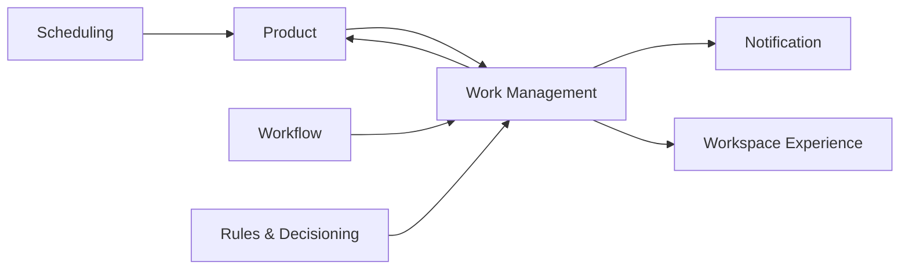

---
doc_meta:
  id: PAD-PLT-013
  title: Work Management Platform
  owner: Work Management Platform Team
  version: 1.1.0
  status: approved
  classification: internal
  governed_by:
    - GDC-008
    - EAD-001
    - EAD-005
  realizes_capability:
    - EAD-001
    - EAD-005
  review_cycle_days: 180
  created_date: 2026-08-23
  last_reviewed: 2026-08-23
  fulfilled_by:
    - SAD-017
---

# Work Management Platform

## 1. Purpose & Scope

The Work Management Platform provides reusable operational work semantics for Products that need human-visible or workload-visible Work Items, Cases, Queues, Assignment, Claim, Release, Priority, generic Review or Approval recording, ownership, and work history.

Products own what the work means, eligibility rules, protected business resources, and final business outcomes.

Work Management owns reusable work lifecycle and concurrency semantics after a Product chooses to represent work through the Platform.

### 1.1 Outcome Contract

A Product can expose shared work inventory and assignment behavior without duplicating generic queue, claim, ownership, and work-history mechanics.

A Work Item is a reference to actionable work and not a copy of the Product aggregate it represents.

### 1.2 Out Of Scope

- Product business entity or Product outcome authority
- Durable multi-step process definition and state owned by Workflow
- Technical Job, Worker, or technical Queue runtime semantics
- Durable future timing owned by Scheduling
- Product-specific business eligibility and routing policy
- Identity, Membership, or workforce Employment authority
- Notification delivery
- Product-specific UI journey
- Product resource authorization
- Generic enterprise Rules ownership
- Product data warehouse or reporting authority

## 2. Enterprise Traceability

### 2.1 Realizes

- **EAD-001** Work, Case, Queue, Assignment, and Review shared execution capability
- **EAD-005** reusable operational execution Platform capability

### 2.2 Relationships

- **Products** define work meaning, business eligibility, protected resource, and final outcome
- **Workflow** may create or reference Work Items for Human Tasks while retaining process state
- **Rules & Decisioning** may provide deterministic assignment, routing, priority, or eligibility evaluation when selected
- **Scheduling** may provide durable wake-ups for future SLA or Product action without owning Work Item lifecycle
- **Notification** communicates assignment, escalation, and work events
- **Organization** supplies Tenant, Workspace, and Membership context
- **Identity** supplies Principal and workload identity
- **Workspace Experience** composes My Work surfaces
- **Audit & Evidence** preserves consequential review, override, and privileged work evidence
- **Event & Messaging** may carry asynchronous work lifecycle contracts

### 2.3 Consumed By

Travel Operations, HCM, future ERP, adjacent BPO and support Products, Workflow, and other operational Products requiring shared work inventory and ownership semantics may consume the Platform.

A Product can use Work Management without Workflow when the work lifecycle is simple and does not require durable multi-step process state.

### 2.4 Logical Topology



Work Management owns generic work state. Product owns the business resource and effect behind the work.

## 3. Domain & Context Model

### 3.1 Bounded Context

- Work Item Registry
- Case Lifecycle
- Queue
- Queue Membership
- Assignment
- Claim and Release
- Priority
- Work Ownership
- Generic Review
- Generic Approval Recording
- Work SLA Reference
- Work History
- Work Search and Projection
- My Work Projection
- Work Operations and Override

### 3.2 Ubiquitous Language

| Term         | Meaning                                                                            |
| :----------- | :--------------------------------------------------------------------------------- |
| Work Item    | Reusable unit of actionable operational work                                       |
| Case         | Durable work container grouping related work or activity                           |
| Queue        | Business-visible work inventory and not a technical message queue                  |
| Assignment   | Explicit ownership relationship between Work Item and Principal, team, or workload |
| Claim        | Atomic acquisition of eligible work                                                |
| Release      | Return of claimed work to an eligible pool                                         |
| Priority     | Work-management ordering signal influenced by Product-owned semantics              |
| Review       | Human or system examination of work                                                |
| Approval     | Recorded Review decision whose business effect remains Product-owned               |
| Work State   | Generic lifecycle state of a Work Item and not Product business state              |
| Work History | Append-oriented record of Work Management lifecycle facts                          |
| My Work      | Query or projection of work assigned, claimed, or eligible for a caller            |

### 3.3 Domain Policies

- Product owns business meaning and final mutation
- Work Management owns reusable Work Item, Case, Queue, Assignment, Claim, Review, and work-history semantics
- Technical message queues are not Work Management Queues
- Claim and assignment operations are concurrency-safe and attributable
- Product-specific routing policy remains Product-owned unless delegated to Rules through a governed contract
- Approval recorded in Work Management does not itself mutate Product truth
- Workflow process state is not duplicated as Work Item state
- Every Work Item has one owning Product or application and Tenant scope where applicable
- Product payload is minimized to stable identifiers and bounded work metadata
- A Work Item can reference a Product resource without granting authority to mutate that resource
- Work closure and Product business completion are distinct unless the Product contract explicitly binds them

### 3.4 Lifecycle & State Semantics

A generic Work Item supports a bounded lifecycle:

```text
Created
  -> Available
  -> Assigned
  -> Claimed / Active
  -> Resolved
  -> Closed

Alternative paths:
Released
Blocked
Cancelled
```

A Product may map its domain-specific states onto this lifecycle but Work Management must not absorb Product business states.

Exclusive Claim semantics guarantee no more than one successful concurrent claimant for one exclusive Work Item.

Review or Approval records are append-oriented decisions attached to Work history. The Product decides whether and how they cause business mutation.

### 3.5 Failure & Degradation Semantics

- Product outage may leave Work Item actionable or blocked but Work Management must not fabricate Product completion
- Workflow outage does not corrupt existing Work Item state
- Notification outage delays communication but does not undo assignment or claim
- Rules outage must follow a declared routing fallback such as manual queueing, previously approved rule version, or explicit blocked state
- Scheduling outage may delay SLA wake-ups but does not change Work authority
- Duplicate create or lifecycle commands are idempotent under a declared source identity
- Concurrent Claim attempts produce one authoritative winner for exclusive work
- Product business mutation failure after Approval remains explicit and cannot be hidden as successful completion
- My Work projection degradation must not alter Work Item authority

## 4. Integration Contracts

### 4.1 Integration Provided

- Work Item creation and source idempotency
- Work Item query and lifecycle
- Case lifecycle
- Queue enrollment and removal
- Assignment and unassignment
- Claim and Release
- Priority update
- Generic Review and Approval recording
- Block and unblock
- Resolve, close, and cancel
- Work History
- Work search
- My Work projection
- Work lifecycle events
- Privileged override and reconciliation

### 4.2 Integration Consumed

- Identity
- Organization
- Optional Workflow
- Optional Rules & Decisioning
- Optional Scheduling
- Notification
- Audit & Evidence
- Event & Messaging where asynchronous contracts are selected
- Product resource and business-operation contracts

### 4.3 Contract Principles

- Work Item references stable Product identifiers rather than Product database rows
- Source idempotency prevents duplicate logical Work Items
- Product operations are independently authorized by the Product
- Claim, Release, and Assignment use explicit concurrency semantics
- Work lifecycle and Product lifecycle remain distinguishable
- Product-specific metadata is bounded and versioned
- Work History preserves source, actor, time, and correlation

## 5. Trust & Data Boundaries

### 5.1 Trust Boundary

Work Management is authoritative for shared Work Item, Case, Queue, Assignment, Claim, Review, Approval-recording, and Work History state it accepts.

It does not own the Product record or business outcome referenced by a Work Item.

### 5.2 Identity Access

- Assignments and Claims reference validated Principals, teams, or workloads
- Tenant and Workspace context is Organization-owned
- Queue visibility and claim eligibility combine Work Management rules with Product-provided policy or context
- Product actions require Product authorization independently
- Cross-Tenant administration and privileged override require separate authority and evidence
- Caller-supplied assignee or ownership fields cannot override authenticated scope
- My Work visibility is not authorization to the Product resource

### 5.3 Data Classification

Work Management stores:

- Bounded work metadata
- Product and resource references
- Queue membership
- Assignment and Claim state
- Review and Approval records
- Priority
- Work History
- Correlation and SLA references

Unbounded Product payloads and Product business records remain with the Product.

### 5.4 Authority & Projection Rules

- Product business truth remains Product authority
- Work Item lifecycle is Work Management authority
- Workflow Human Task may reference Work Item but Workflow owns process state
- My Work and search are projections of Work Management authority
- Notification and Workspace projections do not become Work authority
- A copied Product label or summary is descriptive metadata and not authoritative Product content

## 6. Capability NFR

### 6.1 Availability, RTO, and RPO

- Reliability class: **C1 Mission-Critical Operations** for core Work inventory and Claim paths
- Mature target availability: **>= 99.95% monthly**
- Target RTO: **<= 1 hour**
- Target RPO: **<= 15 minutes**
- Accepted Work Item, Claim, and Assignment state must not be silently lost

### 6.2 Latency, Concurrency, and Scalability

- Claim and Assignment control path target: **P95 <= 300 ms** excluding external Product calls
- Duplicate successful Claim of one exclusive Work Item is prohibited
- Capacity certification targets at least **10x forecast peak lifecycle-transition rate**
- Tenant, application, queue, and work-type quotas or bulkheads prevent one consumer from exhausting shared capacity
- Search, history, and My Work projections must not starve Claim and Assignment control paths

### 6.3 Security, Privacy, and Audit

- Tenant isolation and least-privilege visibility are required
- Product payload is minimized
- Create, assign, claim, release, reprioritize, review, approve, block, resolve, close, cancel, and privileged override are traceable
- Cross-Tenant work operations require explicit privileged authority
- Product resource authorization is never delegated to navigation or Work visibility alone

### 6.4 Interoperability and Cost

- Product references are versioned opaque identifiers and not cross-database joins
- Workflow and Scheduling references preserve authority boundaries
- Unit cost is measurable per active Work Item, lifecycle transition, Tenant, Product, and major queue class
- Adoption and duplicated work-management code retired are Platform Product metrics

## 7. Ownership & Governance

### 7.1 Team Ownership

Work Management Platform Team owns:

- Generic Work Item and Case lifecycle
- Queue semantics
- Assignment, Claim, and Release
- Generic Review and Approval recording
- Work History and projections
- Work Management reliability and support

Product teams own business meaning, eligibility, Product rules, protected-resource authorization, and final outcome. Workflow owns process state.

### 7.2 Realizing Systems

- **SAD-017** Work Management Platform

### 7.3 Governance Rules

- Work Management Queue SHALL NOT be confused with technical messaging Queue
- Work Item SHALL NOT become a copy of Product aggregate
- Generic Approval SHALL NOT become Product authorization or Product business-decision authority
- Workflow state SHALL NOT be duplicated merely for convenience
- Product authorization SHALL NOT be inferred from My Work visibility
- Exclusive Claim SHALL have deterministic concurrency semantics
- Simple Product-local work SHALL NOT be centralized unless shared lifecycle value justifies the dependency

### 7.4 Platform Product Health

Platform health includes active Work Items, Claim conflicts, assignment latency, queue age, reconciliation issues, consumer adoption, My Work quality, support load, lifecycle incident rate, and unit cost.

## 8. Assumptions & Constraints

- Products expose stable resource and business-operation contracts
- Organization and Identity remain separate authorities
- Workflow is optional for simple work
- Rules and Scheduling are optional reusable capabilities
- Physical queue, search, storage, and runtime choices belong downstream

## 9. Architectural Decisions

- Work Item, Workflow, Job, and Schedule remain distinct concepts
- Work Management owns human-visible work lifecycle
- Product owns the meaning and business effect
- Approval is reusable work evidence and not Product business authority
- Physical realization belongs to SAD and downstream decisions

## 10. Evolution

The Platform may evolve specialized Case, Queue, My Work, or operational experiences as measured reuse grows.

Physical decomposition does not alter Work Item, Case, Queue, Assignment, Claim, Review, and Product-authority boundaries.

## 11. References

- EAD-001 Enterprise Capability & Domain Map
- EAD-002 Enterprise System Landscape
- EAD-005 Enterprise Platform Architecture
- EAD-006 Enterprise Security Architecture
- GDC-008 Product Architecture Document Guideline
- ADR-GLB-013 Work, Workflow, Job, and Schedule Boundaries
