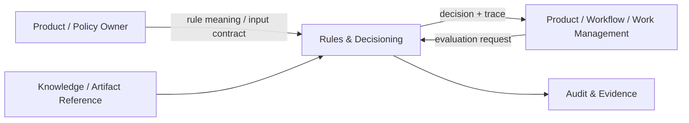

---
doc_meta:
  id: PAD-PLT-014
  title: Rules & Decisioning Platform
  owner: Rules Platform Team
  version: 1.1.1
  status: chartered
  classification: internal
  governed_by:
    - GDC-008
    - EAD-001
    - EAD-005
  realizes_capability:
    - EAD-001
    - EAD-005
  review_cycle_days: 180
  created_date: 2026-08-23
  last_reviewed: 2026-08-23
  fulfilled_by:
    - SAD-018
---

# Rules & Decisioning Platform

> **Commitment: chartered.** This logical boundary is retained as a valid enterprise candidate, but no shared implementation is authorized until the approval gate in GDC-008 is satisfied.

## 1. Purpose & Scope

The Rules & Decisioning Platform provides reusable deterministic Rule lifecycle, evaluation, testing, simulation, explanation, promotion, effective-time selection, rollback, and Decision Trace capabilities.

The Platform owns reusable Rule-engine semantics and released Rule lifecycle.

Product domains own domain Rule meaning, authoritative inputs, Product authorization, policy ownership, and business effects.

### 1.1 Outcome Contract

A Product can externalize governed deterministic decision execution without transferring domain policy authority to the Platform.

The same released Rule Version and canonical input/context must produce the same deterministic result, subject only to explicitly versioned semantics.

### 1.2 Out Of Scope

- Product business policy ownership
- AI or LLM inference
- Product authorization authority
- Workflow process orchestration
- Work assignment authority
- External source-of-rule authority
- Product business mutation
- Mandatory central execution of every local condition or `if` statement
- Product data acquisition
- Product-specific business outcome lifecycle
- Knowledge authority

## 2. Enterprise Traceability

### 2.1 Realizes

- **EAD-001** Rules & Decisioning shared capability
- **EAD-005** reusable Platform Product principles

### 2.2 Relationships

- **Products** own domain Rule semantics, Product policy, source facts, and business effects
- **Knowledge & Retrieval** may provide governed reference or knowledge input without becoming implicit Rule authority
- **AI Enablement** may propose or extract Rule candidates but cannot publish them authoritatively
- **Workflow / Work Management** may consume deterministic decisions for coordination
- **Audit & Evidence** preserves publication, promotion, rollback, override, and consequential Decision evidence
- **Artifact & Document** may provide immutable source artifacts referenced by Rule provenance
- **Identity / Organization** provide administration and Tenant context
- **Event & Messaging** may carry asynchronous evaluation or lifecycle events

### 2.3 Consumed By

Travel, HCM, future ERP, Work Management, Workflow, and other Products may consume Rules when governed deterministic evaluation provides reusable value beyond Product-local logic.

Simple Product-local branching remains local when central Rule lifecycle would increase complexity.

### 2.4 Logical Topology



Rules executes deterministic evaluation. The consuming Product decides how the result affects business state.

## 3. Domain & Context Model

### 3.1 Bounded Context

- Rule Definition
- Rule Set
- Rule Version
- Rule Input Contract
- Effective Lifecycle
- Rule Evaluation
- Decision
- Decision Trace
- Rule Test
- Scenario and Simulation
- Candidate Validation
- Promotion
- Rollback
- Rule Provenance
- Explanation
- Rule Compatibility

### 3.2 Ubiquitous Language

| Term             | Meaning                                                                          |
| :--------------- | :------------------------------------------------------------------------------- |
| Rule             | Deterministic evaluable statement within a Product-owned semantic domain         |
| Rule Set         | Versioned grouping evaluated under a declared input and output contract          |
| Rule Version     | Immutable released representation                                                |
| Effective Period | Declared validity interval                                                       |
| Input Contract   | Canonical facts required for deterministic evaluation                            |
| Evaluation       | Application of a released Rule Set to supplied facts and context                 |
| Decision         | Deterministic result produced by Evaluation                                      |
| Decision Trace   | Explainable record of version, relevant inputs, branches, and result             |
| Simulation       | Non-authoritative evaluation against test or scenario inputs                     |
| Promotion        | Controlled activation of a tested Rule Version                                   |
| Rollback         | Controlled return to a prior compatible released version                         |
| Rule Provenance  | Source and ownership lineage for Rule meaning                                    |
| Failure Policy   | Consumer-declared behavior when required deterministic evaluation is unavailable |

### 3.3 Domain Policies

- Domain meaning and Product policy remain Product-owned
- Released Rule Versions are immutable
- Evaluation is deterministic for identical released version, canonical input, and declared context
- Product supplies or references authoritative inputs
- AI-generated Rule proposals remain non-authoritative until accepted, tested, and published
- Decision Trace identifies Rule Version and relevant inputs without leaking prohibited data
- Shared Platform usage is justified by reusable lifecycle and evaluation value rather than simple local branching
- Product resource authorization is not delegated to Rules unless the Product explicitly defines the Rule result as one input to its own authorization decision
- Effective-time selection is explicit and deterministic
- Historical Decision Trace is not rewritten when later Rule Versions are published
- Failure Policy is declared per consuming decision class and cannot be inferred by the Platform

### 3.4 Lifecycle & State Semantics

A Rule Version follows:

```text
Draft
  -> Tested
  -> Approved
  -> Active
  -> Deprecated
  -> Retired
```

A released Active or Deprecated Rule Version is immutable.

A Decision identifies:

- Rule Set
- Rule Version
- Evaluation identity
- Effective time
- Canonical input identity or bounded snapshot
- Result
- Decision Trace
- Product and Tenant context where applicable

### 3.5 Failure & Degradation Semantics

- Evaluation unavailability follows the consumer-declared Failure Policy
- Allowed failure behaviors may include explicit defer, fail closed, or fallback to a previously approved compatible version
- The Platform must not invent Product business fallback
- Invalid or incomplete input fails validation rather than producing an ambiguous Decision
- Knowledge or external reference unavailability is explicit and cannot silently substitute stale input unless the Product contract permits it
- Promotion failure leaves the prior approved version active
- Rollback is explicit and attributable
- Duplicate evaluation requests may reuse or correlate one Evaluation identity where the consumer contract requires idempotency
- Decision delivery failure does not change the historical Decision result

## 4. Integration Contracts

### 4.1 Integration Provided

- Rule Set lifecycle
- Rule Version publication
- Input-contract validation
- Deterministic Evaluation
- Decision and Decision Trace
- Explanation
- Test-case management
- Simulation
- Effective-time selection
- Candidate validation
- Promotion and rollback
- Rule provenance
- Rule lifecycle events
- Evaluation correlation and query

### 4.2 Integration Consumed

- Identity and Organization for administration scope
- Product-provided input contracts
- Artifact & Document for immutable source references where needed
- Audit & Evidence
- Optional Knowledge & Retrieval
- Event & Messaging where asynchronous evaluation or lifecycle publication is selected
- Product policy and ownership metadata

### 4.3 Contract Principles

- Product owns input semantics and business effect
- Released Rule Version is explicit in each Decision
- Consumer contracts are independent of internal Rule engine implementation
- Evaluation input is bounded and versioned
- Decision and Decision Trace are stable enough for replay, explanation, and audit
- Effective-time behavior is explicit
- Asynchronous and synchronous invocation preserve equivalent Rule semantics
- Rules never read Product persistence directly

## 5. Trust & Data Boundaries

### 5.1 Trust Boundary

Rules Platform is authoritative for published Rule runtime lifecycle, Evaluation, Decision, Decision Trace, promotion state, and rollback state inside its capability.

It is not authoritative for Product policy meaning, Product resource authorization, source facts, or Product business effect.

### 5.2 Identity Access

- Administration, publication, promotion, rollback, simulation of restricted Rules, and cross-Tenant operations require authenticated and attributable identities
- Product resource authorization remains Product-owned
- Workload evaluation calls use registered application identity
- Caller-supplied Product or Tenant ownership cannot override trusted context
- Privileged emergency rollback and override are evidenced
- Rule authorship and approval are distinguishable roles where governance requires separation

### 5.3 Data Classification

Rules Platform stores:

- Rule definitions and versions
- Input and output schemas
- Tests and simulation scenarios or references
- Effective lifecycle
- Evaluation metadata
- Decision Trace
- Provenance
- Promotion and rollback history

Product business records remain outside Platform persistence unless a bounded immutable evaluation snapshot is explicitly required and classified.

### 5.4 Authority & Projection Rules

- Product facts remain Product authority
- Knowledge references remain Knowledge or source authority
- Rule Version is Rules Platform authority
- Decision is authoritative only as the result of that declared Rule Version
- Product business effect remains Product authority
- Reporting and analytics over Decisions are derived

## 6. Capability NFR

### 6.1 Availability, RTO, and RPO

- C1 decision profiles target **>= 99.95% monthly**
- C2 profiles target **>= 99.9% monthly**
- C1 target RTO: **<= 1 hour**
- C1 target RPO: **<= 15 minutes**
- C2 target RTO: **<= 4 hours**
- C2 target RPO: **<= 1 hour**

### 6.2 Determinism, Latency, and Scalability

- Same released Rule Version plus canonical input and context produces the same deterministic result
- Synchronous deterministic Evaluation profile target: **P95 <= 100 ms** excluding consumer data acquisition
- Evaluation throughput scales independently of administration, testing, and simulation workloads
- Capacity certification targets at least **10x forecast peak C1 evaluation rate**
- Tenant, Product, Rule Set, and decision-class quotas protect shared capacity

### 6.3 Security, Audit, and Explanation

- Publication, approval, promotion, rollback, privileged mutation, and Product-declared consequential Decisions are traceable
- Sensitive inputs are minimized in Decision Trace
- Restricted Rules and simulations follow Tenant and Product scope
- Explanation exposes the relevant Rule path without leaking prohibited data
- Emergency override cannot silently mutate historical Rule Versions

### 6.4 Interoperability and Cost

- Product contracts do not depend on internal Rule engine implementation
- Rule definitions and Decision contracts are versioned
- Cost is attributable per Evaluation, Rule Set, Product, Tenant, and major decision class
- Shared adoption is measured against duplicated Rule lifecycle and support burden removed from Products

## 7. Ownership & Governance

### 7.1 Team Ownership

Rules Platform Team owns:

- Reusable Rule lifecycle
- Deterministic Evaluation semantics
- Decision and Decision Trace
- Test and simulation capability
- Promotion and rollback
- Rule Platform reliability and support

Product teams own Rule meaning, Product policy, source authority, Product authorization, Failure Policy, and business effects.

### 7.2 Realizing Systems

- **SAD-018** Rules & Decisioning Platform

### 7.3 Governance Rules

- Rules Platform SHALL NOT become a central owner of Product policy meaning
- AI-generated Rules SHALL remain proposed until governed acceptance
- Simple Product-local logic SHALL NOT be extracted solely for taxonomy consistency
- Released Rule Versions SHALL be immutable
- Product authorization SHALL NOT be bypassed by a Rule result
- Failure Policy SHALL be explicit for consequential decision classes
- Historical Decisions SHALL retain the exact Rule Version used

### 7.4 Platform Product Health

Platform health includes Evaluation success, latency, determinism regressions, active Rule Sets, promotion failures, rollback frequency, consumer adoption, duplicated rule-engine retirement, support burden, and cost by decision class.

## 8. Assumptions & Constraints

- Products can provide stable input contracts
- Domain policy ownership remains distributed
- Not every Product condition belongs in the shared Platform
- Physical Rule language, engine, persistence, and execution technology belong downstream

## 9. Architectural Decisions

- Rules Platform is deterministic and distinct from AI inference
- Product owns Rule meaning and effect
- Rule lifecycle is shared only where lifecycle, explanation, testing, and reuse justify it
- Physical implementation belongs to SAD and downstream decisions

## 10. Evolution

The Platform may support richer Rule languages, decision tables, scenario tooling, policy authoring, or specialized evaluation profiles while preserving deterministic versioned contracts.

New domain-specific semantics remain Product-owned even when their Rule execution is shared.

## 11. References

- EAD-001 Enterprise Capability & Domain Map
- EAD-005 Enterprise Platform Architecture
- EAD-006 Enterprise Security Architecture
- GDC-008 Product Architecture Document Guideline
