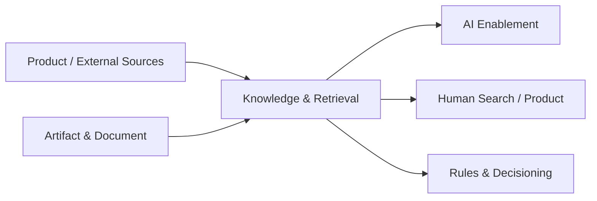

---
doc_meta:
  id: PAD-PLT-015
  title: Knowledge & Retrieval Platform
  owner: Knowledge Platform Team
  version: 1.2.0
  status: approved
  classification: restricted
  governed_by:
    - GDC-008
    - EAD-001
    - EAD-003
    - EAD-005
  realizes_capability:
    - EAD-001
    - EAD-003
    - EAD-005
  review_cycle_days: 180
  created_date: 2026-08-23
  last_reviewed: 2026-08-23
  fulfilled_by:
    - SAD-019
---

# Knowledge & Retrieval Platform

## 1. Purpose & Scope

The Knowledge & Retrieval Platform provides governed enterprise knowledge representation and retrieval capability independent of any specific AI model, embedding provider, graph technology, vector technology, or search implementation.

It owns Knowledge Asset lifecycle, provenance, ontology mechanics, Entity, Relationship, and Claim representation, derived retrieval-index lifecycle, authorized retrieval, retrieval planning, ranking, freshness semantics, and citation or evidence assembly.

Products and declared external authorities remain canonical for source facts and domain semantics.

### 1.1 Outcome Contract

Consumers can retrieve authorized, provenanced, version-aware knowledge through stable retrieval profiles without coupling to one storage or retrieval technology.

Knowledge representation and retrieval may derive from Product facts but cannot silently become Product transactional authority.

### 1.2 Out Of Scope

- Product transactional authority
- AI inference, model routing, or agent execution
- Product-specific business Workflow
- Product resource authorization authority
- Replacing domain ubiquitous language with one central ontology
- Graph, vector, lexical, or metadata storage technology selection
- Product business-rule authority
- Artifact and Document binary lifecycle
- Analytics and reporting ownership
- Source-system master-data authority
- Unbounded enterprise ontology centralization
- Publishing AI output as authoritative Knowledge without governed acceptance

## 2. Enterprise Traceability

### 2.1 Realizes

- **EAD-001** Knowledge Foundation capability
- **EAD-001** Search & Retrieval capability
- **EAD-003** knowledge, provenance, index, and derived-representation topology
- **EAD-005** reusable intelligence Platform direction

### 2.2 Relationships

- **Products and external authorities** remain authoritative for source facts and domain semantics
- **Artifact & Document** provides immutable Artifact Version references for source content
- **Agent Runtime** consumes authorized retrieval, grounded context, provenance, and citations for Agent Context Assembly; Products and human experiences may also consume retrieval directly
- **Rules & Decisioning** may consume governed reference knowledge while retaining deterministic Rule meaning
- **Identity / Organization / Product authorization** constrain retrieval scope
- **Data Foundation** may provide governed data products and lineage
- **Audit & Evidence** receives privileged publication, ontology, and cross-Tenant retrieval evidence
- **Observability** receives operational indexing and retrieval telemetry
- **Workspace Experience** may expose search and knowledge composition surfaces

### 2.3 Consumed By

Vertical AI Products, HCM copilots and search, Travel Operations, future ERP, enterprise search, human knowledge experiences, Rules, analytics consumers, Workspace Experience, and Agent Runtime may consume the Platform.

Consumption does not transfer source authority.

### 2.4 Logical Topology



Knowledge Graph and retrieval indexes are governed derived representations. Source authority remains upstream.

## 3. Domain & Context Model

### 3.1 Bounded Context

- Knowledge Asset Lifecycle
- Source Registry
- Provenance
- Knowledge Versioning
- Knowledge Publication
- Knowledge Retirement
- Enterprise Core Ontology
- Domain Ontology Extension
- Entity
- Relationship
- Claim
- Claim Confidence and Authority Class
- Knowledge Graph Representation
- Lexical Index
- Vector Index
- Metadata Index
- Graph Index
- Retrieval Profile
- Retrieval Planning
- Lexical Retrieval
- Semantic Retrieval
- Graph Retrieval
- Metadata Retrieval
- Hybrid Retrieval
- Authorization-Aware Retrieval
- Citation and Evidence Assembly
- Freshness and Staleness
- Index Lifecycle and Rebuild

### 3.2 Ubiquitous Language

| Term                     | Meaning                                                                                        |
| :----------------------- | :--------------------------------------------------------------------------------------------- |
| Knowledge Asset          | Governed reusable knowledge unit with owner, source, version, and provenance                   |
| Source                   | Authoritative or governed origin from which knowledge is derived                               |
| Source Version           | Identified source state from which a Knowledge representation was produced                     |
| Claim                    | Provenanced assertion that may be authoritative, derived, disputed, or proposed                |
| Authority Class          | Metadata describing whether a Claim is source-authoritative, derived, inferred, or proposed    |
| Entity                   | Identified concept represented in knowledge                                                    |
| Relationship             | Provenanced connection between Entities                                                        |
| Ontology                 | Governed schema and vocabulary for knowledge representation                                    |
| Enterprise Core Ontology | Small durable cross-domain concept set                                                         |
| Domain Ontology          | Domain-owned extension preserving domain ubiquitous language                                   |
| Knowledge Graph          | Derived graph representation of Entities, Relationships, and Claims                            |
| Retrieval Index          | Rebuildable lexical, vector, graph, or metadata structure                                      |
| Retrieval Profile        | Consumer-declared quality, latency, freshness, evidence, and degradation behavior              |
| Citation                 | Traceable reference to governed source, version, Claim, or Evidence                            |
| Staleness                | Declared condition where a Knowledge or Index version exceeds the allowed freshness profile    |
| Publication              | Governed point at which a Knowledge Asset or version becomes available to authorized consumers |

### 3.3 Domain Policies

- Source and Product authority remains canonical
- Graph, index, embedding, and normalized representations are derived unless the Platform itself is the declared source of a Knowledge Asset
- Graph is first-class but not mandatory for every retrieval
- Lexical, vector, metadata, graph, and hybrid retrieval remain supported abstraction classes
- Retrieval authorization happens before disclosure or context assembly
- Every governed Claim carries source, provenance, version, scope, and confidence or authority metadata appropriate to its class
- Enterprise Core Ontology stays intentionally small
- Domains own ontology extensions and preserve domain language
- AI output cannot publish authoritative Knowledge without governed acceptance
- Retrieval results expose provenance and citations adequate to the Retrieval Profile
- Storage and indexing technologies remain replaceable
- Index freshness and source freshness are explicit
- Stale data is surfaced or rejected according to Retrieval Profile
- Product resource authorization cannot be weakened by index-level convenience

### 3.4 Lifecycle & State Semantics

A Knowledge Asset follows:

```text
Registered
  -> Ingested
  -> Validated
  -> Published
  -> Superseded
  -> Retired
```

Derived Retrieval Index lifecycle follows:

```text
Pending
  -> Building
  -> Available
  -> Stale
  -> Rebuilding
  -> Retired
```

A new index may replace a prior index without changing Knowledge Asset identity or source authority.

Claim lifecycle may include Proposed, Accepted, Superseded, Disputed, and Retired according to its authority class and owner.

### 3.5 Failure & Degradation Semantics

- Authorization failure fails closed before content disclosure
- Source outage does not permit fabrication of new source facts
- Retrieval Profile declares whether last published Knowledge may be served when source refresh is unavailable
- Index failure may degrade to another evaluated retrieval mode only when the Retrieval Profile allows it
- Graph failure does not imply total retrieval failure when lexical or metadata modes satisfy the Profile
- Index rebuild failure leaves the prior valid index available when safe rather than exposing partial results
- Citation or provenance failure prevents a Profile requiring evidence from returning unsupported content
- Knowledge ingestion backlog is observable through freshness state
- AI unavailability does not change Knowledge authority
- Artifact processing failure preserves the last accepted source version and explicit freshness state
- Cross-Tenant policy ambiguity fails closed

## 4. Integration Contracts

### 4.1 Integration Provided

- Knowledge Asset registration
- Source and Source Version registration
- Knowledge version lifecycle
- Publication and retirement
- Provenance
- Enterprise Core Ontology lifecycle
- Domain Ontology extension contract
- Entity, Relationship, and Claim ingestion
- Claim authority and confidence metadata
- Retrieval Index lifecycle
- Lexical retrieval
- Semantic or vector retrieval
- Graph retrieval
- Metadata retrieval
- Hybrid retrieval
- Retrieval planning
- Authorization-aware scope evaluation
- Freshness and staleness signals
- Citation and evidence assembly
- Knowledge lifecycle events
- Index lifecycle and rebuild status

### 4.2 Integration Consumed

- Product and Data source contracts
- Artifact & Document immutable versions
- Identity and Application Trust
- Organization
- Product authorization context
- Data Foundation where governed data products are sources
- Event & Messaging for lifecycle and indexing where selected
- Audit & Evidence
- Observability

### 4.3 Contract Principles

The canonical retrieval contract conceptually accepts:

```text
query
knowledge_scope
retrieval_profile
authorization_context
```

It returns bounded results containing, as applicable:

```text
knowledge units
entities
relationships
claims
citations
source versions
relevance
freshness
provenance
```

Additional principles:

- Authorization precedes disclosure
- Source and index versions are traceable
- Consumers do not depend on graph, vector, or search vendor models
- Retrieval Profile declares freshness, evidence, latency, and degradation requirements
- Result ranking is reproducible enough to evaluate against the declared Profile
- Product source access never uses cross-domain database joins

## 5. Trust & Data Boundaries

### 5.1 Trust Boundary

Knowledge & Retrieval is authoritative for Platform-owned Knowledge Asset lifecycle, ontology mechanics, derived index lifecycle, Retrieval Profile execution, and retrieval result assembly.

It does not become canonical authority for Product or external business facts represented within Knowledge.

### 5.2 Identity Access

- Caller identity, application, Tenant, Workspace, purpose, classification, and Product authorization context participate in retrieval authorization
- Product-owned authorization policies remain authoritative for Product-protected Knowledge
- Cross-Tenant search requires explicit provider-scope authority and evidence
- Unauthorized material is excluded before context assembly
- Knowledge administration, ontology change, publication, and privileged reindex operations require attributable authority
- Search result visibility is not authority to mutate the source Product

### 5.3 Data Classification

Knowledge Platform may process and store:

- Knowledge Assets and provenance
- Ontology
- Entities, Relationships, and Claims
- Derived indexes and embeddings
- Citations and Evidence references
- Retrieval metadata
- Access-control metadata or projections
- Source references
- Freshness and index state

All representations inherit source classification, residency, purpose, retention, and Tenant constraints unless a stricter derived classification is required.

### 5.4 Authority & Projection Rules

- Source Product or external authority remains canonical for source facts
- Knowledge Asset may be canonical only for content explicitly authored and governed within Knowledge scope
- Knowledge Graph is derived from sources and Claims
- Retrieval Index is rebuildable derived state
- Embeddings are derived state
- AI-generated summaries are derived or proposed until governed publication
- Search and retrieval output is a view, not Product transaction authority

## 6. Capability NFR

### 6.1 Availability, RTO, and RPO

- Default mature retrieval profile for C1 consumers target: **>= 99.95% monthly**
- Lower-criticality Profiles may declare C2 or C3 availability
- C1 retrieval control and query path target RTO: **<= 1 hour**
- Accepted Knowledge Asset lifecycle target RPO: **<= 15 minutes**
- Rebuildable indexes declare independent rebuild objectives rather than pretending index copies are source authority

### 6.2 Freshness, Quality, Latency, and Scalability

- Every Retrieval Profile declares source freshness, index freshness, stale behavior, quality metrics, latency budget, and evidence requirements
- Interactive default retrieval target: **P95 <= 500 ms** excluding external source fetch and AI generation
- Ingestion and indexing workload is isolated from interactive retrieval
- Capacity certification targets at least **10x forecast peak interactive query rate** for C1 Profile
- Retrieval evaluation uses profile-appropriate relevance and evidence metrics
- Stale or partial index state is observable and queryable

### 6.3 Authorization, Privacy, and Security

- Target: **zero known cross-Tenant or forbidden retrieval leakage**
- Authorization negative tests are release gates
- Cross-Tenant administration and retrieval are separately authorized and evidenced
- Sensitive content is minimized in query logs, telemetry, and evaluation datasets
- Derived representations inherit source policy
- Provider or embedding egress follows classification and residency constraints

### 6.4 Audit, Interoperability, and Cost

- Publication, ontology change, privileged reindex, access-policy change, cross-Tenant retrieval, and administrative override are traceable
- Consumers do not depend on graph, vector, search, or embedding vendor-specific models
- Cost is attributable by ingestion, index class, query, Tenant, Product, Retrieval Profile, and source domain
- Adoption, retrieval quality, freshness, support burden, and index operational cost are Platform Product metrics

## 7. Ownership & Governance

### 7.1 Team Ownership

Knowledge Platform Team owns:

- Knowledge lifecycle mechanics
- Enterprise Core Ontology mechanics
- Domain-extension contract
- Entity, Relationship, and Claim representation mechanics
- Retrieval Index lifecycle
- Retrieval Profiles
- Authorization-aware retrieval
- Citation and evidence assembly
- Freshness and degradation semantics
- Platform reliability and support

Product and domain owners own domain semantics and authoritative source facts. Model & Inference owns bounded model execution. Agent Runtime owns durable agent-execution semantics.

### 7.2 Realizing Systems

- **SAD-019** Knowledge & Retrieval Platform

### 7.3 Governance Rules

- Knowledge Graph SHALL NOT become hidden Product master data
- Graph SHALL NOT be the sole mandated retrieval mode
- Retrieval SHALL authorize before disclosure
- Product and domain ontology extensions SHALL preserve domain ownership
- Model, embedding, graph, vector, or search technology SHALL remain a SAD or ADR concern
- Retrieval Profile SHALL declare freshness and evidence behavior
- AI-generated content SHALL NOT become authoritative Knowledge without governed publication
- Derived index failure SHALL NOT silently transfer authority away from source systems

### 7.4 Platform Product Health

Platform health includes source freshness, index freshness, retrieval quality, authorization incidents, query latency, ingestion backlog, citation coverage, consumer adoption, support burden, cost by Profile, and recovery from index failure.

## 8. Assumptions & Constraints

- Products and external authorities remain source owners
- Knowledge sources may be structured, unstructured, relational, document, or event-derived
- Multiple retrieval modes may coexist
- Enterprise Core Ontology remains deliberately small
- Physical graph, vector, lexical, metadata, embedding, and storage technologies remain downstream

## 9. Architectural Decisions

- Knowledge & Retrieval remains separate from AI Enablement
- Knowledge Graph is first-class derived representation and not Product source of truth
- Hybrid retrieval is supported without mandating one retrieval technology
- Authorization precedes disclosure
- Domain ontology extensions preserve Product ownership
- Physical technology choices belong to SAD and downstream decisions

## 10. Evolution

The Platform may evolve new retrieval modes, ranking strategies, ontology capabilities, regional indexes, or specialized Knowledge profiles without changing source authority.

A new representation becomes shared only when it preserves provenance, authorization, freshness, and replacement boundaries.

## 11. References

- EAD-001 Enterprise Capability & Domain Map
- EAD-003 Enterprise Data Ownership & Topology
- EAD-005 Enterprise Platform Architecture
- EAD-006 Enterprise Security Architecture
- EAD-007 Enterprise Governance & Assurance Architecture
- GDC-008 Product Architecture Document Guideline
- ADR-GLB-012 Separate AI, Knowledge, and Product Authority
- ADR-GLB-015 Separate Model & Inference and Agent Runtime Authority
