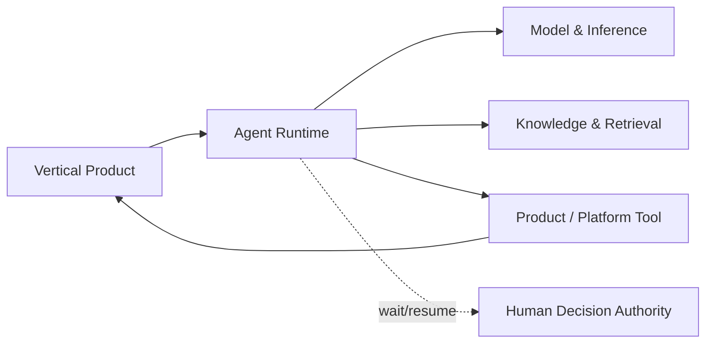

---
doc_meta:
  id: PAD-PLT-016
  title: Agent Runtime Platform
  owner: AI Platform Team
  version: 1.0.0
  status: approved
  classification: restricted
  governed_by: [GDC-008, EAD-001, EAD-003, EAD-005, EAD-006]
  realizes_capability: [EAD-001, EAD-003, EAD-005, EAD-006]
  review_cycle_days: 180
  created_date: 2026-08-23
  last_reviewed: 2026-08-23
  fulfilled_by: [SAD-020]
---

# Agent Runtime Platform

## 1. Purpose & Scope

The Agent Runtime Platform provides governed, durable **agent execution semantics** without owning Product business outcomes, Product Workflow, enterprise Knowledge truth, Model/Provider routing, or Tool side effects.

The Platform is the enterprise **Agent Harness runtime**. Harness is internal machinery of this Platform, not a separate Platform Product.

### 1.1 Outcome Contract

A Product/Platform can register a versioned Agent Definition and start an Agent Run that assembles authorized context, invokes Model & Inference, mediates Tool use, enforces budgets/guardrails, supports pause/resume/delegation, records lineage, and terminates with explicit run state.

### 1.2 Platform Qualification

Agent Runtime is independent because it has its own semantics, durable state/recovery, delegated Tool security boundary, long-running failure model, scaling economics, and reuse across vertical AI Products.

### 1.3 Out Of Scope

- model/provider catalog/routing/inference authority
- Knowledge Asset/Graph/retrieval-source authority
- Product business Workflow/state/outcome/authorization
- Tool business logic/canonical authority/side effects
- generic Workflow or Work Management
- human approval/business-decision semantics
- Product domain prompt/skill meaning
- Product preference/master data
- arbitrary code/browser/computer sandbox authority
- forcing every AI call through Agent Runtime
- equating one Agent with one Vertical AI Product

## 2. Enterprise Traceability

### 2.1 Realizes

- EAD-001 Agent Runtime within AI Enablement
- EAD-003 Agent Run/context/memory data ownership
- EAD-005 shared durable agent-execution strategy
- EAD-006 delegation/Tool/injection/workload/evidence controls

### 2.2 Relationships

- Model & Inference executes bounded model turns
- Knowledge & Retrieval supplies authorized grounded context
- Product owns vertical AI/business meaning, domain prompt/skill meaning, Product Tool meaning, acceptance, and outcome
- Tool owner owns final authorization, invariants, idempotency, reconciliation, and side effects
- Workflow may invoke/wait for Agent Runs while retaining process authority
- Product/Workflow/Work Management owns actual human review/approval meaning
- Identity / Organization / Application Trust provide run/delegation context
- Audit & Evidence, Artifact & Document, Observability, Event & Messaging are consumed where required
- isolated code/browser/computer execution remains separately qualifiable Engineering & Runtime capability

### 2.3 Consumed By

Travel/HCM/future ERP vertical AI, Workflow tasks, knowledge-curation assistance, operational copilots, and other Product-owned agentic features.

A consumer needing one bounded model call may use Model & Inference directly.

### 2.4 Logical Topology



## 3. Domain & Context Model

### 3.1 Bounded Context

- Agent Definition Registry / Agent Version / Agent Runtime Release
- Agent Run / Agent Turn
- Agent Runtime / Harness
- Context Assembly / Context Policy / Context Budget / Context Snapshot
- Run Memory / Session Memory
- Tool Binding / Tool Invocation Mediation / Tool Risk Metadata
- Skill Binding / Skill Runtime
- Parent/Child Agent Run / Delegation / Handoff / Agent-as-Tool
- Agent Budget / Stop Policy
- Pause / Resume / Waiting on Tool / Waiting on Human
- Agent Evaluation
- Agent Trace / Telemetry

### 3.2 Ubiquitous Language

| Term | Meaning |
| :-- | :-- |
| Agent Definition | Versioned runtime contract for capability requirement, bindings, context/memory policy, guardrails, budget, and composition |
| Agent Run | One durable execution instance |
| Agent Turn | One bounded model/reasoning interaction within a Run |
| Harness | Internal machinery driving turns, context, Tool dispatch, state, budgets, and termination |
| Context Assembly | Build authorized model context without taking source authority |
| Context Snapshot | Bounded reproducibility/recovery record or source references |
| Run Memory | Continuity state with lifetime of one Agent Run |
| Session Memory | Bounded continuity reused across related turns/runs |
| Tool Binding | Agent-side binding permitting request of a Tool capability |
| Delegation | Bounded transfer of execution intent/authority context |
| Handoff | Explicit transfer of active responsibility |
| Agent Budget | Bound on time/tokens/cost/turns/Tools/children |
| Agent Result | Generated execution result, not Product truth until accepted |

### 3.3 Domain Policies

- Agent Definition != Agent Run
- Agent != Vertical AI Product
- Harness != separate Platform
- Agent Runtime != Workflow
- Context Assembly owns composition, not source facts
- Run/Session Memory != enterprise Knowledge authority
- reusable factual memory requires governed Knowledge publication
- Product preferences/master data remain Product authority
- Product domain prompt/skill meaning remains Product-owned
- Tool Binding/mediation does not transfer Tool authority
- Tool owner re-authorizes every protected operation
- delegation/handoff cannot expand authority
- unknown Tool side-effect outcome requires Tool-owner reconciliation before unsafe retry
- every Run has bounded budget/Stop Policy
- simple bounded inference may bypass Agent Runtime
- completed Agent Run != completed Product Workflow/outcome

### 3.4 Agent Definition Lifecycle

```text
Draft -> Evaluated -> Approved -> Active -> Deprecated -> Retired
```

Product/domain retains semantic acceptance authority for Product-specific Agent Definitions.

### 3.5 Agent Run Lifecycle

```text
Created -> Running -> Waiting on Tool | Waiting on Human | Suspended -> Running -> Completed
```

Terminal alternatives: `Stopped by Budget`, `Cancelled`, `Failed`.

### 3.6 Tool Invocation Lifecycle

```text
Requested -> Authorized -> Executing -> Completed
```

Alternatives: `Rejected`, `Failed`, `Unknown Outcome`.

### 3.7 Failure & Degradation Semantics

- model failure follows Model & Inference policy
- required grounding never silently disappears
- durable Run progress survives runtime restart according to physical design
- unknown Tool side effect is not blindly retried
- unavailable human authority leaves Run waiting/suspended
- cancellation stops future execution but does not roll back committed external effects
- child-run failure is explicit
- context/memory failure does not fabricate continuity
- authorization ambiguity fails closed
- budget exhaustion is explicit state

## 4. Integration Contracts

### 4.1 Integration Provided

Agent Definition/version/release, Run lifecycle, Turn/Stop Reason, Context Assembly/Snapshot, Run/Session Memory mechanics, Tool Binding/Invocation mediation, Skill runtime, child/delegation/handoff, budgets, wait/resume, evaluation, trace/telemetry.

### 4.2 Integration Consumed

Model & Inference, Knowledge & Retrieval, Product/Platform Tools, Identity/Application Trust/Organization, Trust Services, Artifact & Document, Audit & Evidence, Observability, Event & Messaging, optional isolated execution capability.

### 4.3 Contract Principles

- Agent Definitions reference stable Capability Profiles, not provider SDK models
- Product/domain semantic assets remain Product-owned
- Tool contracts declare owner/schema/scopes/risk/side-effect/idempotency/reconciliation
- Tool owner performs final authorization
- retrieval/context preserves provenance and authorization
- Agent/Turn/Tool/child identifiers preserve lineage
- delegation/handoff carries bounded authority
- framework-specific graph/node/session types are not canonical Product contracts

## 5. Trust & Data Boundaries

### 5.1 Trust Boundary

Authoritative for Agent Definition runtime registration/version state, Agent Run/Turn, Harness state, Context Assembly/Snapshot, Run/Session Memory mechanics, Agent-side Tool Binding/Invocation state, delegation/handoff, budgets/stops, runtime evaluation, telemetry.

Not authoritative for Product facts/Workflow, Knowledge truth, Tool operation truth, human approval semantics, or Model/Provider routing.

### 5.2 Identity Access

Every Run is attributable to Product/application, Tenant, initiating Principal/workload, Agent Definition/Version, and delegation source. Unattended agents use non-human identity. Child/handoff authority cannot exceed the source delegation.

### 5.3 Data Classification

Agent Definition metadata, retrieved context, Context Snapshot, model/tool I/O, Run/Session Memory, Run/Turn state, evaluation, telemetry inherit source classification/Tenant/purpose/residency/retention restrictions.

### 5.4 Authority & Projection Rules

- Context Snapshot is execution record, not new source authority
- Run/Session Memory cannot silently become Knowledge
- Tool result remains Tool/Product authority
- Agent output remains proposed until Product acceptance
- runtime evaluation does not replace Product-domain acceptance

## 6. Capability NFR

### 6.1 Availability, RTO, RPO

- C1 control/query availability >=99.95%
- C1 durable Run RTO <=1 hour
- C1 durable Run RPO <=15 minutes
- committed Product/Tool effects are never reconstructed from Agent Memory alone

### 6.2 Durability, Performance, Scalability

- durable Runs survive process restart
- Run/Tool/child/wait lineage is recoverable
- concurrency bounded by Tenant/Product/Agent/Tool/downstream capacity
- Context/Agent budgets bound tokens/cost/turns/Tools/children
- evaluation workload does not starve production

### 6.3 Security, Safety, Privacy

- Tool-owner authorization negative tests are release gates
- delegation escalation/injection tests are release gates
- high-risk Tool bindings declare risk/side-effect/approval controls
- sensitive context/memory minimized/redacted
- code/browser/computer execution isolated behind appropriate Tool/execution boundary

### 6.4 Observability, Interoperability, Cost

Trace Agent Run/Turn, model Inference Run, retrieval, Tool Invocation, child runs, human waits, budgets, and Stop Reason. Cost attributable by Product/Tenant/Agent Version/run/model profile/Tool/children.

## 7. Ownership & Governance

### 7.1 Team Ownership

AI Platform Team initially owns Agent Runtime. Team topology may evolve independently.

Product teams own vertical AI semantics, domain Agent meaning, domain prompts/skills, Product tools, business decisions, and outcomes.

### 7.2 Realizing Systems

- SAD-020 Agent Runtime Platform

### 7.3 Governance Rules

- SHALL NOT own Model/Provider routing authority
- SHALL NOT own enterprise Knowledge truth
- SHALL NOT own Product business Workflow/outcome
- SHALL NOT own Tool business authorization/side effects
- SHALL NOT be required for simple inference
- SHALL NOT equate one Agent with one Vertical AI Product
- SHALL preserve Agent Definition/Run separation
- Context Assembly SHALL preserve source authority
- Run/Session Memory SHALL NOT silently publish Knowledge
- unknown Tool effects SHALL be reconciled before unsafe replay
- delegation/handoff SHALL NOT expand authority
- cancellation SHALL NOT be represented as rollback of committed effects

### 7.4 Platform Product Health

Run success/stop reasons, recovery, stuck/wait duration, unknown Tool outcome backlog, context/memory failure, delegation findings, evaluation freshness, Tool authorization incidents, cost, adoption, support burden.

## 8. Assumptions & Constraints

Products may use zero/one/many Agents. Agent frameworks are replaceable implementation choices. Knowledge and Workflow remain independent. Sandbox execution may remain separate.

## 9. Architectural Decisions

- Agent Runtime separate from Model & Inference
- Harness internal to Agent Runtime
- Agent Definition != Agent Run
- Agent != Vertical AI Product
- Context Assembly has no source authority
- Run/Session Memory != Knowledge
- Tool Binding != Tool authority
- MCP/native Tool protocols are adapters
- multi-agent is composition pattern
- physical framework/persistence/broker/sandbox belongs downstream

## 10. Evolution

Richer composition, memory, context, framework adapters, or isolated execution integration may evolve behind these boundaries. Any future Memory/Secure Execution split requires independent platform qualification.

## 11. References

- EAD-001
- EAD-002
- EAD-003
- EAD-005
- EAD-006
- ADR-GLB-012
- ADR-GLB-015