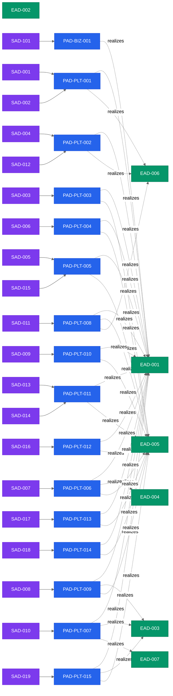

# Architecture Traceability Graph

```mermaid
%%{init: {'theme': 'neutral'}}%%
graph LR
    EAD001[EAD-001]:::ead
    EAD002[EAD-002]:::ead
    EAD003[EAD-003]:::ead
    EAD004[EAD-004]:::ead
    EAD005[EAD-005]:::ead
    EAD006[EAD-006]:::ead
    EAD007[EAD-007]:::ead

    PB1[PAD-BIZ-001]:::pad
    P1[PAD-PLT-001]:::pad
    P2[PAD-PLT-002]:::pad
    P3[PAD-PLT-003]:::pad
    P4[PAD-PLT-004]:::pad
    P5[PAD-PLT-005]:::pad
    P6[PAD-PLT-006]:::pad
    P7[PAD-PLT-007]:::pad
    P8[PAD-PLT-008]:::pad
    P9[PAD-PLT-009]:::pad
    P10[PAD-PLT-010]:::pad
    P11[PAD-PLT-011]:::pad
    P12[PAD-PLT-012]:::pad
    P13[PAD-PLT-013]:::pad
    P14[PAD-PLT-014]:::pad
    P15[PAD-PLT-015]:::pad

    PB1 -.realizes.-> EAD001
    P1 -.realizes.-> EAD001
    P1 -.realizes.-> EAD006
    P2 -.realizes.-> EAD001
    P2 -.realizes.-> EAD006
    P3 -.realizes.-> EAD001
    P3 -.realizes.-> EAD005
    P4 -.realizes.-> EAD001
    P4 -.realizes.-> EAD005
    P5 -.realizes.-> EAD001
    P5 -.realizes.-> EAD005
    P6 -.realizes.-> EAD001
    P6 -.realizes.-> EAD004
    P6 -.realizes.-> EAD005
    P7 -.realizes.-> EAD001
    P7 -.realizes.-> EAD003
    P7 -.realizes.-> EAD007
    P8 -.realizes.-> EAD001
    P8 -.realizes.-> EAD005
    P8 -.realizes.-> EAD006
    P9 -.realizes.-> EAD001
    P9 -.realizes.-> EAD003
    P9 -.realizes.-> EAD005
    P10 -.realizes.-> EAD001
    P10 -.realizes.-> EAD005
    P11 -.realizes.-> EAD001
    P11 -.realizes.-> EAD005
    P12 -.realizes.-> EAD001
    P12 -.realizes.-> EAD005
    P13 -.realizes.-> EAD001
    P13 -.realizes.-> EAD005
    P14 -.realizes.-> EAD001
    P14 -.realizes.-> EAD005
    P15 -.realizes.-> EAD001
    P15 -.realizes.-> EAD003
    P15 -.realizes.-> EAD005

    S1[SAD-001]:::sad --> P1
    S2[SAD-002]:::sad --> P1
    S3[SAD-003]:::sad --> P3
    S4[SAD-004]:::sad --> P2
    S5[SAD-005]:::sad --> P5
    S6[SAD-006]:::sad --> P4
    S7[SAD-007]:::sad --> P6
    S8[SAD-008]:::sad --> P9
    S9[SAD-009]:::sad --> P10
    S10[SAD-010]:::sad --> P7
    S11[SAD-011]:::sad --> P8
    S12[SAD-012]:::sad --> P2
    S13[SAD-013]:::sad --> P11
    S14[SAD-014]:::sad --> P11
    S15[SAD-015]:::sad --> P5
    S16[SAD-016]:::sad --> P12
    S17[SAD-017]:::sad --> P13
    S18[SAD-018]:::sad --> P14
    S19[SAD-019]:::sad --> P15
    S101[SAD-101]:::sad --> PB1

    classDef ead fill:#059669,stroke:#047857,color:#fff
    classDef pad fill:#2563eb,stroke:#1d4ed8,color:#fff
    classDef sad fill:#7c3aed,stroke:#6d28d9,color:#fff
```
