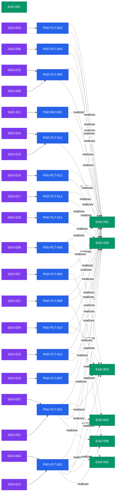

# Architecture Traceability Graph

```mermaid
%%{init: {'theme': 'neutral'}}%%
graph LR
    %% EAD Layer
    EAD-001[EAD-001]:::ead
    EAD-002[EAD-002]:::ead
    EAD-003[EAD-003]:::ead
    EAD-004[EAD-004]:::ead
    EAD-005[EAD-005]:::ead
    EAD-006[EAD-006]:::ead
    EAD-007[EAD-007]:::ead
    %% PAD Layer
    PAD-BIZ-001[PAD-BIZ-001]:::pad
    PAD-BIZ-001 -.realizes.-> EAD-001
    PAD-PLT-001[PAD-PLT-001]:::pad
    PAD-PLT-001 -.realizes.-> EAD-001
    PAD-PLT-001 -.realizes.-> EAD-002
    PAD-PLT-001 -.realizes.-> EAD-003
    PAD-PLT-001 -.realizes.-> EAD-004
    PAD-PLT-001 -.realizes.-> EAD-005
    PAD-PLT-001 -.realizes.-> EAD-006
    PAD-PLT-002[PAD-PLT-002]:::pad
    PAD-PLT-002 -.realizes.-> EAD-001
    PAD-PLT-002 -.realizes.-> EAD-002
    PAD-PLT-002 -.realizes.-> EAD-003
    PAD-PLT-002 -.realizes.-> EAD-004
    PAD-PLT-002 -.realizes.-> EAD-005
    PAD-PLT-002 -.realizes.-> EAD-006
    PAD-PLT-003[PAD-PLT-003]:::pad
    PAD-PLT-003 -.realizes.-> EAD-001
    PAD-PLT-003 -.realizes.-> EAD-005
    PAD-PLT-004[PAD-PLT-004]:::pad
    PAD-PLT-004 -.realizes.-> EAD-001
    PAD-PLT-004 -.realizes.-> EAD-005
    PAD-PLT-005[PAD-PLT-005]:::pad
    PAD-PLT-005 -.realizes.-> EAD-001
    PAD-PLT-005 -.realizes.-> EAD-005
    PAD-PLT-006[PAD-PLT-006]:::pad
    PAD-PLT-006 -.realizes.-> EAD-001
    PAD-PLT-006 -.realizes.-> EAD-004
    PAD-PLT-006 -.realizes.-> EAD-005
    PAD-PLT-007[PAD-PLT-007]:::pad
    PAD-PLT-007 -.realizes.-> EAD-001
    PAD-PLT-007 -.realizes.-> EAD-003
    PAD-PLT-008[PAD-PLT-008]:::pad
    PAD-PLT-008 -.realizes.-> EAD-001
    PAD-PLT-008 -.realizes.-> EAD-005
    PAD-PLT-008 -.realizes.-> EAD-006
    PAD-PLT-009[PAD-PLT-009]:::pad
    PAD-PLT-009 -.realizes.-> EAD-001
    PAD-PLT-009 -.realizes.-> EAD-003
    PAD-PLT-009 -.realizes.-> EAD-005
    PAD-PLT-010[PAD-PLT-010]:::pad
    PAD-PLT-010 -.realizes.-> EAD-001
    PAD-PLT-010 -.realizes.-> EAD-003
    PAD-PLT-010 -.realizes.-> EAD-005
    PAD-PLT-011[PAD-PLT-011]:::pad
    PAD-PLT-011 -.realizes.-> EAD-001
    PAD-PLT-011 -.realizes.-> EAD-005
    PAD-PLT-012[PAD-PLT-012]:::pad
    PAD-PLT-012 -.realizes.-> EAD-001
    PAD-PLT-012 -.realizes.-> EAD-005
    PAD-PLT-013[PAD-PLT-013]:::pad
    PAD-PLT-013 -.realizes.-> EAD-001
    PAD-PLT-013 -.realizes.-> EAD-005
    PAD-PLT-014[PAD-PLT-014]:::pad
    PAD-PLT-014 -.realizes.-> EAD-001
    PAD-PLT-014 -.realizes.-> EAD-005
    PAD-PLT-015[PAD-PLT-015]:::pad
    PAD-PLT-015 -.realizes.-> EAD-001
    PAD-PLT-015 -.realizes.-> EAD-003
    PAD-PLT-015 -.realizes.-> EAD-005
    %% SAD Layer
    SAD-011[SAD-011]:::sad
    SAD-011 --> PAD-PLT-008
    SAD-010[SAD-010]:::sad
    SAD-010 --> PAD-PLT-007
    SAD-009[SAD-009]:::sad
    SAD-009 --> PAD-PLT-010
    SAD-008[SAD-008]:::sad
    SAD-008 --> PAD-PLT-009
    SAD-101[SAD-101]:::sad
    SAD-101 --> PAD-BIZ-001
    SAD-002[SAD-002]:::sad
    SAD-002 --> PAD-PLT-001
    SAD-001[SAD-001]:::sad
    SAD-001 --> PAD-PLT-001
    SAD-007[SAD-007]:::sad
    SAD-007 --> PAD-PLT-006
    SAD-019[SAD-019]:::sad
    SAD-019 --> PAD-PLT-015
    SAD-015[SAD-015]:::sad
    SAD-015 --> PAD-PLT-005
    SAD-005[SAD-005]:::sad
    SAD-005 --> PAD-PLT-005
    SAD-004[SAD-004]:::sad
    SAD-004 --> PAD-PLT-002
    SAD-012[SAD-012]:::sad
    SAD-012 --> PAD-PLT-002
    SAD-018[SAD-018]:::sad
    SAD-018 --> PAD-PLT-014
    SAD-014[SAD-014]:::sad
    SAD-014 --> PAD-PLT-011
    SAD-013[SAD-013]:::sad
    SAD-013 --> PAD-PLT-011
    SAD-003[SAD-003]:::sad
    SAD-003 --> PAD-PLT-003
    SAD-017[SAD-017]:::sad
    SAD-017 --> PAD-PLT-013
    SAD-006[SAD-006]:::sad
    SAD-006 --> PAD-PLT-004
    SAD-016[SAD-016]:::sad
    SAD-016 --> PAD-PLT-012
    classDef ead fill:#059669,stroke:#047857,color:#fff
    classDef pad fill:#2563eb,stroke:#1d4ed8,color:#fff
    classDef sad fill:#7c3aed,stroke:#6d28d9,color:#fff
```
