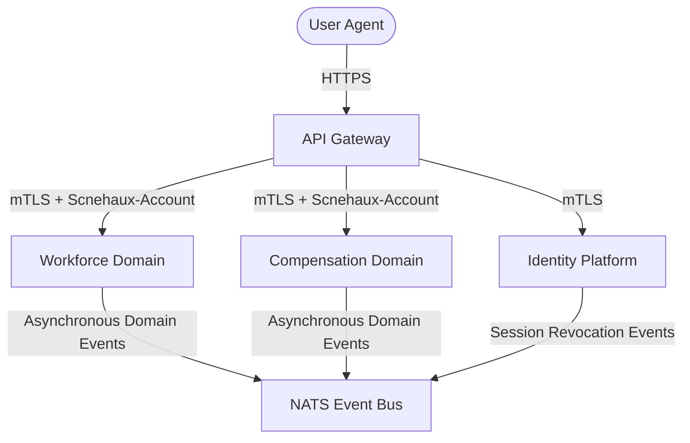

---
doc_meta:
  id: PAD-001
  title: Enterprise Identity & Access Platform Architecture
  owner: Enterprise Security Architect
  version: 1.0.1
  status: approved
  classification: restricted
  governed_by: [GDC-000]
  realizes_capability: EAD-001
  review_cycle_days: 180
  last_reviewed: '2026-05-18'
  fulfilled_by:
    - SAD-001
    - SAD-002
---

# Enterprise Identity & Access Platform Architecture (PAD-001)

---

## 1. Purpose

This document defines the domain architecture, capabilities, and boundaries for the Identity Platform.

## 2. Context & Scope

**Purpose.** The Identity & Access Management (IAM) platform is the enterprise **Root of Trust**. It centralizes authentication, federation, session lifecycle, and tenant governance so that no downstream domain re-implements identity.

**Goals.**

- Be the single authoritative source of "who the actor is" and "which tenant they belong to" (Coarse-Grained Access Control).
- Propagate identity to all downstream domains in a cryptographically verifiable, stateless way.
- Provide O(1) session revocation and key rotation without downstream coordination.

**Non-Goals.** _(explicit boundaries — what this platform deliberately does NOT own)_

- **Fine-Grained Access Control (FGAC)**: local RBAC/ABAC, per-resource permissions, and business-rule authorization remain owned by each consuming domain (HRIS, Finance).
- **User / profile / HR records**: the platform holds identity and credentials, not employment, org-structure, or business-profile data.
- **Per-domain business audit**: downstream domains own the audit trail of their own business actions.

_(Draft — confirm these are the intended exclusions.)_

**Stakeholders.** Enterprise Security Architect (owner), CISO (accountable), Application & Infrastructure teams (consulted), all Engineering (informed). Full RACI in §7.

## 3. Business Capability

The platform provides six centralized capabilities:

1. **Authentication (AuthN)**: Secure verification of primary credentials, TOTP, and WebAuthn.
2. **Federation**: OIDC and OAuth2 brokering with external identity providers (Google/GitHub).
3. **Session Operations**: Token issuance, Refresh Token Rotation (RTR), and active session revocation.
4. **Tenant Governance**: Strict multi-tenant context management and lifecycle orchestration.
5. **Policy & Authorization (AuthZ)**: Governance policy engine for coarse-grained access control and tenant administration roles.
6. **Security Audit**: Immutable, hash-chained logging of all critical identity and access lifecycle events.

**Capability boundary (CGAC vs FGAC).** The platform operates strictly at the **Coarse-Grained Access Control (CGAC)** level: it asserts "who the actor is" and "what tenant they belong to". Downstream business domains (HRIS, Finance) consume this context but retain exclusive ownership of their own **Fine-Grained Access Control (FGAC)** rules (local RBAC/ABAC).

**Capability Maturity.** Tier-0 foundational capability — mature, load-bearing, and depended upon by every other domain in the ecosystem.

## 4. Domain Model

**Bounded Contexts.** The capability decomposes into four logical contexts, independent of any implementation:

- **Authentication** — credential, TOTP, and WebAuthn verification.
- **Federation** — external IdP brokering and OIDC/OAuth2 flows.
- **Session** — token issuance, Refresh Token Rotation, and epoch-based revocation.
- **Tenant Governance** — tenant provisioning, context propagation, and lifecycle.
- **Policy & Authorization** — centralized governance and role/claim definitions.
- **Security Audit** — immutable, append-only security event tracing.

**Context Mapping.** IAM is the upstream **Supplier** of identity context; all business domains are downstream **Consumers**. The platform exposes public OIDC endpoints at the trust edge and propagates verified context to internal domains via mTLS.



**Domain Events.** The platform publishes identity-lifecycle events to the NATS event bus for downstream consumption — notably **SessionRevoked** (drives downstream session-cache invalidation) and tenant-lifecycle events. _(Draft — confirm the authoritative event catalog.)_

## 5. Trust & Data Boundaries

The identity platform enforces the absolute boundary of trust for the enterprise:

- **Zero-Trust Perimeter**: All incoming traffic must authenticate. Security does not rely on network location.
- **Tenant Isolation**: Cross-tenant data leakage is mitigated via PostgreSQL Row-Level Security (RLS) and strict schema separation.
- **Cryptographic Sovereignty**: Decoupled signing using an external Key Management Service (KMS) for staging and production, supporting a four-state key lifecycle (Active, Retiring, Retired, Purged) to guarantee trust continuity during rotation. An ephemeral software signer fallback is used solely in local development.
- **Data Classification**: The platform processes **Restricted / PII** data (credentials, emails, profile metadata). All data must be encrypted at rest and in transit (TLS 1.3).
- **Compliance**: Handling of Restricted/PII data aligns with the enterprise Data Classification and data-protection obligations; downstream consumers inherit these constraints through the identity context.

## 6. Integration Contracts

All downstream domains (e.g., HRIS, Finance) must integrate with the IAM platform following these strict interface guidelines:

- **Synchronous Handshake**: Services do not re-authenticate actors. They receive a cryptographically signed JSON Web Token (JWT) at their API boundary leveraging **Algorithmic Duality** (`ES256` for the internal microservice ecosystem and mobile channels to reduce header size, or `RS256` for external OIDC federation and B2B integrations to maximize compatibility).
- **Signature Verification**: Downstream systems must fetch the active public key set via the IAM JWKS endpoint (`/.well-known/jwks.json`) and verify the signature locally using the specified algorithm and Key ID (`kid`). The JWKS endpoint advertises both active and retiring keys to ensure uninterrupted session verification during cryptographic key rotation. Synchronous callbacks to the IAM on every request are prohibited.
- **Mandatory Context Headers**: All inter-service calls must propagate the `Scnehaux-Account` header representing the active `tenant_id` alongside the Authorization bearer token.
- **Consumers & Providers**: The IAM platform is the sole identity **Provider**; all business domains are **Consumers** of its token contract. New external systems integrate only through the documented OIDC / JWKS surface.
- **Dependencies**: The API Gateway (edge), an external KMS (signing material), and the NATS event bus; the platform has no synchronous dependency on any business domain.
- **Token Schema Claims**:

  ```json
  {
    "sub": "usr_94f83a",
    "tid": "ten_10293b",
    "epc": 12,
    "x_scnx_ent": ["iam.tenant.write"]
  }
  ```

## 7. Capability NFR Targets

These are the **capability's promises** (quantified targets). The mechanisms that achieve them live in the fulfilling SADs.

- **Scalability & Throughput**: Engineered to sustain `10,000 requests per second (RPS)` to support global peak traffic.
- **Performance & CPU Hardening**: Cryptographic password hashing (Argon2id) is governed by a process-level weighted semaphore capped at `Runtime.NumCPU() - 1` to prevent CPU exhaustion. Requests exceeding the threshold are subject to fast-shedding backpressure, returning an HTTP 429 within `100ms` to protect the host scheduler from starvation.
- **Latency Targets**: p95 credential validation must complete within `200ms` when concurrency limits are not saturated.
- **High Availability**: Multi-region redundancy to hit `>= 99.99%` uptime over a rolling 30-day window.
- **Resilience & Recovery**: Primary data stores must support Point-in-Time Recovery (PITR) with an RPO `< 5 minutes` and RTO `< 1 hour`.
- **Distributed Observability**: Every request must carry an OpenTelemetry `traceparent` context header. SLI/SLO dashboards must track authentication success rate, latency, and token-issuance failures; abnormal error spikes in authentication pipelines generate immediate S1 pages to SRE.

## 7. Ownership & Realizing Systems

**Owner.** Enterprise Security Architect.

**RACI** — **R**: Enterprise Security Architect (design) + IAM Engineering (implementation); **A**: Chief Information Security Officer (CISO); **C**: Application & Infrastructure teams; **I**: all Engineering staff.

**Realizing Systems** (`fulfilled_by`, strict 1-to-N):

- **Core IAM Modular Monolith**: [scnehaux-iam.sad.md](../../04-system/scnehaux-iam/scnehaux-iam.sad.md) (SAD-001)
- **IAM Dashboard SPA**: [scnehaux-iam-dashboard.sad.md](../../04-system/scnehaux-iam-dashboard/scnehaux-iam-dashboard.sad.md) (SAD-002)

**Capability governance.** A change to the core JWT schema or to the trust boundary constitutes a Major version bump. Release mechanics (canary rollout, CI/CD security gates, deployment cadence) are realization concerns defined in the fulfilling SADs, not here.
