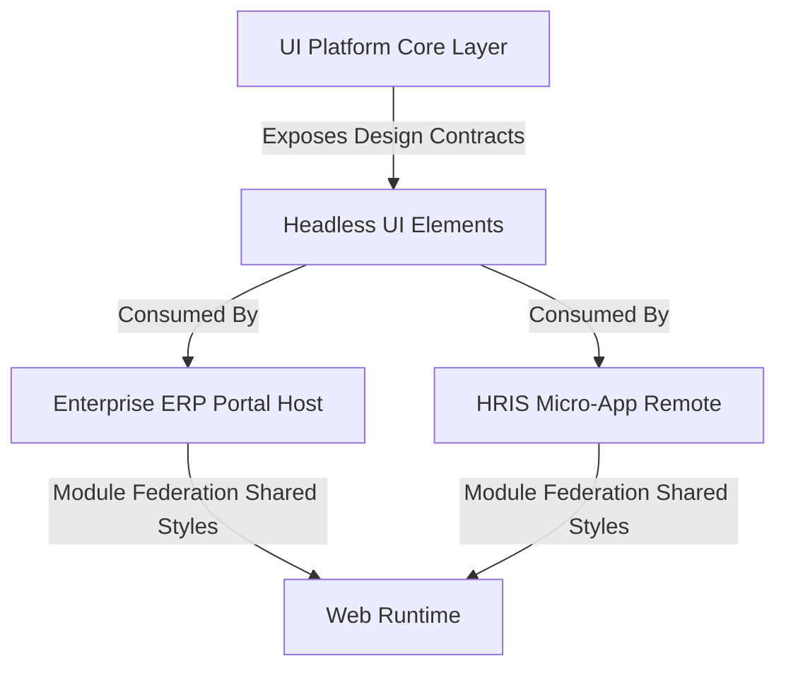

---
doc_meta:
  id: PAD-002
  title: Scnehaux UI Platform Architecture
  owner: Principal UI/UX Architect
  version: 1.0.1
  status: approved
  classification: restricted
  governed_by: [GDC-000]
  realizes_capability: EAD-003
  review_cycle_days: 180
  last_reviewed: 2026-05-18
  fulfilled_by:
    - SAD-003
---

# Scnehaux UI Platform Architecture (PAD-002)

---

## 1. Purpose

## Scope


This document defines the domain architecture, capabilities, and boundaries for the UI Platform.

## 2. Enterprise Position

**Purpose.** The Scnehaux UI Platform is the enterprise **Visual Root of Trust** — a shared presentation foundation that enforces visual consistency, strict styling isolation, and accessible interaction semantics across both standalone applications and federated micro-frontends. It eliminates brand fragmentation and lets a single primitive-layer (rendering or bundle-size) improvement propagate across the entire ecosystem.

**Goals.**

- Be the single authoritative source for visual primitives, design tokens, and styling.
- Guarantee zero visual contamination across applications and brands.
- Guarantee accessibility (WCAG) semantics at the primitive layer, inherited by all consumers.

**Non-Goals.** _(explicit boundaries — what this platform deliberately does NOT own)_

- **Application / business logic**: the platform owns presentation, not domain behavior or business data.
- **Per-product screens & visual identity**: product-specific compositions consume the platform; they are not defined here.
- **Arbitrary third-party theming**: white-labeling is bounded by the partial-contract invariant (§5), not an open runtime theming engine.

_(Draft — confirm these are the intended exclusions.)_

**Stakeholders.** Principal UI/UX Architect (owner); Frontend Architects, Application teams, Product Owners, and the ARB. Full RACI in §7.

## 3. Domain Capabilitiesy

The platform provides a unified **3-Layer Visual Engine** capability:

1. **Primitive Components (Accessible Headless Core)**: Style-agnostic, polymorphic headless elements guaranteeing accessibility compliance and robust interaction handling — the logical layout skeleton, decoupled from physical styles.
2. **Design Tokens (The Design API)**: A platform-agnostic, multi-family token taxonomy as a 3-tier engine — **Tier-1 Core Primitives** (raw mathematical scales), **Tier-2 Global Semantics** (the SSOT mapping primitives to intent), **Tier-3 Component Aliases** (isolated component-unique overrides).
3. **Styled Engine (Zero-Runtime Compiler)**: A static compilation engine binding Headless Primitives to Design Tokens with zero runtime execution overhead.

**Capability Maturity.** Tier-1 shared platform — mature and adopted as the mandatory presentation foundation across all enterprise frontends.

## 5. Domain EventsModel

**## 4. Bounded Context Maps.** The capability decomposes into three logical layers, each a distinct context independent of any implementation:

- **Primitive / Headless** — interaction and accessibility semantics.
- **Design Tokens** — the design API (Core / Semantic / Component tiers).
- **Styled Engine** — compile-time orchestration of primitives and tokens.

**Context Mapping.** The platform is the upstream **Supplier**; container applications (the ERP host shell, micro-frontend remotes, and standalone SPAs) are **Consumers** that receive shared `@scnx/system` styles via Module Federation.



The token## 6. Architecture Rules (Domain-Specific)n isolation to guarantee zero visual contamination:

```text
[Tier 1: Core Primitives] -> [Tier 2: Global Semantic Contract] -> [Tier 3: Component Token]
(Raw OKLCH coordinates)      (Symmetrical Semantic Tokens)          (Direct Component consumes)
```

## 4. Trust & Data Boundaries

Visual styling and layout architectures represent critical application boundaries. The platform enforces the following isolation, compliance, and data policies:

- **Zero Layout Contamination (Trust)**: All layout frameworks must use strict CSS encapsulation. Selectors are isolated via SCSS Modules, domain-specific namespace prefixes (e.g., `scnx-hris-`, `scnx-fin-`), or build-time Atomic CSS extraction (Zero-Runtime CSS-in-JS) — reserving the core `scnx-` prefix exclusively for shared platform styles.
- **CSP Compliance**: Runtime injection of inline `<style>` blocks is prohibited. All styles compile to static, hash-verified external CSS files, mitigating XSS via styling injection.
- **Accessibility Compliance**: Color contrasts must adhere strictly to **WCAG 2.2 AA** (minimum 4.5:1 for standard text, 3:1 for large graphical components) under both light and dark modes.
- **Anti-Flicker**: Overlays, modal animations, and skeletons must execute with frame sanitization (no RequestAnimationFrame queue stacking) to eliminate layout thrashing.
- **Data Boundary**: The platform holds **no PII**; its only data is the design-token contract and theme metadata, distributed as static, versioned assets.

## 5. Integration Contracts

Downstream applications and component systems (e.g., `scnehaux-iam-dashboard`, `core-ui`) consume the platform via the following strict contract.

- **Design API (Token Mapping)**: Structural tokens are exposed as flat CSS Custom Properties (`--ds-color-*`, `--ds-spacing-*`) and mirrored as strongly-typed SCSS variables at compile time (e.g. Surface Canvas → `--ds-color-neutral-canvas-default`), eliminating manual string errors.
- **Consumers & Providers**: The platform is the sole visual **Provider**; all frontends are **Consumers** of the `@scnx/system` contract. Consumers integrate only through the published token API and headless components — never by reaching into internals.
- **Cascading Multi-Theme Invariant**: A global baseline theme injects all core variables at `:root`; brand/contextual themes override only specific visual characteristics; structural variables cascade. Override themes are validated against a brand contract that is a **partial subset** of the core `$system` contract and must introduce no undocumented keys (compile-time design safety, zero visual leakage).
- **Zero-Bypass Governance**: All downstream styling must resolve through Tier-2 semantic properties (`--ds-`); raw OKLCH/HSL/HEX literals are prohibited; Tier-3 aliases are strictly budgeted.
- **Dependencies**: React (peer singleton, shared under Module Federation) and the consuming bundlers (Vite / Rspack); the platform has no runtime service dependencies.

**Authoritative Sources (SSOT — not duplicated here, per GDC-000 §2.3):**

- **Taxonomy & Naming Convention**: [ADR-UIP-TKN-003](../../05-decisions/ui-platform/design-tokens/ADR-UIP-TKN-003-token-taxonomy-and-naming-convention.md).
- **Token Consumption Governance**: [STD-UIP-TKN-002](../../02-standards/ui-platform/design-tokens/STD-UIP-TKN-002-consumption-governance.md).

## 7. Traceability NFR Targets

These are the capability's quantified promises; the mechanisms that achieve them live in the fulfilling SAD.

- **Bundle Budget**: The compressed global design-token bundle must not exceed `12KB` (gzip).
- **Render Performance**: Transitions/animations must use GPU-accelerated properties (`transform`, `opacity`) only; layout-reflow triggers are prohibited, so p95 frame rendering completes within `16ms`.
- **Theme-Switch Latency**: Light↔Dark swaps must execute in under `50ms` by mutating a single root `data-theme` attribute, avoiding application-wide re-renders.
- **Sub-Pixel Precision**: All spacing and typography must align to a strict `4px` grid at any desktop resolution.

## 7. Ownership & Realizing Systems

**Owner.** Principal UI/UX Architect.

**RACI** — **R**: Principal UI/UX Architect (design) + UI Platform Engineering (implementation); **A**: Principal UI/UX Architect; **C**: Application teams & ARB; **I**: all Frontend Engineering.

**Realizing Systems** (`fulfilled_by`, strict 1-to-N):

- **UI Platform package & registry**: [scnehaux-ui-platform.sad.md](../../04-system/scnehaux-ui-platform/scnehaux-ui-platform.sad.md) (SAD-003)
- **Consuming surfaces** (not owned, integrate the contract): the IAM Dashboard standalone SPA and the ERP federated host shell.

**Capability governance.** A change to the core `$system` token contract or the trust boundary constitutes a Major version bump. Release mechanics (visual-regression gates, bundle-size checks, NPM publication) are realization concerns defined in the fulfilling SAD, not here.


