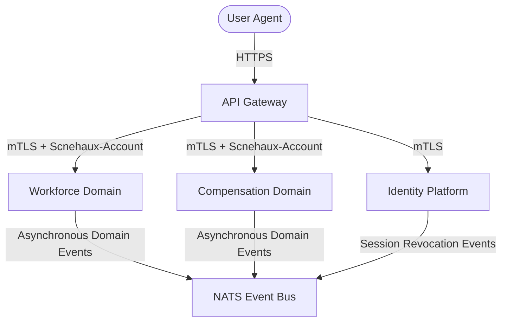

---
doc_meta:
  id: PAD-001
  title: Enterprise Identity & Access Platform Architecture
  owner: Enterprise Security Architect
  version: 1.0.0
  status: approved
  classification: restricted
  governed_by: [GDC-000]
  review_cycle_days: 180
  last_reviewed: 2026-05-18
  fulfilled_by:
    - SAD-001
    - SAD-002
---

# Enterprise Identity & Access Platform Architecture (PAD-001)

---

## 1. Business Capability

The Identity and Access Management (IAM) platform is the **Root of Trust** for the entire Scnehaux ecosystem. It provides the following centralized business capabilities:

1.  **Authentication (AuthN)**: Secure verification of primary credentials, TOTP, and WebAuthn.
2.  **Federation**: OIDC and OAuth2 brokering with external identity providers (Google/GitHub).
3.  **Session Operations**: Token issuance, Refresh Token Rotation (RTR), and active session revocation.
4.  **Tenant Governance**: Strict multi-tenant context management and lifecycle orchestration.

### 1.1 Fulfilling Systems

This platform capability is physically fulfilled by the following software applications:
- **Core IAM Modular Monolith**: [scnehaux-iam.sad.md](../../04-application/scnehaux-iam/scnehaux-iam.sad.md) (SAD-001)
- **IAM Dashboard SPA**: [scnehaux-iam-dashboard.sad.md](../../04-application/scnehaux-iam-dashboard/scnehaux-iam-dashboard.sad.md) (SAD-002)

**Domain Boundary (CGAC vs FGAC)**:
The platform operates strictly at the **Coarse-Grained Access Control (CGAC)** level. It verifies "who the actor is" and "what tenant they belong to". Downstream business domains (HRIS, Finance) consume this context but retain exclusive ownership of their own **Fine-Grained Access Control (FGAC)** rules (e.g., local RBAC/ABAC).

## 2. Trust Boundary & Security

The identity platform enforces the absolute boundary of trust for the enterprise:

-   **Zero Trust Perimeter**: All incoming traffic must authenticate. Security does not rely on network location.
-   **Tenant Isolation**: Cross-tenant data leakage is mitigated via PostgreSQL Row-Level Security (RLS) and strict schema separation.
-   **Cryptographic Sovereignty**: Decoupled signing using an external Key Management Service (KMS) for staging and production environments, supporting a four-state key lifecycle (Active, Retiring, Retired, Purged) to guarantee trust continuity during rotation. An ephemeral software signer fallback is utilized solely in local development environments to enhance developer ergonomics.
-   **Data Classification**: The platform processes **Restricted / PII** data (credentials, emails, profile metadata). All data must be encrypted at rest and in transit (TLS 1.3).

## 3. Integration Contract

All downstream domains (e.g., HRIS, Finance) must integrate with the IAM platform following these strict interface guidelines:

-   **Synchronous Handshake**: Services do not re-authenticate actors. They receive a cryptographically signed JSON Web Token (JWT) at their API boundary leveraging **Algorithmic Duality** (either `ES256` for the internal microservice ecosystem and mobile channels to reduce header size, or `RS256` for external OIDC federation and B2B integrations to maximize compatibility).
-   **Signature Verification**: Downstream systems must fetch the active public key set via the IAM JWKS endpoint (`/.well-known/jwks.json`) and verify the signature locally using the specified algorithm and Key ID (`kid`). The JWKS endpoint advertises both active and retiring keys to ensure seamless session verification during cryptographic key rotation. Synchronous callbacks to the IAM on every request are prohibited.
-   **Mandatory Context Headers**: All inter-service calls must propagate the `Scnehaux-Account` header representing the active `tenant_id` alongside the Authorization bearer token.
-   **Token Schema Claims**:
    ```json
    {
      "sub": "usr_94f83a",
      "tid": "ten_10293b",
      "epc": 12,
      "x_scnx_ent": ["iam.tenant.write"]
    }
    ```

## 4. Strategic Architecture

The Enterprise Identity Platform acts as the sole orchestrator of identities, positioned at the edge of the C1 container boundary:



The IAM monolithic engine exposes public OIDC endpoints at the edge, while propagating verified context to internal microservices via mTLS.

## 5. Quality Attributes

-   **Throughput & Scaling**: Engineered to sustain `10,000 requests per second (RPS)` to support global peak traffic.
-   **CPU Hardening & Anti-DoS**: Cryptographic password hashing (Argon2id) execution is governed by a Process-Level Weighted Semaphore capped at `Runtime.NumCPU() - 1` to prevent CPU exhaustion. Incoming requests exceeding the threshold are subject to fast-shedding backpressure mechanisms, returning an HTTP 429 status within `100ms` to protect the host scheduler from starvation.
-   **Latency Targets**: p95 credential validation must be completed within `200ms` when concurrency limits are not saturated.
-   **High Availability**: Configured with multi-region redundancy to hit `>= 99.99%` uptime over a rolling 30-day window.
-   **Resilience & Recovery**: Primary data stores must support Point-in-Time Recovery (PITR) with an RPO `< 5 minutes` and RTO `< 1 hour`.
-   **Distributed Observability**: Every request must carry an OpenTelemetry `traceparent` context header. Abnormal error spikes in authentication pipelines generate immediate S1 pages to SRE teams.
