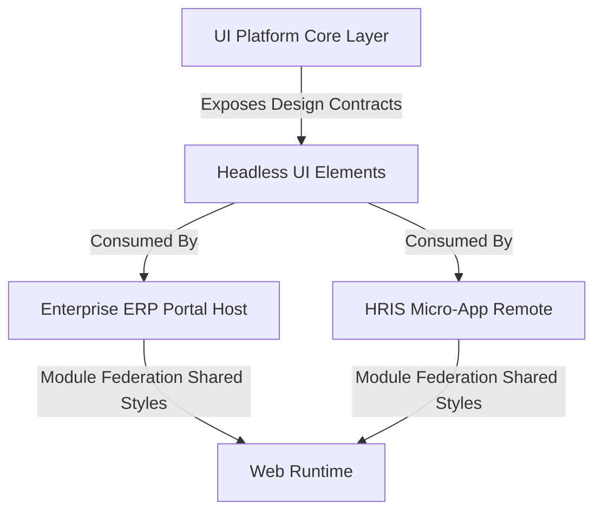

---
doc_meta:
  id: DOC-P-002
  title: Scnehaux UI Platform Architecture
  owner: Principal UI/UX Architect
  version: 1.0.0
  status: approved
  classification: public
  review_cycle_days: 180
  last_reviewed: 2026-05-18
  fulfilled_by:
    - DOC-S-003
---

# Scnehaux UI Platform Architecture (PAD-002)

---

## 1. Application Capability

**System Context & Business Drivers**: 
To eliminate brand fragmentation, reduce duplicated frontend engineering efforts, and ensure an accessible user experience across all digital touchpoints, the enterprise requires a centralized styling authority. 

The **Scnehaux UI Platform** serves as this authoritative **Visual Root of Trust**. It is a logical shared presentation foundation that enforces absolute visual consistency, strict styling isolation, and robust accessible interaction semantics across both standalone applications and federated micro-frontends.

The platform capability is defined by a unified **3-Layer Visual Engine**:
1.  **Layer 1: Primitive Components (Accessible Headless Core)**: Pure, style-agnostic, and polymorphic headless elements that guarantee accessibility compliance and robust interaction handling. These primitives are decoupled from physical visual styles, serving strictly as the logical layout skeleton.
2.  **Layer 2: Design Tokens (The Design API)**: A platform-agnostic, multi-family token taxonomy structured as a 3-tier engine:
    *   **Tier-1: Core Primitives (Raw Values)**: Platform-agnostic raw constants without semantic meaning, organized as precise mathematical scales (Colors, Dimensions, Typography, and Motion).
    *   **Tier-2: Global Semantics (The Core Taxonomy)**: Standardized single source of truth mapping primitives to visual intent under a strict flat key notation.
    *   **Tier-3: Component Aliases (Unique Overrides)**: Isolated overrides reserved strictly for component-unique behavior where independent styling divergence is structurally justified, preventing global semantic pollution.
3.  **Layer 3: Styled Engine (Zero-Runtime Compiler)**: A static compilation engine that marries the Headless Primitives (Layer 1) with the Design Tokens (Layer 2) using static styling orchestration with zero runtime execution overhead.

### 1.1 Fulfilling Systems

This platform capability is physically fulfilled by the following systems:
-   **Scnehaux UI Platform Software Architecture**: Managed under the physical package registry defined in [scnehaux-ui-platform.sad.md](../../04-application/scnehaux-ui-platform/scnehaux-ui-platform.sad.md) (DOC-S003).
-   **IAM Dashboard (Standalone SPA)**: Housed under `scnehaux-iam-dashboard` which directly integrates and consumes the semantic token suite as a standalone portal ([scnehaux-iam-dashboard.sad.md](../../04-application/scnehaux-iam-dashboard/scnehaux-iam-dashboard.sad.md)).
-   **ERP Portal (Federated Host)**: The host shell orchestrating HRIS and Finance micro-frontends sharing `@scnx/system` styles.

---

## 2. Trust Boundary & Security

Visual styling and layout architectures represent critical application boundaries. The platform enforces the following security and isolation policies:

-   **Zero Layout Contamination**: All layout frameworks must use strict CSS encapsulation. Component selectors are isolated using SCSS Modules, unique domain-specific namespace prefixes (e.g., `scnx-hris-`, `scnx-fin-`), or Build-time Atomic CSS Extraction (Zero-Runtime CSS-in-JS) to prevent side-effects, reserving the core `scnx-` prefix exclusively for the shared Scnehaux UI Platform core styles and visual tokens.
-   **CSP (Content Security Policy) Compliance**: The platform prohibits injecting inline `<style>` blocks at runtime. All styles must compile to static, hash-verified external CSS files, mitigating cross-site scripting (XSS) via styling injection.
-   **Anti-Flicker Transitions**: Active page overlays, modal animations, and skeletons must execute with frame sanitization (preventing RequestAnimationFrame queue stacking) to eliminate layout thrashing and rendering flickering.
-   **Data-Driven Aesthetics Protection**: Color contrasts must adhere strictly to **WCAG 2.2 AA** rules, guaranteeing a minimum contrast ratio of 4.5:1 for standard text and 3:1 for large graphical components under both light and dark modes.

---

## 3. Integration Contract

Downstream applications and component systems (e.g., `scnehaux-iam-dashboard`, `core-ui`) must consume the design token platform following this strict contract.

### 3.1 Token Mapping and Developer Convenience
The platform maps structural design tokens to standard flat CSS Custom Properties (prefixed with `--ds-color-` and `--ds-spacing-`) and mirrors them as strongly-typed SCSS variables at compile-time to provide an excellent developer experience and eliminate manual string errors.
*   Conceptual Surface Canvas $\rightarrow$ `--ds-color-neutral-canvas-default` / `$color-neutral-canvas-default`
*   Conceptual Primary Hover $\rightarrow$ `--ds-color-primary-surface-hover` / `$color-primary-surface-hover`
*   Conceptual Success Border $\rightarrow$ `--ds-color-success-border-default` / `$color-success-border-default`

### 3.2 The Master Semantic Taxonomy (Reference)

The SCNX Platform establishes a highly predictable combinatorial token taxonomy. However, to comply with the Abstraction Leakage Rule (GDC-000 §2.3), this PAD does not duplicate the token payload or taxonomy tree. 

**Authoritative Sources (SSOT):**
*   **Taxonomy Structure & Naming Convention**: Defined strictly in the Enterprise Architecture Record **[ADR-UIP-TKN-003](../../05-decisions/ui-platform/design-tokens/ADR-UIP-TKN-003-token-taxonomy-and-naming-convention.md)**.
*   **Physical CSS Payload & OKLCH Generator Math**: Detailed in the project-level Technical Design Document **[TDD-SCNX-UI-JS-003](../../../js/module_federation_v1.5/packages/docs/06-designs/TDD-SCNX-UI-JS-003-semantic-token-dictionary.md)**.

### 3.3 Cascading Multi-Theme & Partial Contracts Invariant
The platform natively supports multi-theme and multi-brand white-label capabilities under a strict cascading model:
1.  **Global Baseline Theme**: The default theme is the Visual Root of Trust, injecting all core variables onto the global :root selector.
2.  **Cascading Overrides**: Brand or contextual themes only override specific visual characteristics. All structural variables (spacing, layout, typography) cascade from the global baseline theme.
3.  **Partial Contract Invariant**: Override themes are validated against a brand-specific contract map. This contract represents a **partial subset** of the core $system contract. It must not introduce any undocumented keys or variables that are absent from the core $system contract, ensuring strict compile-time design safety and zero visual leakage.

### 3.4 Token Consumption Governance

> **Authoritative Source**: The full operational governance framework, consumption doctrines, alias budgeting rules, and enforcement mechanisms for design tokens are defined and maintained in **[STD-UIP-TKN-002 — UI Platform Token Consumption Governance](../../02-standards/ui-platform/design-tokens/STD-UIP-TKN-002-consumption-governance.md)**.

The platform enforces zero-bypass doctrines:
1. **Zero-Bypass Styling**: All downstream styling must resolve through Tier-2 semantic CSS custom properties (--ds-). Raw OKLCH/HSL/HEX literals in component files are prohibited.
2. **Domain Semantic Layering**: Downstream portals must implement a thin logical alias mapping layer (state.fraud → --ds-color-danger-solid-default) instead of hardcoding primitive references deep in application logic.
3. **Restricted Alias Budget**: Component-level Tier-3 aliases are strictly budgeted to prevent semantic entropy.

---
## 4. Strategic Architecture

The `@scnx/system` platform serves as the visual foundation distributed to container applications via Module Federation.



The token architecture structure is grouped in isolation to guarantee zero visual contamination:

```
[Tier 1: Core Primitives] -> [Tier 2: Global Semantic Contract] -> [Tier 3: Component Token]
(Raw OKLCH coordinates)      (Symmetrical Semantic Tokens)          (Direct Component consumes)
```

---

## 5. Quality Attributes

-   **Performance Constraints**: CSS compilation output must be lightweight. The compressed global design system token bundle must not exceed `12KB` (gzip).
-   **Zero Layout Thrashing**: Any transition or animation must execute using GPU-accelerated CSS properties (`transform` and `opacity` only). Layout reflow triggers (e.g., modifying `width`, `height`, or `margin` inside animations) are prohibited to ensure p95 frame rendering completes within `16ms`.
-   **Theme Switching Latency**: Theme swaps (e.g., Light to Dark mode) must execute in under `50ms` by mutating a single global data-attribute (`data-theme`) on the root elements, avoiding application-wide component re-renders.
-   **Sub-Pixel Precision Styling**: All padding, spacing, and typography boundaries must match a strict 4px grid system, ensuring flawless visual alignment at any desktop screen resolution.

