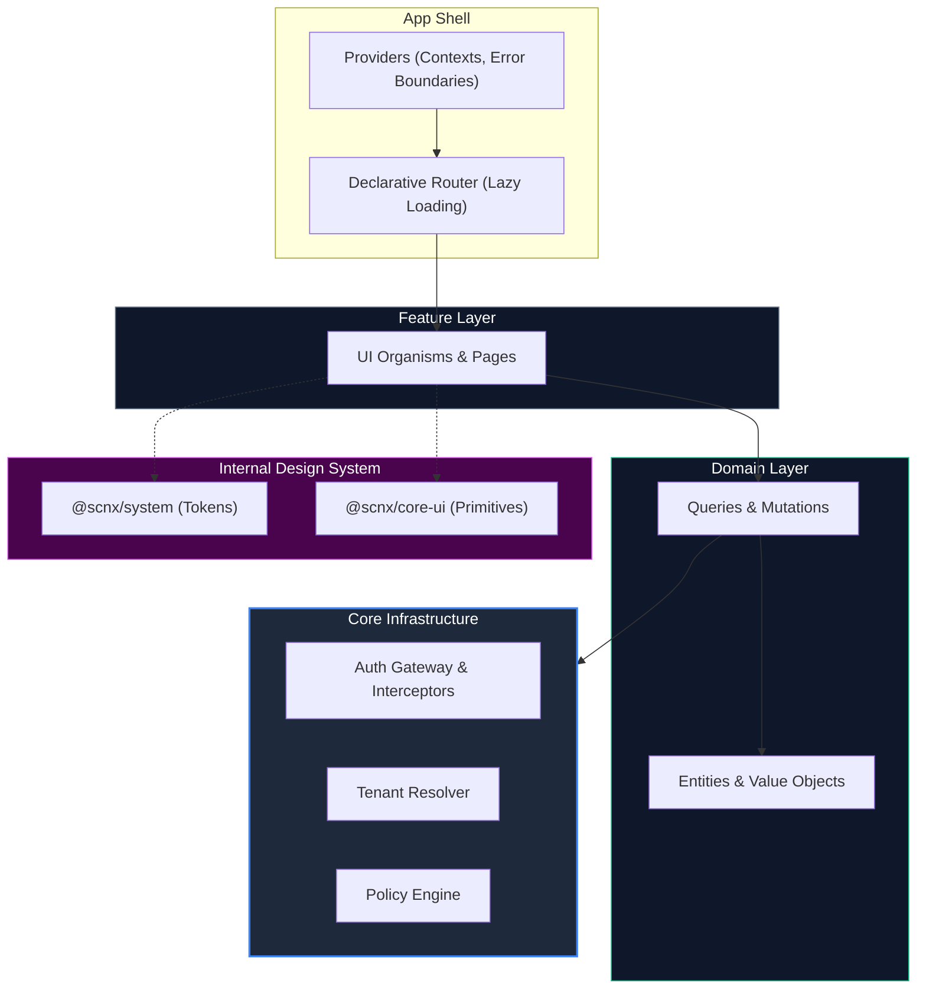
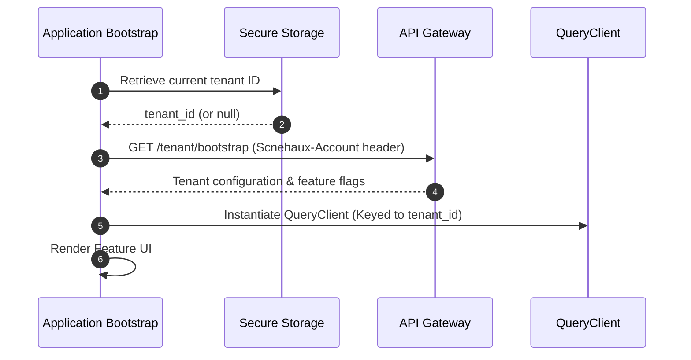
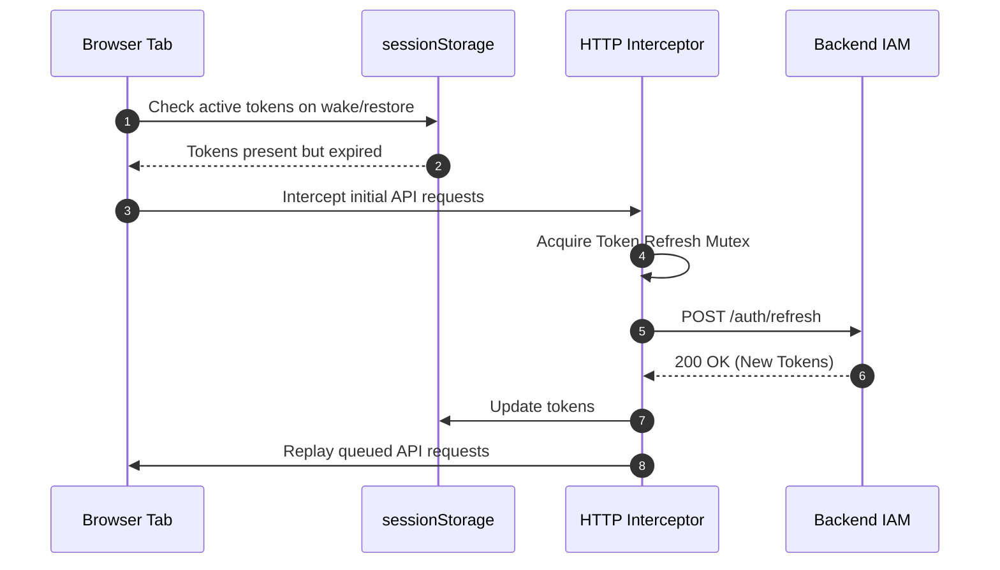
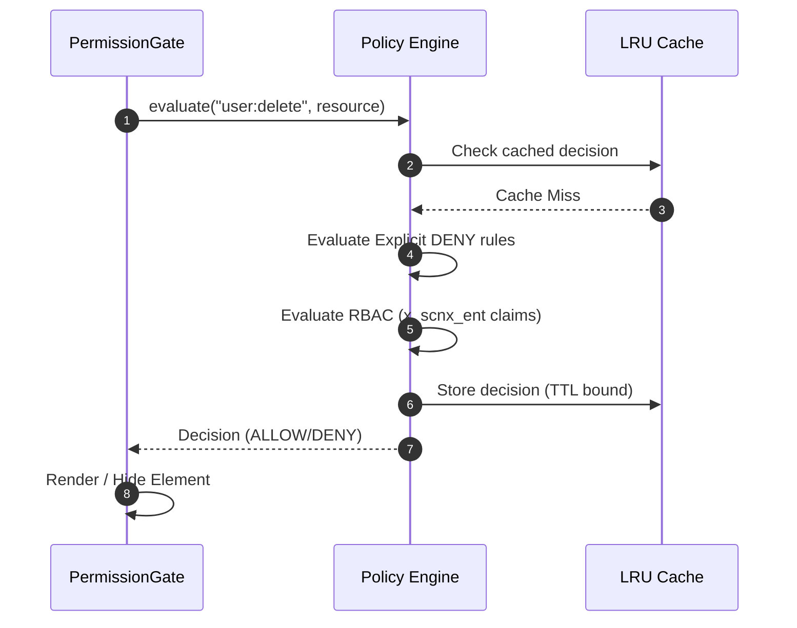

---
doc_meta:
  id: DOC-S002
  title: Scnehaux IAM Dashboard Software Architecture (SAD)
  owner: Principal Frontend Architect
  version: 1.0.0
  status: approved
  classification: restricted
  review_cycle_days: 180
  last_reviewed: 2026-05-18
parent_pad: DOC-P001
---

# Scnehaux IAM Dashboard Software Architecture (SAD-002)

---

## 1. Context

The Scnehaux IAM Dashboard is the concrete frontend software application that serves as the administrative interface for the **Enterprise Identity & Access Platform** (defined in [identity-platform.pad.md](../../03-platform/identity-platform/identity-platform.pad.md)). 

It is architected as a standalone Single Page Application (SPA) to ensure maximum isolation, operational simplicity, and strict boundary separation from other business capability frontends. It strictly consumes the enterprise design system packages (`@scnx/system` and `@scnx/core-ui`) with zero external primitive component libraries.

## 2. Solution Architecture

The application adopts a strict 4-layer dependency flow (Clean Architecture) to guarantee that core multi-tenancy and security logic remain entirely framework-agnostic.

### 2.1 Architectural Boundaries
- **Core Infrastructure (`core/`)**: Handles non-business mechanics. Responsible for token lifecycle, HTTP interception, multi-tenant resolution, and policy evaluation. It knows nothing about React components or domain logic.
- **Domain Logic (`domain/`)**: Framework-agnostic TypeScript modules defining IAM bounded contexts (identity, access, organization). Uses strict Value Objects (e.g., `UserId`, `Email`).
- **Feature UI (`features/`)**: React-specific implementations. Strictly imports from `domain/` and `core/`. No cross-feature dependencies are permitted.
- **Design System Isolation**: The UI layer relies 100% on `@scnx/system` (tokens/styling) and `@scnx/core-ui` (primitives). External component libraries (e.g., Radix, MUI) are strictly prohibited to enforce enterprise brand consistency and minimize bundle payload.

## 3. Deployment & Topology

The IAM Dashboard is deployed as a stateless, client-rendered Single Page Application (SPA).

- **Current Deployment Model**: Delivered via a global CDN (e.g., AWS CloudFront / S3) as static assets.
- **Server-Side Rendering (SSR)**: Current architecture adopts client-rendered SPA deployment due to operational simplicity and authentication isolation requirements. SSR/Edge rendering is intentionally deferred and may be revisited through a future ADR.
- **Micro-Frontend (MFE) Exclusivity**: This application is intentionally excluded from the standard Module Federation runtime shell to preserve its security perimeter and prevent runtime contamination from less privileged applications.

### 3.1 Build Engine & Tooling Selection

The application is built using **Vite** rather than Rspack/Webpack. This tooling selection was approved by the Architecture Review Board (ARB) based on three primary factors:
1. **Zero-Waste and Simplicity (Zero-Overhead)**: Since the IAM Dashboard is strategically excluded from Module Federation, it has no requirement for complex module-loading/federating runtime plugins. Vite keeps the build pipeline lightweight (< 15 lines of configuration) and eliminates unnecessary build-engine overhead.
2. **Operational Portability**: Development currently takes place in the local monorepo to easily consume the local design system packages (`@scnx/system` and `@scnx/core-ui`) via pnpm workspaces. Once the design system is published to NPM, the application is designed to be effortlessly moved to a standalone repository. Vite is the industry standard for React SPAs, ensuring seamless transition friction.
3. **Developer Experience & Ecosystem**: Vite provides a blazing-fast HMR and has a vast ecosystem of plugins specifically optimized for standalone client-rendered SPAs, making long-term maintenance highly efficient.

## 4. Runtime Flows

### 4.1 Tenant Resolution & Provider Bootstrap
Ensures that cross-tenant data leakage is structurally impossible before rendering any feature.

### 4.2 Authentication State Recovery Flow
Arbitrates complex browser lifecycle events to maintain session integrity.

### 4.3 Policy Engine RBAC Evaluation
Evaluates permissions synchronously on the client side using embedded JWT claims.

## 5. Resilience & Failure Modes

- **Token Refresh Race Conditions**: Handled via the Token Refresh Mutex (see **ADR-E008**). Prevents duplicate refresh requests from triggering backend theft-detection mechanisms.
  - **Blast Radius**: **Single Client Session**. Prevents accidental session invalidation for the current user.
- **API Gateway Degradation**: HTTP interceptors automatically retry idempotent operations using exponential backoff.
  - **Blast Radius**: **Temporary Degraded UX**. Actions may take longer, but the application remains usable.
- **Cross-Tenant Contamination**: Prevented structurally by purging the `QueryClient` cache when a tenant switch occurs (see **ADR-E009**).
  - **Blast Radius**: **Cross-Tenant Data Leak**. Mitigated immediately upon tenant context switch.

## 6. Observability & Quality Benchmarks

- **Web Vitals**: Must strictly adhere to enterprise targets (LCP ≤ 2.5s, FID ≤ 100ms, CLS ≤ 0.1).
- **Performance Standards Compliance**: The application codebase must comply with the global [Enterprise Frontend Performance and Rendering Standard (STD-E006)](../../05-standards/STD-E006-frontend-performance-rendering-standard.md) to guarantee frame rate stability and prevent memory leaks.
- **Client-Side Errors**: Unhandled promise rejections and React Error Boundary fallbacks are aggregated and sent to the centralized logging sink (e.g., Sentry) with `tenantId` and `traceId` context.
- **Tracing**: OpenTelemetry browser tracing is enabled for critical paths (e.g., initial load, authentication handshakes) to correlate client latency with backend spans.

## 7. Security Considerations

- **Tenant-Scoped Storage Keys**: `sessionStorage` keys must be prefixed with the active tenant ID to prevent origin-shared contamination (see **ADR-E009**).
- **LRU-Bounded Policy Cache**: Client-side authorization decisions are cached in a capacity-bounded LRU cache to prevent unbounded memory growth in long-running SOC sessions (see **ADR-E010**).
- **Browser Defenses**: Enforces a strict `Content-Security-Policy` (`default-src 'none'`), `X-Frame-Options: DENY`, and strictly sanitizes all user-generated content prior to rendering to prevent XSS.
