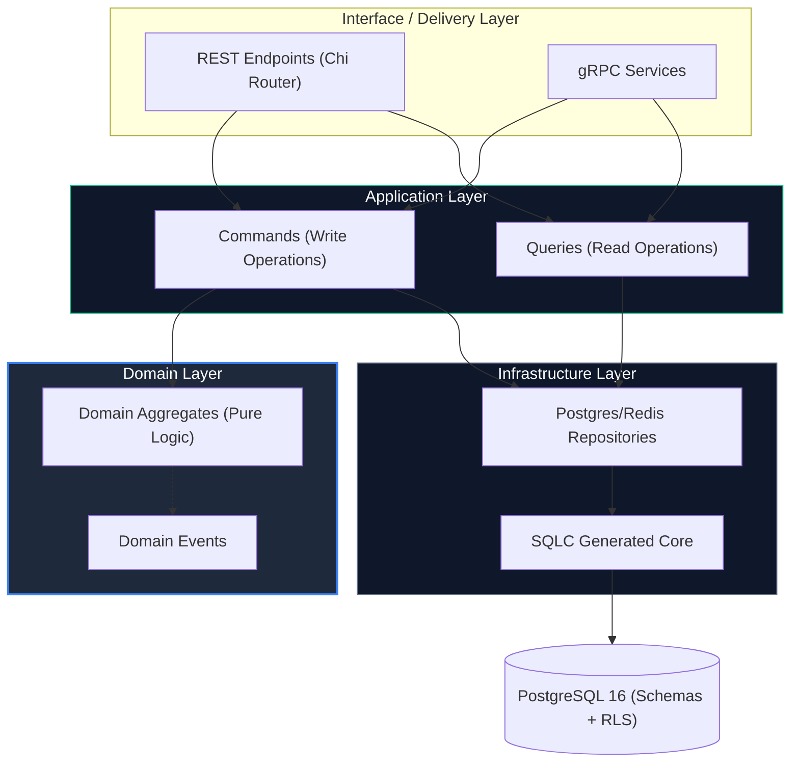
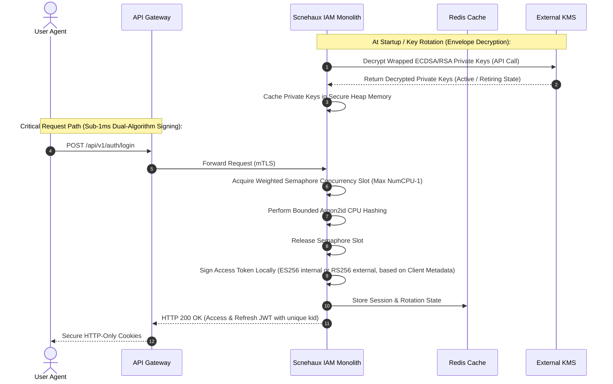
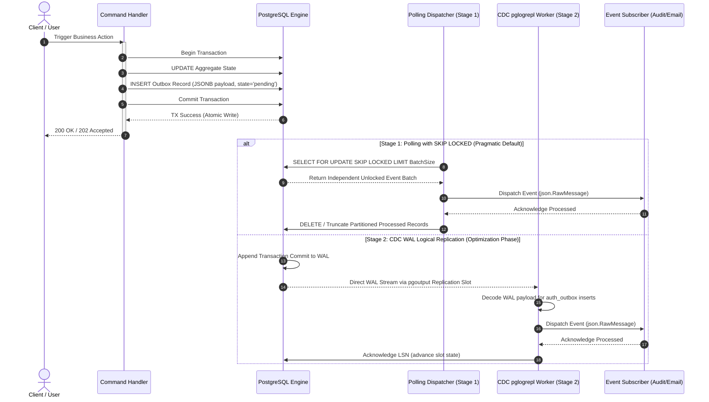
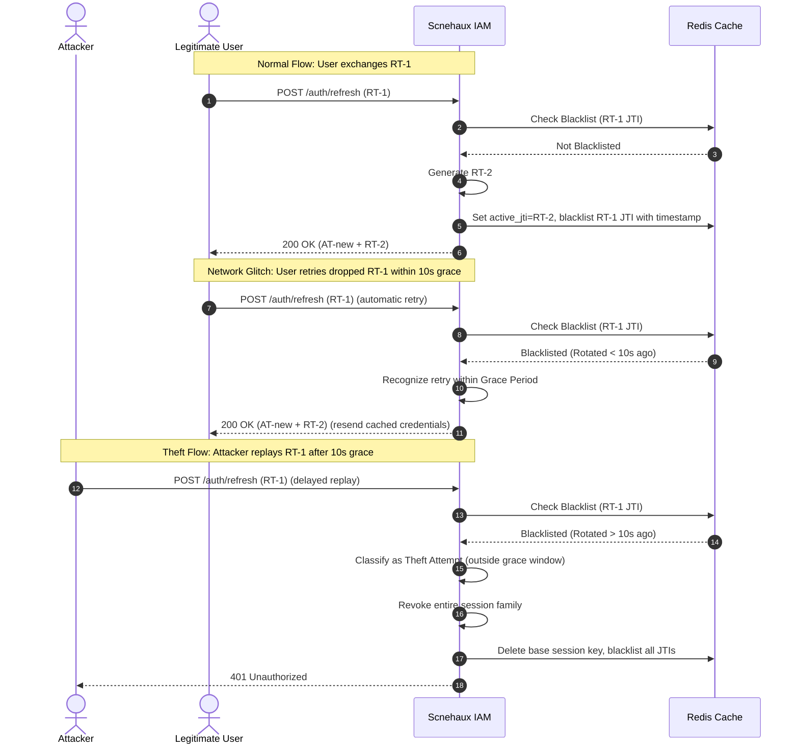

---
doc_meta:
  id: SAD-001
  title: Scnehaux IAM Software Architecture (SAD)
  owner: Principal IAM Architect
  version: 1.0.0
  status: approved
  classification: restricted
  governed_by: [GDC-000]
  review_cycle_days: 180
  last_reviewed: 2026-05-18
  parent_pad: PAD-001
---

# Scnehaux IAM Software Architecture (SAD-001)

---

## 1. Context

Scnehaux IAM is the concrete software application that implements the enterprise identity capability. It serves as the physical execution unit for the **Enterprise Identity & Access Platform** capability described in the [identity-platform.pad.md](../../03-platform/identity-platform/identity-platform.pad.md) specification. It is architected as a **Modular Monolith** in **Golang** to ensure high-performance authentication with low operational complexity.

The system interacts directly with the API Gateway, PostgreSQL for tenant/session state persistence (segregated strictly via logical database schemas), Redis for rate limiting and cache, and an external KMS for cryptographic data key decryption.

## 2. Solution Architecture

The application is structured into isolated vertical domain slices coordinated strictly via an event-driven outbox. This architecture maintains clear boundaries inside a single compile unit, providing a strict separation between synchronous user actions and asynchronous side effects.



### 2.1 Architectural Boundary and Segregation
- **Interface Layer**: Employs an HTTP server (using `go-chi`) for REST API endpoints and a gRPC server for low-latency inter-service validations.
- **Internal CQRS (Level 1)**: Commands and Queries are strictly segregated at the application layer into separate packages (`command/` and `query/`).
  - **Commands**: Orchestrate state changes, interact with Domain Aggregates, and emit Outbox Events.
  - **Queries**: Provide high-performance data retrieval by bypassing Domain Aggregates and executing direct, type-safe SQL via **SQLC** using idiomatic Go pointers for nullable fields (**ADR-018**).
- **Core Module**: Business logic domains are separated cleanly into packages (`internal/auth`, `internal/tenant`, `internal/token`). Interaction between modules must pass through well-defined internal APIs.
- **Database Access & Schema Boundaries**: Uses SQLC for type-safe database queries, completely avoiding slow and unpredictable ORM behaviors. Domain tables are isolated into separate logical PostgreSQL database schemas (e.g., `iam_schema` and `audit_schema`) to prevent cross-module table joins and preserve domain purity.
- **Asynchronous Event Delivery**: Employs an outbox table within each module's schema utilizing a **Two-Stage Evolutionary Outbox Architecture** (**ADR-E003**).
  - *Stage 1 (Pragmatic Default)*: A background worker threads query the outbox utilizing `SELECT FOR UPDATE SKIP LOCKED` and deletes processed elements in bulk via daily/weekly database partitions to eliminate WAL autovacuum bloat.
  - *Stage 2 (Scale Optimization)*: Direct WAL streaming using logical replication and change data capture (`pglogrepl` plugin) to stream events directly to NATS JetStream.

### 2.2 Modular Monolith Structure & Topologies
To enforce structural integrity and compile-time boundaries, Scnehaux IAM employs a strict package topology:
```text
scnehaux-auth/
├── cmd/server/                  # main.go, manual DI, graceful shutdown
├── internal/
├── platform/                # Cross-cutting infrastructure
│   │   ├── bootstrap/           # Manual DI container & wiring
│   │   ├── database/            # pgx pool, TxManager, Read/Write Splitting
│   │   ├── cache/               # Redis client
│   │   ├── http/                # Chi server, CORS, recovery
│   │   ├── grpc/                # gRPC server, interceptors
│   │   ├── middleware/          # Auth, tenant, tracing, logging
│   │   ├── security/            # Argon2id Worker Pool, Envelope Key Decryptor
│   │   ├── events/              # pglogrepl WAL listener, NATS outbox CDC
│   │   ├── resilience/          # Circuit breaker, timeouts
│   │   ├── idgen/               # UUIDv7 generator
│   │   ├── clock/               # Clock interface
│   │   ├── errors/              # Error taxonomy
│   │   └── health/              # Liveness & readiness
│   ├── tenant/                  # Tenant Registry Module
│   ├── identity/                # Identity Module (foundation)
│   ├── token/                   # JWT local signing, JWK rotation
│   ├── session/                 # Refresh token lifecycle & grace period checking
│   ├── client/                  # OAuth2 client registry
│   ├── federation/              # OIDC, PKCE, JIT provisioning
│   ├── mfa/                     # TOTP, WebAuthn, backup codes
│   ├── audit/                   # Hash-chained, append-only
│   ├── policy/                  # Governance Policy Engine
│   └── ratelimit/               # Redis sliding window
```

**Compiler-enforced dependency rules**:
```text
identity   → no upstream dependency (foundation)
tenant     → no upstream dependency (foundation)
session    → may depend on identity/application
token      → may depend on identity/application
mfa        → may depend on identity/application
federation → may depend on identity/application
policy     → may depend on identity/application, tenant/application
audit      → depends on nobody (write-only sink)
ratelimit  → depends on nobody (standalone)
```
No module may import another module's `infrastructure/` or `domain/` repository types directly.

### 2.3 Technology Baseline

| Area | Choice | Rationale |
| :--- | :--- | :--- |
| **Language** | Go 1.25 | Concurrency, static typing, single-binary deployment. |
| **HTTP Router** | Chi | Idiomatic `net/http`, clean middleware, stdlib-compatible. |
| **SQL Engine** | SQLC | Type-safe code generation from raw SQL. No ORM. |
| **Migrations** | Atlas | Schema-first declarative migrations. |
| **Config** | envconfig | Strict 12-factor env-only config. |
| **Logging** | Zerolog | Zero-allocation structured JSON logging. |
| **Tracing** | OpenTelemetry | OTLP export to Jaeger/Grafana Tempo. |
| **Metrics** | Prometheus | Counters for login, token issuance, rate limit hits. |
| **ID Generation** | UUIDv7 | Time-sortable, no index fragmentation. |
| **Password Hash** | Argon2id + Semaphore Guard | Memory=64MB, time=3, threads=4. Concurrency-isolated globally at `Runtime.NumCPU() - 1` using a Weighted Semaphore. Enforces fast-shedding 429 backpressure and context-cancellation (**ADR-E007**). |
| **MFA (TOTP)** | `pquerna/otp` | RFC 6238 compliant. |
| **MFA (WebAuthn)**| `go-webauthn/webauthn` | FIDO2 / Passkey. |
| **KMS / Token Keys**| AWS KMS / Vault Transit | Envelope encryption decryption of signing identity. Standardizes on Algorithmic Duality (internal ES256, external RS256) and a 4-state key lifecycle (Active, Retiring, Retired, Purged) (**ADR-E006**). Fallback ephemeral software signer for local development. |
| **Outbox Engine** | Polling & pglogrepl | Stage 1 (Pragmatic Default): Polling with `SKIP LOCKED` and partition purges. Stage 2 (Scale Optimization): WAL logical replication with `pglogrepl` (**ADR-E003**). |
| **CI Security** | gosec + gitleaks | SAST and secret scanning. |

---

## 3. Deployment & Topology

Scnehaux IAM is deployed as a cloud-native, completely stateless containerized service:

-   **Runtime Environment**: Deployed within a Kubernetes (K8s) cluster across multiple availability zones.
-   **Horizontal Auto-Scaling**: CPU-based Horizontal Pod Autoscaler (HPA) targets `80% CPU Utilization` to scale replicas from `3 to 10 instances` dynamically.
-   **Database Clustering**: Leverages PostgreSQL with one primary writer instance and two read-replicas. Read operations (e.g., JWKS lookups) are routed to read-replicas, while write operations (e.g., session generation) target the primary writer.

---

## 4. Runtime Flows

### 4.1 Client Authentication & Token Issuance
This sequence diagram shows the step-by-step transaction for a standard OIDC credential exchange. It utilizes high-performance **KMS-backed Envelope Encryption**, where the active cryptographic keys are loaded and decrypted once at startup or rotation, cached in secure RAM, allowing local sub-1ms dual-algorithm token signing (`ES256` for internal ecosystem/mobile, `RS256` for external B2B) under global concurrency constraints:



### 4.2 Outbox Event Propagation Pipeline
This sequence diagram shows the step-by-step transaction for propagating domain events asynchronously using the `auth_outbox` table. It models both the **Stage 1 Polling Dispatcher** and the **Stage 2 CDC Logical Replication Streaming** execution flows:



### 4.3 Refresh Token Theft Detection & Rotation
This sequence diagram shows how the system prevents token replay attacks by rotating refresh tokens while ensuring high reliability via a **10-second Cryptographic Rotation Grace Period** to mitigate mobile network dropped connection retries:



---

## 5. Resilience & Failure Modes

-   **PostgreSQL Outage (Database Failure)**:
    -   *Impact*: All authentication writes and active transactional flows fail.
    -   *Blast Radius*: **Entire Platform Authentication Outage**. Existing sessions remain valid (handled by JWTs/Redis), but no new logins or mutations can occur.
    -   *Handling*: The health probe immediately reports `unhealthy`, removing the instance from the load balancer. The system fails-closed to prevent unauthorized sessions.
-   **Redis Cache Outage**:
    -   *Impact*: Refresh Token Rotation (RTR) validations fail.
    -   *Blast Radius*: **Performance Degradation & Refresh Failure**. Active sessions survive, but token refresh operations become bottlenecked or fall back.
    -   *Handling*: The application degrades gracefully, falling back to verifying active sessions directly against PostgreSQL. It utilizes split queries, routing reads to read-replicas to prevent primary database exhaustion.
-   **Outbox Dispatcher Failure (Stage 1 / Stage 2)**:
    -   *Impact*: Asynchronous event propagation is paused.
    -   *Blast Radius*: **Delayed Event Delivery**. Synchronous user flows continue to work, but downstream audits and email deliveries are temporarily delayed.
    -   *Handling*: In Stage 1, unsent events remain stored in the persistent `auth_outbox` table. Upon dispatcher restart, the worker queries the table utilizing `SKIP LOCKED` to resume dispatching without lock overhead. In Stage 2, unsent events are preserved in the Write-Ahead Log (WAL) replication slot, and when the `pglogrepl` worker reconnects, it resumes from the last acknowledged LSN. Both stages ensure zero data loss.
-   **KMS/Vault Startup Decryption Failure**:
    -   *Impact*: Application bootstrap crashes in production.
    -   *Blast Radius*: **Deployment Blocker**. New instances fail to start, existing instances continue to serve traffic using cached keys.
    -   *Handling*: In local development (DX), the system seamlessly falls back to generating an ephemeral P-256 software signer in-memory. In production/staging, the server logs a fatal error and halts startup immediately (fail-fast) to prevent token generation with weak default signers, triggering immediate SRE alerts.
-   **KMS/Vault Key Rotation Failures**:
    -   *Impact*: Retires the active data key, but cannot decrypt the new private key.
    -   *Blast Radius*: **Future Security Degradation**. Current tokens remain valid, but the system fails to rotate to a new cryptographic key boundary.
    -   *Handling*: The application falls back to the previous key for the remaining 7-day retirement window, firing an immediate P1 alert for manual key reconciliation.

---

## 6. Observability & Quality Benchmarks

The application implements high-density observability standards for telemetry:

-   **Metrics Baseline**: Exposes Prometheus-compatible RED metrics at `/metrics`:
    -   `auth_login_total{tenant_id, status}`: Mapped login outcomes.
    -   `auth_token_issued_total{type}`: Total token issuance.
    -   `auth_cdc_replication_lag_bytes`: Bytes behind the primary PostgreSQL LSN.
    -   `auth_ratelimit_rejected_total{route}`: Blocked rate-limited attempts.
    -   `http_request_duration_seconds` / `db_query_duration_seconds`: Standard latencies.
-   **Distributed Tracing**: Fully instrumented with OpenTelemetry. Every database query, internal module invocation, and remote KMS startup request is wrapped in an explicit trace span. The OpenTelemetry `trace_id` is propagated to database WAL spans and outbox event headers.
-   **Structured Logs**: Emits structured JSON logs to `STDOUT` containing mandatory context fields (`trace_id`, `span_id`, `tenant_id`, `actor_id`).

---

## 7. Security Considerations

-   **Zero Silent Failure**: All errors in security paths are logged with stack traces and surfaced via custom errors to prevent information disclosure.
-   **Credential Hardening (Argon2id Semaphore Guard)**: Passwords are encrypted using the Argon2id hashing algorithm (`Memory=64MB, Iterations=3, Parallelism=4`). Hashing is protected globally using a Process-Level Weighted Semaphore capped at `Runtime.NumCPU() - 1` to prevent CPU exhaustion DoS attacks (**ADR-E007**). In addition, fast-shedding backpressure mechanisms instantly reject requests when the semaphore is fully saturated (HTTP 429), and active context cancellation is observed to terminate execution if clients abort their connections.
-   **Schema-Level Isolation Boundaries**: Database modular boundaries are strictly enforced. Direct cross-schema table joins are forbidden. All data access must pass through clean package interfaces.
-   **KMS Memory Key Security**: The ECDSA and RSA private keys decrypted at startup must be stored inside secure heap references, protected by IAM boundaries, and cleared from swap/RAM using explicit memory cleaning procedures.
-   **Row-Level Security (RLS)**: PostgreSQL tables are protected by tenant RLS policies:
    ```sql
    ALTER TABLE sessions ENABLE ROW LEVEL SECURITY;
    CREATE POLICY tenant_isolation_policy ON sessions 
      USING (tenant_id = NULLIF(current_setting('app.current_tenant', true), '')::uuid);
    ```
-   **Anti-Brute Force**: Integrated Redis-backed sliding window rate limiter allowing a maximum of `5 failed login attempts per minute per IP address`.
-   **Constant-Time Comparisons**: Employs constant-time comparisons (`subtle.ConstantTimeCompare`) on all cryptographic verify routines.
-   **Entropy Source**: Secure random generation via `crypto/rand` exclusively. `math/rand` is prohibited.

---

## 8. Alternatives Considered

### 8.1 Active GORM/Hibernate reflection ORM
- *Rejected*: Injects slow reflect-based execution, query plan opacity, and bypasses database-level RLS policies, complicating security audits.

### 8.2 Direct App-Layer / Broker-In-Transaction publishing
- *Rejected*: Direct external broker dispatches during SQL transactions introduce "dual-write" consistency concerns and database connection exhaustion if brokers experience network spikes.

### 8.3 Pure Outbox Polling Without Concurrency Protections or Partitioning
- *Rejected*: Direct table polling without `SKIP LOCKED` causes heavy row locks and transaction blockages. Running it without outbox table partitioning leads to massive autovacuum write amplification and performance degradation.
- *Mitigation (Stage 1 Accepted)*: We accepted a highly concurrency-protected polling outbox model utilizing `SKIP LOCKED` and table partitioning to safely bypass locking conflicts and bulk truncate processed event blocks.

### 8.4 Direct Synchronous KMS Key API signing
- *Rejected*: Contacting external Cloud KMS/Vault APIs synchronously during every user login introduces an unacceptable 15-50ms network latency penalty and risks massive rate-limit failures under peak production traffic.

### 8.5 Microservices splits
- *Rejected*: Introduces substantial RPC overhead, DevOps complexity, and distributed transactional consistency costs for small teams.

### 8.6 Database-Per-Tenant isolation
- *Rejected*: Unviable infrastructure footprint cost and migration complexity for thousands of concurrent small tenants.

