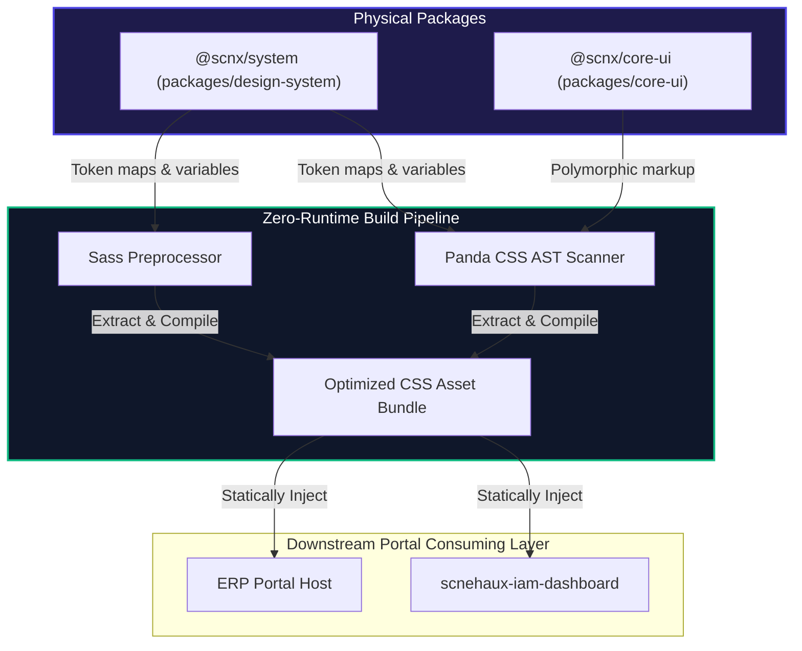
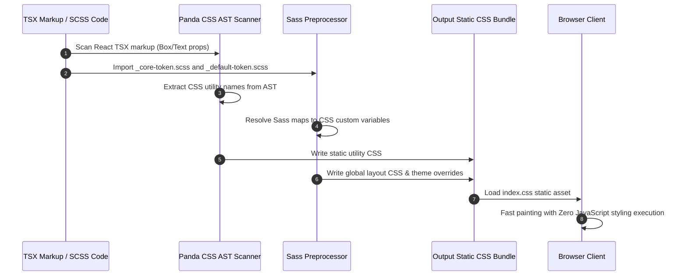
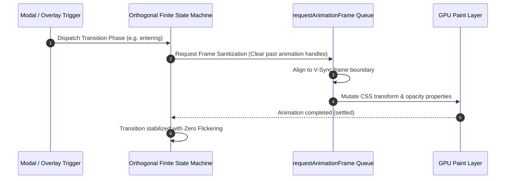

---
doc_meta:
  id: DOC-S003
  title: Scnehaux UI Platform Software Architecture (SAD)
  owner: Principal UI/UX Architect
  version: 1.0.0
  status: approved
  classification: public
  review_cycle_days: 180
  last_reviewed: 2026-05-19
parent_pad: DOC-P002
---

# Scnehaux UI Platform Software Architecture (SAD-003)

---

## 1. Context

The **Scnehaux UI Platform** is the concrete physical styling compiler and component infrastructure that fulfills the logical capabilities defined in the [Scnehaux UI Platform Architecture Platform Document (PAD-002)](../../03-platform/scnehaux-ui-platform/scnehaux-ui-platform.pad.md). 

It provides the physical visual foundation consumed by all frontend portals across the monorepo—including the [Scnehaux IAM Dashboard (SAD-002)](../scnehaux-iam-dashboard/scnehaux-iam-dashboard.sad.md) and the federated ERP Portal. It is developed as a set of isolated packages to guarantee zero runtime visual pollution, maximum build-time optimization, and strict style encapsulation.

### 1.1 Architectural Principles & Core Philosophy

The platform operates at a high performance tier, inheriting and enforcing the global [Enterprise Frontend Performance and Rendering Standard (STD-E006)](../../05-standards/STD-E006-frontend-performance-rendering-standard.md) across all component and compilation layers:

1. **Zero Layout Thrashing (60FPS Render Guarantee)**: The platform prohibits synchronous geometry queries during high-frequency cycles. All dynamic layout adjustments are deferred and batched using `requestAnimationFrame`.
2. **Polymorphic Rendering Safety**: The platform prefers the dynamic `as` prop pattern for high-performance polymorphism. The React `asChild` composition pattern is deprecated in high-frequency rendering loops due to children array mapping and cloning execution overhead.
3. **Compound & Headless UI Separation**: Component logic, states, and event orchestration hooks are separated from visual markup. Headless engines remain blind to HTML wrappers, delegating structure layout composition to the downstream consumer.
4. **Panda CSS & Data Contract Strictness**: Styling definitions must resolve back to established design tokens, avoiding hardcoded properties or raw layout declarations.

---

## 2. Solution Architecture

The platform architecture is structured into two main physical package containers, married by a build-time Zero-Runtime styling extraction pipeline:

### 2.1 Physical Package Boundaries
-   **`@scnx/system` (`packages/design-system`)**: The visual core of the enterprise. Housed under `packages/design-system`, it declares the raw core primitives (Tier-1), the global semantic theme contracts (Tier-2), and compiles them to CSS Custom Properties. It orchestrates all build-time configuration variables for static layout compilers.
-   **`@scnx/core-ui` (`packages/core-ui`)**: The physical component library containing style-agnostic, accessible, and polymorphic React primitives (e.g., `<Box>`, `<Flex>`, `<Grid>`, `<Text>`). It relies 100% on `@scnx/system` for visual styling and is completely decoupled from any direct vendor CSS frameworks.

### 2.2 Zero-Runtime Build Pipeline
To ensure maximum client-side performance, the platform rejects runtime CSS-in-JS style injection. It utilizes a dual build-time engine:
1.  **Panda CSS AST Scanner**: Scans downstream Javascript/TypeScript source files at compile time. It extracts utility token classes from markup and compiles them directly into static atomic utility CSS rules, avoiding runtime execution overhead.
2.  **Sass Preprocessor**: Orchestrates global static structures, custom layout grids, and complex theme contracts (`_core-token.scss` and `_default-token.scss`). It outputs a consolidated, highly optimized CSS bundle containing custom properties and layout grids.

### 2.3 Design System Base Layer & Reset Isolation
The `@scnx/system` package ships a dedicated **Base Layer** (housed under `packages/design-system/src/styles/base/`) to clean and equalize default browser rendering before styling components or applying styling utilities.
1.  **Normalization & Reset Strategy**: 
    - Normalization rules (`_normalize.scss`) equalize styling inconsistencies between client viewports.
    - Core structural resets (`_reset.scss`) clean the native padding, margin, border, and typography properties of native interactive elements (`button`, `input`, `select`, `textarea`, `a`).
    - Typographical and baseline alignments (`_base.scss` and `_typography.scss`) define global default weights, line heights, and SVG vertical alignments.
2.  **Cascade Layer Isolation**:
    - To prevent resets and normalizations from interfering with or overriding downstream utilities and components, all reset rules are wrapped in native CSS `@layer reset` and `@layer base`.
    - The compiled bundles (`default-ui.scss`) declare the explicit cascade precedence order (`@layer reset, base, tokens, recipes, utilities;`), guaranteeing that base rules are evaluated first and cannot override design tokens or utility styles.

### 2.4 Physical Primitives & Theme Mappings (Reference)

> **Abstraction Leakage Rule Compliance (GDC-000 §2.3)**: 
> As a C2 System Architecture Document, this document does not contain component-level implementation mechanics, raw SASS maps, or CSS Custom Property payloads.
>
> The exhaustive physical parameters, OKLCH scales, and CSS Variable mappings are maintained in the authoritative C3 Technical Design Document:
> **[TDD-SCNX-UI-JS-003-semantic-token-dictionary](../../../../js/module_federation_v1.5/packages/docs/06-designs/TDD-SCNX-UI-JS-003-semantic-token-dictionary.md)**.

---

## 3. Deployment & Topology

The platform packages are developed locally within the monorepo and integrated into downstream applications via local workspace linkages:

-   **Development Isolation**: Downstream applications consume the design packages via **pnpm workspaces** locally. Changes to package files are hot-reloaded automatically inside Vite and Rspack bundlers.
-   **Production Delivery**: Built static assets (minified CSS files and TypeScript declarations) are published to the enterprise private NPM registry. The consuming SPA apps bundle these assets into their physical deployment targets during build time, serving them globally via global CDNs (e.g., AWS S3 and CloudFront).
-   **Encapsulation Boundary**: To prevent layout pollution under Module Federation, `@scnx/system` provides unique namespace classes (e.g., `.scnx-theme-wrapper`). Consuming micro-frontends wrap their entry roots with these classes to enforce isolated styling sandboxes.

---

## 4. Runtime Flows

### 4.1 Build-Time Compilation and Static Style Extraction Flow
Demonstrates how raw SCSS variables and React primitive markups compile down to a zero-runtime static CSS bundle:

### 4.2 Transition & Overlays Frame Sanitization Flow
Ensures that all dynamic overlays, modals, and layout transition animations execute with clean momentum without visual queue piling or flickering:

---

## 5. Resilience & Failure Modes

-   **Missing CSS Variables Fallback**: For environments with restricted stylesheet imports, Sass maps are pre-compiled into static fallback utility classes, allowing layout systems to degrade gracefully without breaking structural functionality.
    -   **Blast Radius**: **Single Client Render Failure**. Degrades gracefully to fallback layout without affecting other users or backend services.
-   **Cumulative Layout Shift (CLS) Mitigation**: Unloaded visual components (e.g., dynamic tables, async charts) are matched with strict width/height sizing properties based on Tier-1 primitive values, rendering structured skeletons immediately to keep CLS strictly under `0.1`.
    -   **Blast Radius**: **Component Level Disruption**. Only the affected asynchronous component remains in a skeleton state, rest of the page remains interactive.
-   **Momentum Reversal Interruption**: If a transition is interrupted mid-flight (e.g., user triggers a close animation while an overlay is still opening), the frame queue immediately purges the active animation handle, recalculates the elapsed transform coordinates, and gracefully reverses the animation without resetting the layout.
    -   **Blast Radius**: **Single User Interaction**. Confined to the specific overlay state machine.

---

## 6. Observability & Quality Benchmarks

To maintain peak web performance, the presentation platform enforces strict operational metrics:

-   **Performance Benchmarks (NFRs)**:
    *   **Cumulative Layout Shift (CLS)**: Strictly $\le 0.1$.
    *   **Interaction to Next Paint (INP)**: Strictly $\le 200\text{ms}$.
    *   **P95 Layout Reflow Paint Duration**: Strictly $\le 100\text{ms}$.
    *   **Gzip CSS Bundle Size**: Max limit of `12KB`.
-   **Error Telemetry**: The `@scnx/core-ui` components are wrapped in strict Error Boundary handlers. Unhandled rendering errors or CSS injection failure states trigger Sentry logging events containing specific component tag references and active theme state identifiers.

---

## 7. Security Considerations

-   **Strict Content-Security-Policy (CSP)**: The presentation layer prevents inline style injections (`style-src 'unsafe-inline'`). All compiled utilities are loaded via static assets linked to build-time hashes, or injected using trusted stylesheet nonces.
-   **Polymorphic ARIA Accessibility Core**: Accessible behaviors are built directly into the polymorphic Layer-1 primitives of `@scnx/core-ui` (incorporating focus-trapping inside modal overlays, ARIA state bindings for custom controls, and keyboard navigation support), guaranteeing compliance with WCAG 2.2 AA standards at the visual root of trust.
