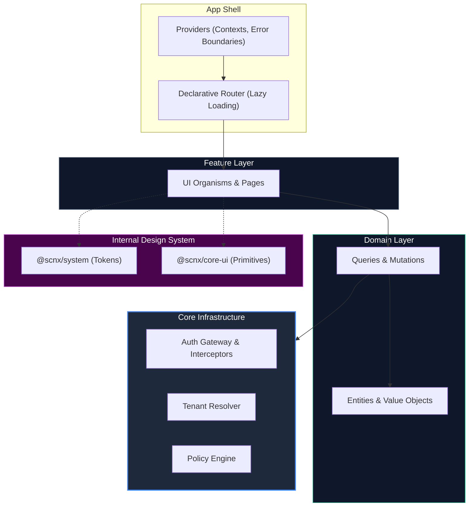
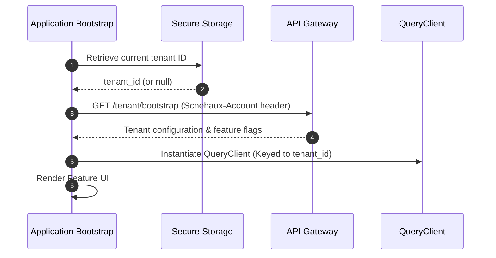
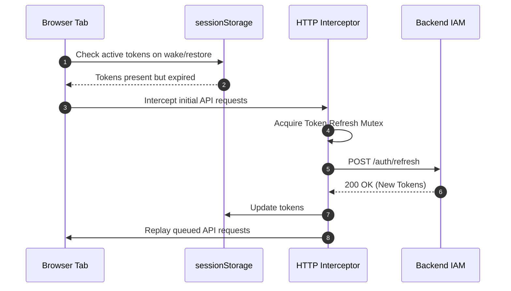
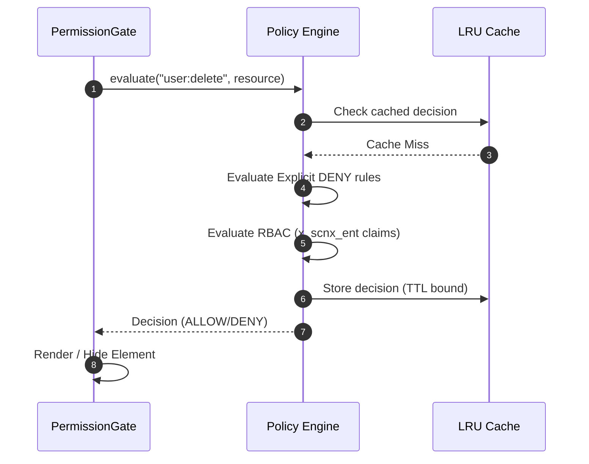

---
doc_meta:
  id: SAD-002
  title: Scnehaux IAM Dashboard Software Architecture (SAD)
  owner: Principal Frontend Architect
  version: 1.0.0
  status: approved
  classification: restricted
  governed_by: [GDC-000]
  review_cycle_days: 180
  last_reviewed: "2026-05-18"
  parent_pad: PAD-001
---

# Scnehaux IAM Dashboard Software Architecture (SAD-002)

---

## 1. Context & Scope

**Capability Realized.** This system realizes the administrative-interface aspect of the Enterprise Identity & Access capability defined in [identity-platform.pad.md](../../03-domain/identity-platform/identity-platform.pad.md) (PAD-001).

The Scnehaux IAM Dashboard is the concrete frontend application serving as the administrative interface for the platform. It is architected as a standalone Single Page Application (SPA) for maximum isolation, operational simplicity, and strict boundary separation from other business-capability frontends. It consumes the enterprise design system packages (`@scnx/system` and `@scnx/core-ui`) with zero external primitive component libraries.

**System Context (C1).** A browser SPA behind the API Gateway; it consumes the IAM backend (SAD-001) over REST and renders with the enterprise design system. It holds no server-side state.

**Objectives.** Provide a secure, tenant-isolated administrative console for identity operations, with cross-tenant data leakage made structurally impossible.

**Constraints.** Standalone client-rendered SPA (no SSR); intentionally excluded from the Module Federation runtime; consumes only `@scnx/system` / `@scnx/core-ui` (no external component libraries).

**Requirements.** Tenant bootstrap, client-side RBAC gating from JWT claims, resilient token-refresh, and strict browser hardening.

**Assumptions.** The IAM backend issues and rotates tokens; the gateway forwards the `Scnehaux-Account` header; the design system packages are available via workspace or NPM.

## 2. Solution Architecture

The application adopts a strict 4-layer dependency flow (Clean Architecture) so that core multi-tenancy and security logic remain entirely framework-agnostic.

### 2.1 Architectural Boundaries
- **Core Infrastructure (`core/`)**: Non-business mechanics — token lifecycle, HTTP interception, multi-tenant resolution, policy evaluation. Knows nothing about React components or domain logic.
- **Domain Logic (`domain/`)**: Framework-agnostic TypeScript modules defining IAM bounded contexts (identity, access, organization) with strict Value Objects (e.g., `UserId`, `Email`).
- **Feature UI (`features/`)**: React implementations. Strictly imports from `domain/` and `core/`. No cross-feature dependencies.
- **Design System Isolation**: The UI relies 100% on `@scnx/system` (tokens/styling) and `@scnx/core-ui` (primitives); external component libraries (Radix, MUI) are prohibited to enforce brand consistency and minimize bundle payload.

## 3. Runtime Flows

### 3.1 Tenant Resolution & Provider Bootstrap
Ensures cross-tenant data leakage is structurally impossible before rendering any feature.

### 3.2 Authentication State Recovery Flow
Arbitrates browser lifecycle events to maintain session integrity.

### 3.3 Policy Engine RBAC Evaluation
Evaluates permissions synchronously on the client using embedded JWT claims.

## 4. Data Architecture

This is a client-rendered SPA with no server-side datastore.

- **Database**: Not Applicable — no server datastore; the authoritative data lives in the IAM backend (SAD-001).
- **Storage**: Browser `sessionStorage` only, with keys prefixed by the active tenant ID to prevent origin-shared contamination.
- **Caching**: An in-memory `QueryClient` cache keyed per tenant (purged on tenant switch), plus a capacity-bounded LRU cache for authorization decisions.
- **Data Classification**: Holds short-lived access/refresh tokens and JWT claims client-side (Restricted); no PII is persisted beyond the active session.

## 5. Integration

- **Consumed API**: The IAM backend (SAD-001) over REST, attaching the `Scnehaux-Account` tenant header; access tokens are verified against locally-cached JWT claims.
- **Published API**: None — the dashboard is a pure consumer and exposes no API.
- **Events (Producer/Consumer)**: None — no event-bus participation; all interaction is synchronous request/response.

## 6. Security

- **Tenant-Scoped Storage Keys**: `sessionStorage` keys are prefixed with the active tenant ID to prevent origin-shared contamination.
- **LRU-Bounded Policy Cache**: Client-side authorization decisions are cached in a capacity-bounded LRU cache to prevent unbounded memory growth in long-running SOC sessions.
- **Browser Defenses**: Enforces a strict `Content-Security-Policy` (`default-src 'none'`), `X-Frame-Options: DENY`, and sanitizes all user-generated content prior to rendering to prevent XSS.
- **Authorization**: All privileged UI is gated by the client-side Policy Engine evaluating `x_scnx_ent` claims; the client gate is advisory only — the backend remains the authoritative enforcement point.

## 7. Resilience & Failure Modes

- **Token Refresh Race Conditions**: Handled via a Token Refresh Mutex; prevents duplicate refresh requests from triggering backend theft-detection.
  - *Blast Radius*: **Single Client Session** — prevents accidental session invalidation for the current user.
- **API Gateway Degradation**: HTTP interceptors automatically retry idempotent operations using exponential backoff.
  - *Blast Radius*: **Temporary Degraded UX** — actions may take longer, but the application remains usable.
- **Cross-Tenant Contamination**: Prevented structurally by purging the `QueryClient` cache on tenant switch (graceful degradation to a clean state).
  - *Blast Radius*: **Cross-Tenant Data Leak** — mitigated immediately upon tenant context switch.

## 8. Observability & Operations

- **Web Vitals (SLI)**: Must adhere to enterprise targets (LCP ≤ 2.5s, FID ≤ 100ms, CLS ≤ 0.1).
- **Performance Standards Compliance**: The codebase must comply with the [Enterprise Frontend Performance and Rendering Standard](../../02-standards/_global/frontend/STD-GLB-FE-002-performance.md) to guarantee frame-rate stability and prevent memory leaks.
- **Logging / Errors**: Unhandled promise rejections and React Error Boundary fallbacks are aggregated to the centralized sink (e.g., Sentry) with `tenantId` and `traceId` context.
- **Tracing**: OpenTelemetry browser tracing on critical paths (initial load, authentication handshakes) to correlate client latency with backend spans.
- **Alerting / Runbook**: Client-error spikes alert the frontend on-call; the runbook covers cache-purge and forced-logout procedures.

## 9. Deployment

The IAM Dashboard is deployed as a stateless, client-rendered SPA.

- **Environment / Infrastructure**: Delivered via a global CDN (e.g., AWS CloudFront / S3) as static assets.
- **Micro-Frontend Exclusivity**: Intentionally excluded from the standard Module Federation runtime shell to preserve its security perimeter and prevent runtime contamination from less-privileged applications.
- **CI/CD & Release**: Built with **Vite** (no federation requirement, so a lightweight pipeline); released as immutable, hash-versioned static bundles.

## 10. Trade-offs & Alternatives

### 10.1 Server-Side Rendering (SSR / Edge)
- *Rejected (deferred)*: Client-rendered SPA chosen for operational simplicity and authentication isolation. SSR/Edge rendering is intentionally deferred and may be revisited via a future ADR.

### 10.2 Module Federation Runtime Shell
- *Rejected*: The dashboard is deliberately excluded from the federated runtime to preserve its security perimeter and prevent contamination from less-privileged applications.

### 10.3 Rspack / Webpack Build
- *Rejected*: With no federation requirement, Vite keeps the build pipeline lightweight (< 15 lines of config); Rspack's module-federation tooling would be unnecessary overhead. *Accepted trade-off*: a future move to a standalone repo accepts a low-friction Vite migration cost.

### 10.4 External Component Libraries (Radix / MUI)
- *Rejected*: Prohibited to enforce enterprise brand consistency and minimize bundle payload; the dashboard consumes only `@scnx/core-ui`.

## 11. Assumptions
- Modern evergreen browsers are supported (ES2022 target).
- Authentication state is managed via secure, HttpOnly cookies established by the IAM platform.

## 12. Compatibility Strategy
- Graceful degradation for clients without JavaScript is not a requirement for this internal admin dashboard.
