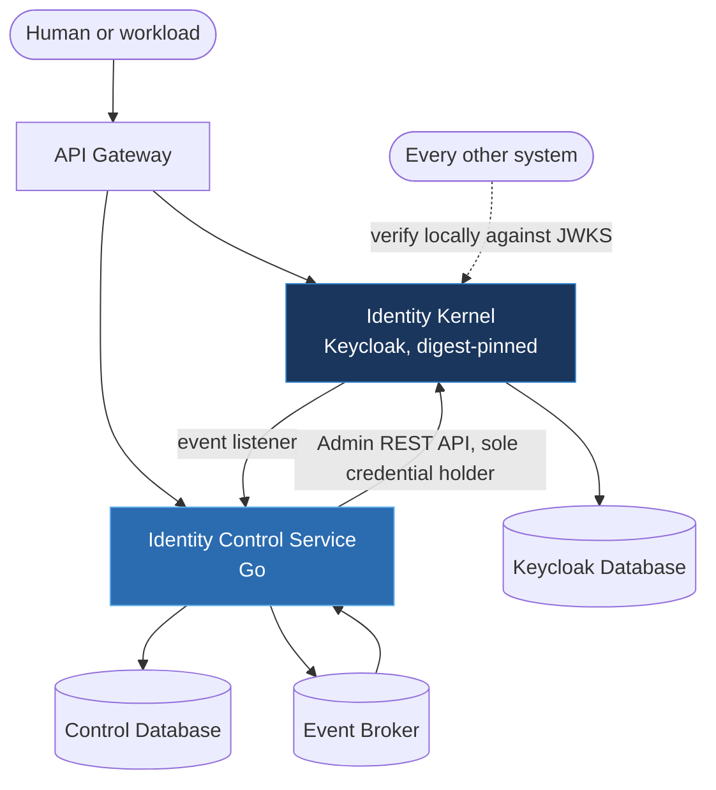
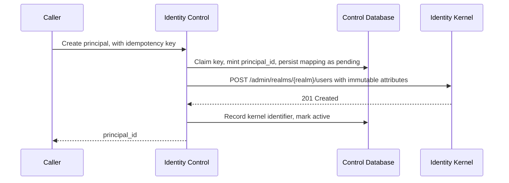

---
doc_meta:
  id: SAD-001
  title: Scnehaux Identity Runtime
  owner: Principal IAM Architect
  version: 2.1.0
  status: approved
  classification: restricted
  governed_by:
    - EAD-006
  parent_pad: PAD-PLT-001
  review_cycle_days: 180
  created_date: 2026-01-01
  last_updated: 2026-08-21
  last_reviewed: 2026-08-18
  technologies:
    - name: keycloak
      type: identity-provider
    - name: golang
      type: language
    - name: postgresql
      type: database
    - name: kafka
      type: event-broker
    - name: atlas
      type: schema-migration
    - name: opentelemetry
      type: observability
    - name: kubernetes
      type: orchestration
    - name: aws
      type: cloud-provider
---

# Scnehaux Identity Runtime (SAD-001)

> **Version 2.0.0 replaces the architecture this document previously described.**
>
> Version 1 specified a single Go binary that was itself the identity provider: it hashed
> credentials with Argon2id, signed its own tokens, held sessions in Redis, implemented
> MFA and federation, and exposed `/api/v1/auth/login`. That is not what is being built,
> and every technical design under this system had already moved away from it.
>
> The identity provider is **adopted, not built**. An authentication engine, session
> engine, credential store, and OIDC provider written in-house is the weakest security
> link an enterprise owns, and `EAD-006 §4.2` records a breach caused by exactly that.
> What remains in-house is the part no vendor can hold: the canonical enterprise
> identifier, and the control plane that governs the vendor.
>
> The Argon2id concurrency guard, envelope-encryption signing path, and refresh-token
> theft detection described in version 1 were sound engineering for a system we no longer
> operate. Their requirements survive as properties the kernel must exhibit, asserted by
> the realm contract suite rather than implemented here.

---

## 1. Purpose & Scope

This document describes the Scnehaux Identity Runtime, the system that realizes the Identity Platform capability defined in PAD-PLT-001. The runtime is two containers with one trust boundary.

### 1.1 Objective

Establish authenticated identity for the entire enterprise and every registered third party, and make the revocation of an authorization reach enforcement within a stated interval. Both containers exist to serve those two sentences.

### 1.2 Capability

Authentication and the hosted login experience; token issuance and the published verification material; the canonical Principal identifier and its creation path; protocol client and protected-resource registration; workload and bounded-agent identity; Membership context projection and session removal; account-security and investigation mediation; and identity lifecycle events.

### 1.3 Constraint

- **Authentication is adopted.** Credential material, authenticator enrollment, authentication ceremonies, session state, token signing, and the OIDC and OAuth 2.1 protocol surface belong to the identity kernel. No Scnehaux-authored code performs any of them.
- **The canonical identifier is not adopted.** `principal_id` is minted by the control service and is the only identifier another domain persists, so exiting the vendor migrates credentials and protocol configuration rather than every foreign key in the estate.
- **One credential holder.** The Keycloak administration credential exists in the control service and nowhere else.
- **No writes to the Keycloak database by anything but Keycloak.** Every control-plane change transits the supported Admin REST API.
- **Two deployables, two release cadences.** Each container is independently deployable, per `EAD-002 §6.2`.
- **`Tier-0`.** Availability at or above 99.99%, RTO within 15 minutes, RPO within 1 minute, per `EAD-005 §5.4`.
- **`PS256` only.** One signing algorithm, per `STD-IAM-002 §3.2.2`.

### 1.4 Requirement

Local token verification with no per-request callback into this system; four closed Principal creation paths; a stated enforcement interval for every revocation class; and complete, non-destructive capture of identity events.

### 1.5 Assumption

Consumers verify tokens locally against the published JWKS. The secret manager is reachable at startup and at rotation. The event broker is reachable, and its unavailability delays propagation rather than failing a mutation.

---

## 2. Enterprise Traceability

| Relationship | Target |
| :-- | :-- |
| Realizes | PAD-PLT-001 — the Identity Platform capability, as the Ecosystem Root of Trust |
| Governed by | EAD-006 — Zero Trust, centralized identity, least privilege, complete auditability |
| Governed by | ADR-IAM-001 — adopt the Keycloak identity kernel; supported interfaces only |
| Governed by | ADR-IAM-002 — key lifecycle and the single `PS256` baseline |
| Governed by | ADR-ORG-001 — the Organization authority never writes here; projection is mediated by the control service |
| Conforms to | STD-IAM-001 — identity security controls, realized per §7.5 below |
| Conforms to | STD-IAM-002 — the token and verification profile this runtime issues against |
| Consumed by | Every system in the estate, through locally verified tokens |

---

## 3. Solution Context

### 3.1 System Context



The dashed edge is the one that matters for availability. Consumers verify tokens against cached signing material and do not call this system per request, so an outage here degrades new logins and privileged writes rather than the whole estate, per `EAD-006 §8`.

### 3.2 External Dependencies

The secret manager, at startup and at key rotation only — never on the authentication hot path. External identity providers for federation, mediated by the Integration Platform. Nothing else.

### 3.3 Internal Structure

Two containers, each a modular monolith internally, per `ADR-GLB-001 §5.1`.

| Container | Technology | Owns |
| :-- | :-- | :-- |
| Identity Kernel | Keycloak, pinned by digest, with owned extensions | Credentials, authenticators, sessions, token issuance, JWKS, federation, consent, hosted login |
| Identity Control Service | Go | `principal_id` authority, the mapping table, context projection, session removal, registration, workload identity, security-state mediation, reconciliation |

They are one system because they share one trust boundary and one release-compatibility surface: a kernel upgrade can change a claim the control service depends on, so the two are verified together before either is promoted. They are two containers because one is a configured vendor artifact and the other is authored code, and their release cadences differ.

---

## 4. Architecture Model

### 4.1 Authority Split

The split is the central decision of this architecture and is deliberate in both directions.

| Fact | Physical system of record | Enterprise authority |
| :-- | :-- | :-- |
| The Principal row exists | Identity Kernel | Identity Kernel |
| The canonical `principal_id` | Identity Kernel, as an immutable attribute | **Identity Control Service** |
| Credential material | Identity Kernel | Identity Kernel |
| Session existence | Identity Kernel | Identity Kernel |
| Membership context projected into a token | Identity Kernel, non-authoritative | `organization-control`, per ADR-ORG-001 |

The kernel stores the identifier and the control service is authoritative for it. Keycloak enforces no uniqueness on user attributes, so the uniqueness invariant lives in the Control Database. That asymmetry is what makes the attribute a recovery index rather than a second authority.

### 4.2 Identity Event Capture

Two requirements pull against each other, and the resolution is stated rather than left to the extension author.

**Completeness**: every user, admin, and security event the kernel emits must reach the enterprise, because an event silently dropped is an audit gap that no later reconciliation can distinguish from an action that never happened.

**Non-destruction**: a delivery failure in the listener must not erase or suppress the source event inside the kernel. An extension that consumes an event and then fails has destroyed the only record.

The listener therefore captures without consuming: it writes to a durable local queue and acknowledges to the kernel independently of downstream delivery. Completeness is then proven by reconciliation against supported kernel event and admin state rather than asserted by the delivery path, so a dropped event is detected rather than lost.

### 4.3 Realm Topology

One realm serves the enterprise and its registered third parties.

**Tenant count is not a splitting criterion.** A realm per Tenant multiplies realm configuration, issuer values, and key material by the number of customers, and every consumer would need to resolve which issuer to trust per request. Tenancy is a claim inside a token, not a realm boundary.

A second realm is justified only by a genuinely separate trust anchor — a distinct issuer identity with its own key custody and its own administrative separation. Load, Tenant count, and organisational preference are not such justifications.

### 4.4 Principal Creation Sequence



The identifier is fixed before the remote call and carried inside the creation payload, so the Principal never exists in the kernel without its canonical identifier. A crash between the call and the local commit leaves a `pending` row that recovery resolves by searching the kernel for the attribute.

Four creation paths are closed by realm configuration rather than by policy: self-registration, federated first-login auto-create, direct Admin Console creation, and any write to the Keycloak database.

### 4.5 Revocation Runtime Flow

Four mechanisms bound revocation enforcement, and this system owns two of them.

| Mechanism | Owner | Effect |
| :-- | :-- | :-- |
| Projected context removed | **Identity Control** | The next authentication cannot assert the revoked context |
| Kernel sessions removed | **Identity Control** | A refresh cannot mint a fresh token past the removal |
| Consumer read model updated | Each consumer | An already-issued token naming the revoked context is rejected |
| Access token expiry | `STD-IAM-002 §3.3` | The residual interval, bounded by the lifetime class |

Context removal runs before session removal. Reversing them leaves a window in which a session still exists and the context is still projected, so a refresh arriving inside it mints a token asserting the revoked context.

---

## 5. State & Data Architecture

### 5.1 Storage

Two databases, each private to its container.

**Control Database** (PostgreSQL) holds two schemas. `identity` carries the Principal mapping, the projection operations and accepted authority heads, the client and credential registrations, workload ownership and agent delegations, security operations, drift findings, and the **reconciliation cursors** this system's consumers track. `platform` carries the outbox, deduplication, dead-letter, and idempotency tables shipped by the shared substrate.

**Keycloak Database** is owned by the kernel. No Scnehaux code connects to it, reads it, or writes it. Its schema is the vendor's and changes with the vendor's releases, which is precisely why nothing depends on its shape.

The two are never joined. A control-plane record references a kernel object by identifier, and that identifier never leaves the control service.

### 5.2 Schema Management

Declarative under Atlas for the `identity` schema; the `platform` schema is applied from the shared module rather than re-declared, per `ADR-GLB-004 §5.3`. Migrations run under a role distinct from the runtime role, which holds no DDL privilege and owns no table.

### 5.3 Cache

The control service caches nothing authoritative. Consumers cache signing material and their own projections; the authority does not cache itself.

### 5.4 Signing Key Custody

Production signing keys are provisioned through an approved secret manager or keystore custody mechanism. **Keys generated per process in production are prohibited, including as a fallback.**

The wording is *keystore or custody mechanism* deliberately. A keystore file delivered through the secret manager and a key held in a managed KMS both satisfy the requirement; what does not satisfy it is a key pair the process creates for itself, because two replicas would then advertise different verification material for the same issuer and a token signed by one would fail against the other.

One `kid` binds to one immutable key pair for its whole life. A retiring key remains published for at least the maximum lifetime of any artifact it signed, plus the maximum clock skew and the maximum JWKS cache lifetime, per `STD-IAM-002 §3.5`.

### 5.5 Stateless Control Service

The control service holds no state that survives a request. Kernel sessions are the kernel's, so control-service replicas are interchangeable and a replica loss signs nobody out.

---

## 6. Integration Contracts

### 6.1 Published API — Identity Kernel

The OIDC and OAuth 2.1 protocol surface: authorization, token, introspection, revocation, UserInfo, and `/.well-known/jwks.json`. This is the vendor's surface, configured rather than authored, and it is the only interface in this system that end-user clients call directly.

### 6.2 Published API — Identity Control Service

REST over HTTP, path-versioned, with an OpenAPI 3.1 contract. A control-plane interface under `STD-GLB-006`: its volume is proportional to administrative actions, and it depends on `Idempotency-Key`, optimistic-concurrency preconditions, and `202 Accepted` with a polled operation resource.

```text
/v1/principals            mint, read, quarantine, retire, reconcile
/v1/registrations         protocol clients and protected resources, credential rotation
/v1/workloads             workload identity, ownership, orphan and unused findings
/v1/agents/{id}/delegations   bounded agent delegation
/v1/me/*                  self-service session, authenticator, and consent operations
/v1/principals/{id}/*     privileged security state, containment, and investigation
```

Every mutation requires an idempotency key. Administrative mutations additionally require the expected version, a reason, and a correlation identifier. Errors are RFC 9457 problem documents from a compiled registry. A kernel identifier never appears in any response body.

### 6.3 Published Events

`com.scnehaux.identity.*` in the CloudEvents 1.0 envelope, through the transactional outbox. Principal lifecycle, reconciliation findings, privileged administration, and containment outcomes. Security-classified events route to the priority lane.

### 6.4 Consumed Events

`com.scnehaux.organization.membership.*` and `com.scnehaux.organization.tenant.*`. Every consumption passes the deduplication guard inside the same transaction as its durable effect.

### 6.5 Consumed Contract

`GET /v1/projections/organization/snapshot`, the published authority read the reconciler compares against. There is no database connection to the Organization Database anywhere in this system, and no privileged read path exists.

---

## 7. Security & Trust Boundary

### 7.1 Telemetry and Event Redaction

No event, log line, span attribute, metric label, or problem document emitted by this system contains a password, a passkey private value, a TOTP secret, a refresh token, an access token, or a client secret.

The rule is absolute rather than best-effort because this is the one system where such values exist in memory, and an identity event stream is copied to more places than any database in the estate. `principal_id` appears in structured logs; the kernel's user identifier does not.

### 7.2 Administrative Interfaces

**The Keycloak Admin Console is not the enterprise administration interface.** Access is restricted to a named break-glass group, is time-bounded, and every session in it is evidenced.

Ordinary administration happens through the Identity Control API, because that is where enterprise authorization, canonical identifier resolution, last-authenticator guards, idempotency, reason capture, and evidence publication live. A console change bypasses all six, and the registration reconciler treats an unmanaged client or an out-of-band configuration change as a security finding rather than as drift to repair silently.

**The one exception is the bootstrap ceremony, and it is an entry point rather than an exception to authorization.** The API requires a caller holding a `principal_id` and is the only path that issues one, so a fresh realm cannot reach its first Principal. `ADR-IAM-001 §5.8` gives that entry point to a single-use command on the Identity Control Service itself: it can succeed at most once per Control Database, refuses a populated registry, records the human who ran it in a row the runtime role cannot modify, and creates the Principal through the ordinary provisioning path so the identifier is issued by the authority that owns it. It holds no credential — the kernel is told to demand one on first authentication.

This is distinct from the console break-glass above. That path is time-bounded, group-scoped, and evidenced per session, and it operates on the kernel; the ceremony mints a canonical identifier and expires by construction after one use.

### 7.3 Authentication and Authorization

Authentication is performed by the kernel using Authorization Code with PKCE `S256`. The control service authenticates no one: it verifies a presented token locally per `STD-IAM-002 §3.5`, including that `principal_id` is present for an internal or privileged audience, and then applies its own authorization to every command.

A valid token is an authenticated identity and never an authorization decision.

### 7.4 Credential Containment

The control service holds the Keycloak administration credential under the narrowest role set that permits its operations: user creation, attribute write, user search, user enable and disable, context projection, session enumeration and removal, client management, and credential rotation. It holds no realm administration and no credential read authority.

No other system in the estate holds that credential. `ADR-ORG-001 §5.4` makes the prohibition structural for the Organization authority by giving it neither the credential nor a network route.

### 7.5 Where the Identity Security Controls Are Realized

`STD-IAM-001` states properties. Adopting the kernel changed where each is realized, not whether it holds. Recording the mapping here is what stops a control from being assumed present in a container that cannot implement it.

| Control | Realized in | Asserted by |
| :-- | :-- | :-- |
| Argon2id credential hashing with defined parameters | Kernel configuration | Realm contract suite, on every candidate release |
| Access token lifetime ceiling | Kernel client scope, per lifetime class | Realm contract suite and registration constraints |
| Refresh token rotation and replay handling | Kernel session engine | Kernel compatibility suite |
| Signing algorithm and key lifecycle | Kernel, keys from the secret manager | §5.4 above and the upgrade suite |
| Session revocation | **Control service**, by removing context then sessions | Measured propagation tests |
| Immutable audit of identity operations | Audit Platform, fed by §6.3 | Evidence completeness reconciliation |
| Security headers on external interfaces | Gateway and the hosted login theme | Theme conformance suite |

Two controls in `STD-IAM-001` describe a mechanism rather than a property: the process-level Argon2id semaphore, and the `session_epoch` counter with a Redis-cached comparison. Neither is implemented here, because the credential hashing and the session engine that would host them belong to the kernel. The properties they existed to guarantee — bounded hashing concurrency, and revocation that does not require an N-row scan — are the kernel's to exhibit and are asserted by the contract suite. That standard needs restructuring to state those two as properties; the gap is recorded here rather than resolved by pretending this system implements them.

### 7.6 Artifact Integrity

The kernel image is built from a digest-pinned upstream release and is itself pinned by digest wherever it is referenced. A tag is mutable, so an image built from one is not reproducible and the day it changes there is no commit to show for it.

Owned extensions are built from source in a repository we control and are signed. A binary extension of unknown provenance running inside the identity kernel has the kernel's privileges over every credential in the enterprise.

Provenance attestation links the built image digest to the commit that produced it, and a digest without a passing release record cannot be promoted.

---

## 8. NFR

### 8.1 Blast Radius

| Failure | Impact | Blast radius | Degradation |
| :-- | :-- | :-- | :-- |
| Identity Kernel unavailable | No new authentication | **Enterprise-wide for new logins.** Existing sessions continue; consumers verify cached tokens locally | Read and degraded operation continues; new logins and privileged writes fail closed, per `EAD-006 §8` |
| Control Database unavailable | No Principal minting, no projection, no registration | Provisioning and enforcement, not authentication | Readiness reports unhealthy; the replica leaves the load balancer. Writes fail closed |
| Control Service unavailable | Projection and session removal paused | **Revocation not enforced within budget.** Authentication is unaffected | Operations remain durable in the Control Database and apply on recovery. Bounded by each consumer's staleness policy |
| Secret manager unavailable at startup | New kernel replicas cannot start | Deployment blocked; running replicas serve on loaded keys | Fail fast and halt rather than generate a key, per §5.4 |
| Event broker unavailable | Identity events undelivered | Delayed audit and delayed downstream projection | Rows remain in the outbox; priority rows return to the pool with escalating backoff and are never dead-lettered for unavailability |
| Keycloak Database unavailable | Kernel cannot serve | Same as kernel unavailable | Per-tier restore; the Control Database is unaffected and the mapping survives |

Losing the kernel and losing the control service are different incidents with different pages. The first stops new authentication; the second stops enforcement while authentication continues, which is the more dangerous of the two and the less obvious.

### 8.2 Latency

Token verification imposes no load on this system. Principal creation p95 within 500 ms excluding kernel latency. Projection dispatch-to-applied within 2 seconds. Security command inline budget 2 seconds, after which the API returns `202` with an operation resource rather than holding a connection.

### 8.3 Scalability

Both containers scale horizontally. The reconciliation and projection sweeps are rate-limited so that reconciliation cannot consume capacity reserved for authentication — a sweep that starves the login path has traded a detective control for an availability incident.

### 8.4 Timeout, Retry, and Circuit Breaker

Cascaded timeouts from the edge inward, each strictly below its caller's remaining budget. One Admin API attempt is bounded at 500 ms, with three immediate attempts inside the operation budget and exponential backoff with jitter thereafter. An ambiguous outcome — a timeout after the request left the process — is resolved by reading the kernel state back before retrying, never by assuming the side effect failed.

### 8.5 Observability, Telemetry, Alerting, and Runbook

OpenTelemetry traces spanning the control service, the Admin API call, and the consumed event; RED metrics; structured JSON logs carrying `deployable`, `system`, `correlation_id`, and `principal_id`.

Alerting is on the properties, not the components: duplicate canonical identifier, unmapped Principal, unmanaged kernel client, unresolved containment operation, `extra` drift finding, and revocation not enforced within budget. Each is critical on any occurrence, because each is a security state rather than a capacity signal.

Runbooks required before production: unmapped-Principal triage, duplicate-identifier containment, pending-mapping recovery, administration credential rotation, key ceremony and emergency rotation, projection drift repair, unresolved operation replay, collateral containment review, revocation not enforced within budget, and a consumer reporting an unknown `kid`.

---

## 9. Deployment Strategy

### 9.1 Environment and Infrastructure

Kubernetes across multiple availability zones. `Tier-0` means at least three replicas of each container and no single-zone dependency. PostgreSQL with one primary and read replicas per database; authority reads target the primary.

### 9.2 Configuration

Environment only, read once at each composition root. The administration credential and the signing key references come from the secret manager and are never present in configuration or in an image.

### 9.3 Migration Job

Schema application and partition maintenance run as a job under the migration role, separate from the runtime role.

### 9.4 Artifact Pinning, Rollback, and Drift

**Every artifact is referenced by digest**, upstream and built alike, and the digest promoted to production is the digest the release suite evaluated.

**Rollback boundaries are explicit.** A kernel release that alters realm state in a way an earlier release cannot read is not rollback-safe, and it is identified as such before promotion rather than discovered during an incident. Where a change is not reversible, the release record states so and the deployment is gated accordingly.

**Configuration drift is caught before an upgrade, not during one.** The realm definition is rendered from source and diffed against the running instance on every pipeline run. An unmanaged Admin Console change to controller-owned configuration is a finding, because an upgrade applied on top of undeclared drift produces a state no artifact describes.

The upgrade compatibility suite applies the realm to a clean instance, asserts the declared contract, asserts the four closed creation paths, and rehearses rollback. A candidate that changes the issuer form, drops a claim from a covered surface, reopens a creation path, or cannot issue the baseline algorithm fails before promotion.

### 9.5 CI/CD

Every gate blocks a merge. For the control service: formatting, static analysis, build, tests under the race detector, a coverage floor, package-graph boundary assertion per `STD-GLB-BE-001`, schema integrity and the destructive gate per `ADR-GLB-004 §5.1`, event schema compatibility, dependency tidiness, and a scheduled vulnerability scan. For the kernel: reproducible image build, extension signing, realm render and diff, the realm contract suite, and the upgrade compatibility suite.

Canary rollout is mandatory for any change to authentication, token issuance, or the revocation path.

---

## 10. Architecture Decisions

### Accepted

Adopt the kernel, keep the identifier — `ADR-IAM-001`. One `PS256` baseline and a four-state key lifecycle — `ADR-IAM-002`. The Organization authority never writes here — `ADR-ORG-001`. Transactional outbox over the Kafka protocol — `ADR-GLB-003`.

### Rejected

#### 10.1 Building the identity provider in-house

Rejected, reversing version 1 of this document. An authentication engine, credential store, session engine, and OIDC provider are a large, adversarially-tested surface where the cost of being subtly wrong is a breach rather than a defect. `EAD-006 §4.2` records a product-local authentication implementation becoming the weakest link. The engineering in version 1 was sound; the decision to own that surface was not.

#### 10.2 Persisting the kernel's user identifier as the enterprise reference

Rejected. It would make exiting the vendor a referential migration across Membership, HCM, audit, evidence, and every analytical store, rather than a migration of credentials and protocol configuration. The canonical `principal_id` exists to keep that cost bounded.

#### 10.3 Letting the kernel hold Membership authority

Rejected. Membership carries versions, effective dates, invitation provenance, and offboarding state that a directory does not model, and authority in a vendor store couples enterprise recovery to vendor recovery. Argued in `ADR-ORG-001 §8` Alternative B.

#### 10.4 A second realm per Tenant

Rejected, per §4.3. It multiplies issuer identity and key custody by customer count and pushes issuer resolution into every consumer. Tenancy is a claim, not a trust anchor.

#### 10.5 Administration through the Keycloak Admin Console

Rejected as the ordinary path, per §7.2. The console bypasses enterprise authorization, canonical identifier resolution, idempotency, reason capture, and evidence. It remains available as an evidenced break-glass path.

#### 10.6 A session_epoch counter and cache-backed epoch comparison in the control service

Rejected. The mechanism presumes ownership of the session engine, which belongs to the kernel. Implementing a parallel epoch would create a second session authority that the kernel does not consult, so a token rejected by one would be accepted by the other. Revocation is achieved by removing the projected context and the kernel sessions, which the kernel does consult.

#### 10.7 An in-process ephemeral signing key as a development convenience

Rejected in every environment that issues a token anyone relies on, per §5.4. A local development fallback that generates a key is permitted only where the issuer is not trusted by any other system, and it is prohibited from appearing in a configuration path a staging or production deployment can select.

---

## 11. Compatibility Strategy

The Identity Control API is versioned in the path, and events are versioned in the type with major-version promotion for a breaking change, per `ADR-GLB-006`.

**The kernel's compatibility surface is the token contract, not its version.** A change to the issuer value, the removal of a claim from a covered surface, a change to the signing algorithm, or the reopening of a closed creation path is a breaking change to every consumer in the estate, regardless of whether the vendor calls it a patch. Such a change requires a deprecation window of at least 90 days or two consumer release cycles, whichever is longer, and the upgrade suite fails a candidate that makes one silently.

The supported kernel range is the pinned release and the next candidate once the compatibility suite has verified it. Running two kernel versions that advertise different claim sets for one issuer is prohibited.

---

## 12. Assumptions

- The vendor continues to support the supported-interface set this architecture depends on: Admin REST user and client management, session listing and removal, credential listing and removal, consent listing and revocation, federated-identity listing, and application-initiated actions.
- The secret manager provides versioned key material and is reachable at startup and rotation.
- Consumers implement local verification correctly, which the reference verifier conformance suite exists to make checkable rather than assumed.
