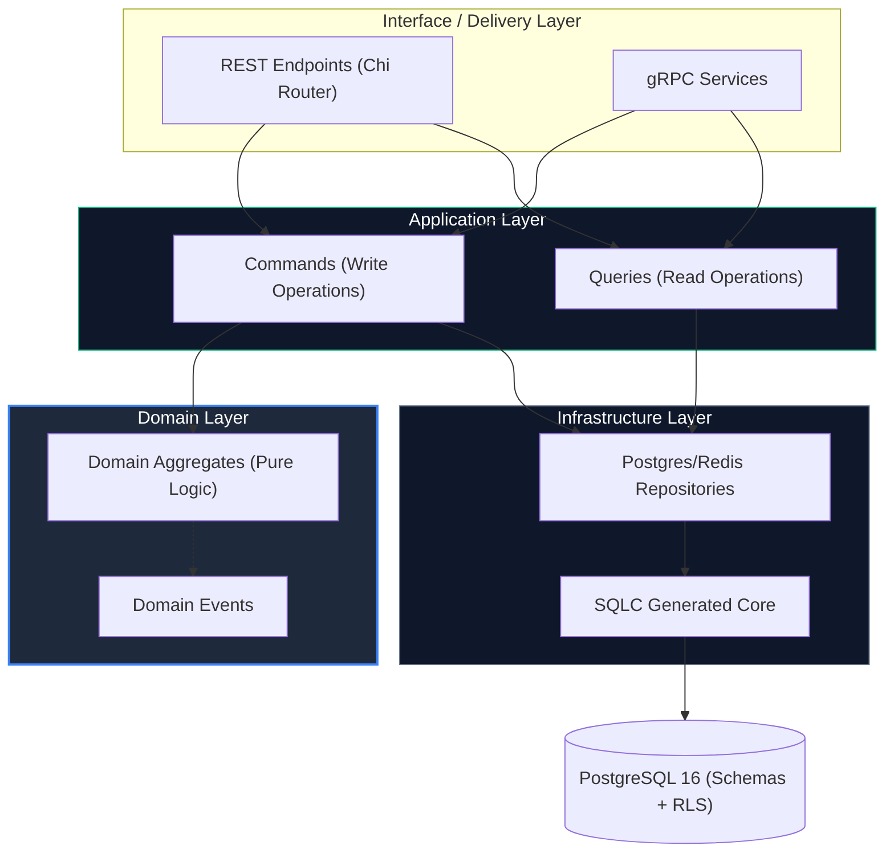
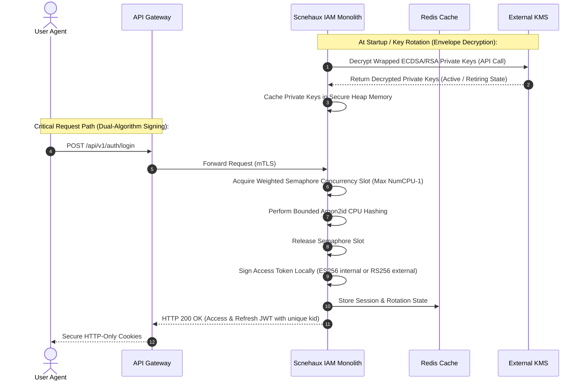
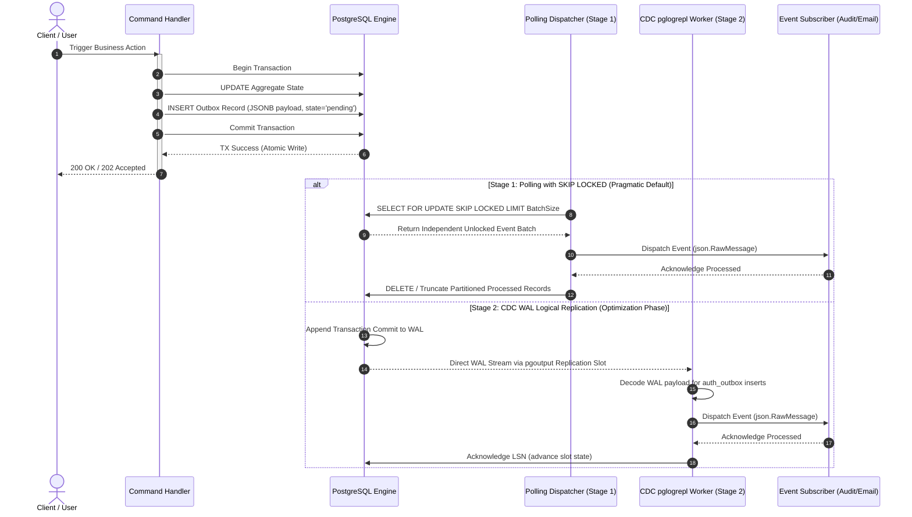
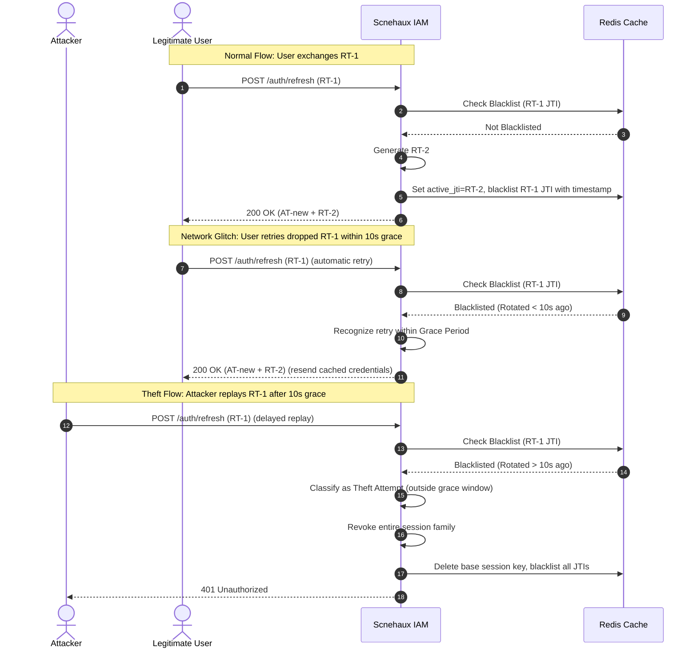

---
doc_meta:
  id: SAD-001
  title: Scnehaux IAM Software Architecture (SAD)
  owner: Principal IAM Architect
  version: 1.0.1
  status: approved
  classification: restricted
  governed_by: [GDC-000]
  review_cycle_days: 180
  last_reviewed: '2026-05-18'
  parent_pad: PAD-001
---

# Scnehaux IAM Software Architecture (SAD-001)

---

## 1. Purpose

## Scope


**Capability Realized.** This system realizes the Enterprise Identity & Access capability defined in [identity-platform.pad.md](../../03-domain/identity-platform/identity-platform.pad.md) (PAD-001). It is the concrete physical execution unit for that logical capability.

Scnehaux IAM is architected as a **Modular Monolith** in **Golang** to deliver high-performance authentication with low operational complexity.

**System Context (C1).** IAM sits behind the API Gateway at the enterprise trust edge. It depends on PostgreSQL (tenant/session state), Redis (rate limiting and cache), and an external KMS (cryptographic data-key decryption), and it publishes domain events to the NATS event bus. Business domains never call IAM synchronously per request — they verify JWTs locally against the published JWKS.

**Objectives.** Deliver the identity capability as a low-latency, horizontally scalable service with strong tenant isolation and O(1) session revocation.

**Constraints.** Single deployable Go binary (modular monolith, not microservices); PostgreSQL and Redis are the only datastores; no synchronous third-party calls on the login hot path; cryptographic signing via external KMS.

**Requirements.** OIDC/OAuth2 brokering, MFA (TOTP + WebAuthn), refresh-token rotation, multi-tenant isolation, and an immutable audit trail.

**Assumptions.** Downstream domains validate tokens locally; the gateway terminates TLS and forwards mTLS; KMS is reachable at startup/rotation.

## 2. System Architecture

The application is structured into isolated vertical domain slices coordinated strictly via an event-driven outbox, maintaining clear boundaries inside a single compile unit (a strict separation between synchronous user actions and asynchronous side effects). Container- and system-level structure is described here (C2); component- and class-level design (C3) lives in the downstream TDD.



### 2.1 Architectural Boundary and Segregation

- **Interface Layer**: An HTTP server (`go-chi`) for REST endpoints and a gRPC server for low-latency inter-service validations (the concrete API surface is documented in §5).
- **Internal CQRS (Level 1)**: Commands and Queries are strictly segregated at the application layer into separate packages (`command/` and `query/`).
  - **Commands**: Orchestrate state changes, interact with Domain Aggregates, and emit Outbox Events.
  - **Queries**: Provide high-performance data retrieval by bypassing Domain Aggregates and executing direct, type-safe SQL via **SQLC** using idiomatic Go pointers for nullable fields.
- **Core Module**: Business logic domains are separated cleanly into packages (`internal/auth`, `internal/tenant`, `internal/token`). Interaction between modules must pass through well-defined internal APIs.

### 2.2 Modular Monolith Structure & Topologies

To enforce structural integrity and compile-time boundaries, Scnehaux IAM employs a strict package topology:

```text
scnehaux-auth/
├── cmd/server/                  # main.go, manual DI, graceful shutdown
├── internal/
├── platform/                # Cross-cutting infrastructure
│   │   ├── bootstrap/           # Manual DI container & wiring
│   │   ├── database/            # pgx pool, TxManager, Read/Write Splitting
│   │   ├── cache/               # Redis client
│   │   ├── http/                # Chi server, CORS, recovery
│   │   ├── grpc/                # gRPC server, interceptors
│   │   ├── middleware/          # Auth, tenant, tracing, logging
│   │   ├── security/            # Argon2id Worker Pool, Envelope Key Decryptor
│   │   ├── events/              # pglogrepl WAL listener, NATS outbox CDC
│   │   ├── resilience/          # Circuit breaker, timeouts
│   │   ├── idgen/               # UUIDv7 generator
│   │   ├── clock/               # Clock interface
│   │   ├── errors/              # Error taxonomy
│   │   └── health/              # Liveness & readiness
│   ├── tenant/                  # Tenant Registry Module
│   ├── identity/                # Identity Module (foundation)
│   ├── token/                   # JWT local signing, JWK rotation
│   ├── session/                 # Refresh token lifecycle & grace period checking
│   ├── client/                  # OAuth2 client registry
│   ├── federation/              # OIDC, PKCE, JIT provisioning
│   ├── mfa/                     # TOTP, WebAuthn, backup codes
│   ├── audit/                   # Hash-chained, append-only
│   ├── policy/                  # Governance Policy Engine
│   └── ratelimit/               # Redis sliding window
```

**Compiler-enforced dependency rules**:

```text
identity   → no upstream dependency (foundation)
tenant     → no upstream dependency (foundation)
session    → may depend on identity/application
token      → may depend on identity/application
mfa        → may depend on identity/application
federation → may depend on identity/application
policy     → may depend on identity/application, tenant/application
audit      → depends on nobody (write-only sink)
ratelimit  → depends on nobody (standalone)
```

No module may import another module's `infrastructure/` or `domain/` repository types directly.

### 2.3 Technology Baseline

| Area | Choice | Rationale |
| :-- | :-- | :-- |
| **Language** | Go 1.25 | Concurrency, static typing, single-binary deployment. |
| **HTTP Router** | Chi | Idiomatic `net/http`, clean middleware, stdlib-compatible. |
| **SQL Engine** | SQLC | Type-safe code generation from raw SQL. No ORM. |
| **Migrations** | Atlas | Schema-first declarative migrations. |
| **Config** | envconfig | Strict 12-factor env-only config. |
| **Logging** | Zerolog | Zero-allocation structured JSON logging. |
| **Tracing** | OpenTelemetry | OTLP export to Jaeger/Grafana Tempo. |
| **Metrics** | Prometheus | Counters for login, token issuance, rate limit hits. |
| **ID Generation** | UUIDv7 | Time-sortable, no index fragmentation. |
| **Password Hash** | Argon2id + Semaphore Guard | Memory=64MB, time=3, threads=4. Concurrency-isolated globally at `Runtime.NumCPU() - 1` using a Weighted Semaphore. Enforces fast-shedding 429 backpressure and context-cancellation (**ADR-IAM-003**). |
| **MFA (TOTP)** | `pquerna/otp` | RFC 6238 compliant. |
| **MFA (WebAuthn)** | `go-webauthn/webauthn` | FIDO2 / Passkey. |
| **KMS / Token Keys** | AWS KMS / Vault Transit | Envelope encryption decryption of signing identity. Standardizes on Algorithmic Duality (internal ES256, external RS256) and a 4-state key lifecycle (Active, Retiring, Retired, Purged) (**ADR-IAM-002**). Fallback ephemeral software signer for local development. |
| **Outbox Engine** | Polling & pglogrepl | Stage 1 (Pragmatic Default): Polling with `SKIP LOCKED` and partition purges. Stage 2 (Scale Optimization): WAL logical replication with `pglogrepl` (**ADR-GLB-003**). |
| **CI Security** | gosec + gitleaks | SAST and secret scanning. |

## 3. Runtime Flows

### 3.1 Client Authentication & Token Issuance

This sequence shows a standard OIDC credential exchange. It uses **KMS-backed Envelope Encryption** where active keys are decrypted once at startup/rotation and cached in secure RAM, allowing local sub-millisecond dual-algorithm token signing (`ES256` internal, `RS256` external) under global concurrency constraints:



### 3.2 Outbox Event Propagation Pipeline

Propagation of domain events asynchronously via the `auth_outbox` table, modelling both the **Stage 1 Polling Dispatcher** and **Stage 2 CDC Logical Replication** flows:



### 3.3 Refresh Token Theft Detection & Rotation

Prevents token replay by rotating refresh tokens while ensuring reliability via a **10-second Cryptographic Rotation Grace Period** (mitigating mobile dropped-connection retries):



## 4. Data Architecture

- **Engine & Access**: PostgreSQL 16 accessed exclusively via **SQLC** type-safe generated queries (no ORM, avoiding reflection and query-plan opacity). Declarative migrations via **Atlas**.
- **Schema Boundaries**: Domain tables are isolated into separate logical PostgreSQL schemas (e.g., `iam_schema`, `audit_schema`) to prevent cross-module table joins and preserve domain purity. Direct cross-schema joins are forbidden.
- **Caching**: Redis serves the rate-limit sliding window and session/rotation state. On Redis failure the system falls back to verifying sessions directly against PostgreSQL (read-replicas).
- **Storage / Keys**: UUIDv7 primary keys (time-sortable, low index fragmentation). Signing keys are never persisted in plaintext — only KMS-wrapped (see §5/§6).
- **Data Classification**: Restricted / PII (credentials, emails, profile metadata), encrypted at rest and in transit (TLS 1.3); tenant-scoped via Row-Level Security (§6).
- _Physical table/column DDL and ERDs live in the downstream TDD, not here._

## 5. Integration

- **Inbound API (Published surface)**: REST (`go-chi`) for OIDC/OAuth2 and management endpoints; gRPC for low-latency inter-service token validation. The public key set is **Published** at the JWKS endpoint (`/.well-known/jwks.json`), advertising active and retiring keys for rotation-safe verification.
- **Consumed Dependencies**: External KMS/Vault (startup/rotation key decryption only — never on the hot path); no synchronous business-domain calls.
- **Outbound Async Events (Published)**: Domain events propagate via a **Two-Stage Evolutionary Outbox** (**ADR-GLB-003**):
  - _Stage 1 (Pragmatic Default)_: Background workers poll the outbox using `SELECT FOR UPDATE SKIP LOCKED`, deleting processed rows in bulk via daily/weekly partitions to eliminate WAL autovacuum bloat.
  - _Stage 2 (Scale Optimization)_: Direct WAL streaming via logical replication / change data capture (`pglogrepl`) to **NATS JetStream**.
- **Event Consumers**: Downstream audit and email subscribers consume `json.RawMessage` events; delivery is at-least-once with idempotent handlers.

## 6. Security

- **Zero Silent Failure**: All errors in security paths are logged with stack traces and surfaced via custom errors to prevent information disclosure.
- **Authentication & Credential Hardening (Argon2id Semaphore Guard)**: Passwords are hashed with Argon2id (`Memory=64MB, Iterations=3, Parallelism=4`), globally bounded by a Process-Level Weighted Semaphore capped at `Runtime.NumCPU() - 1` to prevent CPU-exhaustion DoS (**ADR-IAM-003**). Fast-shedding backpressure rejects saturated requests (HTTP 429); context cancellation terminates aborted connections.
- **Authorization & Schema Isolation**: Database modular boundaries are strictly enforced; direct cross-schema joins are forbidden; all access passes through clean package interfaces.
- **Encryption & KMS Memory Key Security**: ECDSA/RSA private keys decrypted at startup are held in secure heap references, protected by IAM boundaries, and cleared from swap/RAM via explicit memory wiping.
- **Row-Level Security (RLS)**: PostgreSQL tables are protected by tenant RLS policies:
  ```sql
  ALTER TABLE sessions ENABLE ROW LEVEL SECURITY;
  CREATE POLICY tenant_isolation_policy ON sessions
    USING (tenant_id = NULLIF(current_setting('app.current_tenant', true), '')::uuid);
  ```
- **Secrets**: No secrets in source; envconfig 12-factor injection; gitleaks in CI.
- **Audit**: Hash-chained, append-only audit log in an isolated schema.
- **Anti-Brute Force**: Redis sliding-window rate limiter (max `5 failed login attempts per minute per IP`).
- **Constant-Time Comparisons**: `subtle.ConstantTimeCompare` on all cryptographic verify routines.
- **Entropy Source**: `crypto/rand` exclusively; `math/rand` prohibited.

## 7. Resilience & Failure Modes

- **PostgreSQL Outage (Database Failure)**:
  - _Impact_: All authentication writes and active transactional flows fail.
  - _Blast Radius_: **Entire Platform Authentication Outage**. Existing sessions remain valid (JWTs/Redis), but no new logins or mutations.
  - _Handling (Graceful Degradation)_: The health probe immediately reports `unhealthy`, removing the instance from the load balancer. The system fails-closed to prevent unauthorized sessions.
- **Redis Cache Outage**:
  - _Impact_: Refresh Token Rotation (RTR) validations fail.
  - _Blast Radius_: **Performance Degradation & Refresh Failure**. Active sessions survive; token refresh becomes bottlenecked.
  - _Handling (Graceful Degradation)_: Degrades gracefully, falling back to verifying active sessions directly against PostgreSQL via read-replicas to prevent primary exhaustion.
- **Outbox Dispatcher Failure (Stage 1 / Stage 2)**:
  - _Impact_: Asynchronous event propagation is paused.
  - _Blast Radius_: **Delayed Event Delivery**. Synchronous user flows continue; downstream audit/email are delayed.
  - _Handling_: Stage 1 keeps unsent events in `auth_outbox`, resuming via `SKIP LOCKED` on restart. Stage 2 preserves events in the WAL replication slot, resuming from the last acknowledged LSN. Both ensure zero data loss.
- **KMS/Vault Startup Decryption Failure**:
  - _Impact_: Application bootstrap crashes in production.
  - _Blast Radius_: **Deployment Blocker**. New instances fail to start; existing instances serve traffic using cached keys.
  - _Handling_: Local dev falls back to an ephemeral P-256 software signer; production/staging logs a fatal error and halts startup (fail-fast) to prevent weak-key signing, triggering SRE alerts.
- **KMS/Vault Key Rotation Failure**:
  - _Impact_: Retires the active key but cannot decrypt the new private key.
  - _Blast Radius_: **Future Security Degradation**. Current tokens remain valid; rotation to a new key boundary fails.
  - _Handling_: Falls back to the previous key for the remaining 7-day retirement window, firing a P1 alert for manual reconciliation.

## 8. Observability & Operations

- **Metrics (SLI baseline)**: Prometheus RED metrics at `/metrics` — `auth_login_total{tenant_id, status}`, `auth_token_issued_total{type}`, `auth_cdc_replication_lag_bytes`, `auth_ratelimit_rejected_total{route}`, `http_request_duration_seconds` / `db_query_duration_seconds`. These SLIs back the availability and latency SLOs of PAD-001.
- **Distributed Tracing**: OpenTelemetry on every DB query, internal module invocation, and KMS startup call; `trace_id` propagated to WAL spans and outbox event headers.
- **Logging**: Structured JSON to `STDOUT` with mandatory context (`trace_id`, `span_id`, `tenant_id`, `actor_id`).
- **Alerting**: Abnormal error spikes in authentication pipelines page SRE (S1); KMS rotation failures fire P1.
- **Runbook**: Standard operational runbooks cover database failover, KMS reconciliation, and outbox backlog drain.

## 9. Deployment

Scnehaux IAM is deployed as a cloud-native, stateless containerized service:

- **Environment / Runtime**: Kubernetes (K8s) across multiple availability zones.
- **Horizontal Auto-Scaling**: CPU-based HPA targeting `80% CPU Utilization`, scaling replicas from `3 to 10 instances` dynamically.
- **Infrastructure (Data tier)**: PostgreSQL with one primary writer and two read-replicas. Reads (e.g., JWKS lookups) route to replicas; writes (e.g., session generation) target the primary.
- **CI/CD & Release**: SAST/secret scanning (gosec + gitleaks) gate deployment; canary rollout is mandatory for any change to the authentication flow.

## 10. Trade-offs & Alternatives

### 10.1 Active GORM/Hibernate reflection ORM

- _Rejected_: Injects slow reflect-based execution, query-plan opacity, and bypasses database-level RLS policies, complicating security audits.

### 10.2 Direct App-Layer / Broker-In-Transaction publishing

- _Rejected_: Direct external broker dispatches during SQL transactions introduce "dual-write" consistency concerns and connection exhaustion under broker network spikes.

### 10.3 Pure Outbox Polling Without Concurrency Protections or Partitioning

- _Rejected_: Polling without `SKIP LOCKED` causes heavy row locks; without partitioning it leads to massive autovacuum write amplification.
- _Accepted trade-off (Stage 1)_: A concurrency-protected polling outbox using `SKIP LOCKED` + partition truncation — accepting polling latency as deliberate technical debt until Stage 2 CDC.

### 10.4 Direct Synchronous KMS Key API signing

- _Rejected_: Synchronous Cloud KMS/Vault calls on every login add an unacceptable 15-50ms latency penalty and rate-limit risk under peak traffic.

### 10.5 Microservices split

- _Rejected_: Substantial RPC overhead, DevOps complexity, and distributed-transaction costs for small teams; revisit at scale.

### 10.6 Database-Per-Tenant isolation

- _Rejected_: Unviable infrastructure footprint and migration complexity for thousands of concurrent small tenants; RLS chosen instead.

## 11. Assumptions

- Hardware scaling (vertical/horizontal) is handled transparently by the managed Kubernetes cluster.
- The PostgreSQL managed instance handles connection pooling at the PaaS level or via pgBouncer.

## 12. Compatibility Strategy

- The API is strictly versioned via URL path (`/v1`, `/v2`).
- Deprecations require a 6-month notice period.


