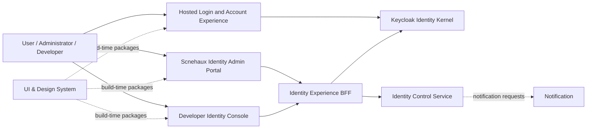
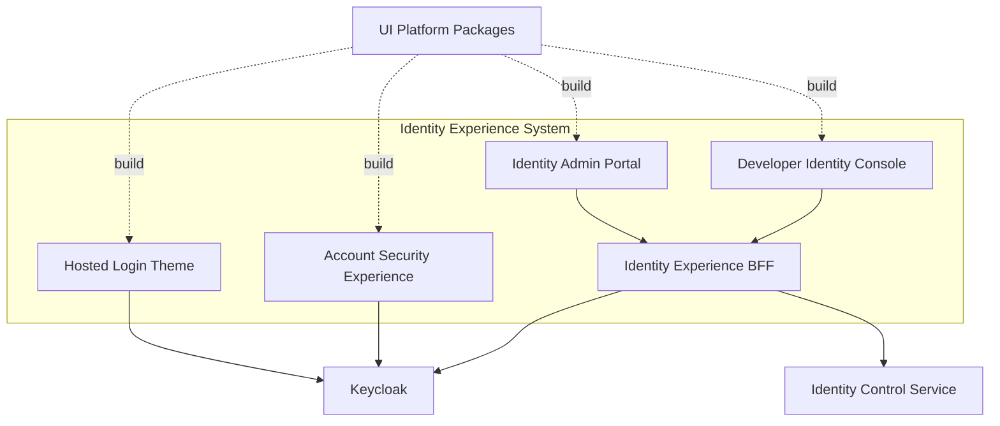
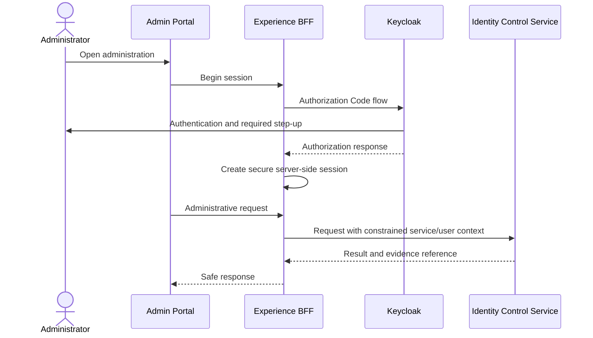
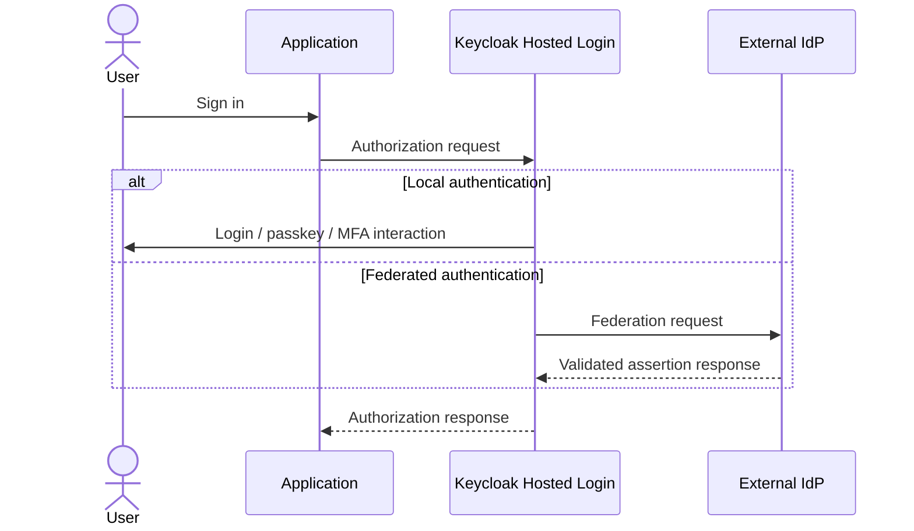

---
doc_meta:
  id: SAD-002
  title: Scnehaux Identity Experience
  owner: Identity Experience Team
  version: 2.0.0
  status: draft
  classification: restricted
  governed_by:
    - GDC-009
    - ADR-IAM-004
  review_cycle_days: 90
  created_date: 2026-08-06
  last_reviewed: 2026-08-06
  parent_pad: PAD-PLT-001
---

# Scnehaux Identity Experience

## 1. Purpose & Scope

### Objective

Provide secure, accessible, branded, and governable identity experiences without creating an independent authentication, token, session, Tenant, or Product-authorization engine in the frontend layer.

### Capability

The system realizes the user-facing aspects of PAD-PLT-001:

- hosted login and federation selection;
- authenticator enrollment and step-up;
- recovery and account security;
- session, device, authenticator, and consent management;
- Application/client onboarding experience;
- Identity administration and investigation;
- migration and compatibility messaging.

### Requirement

- Authentication and protocol state remain owned by the Identity Runtime.
- Tenant/Membership administration remains owned by Organization & Tenancy.
- Product permissions remain outside the Identity Experience.
- Privileged administration is default-deny, high-assurance, attributable, and evidenced.
- User experiences target WCAG 2.2 AA.
- Tokens and secrets are not persisted in browser local storage.

### Constraint

- Hosted authentication uses supported Keycloak login interfaces and theme/extension mechanisms.
- Enterprise administration calls the Scnehaux Identity Control API, not the Keycloak database.
- Direct Keycloak Admin Console access is restricted to platform break-fix and designated operators.
- The UI Platform supplies design tokens and reusable primitives; Identity-specific flows remain owned by this system.
- Custom UI work cannot require a custom OAuth/OIDC backend.

### Assumption

- SAD-001 provides standards-based authentication, session, account, and control contracts.
- UI Platform packages are available as immutable build-time dependencies.
- Notification delivery is provided asynchronously by the enterprise Notification capability.

### Out of Scope

- Identity protocol engine.
- credential verification and storage.
- session and token issuance.
- canonical Tenant/Membership administration.
- Product authorization administration.
- enterprise evidence retention.
- general Product UI.

## 2. Enterprise Traceability

### Realizes

This system realizes the Identity Experience portions of PAD-PLT-001 and is governed by the adopted-kernel decision in ADR-IAM-004.

It consumes UI Platform as a build-time capability and Identity Runtime as its trust and control backend.

## 3. Solution Context

### System Context

### External

- browser and device security environment;
- external identity-provider login pages;
- Notification delivery channels;
- UI Platform packages.

### Internal

1. **Hosted Login Theme/Extension** — Keycloak-hosted authentication pages using supported extension points.
2. **Account Security Experience** — initially supported Keycloak account capabilities with Scnehaux branding; custom replacement only through supported APIs.
3. **Identity Admin Portal** — Scnehaux application for identity, client, federation, session, and security operations.
4. **Developer Identity Console** — application/client onboarding, redirect/audience configuration workflow, credential rotation request, and integration guidance.
5. **Identity Experience BFF** — secure browser-facing backend that manages application sessions and calls Identity Control/Runtime interfaces.

## 4. Architecture Model

### 4.1 Container Model

### 4.2 Experience Boundaries

#### Hosted Login

Owns presentation and interaction for:

- identifier entry;
- authentication method selection;
- federation routing;
- MFA/passkey challenge;
- consent;
- recovery initiation;
- error and support guidance.

It does not own credential verification, session creation, protocol state, or Tenant Membership.

#### Account Security

Owns presentation and supported operations for:

- profile fields delegated to Identity;
- authenticators and recovery methods;
- active sessions/devices;
- consent and delegated grants;
- linked external identities;
- security notifications.

#### Identity Admin Portal

Owns presentation and workflows for:

- Principal lifecycle and investigation;
- authenticator/session containment;
- federation configuration workflow;
- client/resource security registration;
- privileged Identity operations;
- drift, reconciliation, and migration status.

It does not administer Product permissions, Tenant Membership authority, or Subscription/Entitlement.

#### Developer Identity Console

Owns presentation for:

- Application security onboarding;
- redirect URI and audience request;
- client authentication profile;
- credential/certificate rotation request;
- supported protocol documentation;
- conformance and integration status.

Application ownership and lifecycle originate in Software Catalog.

### 4.3 Runtime Flow — Administrative Session

### 4.4 Runtime Flow — Hosted Login

### 4.5 UI Platform Integration

- UI Platform is a build-time dependency, not a runtime identity dependency.
- Identity Experience uses approved design tokens, primitives, accessibility helpers, and theming contracts.
- Identity-specific security messages, form states, recovery flows, and consent semantics remain in this system.
- A UI Platform outage cannot break already deployed identity experiences.

## 5. State & Data Architecture

### 5.1 Browser State

Allowed browser state:

- non-sensitive UI preferences;
- anti-CSRF and authorization-flow state using secure mechanisms;
- temporary form state without credential retention;
- server-session reference in Secure, HttpOnly, SameSite cookies for BFF applications.

Prohibited:

- access or refresh tokens in localStorage/sessionStorage;
- passwords, recovery codes, TOTP secrets, client secrets, or private keys;
- canonical Principal, Membership, or permission databases in the frontend.

### 5.2 Server State

The Experience BFF may store:

- short-lived encrypted server-side application session;
- CSRF state;
- correlation and interaction state;
- safe user-interface preferences;
- administrative workflow draft/reference;
- audit correlation identifier.

Identity authority remains in SAD-001.

### 5.3 Cache

- public static assets may be edge-cached with immutable versioning;
- personalized or restricted responses are private/no-store according to data class;
- authorization and administrative state is not trusted from stale browser cache;
- logout and containment clear server-side Experience sessions.

### 5.4 Schema

UI data contracts are generated or validated from supported Control/Runtime API contracts. The frontend does not infer Keycloak internal database schema or unsupported private APIs.

### 5.5 Statelessness

Static login assets and frontend bundles are stateless. The BFF is horizontally scalable with externalized encrypted session state or sticky-session-independent server sessions.

## 6. Integration Contracts

### 6.1 API

The Experience BFF consumes:

- OAuth/OIDC authorization and logout contracts from Keycloak;
- supported account/security operations;
- Scnehaux Identity Control API;
- Software Catalog references through the Control Service;
- Tenant/Membership context through the Control Service where administration needs it.

The browser does not call privileged Keycloak Admin APIs directly.

### 6.2 Consumed

- UI Platform packages.
- Identity Runtime protocol and control contracts.
- Notification status where surfaced.
- support/ticket references for high-risk recovery where applicable.

### 6.3 Published

- safe UI telemetry;
- accessibility and client-error telemetry;
- administrative interaction correlation;
- security signals such as suspicious recovery or repeated challenge failure through Identity Runtime contracts.

### 6.4 Event Flow

Experience events are interaction signals, not authoritative identity facts. Identity Runtime records the authoritative authentication, session, credential, or administration outcome.

### 6.5 Retry and Timeout

- login and consent forms prevent accidental duplicate submission;
- administrative commands expose idempotency/correlation when supported;
- browser retry never replays destructive operations without explicit confirmation;
- external IdP delays are represented without leaking provider internals;
- long-running migration or provisioning operations use status polling/event updates through the Control Service.

## 7. Security & Trust Boundary

### 7.1 Authentication

- hosted login remains inside the Keycloak authentication transaction;
- Admin and Developer portals use Authorization Code flow and appropriate PKCE/confidential-client controls;
- privileged operations require step-up and recent authentication;
- the UI never marks authentication successful before Identity Runtime confirmation.

### 7.2 Authorization

- browser route hiding is usability only, not authorization;
- BFF and Control Service enforce every administrative operation;
- Tenant and Product administration are not inferred from Identity roles;
- provider cross-Tenant administration is explicit, scoped, short-lived, and evidenced.

### 7.3 Encryption and Secrets

- TLS is mandatory;
- cookies are Secure, HttpOnly, SameSite, narrowly scoped, and rotated;
- CSRF and origin checks protect state-changing browser requests;
- client secrets exist only in server-side trusted components or secret management;
- CSP, frame protection, referrer policy, and secure headers are enforced.

### 7.4 Audit

Privileged interactions record:

- authenticated actor;
- assurance and session;
- requested scope/context;
- target Principal/client/federation configuration;
- reason and approval reference where required;
- result and correlation;
- evidence publication status.

### 7.5 Recovery and Enumeration

- responses avoid unnecessary account-existence disclosure;
- recovery changes security authority and therefore uses risk controls, evidence, and post-recovery containment;
- support-assisted recovery cannot bypass documented approval and assurance controls;
- recovery secrets are single-use, time-bound, and never displayed after issuance where applicable.

## 8. NFR

### 8.1 Latency

- static identity assets target fast global delivery;
- page interaction remains responsive under authentication backpressure;
- BFF overhead is bounded and measured separately from Keycloak and external IdP latency;
- slow external providers do not freeze unrelated UI journeys.

### 8.2 Throughput and RPS

Capacity tests cover:

- login page and static assets;
- peak authentication initiation;
- account-security page load;
- admin search and bulk operations;
- developer onboarding workflows;
- concurrent federation/provider failures.

### 8.3 Scalability and Caching

- frontend assets scale through immutable distribution;
- BFF replicas scale horizontally;
- bulk/admin requests are paginated and rate-bounded;
- no unbounded cross-Tenant result set is rendered or fetched.

### 8.4 Observability and Telemetry

Measure:

- page and interaction performance;
- authentication funnel by safe outcome category;
- federation selection/failure;
- step-up and recovery completion;
- BFF latency/error;
- admin command outcomes;
- accessibility errors;
- browser security-policy violations.

PII, tokens, secrets, and credential fields are excluded.

### 8.5 Alerting and Runbook

Runbooks cover:

- login theme deployment regression;
- BFF outage;
- cookie/session incident;
- CSP or browser compatibility failure;
- external IdP outage messaging;
- privileged portal compromise;
- accidental cross-Tenant display;
- failed identity-runtime upgrade compatibility.

### 8.6 Circuit Breaker, Retry, Timeout, and Failover

- BFF uses bounded timeout and circuit breaking for Control Service operations;
- login flow behavior is owned by Keycloak and provider-specific policy;
- static login assets continue when Admin Portal is unavailable;
- Admin Portal outage does not block ordinary authentication;
- unsafe administrative operations fail closed.

### 8.7 Accessibility and Usability

- WCAG 2.2 AA target;
- keyboard-only and screen-reader support;
- visible focus and accessible error association;
- safe copy for recovery, consent, session, and destructive actions;
- no color-only security meaning;
- localization-ready messages;
- current administration scope is always visible.

### 8.8 Blast Radius

| Failure | Blast Radius | Containment |
| :-- | :-- | :-- |
| Login theme asset regression | Authentication presentation | rollback immutable theme artifact; runtime remains intact |
| Account Experience | Self-service security management | login/token issuance continues; support path activated |
| Admin Portal/BFF | Identity administration | ordinary login continues; restricted break-fix path only |
| Developer Console | new Application onboarding | existing clients and login continue |
| UI Platform package registry | new builds | deployed immutable assets continue |
| Browser session compromise | one Experience session | revoke BFF and Keycloak session, rotate cookies, investigate |
| Cross-Tenant UI defect | affected administrative data exposure | fail closed, contain actor/session, evidence and incident process |

## 9. Deployment Strategy

### 9.1 Environment

- local development with synthetic identity data;
- integration environment connected to non-production Identity Runtime;
- accessibility and browser-compatibility environment;
- staging with production security headers and topology;
- production;
- migration/cutover rehearsal.

### 9.2 Infrastructure

- hosted login/theme artifacts deployed with Keycloak through supported packaging;
- Admin/Developer Experience deployed as independently versioned TypeScript web/BFF application;
- immutable static assets distributed through approved edge/static hosting;
- server-side session state externalized or encrypted for horizontal scaling;
- no production secrets in browser bundles.

### 9.3 CI/CD

The pipeline must:

1. type-check, lint, test, and build frontend/BFF code;
2. run accessibility automation and critical manual checks;
3. run browser security and CSP tests;
4. run OIDC login/logout/session integration tests;
5. run privileged route and cross-Tenant negative tests;
6. scan dependencies, bundles, images, and secrets;
7. test supported Keycloak-version compatibility for theme and account integration;
8. build immutable signed artifacts;
9. promote the same artifacts across environments;
10. support immediate rollback of theme and portal releases.

### 9.4 Release Independence

- Login theme, Admin Portal, Developer Console, and Identity Runtime may release independently within compatibility contracts.
- A Keycloak upgrade cannot proceed until theme/account/admin compatibility tests pass.
- Identity Experience rollback must not require identity-data rollback.

## 10. Architecture Decisions

### Governing

- ADR-IAM-004 — Keycloak as identity kernel.
- UI Platform standards and frontend ecosystem ADRs.
- browser session/BFF decision — required before production approval.
- hosted login customization strategy — required before production approval.
- account experience build/adopt decision — required after fit-gap testing.

### Rejected

- custom authentication/token backend for UI flexibility;
- browser direct access to privileged Keycloak Admin APIs;
- access/refresh tokens in browser local storage;
- Product permission management in Identity Admin Portal;
- canonical Tenant/Membership administration in Identity Experience;
- mandatory Module Federation runtime for trust-critical login;
- external component-library bypass of UI Platform without an approved exception.

## 11. Compatibility Strategy

- UI integrates through standards and supported Identity Runtime contracts;
- Keycloak theme/API compatibility is tested for every selected upgrade;
- unsupported private endpoints and database schema are prohibited;
- identity terminology and identifiers remain Scnehaux canonical language;
- UI Platform packages are pinned and immutable per release;
- staged deprecation protects Applications during portal and protocol changes.

## 12. Migration Strategy

1. retain the current administrative UI only for bounded legacy operations;
2. remove assumptions that Tenant header or client-side role proves authority;
3. establish new hosted login and account experience against Keycloak;
4. establish Admin Portal through the Control Service;
5. migrate administrative functions by bounded capability;
6. migrate developer/client onboarding;
7. run parallel support and operational training;
8. disable legacy identity administration after zero-consumer evidence;
9. retire legacy frontend token/session behavior.

## 13. Alternatives

- Keycloak default Admin and Account Consoles only;
- fully custom login and account frontend;
- SPA with browser-held tokens;
- server-rendered/BFF experience;
- consolidated Identity and Tenant administration portal.

The selected architecture uses supported Keycloak-hosted authentication, a Scnehaux-owned BFF administration experience, and strict authority separation.
