---
doc_meta:
  id: SAD-001
  title: Scnehaux Identity Runtime
  owner: Identity Platform Team
  version: 2.2.0
  status: approved
  classification: restricted
  governed_by:
    - GDC-009
    - ADR-IAM-001
  review_cycle_days: 90
  created_date: 2026-08-06
  last_reviewed: 2026-09-09
  parent_pad: PAD-PLT-001
---

# Scnehaux Identity Runtime

## 1. Purpose & Scope

### Objective

Realize the Identity & Access Platform through a mature identity kernel, a Scnehaux-owned control and reconciliation service, protected persistence, standards-based consumer integration, and governed event/evidence flows.

### Capability

This system realizes:

- Principal, identifier, authenticator, and session runtime;
- OAuth 2.0, OpenID Connect, and required SAML/federation runtime;
- token and protocol-grant issuance;
- client and protected-resource registration;
- Identity administration runtime;
- Tenant/Membership and Application-registration projection;
- Consumer Verification Profile metadata and context-revocation propagation;
- workload identity and bounded delegated execution identity support;
- canonical Scnehaux identity events;
- migration and compatibility from the legacy Go IAM.

### Requirement

The system must preserve PAD-PLT-001 authority boundaries, provide local consumer verification, prevent a duplicate Principal authority, support controlled Keycloak upgrades, and provide evidence for security, recovery, conformance, migration, context-revocation enforcement, federation/account-linking safety, and key continuity.

### Constraint

- Keycloak is the adopted identity kernel.
- Go is used for the Scnehaux Identity Control Service, not for reimplementing the protocol/session engine.
- Organization remains authoritative for Tenant, Workspace, and Membership.
- Software Catalog remains authoritative for Application and owner metadata.
- Product authorization remains outside this system.
- Direct writes to the Keycloak database are prohibited.
- Realm-per-Tenant is prohibited by default.
- Preview Keycloak features require a separate ADR.
- The initial production topology is single-region, multi-availability-zone.
- Email/phone/display-name equality alone is never sufficient automatic federation account-linking proof.
- Human session credentials are never copied into worker/Agent storage as a delegation mechanism.

### Assumption

- Managed relational database, secret/key management, load balancing, object storage, event broker, and observability capabilities are available.
- Product systems can validate signed access artifacts locally.
- Organization and Software Catalog can publish or expose bounded lifecycle contracts.
- Consumers that keep long-lived connections can register or equivalently revalidate those connections against the authorizing Principal/Tenant context.
- The existing Go IAM can operate temporarily during migration.

### Out of Scope

- Identity user-interface architecture — SAD-002.
- Product business authorization.
- Tenant and Membership authority.
- Subscription and Entitlement authority.
- Application ownership.
- Consumer-owned WebSocket/SSE connection infrastructure.
- Agent Runtime execution lifecycle.
- Enterprise evidence retention.
- Product-specific profile and business data.
- Multi-region active-active architecture in the initial release.

## 2. Enterprise Traceability

### Realizes

This system realizes PAD-PLT-001 and implements the decision proposed by ADR-IAM-001.

It inherits:

- narrow IAM authority from EAD-001 and EAD-006;
- system relationships from EAD-002;
- data authority from EAD-003;
- integration and reconciliation principles from EAD-004;
- runtime and reliability posture from EAD-005.

## 3. Solution Context

### System Context

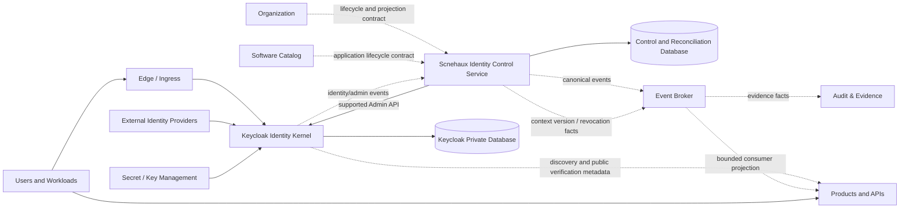

### External

External dependencies include:

- configured enterprise or partner identity providers;
- managed key/secret capability;
- managed database and backup service;
- event broker and Audit & Evidence consumer;
- Organization and Software Catalog contracts.

### Internal

Internal system containers are:

1. **Keycloak Identity Kernel** — authoritative runtime for Principal, credential, session, protocol trust, federation, and token issuance.
2. **Identity Control Service** — Scnehaux-owned desired-state, orchestration, mapping, drift, reconciliation, event translation, context-revocation propagation, and migration system.
3. **Identity Event Adapter** — minimal Keycloak extension or supported event integration with completeness reconciliation.
4. **Keycloak Private Database** — internal Keycloak persistence, accessed only by Keycloak.
5. **Control Database** — Scnehaux mappings, desired state, reconciliation cursors, migration state, Consumer Verification Profile metadata, and transactional outbox; no duplicate Principal secrets or sessions.
6. **Verification Distribution** — discovery and public-key material exposed through Keycloak and safely cached by consumers.

Consumer connection registries are not an Identity Runtime container. They are consumer-owned enforcement mechanisms receiving bounded revocation/context facts from the identity/event contract.

#### Source Realization

This system is realized by two repositories with different toolchains and different release cadences:

| Repository         | Containers realized                                                                                           | Toolchain         | Release cadence                      |
| :----------------- | :------------------------------------------------------------------------------------------------------------ | :---------------- | :----------------------------------- |
| `identity-kernel`  | Keycloak Identity Kernel, Identity Event Adapter, realm configuration, login theme, digest-pinned image build | JVM and container | Bound to the pinned Keycloak release |
| `identity-control` | Identity Control Service                                                                                      | Go                | Independent                          |

The split is required rather than preferred. A Keycloak upgrade forces a rebuild and a full compatibility suite across everything in `identity-kernel`; holding the Go service in the same repository would make every kernel upgrade block an unrelated control-plane release. Extension governance in §4.5 also requires each extension to declare its own source repository and supported Keycloak range.

Both repositories consume the shared Go substrate described in the technical designs of `foundation-platform`. That substrate is a versioned library and not a deployed system, so it carries no SAD of its own.

## 4. Architecture Model

### 4.1 Container Model

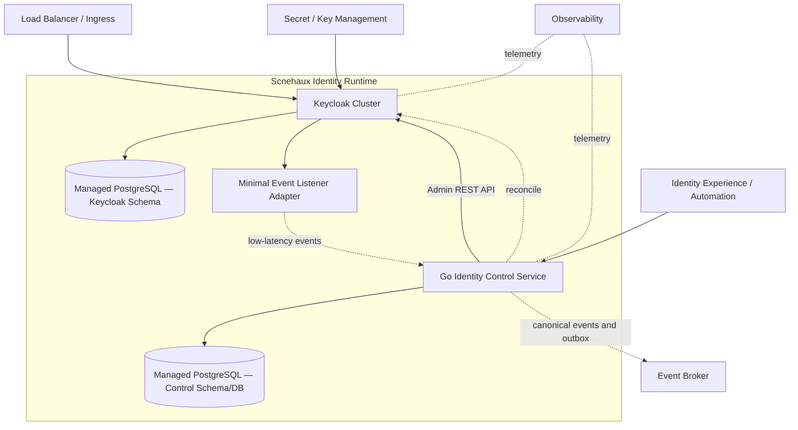

### 4.2 Container Responsibilities

#### Keycloak Identity Kernel

- Owns Principal physical persistence inside the Identity domain.
- Stores identifiers, credentials, authenticators, sessions, grants, clients, federation configuration, and protocol state.
- Executes authentication, OAuth/OIDC, SAML/federation, token, consent, session, recovery, and supported administration capabilities.
- Publishes discovery and verification metadata.
- Never calls Product domains on authentication or token-validation paths.

#### Identity Control Service

- Maintains desired-state records for Scnehaux-controlled realm, client, resource, and projection configuration.
- Validates Application and owner references before provisioning a client/resource.
- Projects the minimum Tenant/Membership context required by approved token and administration policies.
- Maintains canonical mapping between Scnehaux identifiers and Keycloak-local identifiers.
- Detects drift between desired state and Keycloak runtime state.
- Reconciles events and administrative state.
- Translates Keycloak events into canonical Scnehaux events.
- Publishes versioned context-revocation facts for consumers according to declared verification profiles.
- Coordinates legacy migration, cutover, and rollback.
- Does not authenticate users, issue tokens, store credentials, or implement a parallel session engine.

#### Identity Event Adapter

- Uses the smallest supported extension surface necessary to capture user/admin/security events.
- Contains no Product business logic.
- Is versioned and compatibility-tested against the selected Keycloak release.
- A delivery failure must not silently erase the source event.
- Completeness is checked through scheduled reconciliation against supported event/admin state.

### 4.3 Realm and Issuer Topology

Initial topology:

```text
Scnehaux Primary Realm
├── ATI workforce Principals
├── approved customer/partner identities according to Realm policy
├── internal and external protocol clients
├── protected-resource registrations
└── bounded Tenant/Membership context projection
```

Additional Realms require an ADR based on one or more of:

- independent issuer trust;
- cryptographic isolation;
- regulatory or residency boundary;
- independently delegated realm administration;
- incompatible authentication policy;
- acquisition/migration isolation.

Tenant count alone is not a Realm-splitting criterion.

### 4.4 Runtime Flows

#### Authentication and Token Issuance

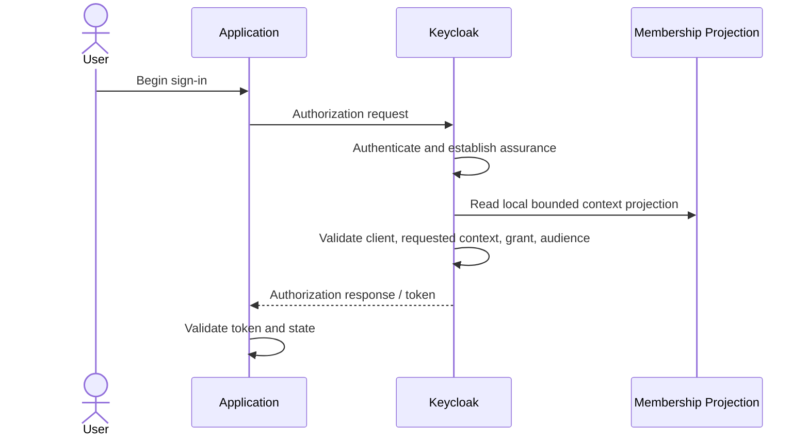

`P` is Keycloak-local or Control-managed projection state. This flow does not synchronously call Organization.

#### Application Registration

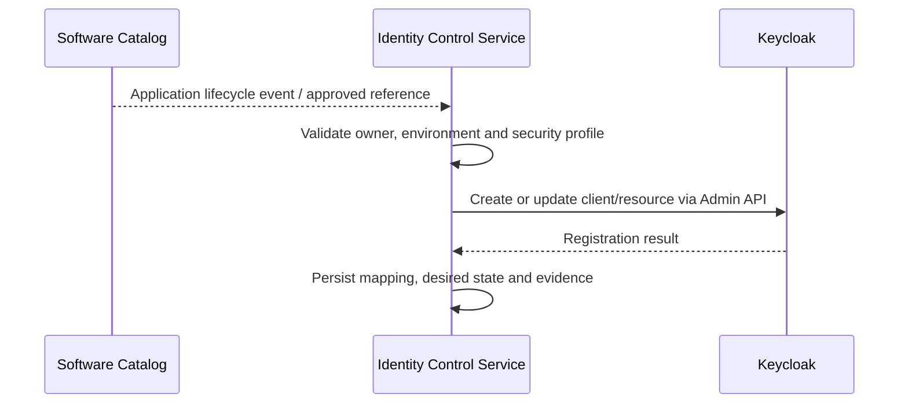

#### Membership Projection

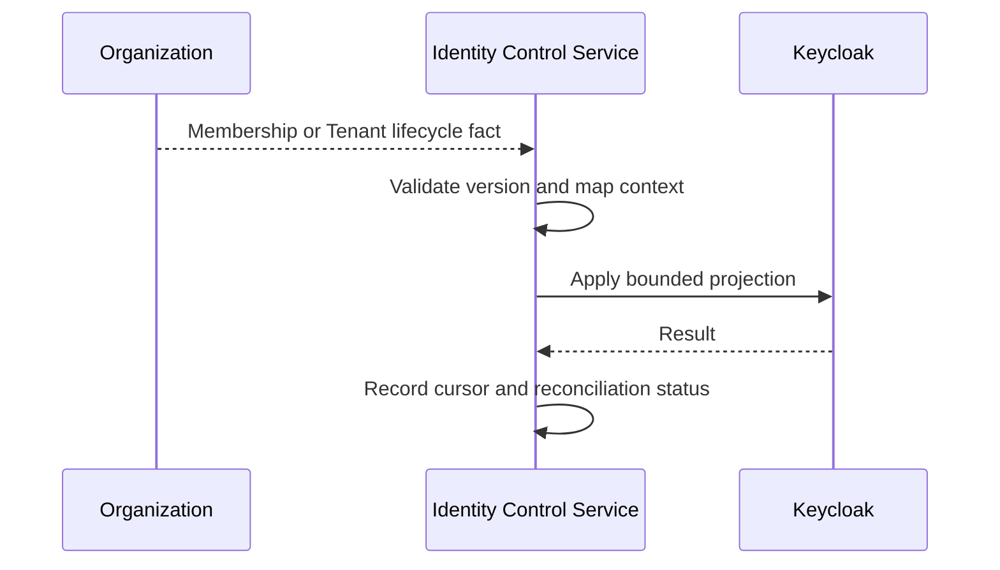

#### Context Revocation Propagation

The revocation path separates durable acceptance, kernel/session containment, consumer projection advance, and long-lived-connection enforcement.

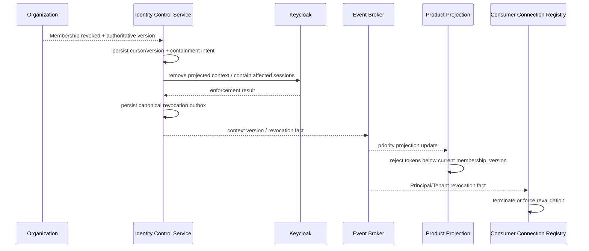

The Product projection and Connection Registry are consumer-owned. Identity does not become a synchronous universal request gateway.

#### Federation & Account Linking

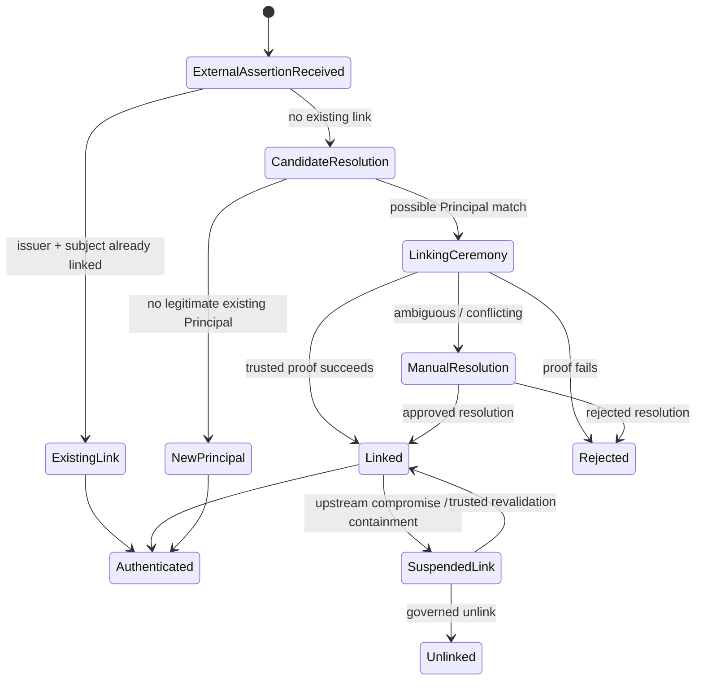

Implementation rules:

- external uniqueness is issuer plus subject;
- email/phone/display-name equality may find a candidate but never auto-links an existing Principal by itself;
- link/unlink/relink and conflict resolution are security-sensitive attributable mutations;
- upstream compromise may suspend the external link without deleting the local Principal;
- accepted federation attributes are issuer- and attribute-policy specific.

#### Bounded Workload / Agent Delegation

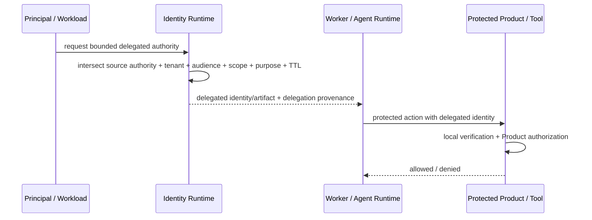

Identity provides bounded attributable delegation; Agent Runtime owns execution mechanics and Products own resource authorization.

#### Identity Event Publication

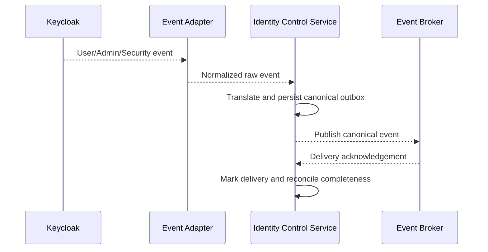

### 4.5 Extension Architecture

Extension hierarchy:

1. standard Keycloak configuration;
2. supported Admin REST and protocol interfaces;
3. themes and supported UI extension points;
4. minimal event listener;
5. restricted SPI only through a dedicated ADR.

Every extension has:

- owner;
- source repository;
- supported Keycloak range;
- unit/integration tests;
- upgrade compatibility suite;
- failure and rollback behavior;
- removal strategy.

No extension may create Product authorization or directly call Product/Tenancy services on the normal token-validation path.

## 5. State & Data Architecture

### 5.1 Storage

#### Keycloak Private Database

Authoritative for the physical realization of:

- Principal and identifier;
- credentials and authenticators;
- sessions and offline sessions;
- OAuth/OIDC clients, grants, consent, and protocol state;
- federation links and configuration;
- Keycloak-local context projections;
- Keycloak administrative and event state.

Rules:

- accessed only through Keycloak-supported interfaces;
- no direct Scnehaux SQL reads or writes;
- backup and restore follow Keycloak/database compatibility requirements;
- schema migration is performed only by the supported Keycloak upgrade process.

#### Control Database

Authoritative for:

- desired configuration state owned by Scnehaux;
- Application-to-client/resource mappings;
- Tenant/Membership projection mappings and consumer versions;
- Consumer Verification Profile and revocation-propagation configuration owned by Identity;
- reconciliation cursors and drift results;
- canonical event outbox and delivery state;
- migration batches, identity mappings, and cutover state;
- operational evidence references.

It is not authoritative for Principal credentials, sessions, Product authorization, or Organization Membership truth.

### 5.2 Cache and Session State

- Keycloak owns its required cache/session architecture.
- Initial clustered deployment uses stable supported cache behavior; preview stateless mode is excluded.
- Products do not depend on Keycloak cache for local token verification.
- Cache loss and replica restart behavior are tested for active authentication and session journeys.

### 5.3 Identifier Mapping

```text
scnehaux_principal_id
    ↔ keycloak_user_id

application_id
    ↔ keycloak_client_or_resource_id

tenant_id / workspace_id / membership_id
    ↔ keycloak_local_projection_id
```

Scnehaux identifiers are immutable references. A Keycloak-local identifier is not a canonical Tenant, Membership, or Application owner identifier.

### 5.4 Cryptographic State

- Realm signing keys are stable across replicas and restarts.
- Production keys are provisioned through an approved secret/keystore or security-custody mechanism.
- Generated per-process production signing keys are prohibited.
- Public verification material remains available for the maximum lifetime of issued artifacts plus cache and clock-skew margin.
- Previous verification keys remain resolvable for every still-valid artifact they signed plus the governed cache/clock-skew margin.
- Key rotation and recovery are rehearsed before production claims.
- Database failover/recovery cannot silently create a new issuer identity or invalidate the declared key continuity contract.

### 5.5 Stateless Consumer Model

Protected resources remain stateless with respect to the Identity Runtime for normal validation:

- validate issuer, audience, type, signature, algorithm policy, time, and required claims locally;
- apply the declared Consumer Verification Profile for mutable context freshness;
- reject context-bearing artifacts whose projected Membership/context version is below the consumer's current authoritative projection where the profile requires it;
- enforce Product authorization locally;
- use bounded online status checks only for approved high-risk or opaque-token profiles.

`signature_valid` and `context_current` are distinct predicates for profiles containing mutable operating context.

### 5.6 Delegation State

Delegated execution metadata may include stable source identity, direct acting workload, delegation chain/correlation, Tenant/Workspace, audience, purpose, scope, TTL, and bounded resource/tool constraints.

It does not copy the source human credential. Delegation metadata proves attributable bounded authority; it does not become Product business permission authority.

## 6. Integration Contracts

### 6.1 API

#### Public Protocol API

Owned by Keycloak through standards-based OAuth/OIDC/SAML interfaces.

#### Control API

Owned by the Identity Control Service for:

- Application client/resource onboarding;
- desired configuration inspection;
- Tenant/Membership projection status;
- Consumer Verification Profile and revocation-propagation status;
- drift and reconciliation operations;
- migration administration;
- governed identity administration not exposed directly to ordinary operators.

Exact paths and schemas belong in developer contracts/TDDs.

### 6.2 Consumed

- Organization lifecycle events and snapshots.
- Software Catalog Application lifecycle events and queries.
- Security & Trust secret/key capabilities.
- external IdP metadata and assertions.
- notification delivery contract.
- enterprise evidence ingestion contract.

### 6.3 Published

Canonical event families:

```text
identity.principal.*
identity.identifier.*
identity.authenticator.*
identity.authentication.*
identity.session.*
identity.protocol-client.*
identity.consent.*
identity.federation.*
identity.workload.*
identity.delegation.*
identity.context.*
identity.recovery.*
identity.privileged-admin.*
identity.security.*
identity.migration.*
```

### 6.4 Retry, Timeout, and Circuit Breaker

- Admin API operations are idempotent or guarded by desired-state/version checks.
- External IdPs have independent timeout, retry, and circuit-breaker policies.
- Control-plane reconciliation uses bounded retries and dead-letter/manual-repair state.
- Authentication does not synchronously call Software Catalog or Organization.
- Event publication failure retains the canonical outbox fact.
- Revocation propagation retries preserve the same authoritative context version and cannot manufacture a newer version.

## 7. Security & Trust Boundary

### 7.1 Authentication

Keycloak owns authentication ceremonies and authenticator verification. The Control Service never receives plaintext passwords, passkey private material, TOTP secrets, or refresh tokens.

### 7.2 Authorization

- Keycloak authorizes protocol grants and Identity administration.
- Identity Control Service authorizes Scnehaux control/provisioning operations.
- Organization authorizes Membership context.
- Product domains authorize business actions.
- Delegated execution is bounded by the source authority and target policy intersection; it never creates Product permission.
- Admin Console access is restricted and not the ordinary enterprise administration interface.

**The bootstrap ceremony is the one entry point, and it is not an exception to the above.** The Identity Control API requires a caller holding a `principal_id` and is the only path that issues one, so a fresh Realm cannot reach its first Principal. `ADR-IAM-001 §5.11` gives that entry point to a single-use command on the Identity Control Service itself: it can succeed at most once per Control Database, refuses a populated registry, records the human who ran it in a row the runtime role cannot modify, and creates the Principal through the ordinary provisioning path. It holds no credential — the kernel is told to demand one on first authentication.

This is distinct from restricted Admin Console access. That path operates on the kernel and is bounded by who may reach it; the ceremony mints a canonical identifier and is bounded by construction, expiring after one use.

### 7.3 Encryption and Secrets

- TLS protects all external and internal network paths carrying identity data.
- client secrets, admin credentials, database credentials, and signing keystores are stored in approved secret management.
- secrets are never committed to realm export, source control, logs, events, or analytics.
- database and backup encryption is mandatory for restricted identity data.

### 7.4 Audit

- Keycloak user/admin events are enabled according to retention and privacy policy.
- Canonical security events are published through the Control Service outbox.
- privileged changes identify actor, client, Realm, Tenant context where applicable, assurance, reason, and result.
- federation link/unlink/relink/conflict resolution and delegated authority issuance are attributable events.
- enterprise Audit & Evidence remains the long-term evidence authority.

### 7.5 Tenant Isolation

- Keycloak-local Tenant/Organization/group structures are projections only.
- requested Tenant context is validated against projected Membership state.
- Realm administrator is not equivalent to Product or Tenant administrator.
- cross-Tenant provider administration requires elevated assurance, narrow scope, and evidence.
- cross-tenant negative tests cover tokens, admin APIs, projections, cache, events, exports, migration, and delegated execution.

### 7.6 Supply Chain

- Keycloak image is pinned by digest.
- extensions are built from owned source and signed artifacts.
- dependency and vulnerability scanning applies to Keycloak image, JVM extensions, Go Control Service, and deployment manifests.
- critical security updates follow a documented emergency upgrade process.

### 7.7 Revocation Classes and Enforcement

`PAD-PLT-001` invariant 9 names six revocation classes, and `STD-IAM-001 §3.4` requires each to declare its enforcing mechanisms and a measurable maximum enforcement delay. This section is that declaration. Without it the platform can accept a revocation and report success while no artifact states when the access actually stops, which is the failure mode the invariant exists to prevent.

**The delay is derived, never chosen.** `STD-IAM-001 §3.4` fixes the formula and `STD-IAM-002 §3.3` supplies both terms:

```text
maximum_enforcement_delay = propagation_budget + remaining_access_token_lifetime
```

The propagation budget is 60 seconds as the planning figure, against an operational target below 10 seconds. The lifetime term is the class of the audience the revoked subject holds tokens for, and where a subject reaches several audiences the delay is the **worst** class, not the typical one.

| Class                 | Enforcing mechanisms, in order                                                                                                 | Lifetime term                    | Maximum delay                                                                    |
| :-------------------- | :----------------------------------------------------------------------------------------------------------------------------- | :------------------------------- | :------------------------------------------------------------------------------- |
| Session               | kernel session removal                                                                                                         | class of that session's audience | 60s + class                                                                      |
| Principal             | kernel user disable → remove every kernel session → remove projected context → quarantine the control-plane mapping            | worst class the Principal holds  | 60s + worst class                                                                |
| Authenticator         | kernel authenticator removal                                                                                                   | none for future ceremonies       | 60s, and the Session delay in addition when the removal is a compromise response |
| Client or grant       | client disable → grant revocation → refresh invalidation                                                                       | class of that client's audience  | 60s + class                                                                      |
| Workload              | workload credential disable → grant and session removal                                                                        | `L3`, 9 minutes                  | 10 minutes                                                                       |
| Contextual Membership | Organization priority event → Identity Control removes projected context → kernel session removal → consumer projection update | `L1`, 9 minutes                  | 10 minutes                                                                       |

**Ordering inside the Principal and Membership classes is load-bearing.** The projected context is removed before the kernel sessions. Reversed, a refresh landing between the two steps can mint a fresh token asserting the context that was just revoked and the new token outlives the revocation by a full lifetime class.

**Contextual Membership can enforce earlier than the formula.** `STD-IAM-002 §3.5` rule 8 makes a consumer reject a token whose `membership_version` is below the version its local projection holds. A consumer that has already applied the priority event therefore rejects the outstanding token immediately rather than at expiry. The 10-minute figure is the ceiling for a consumer that has not yet applied it, not the expected case.

**Acknowledgement is not enforcement.** Per `STD-IAM-001 §3.4`, accepting a revocation means the change is durable and queued. The platform MUST NOT report it as enforced until the mechanisms above have applied, and the security dashboard measures acceptance-to-enforcement separately from acceptance.

**Long-lived connections are outside the token term.** A connection authenticated once and held open receives no further request to reject, so `STD-IAM-002 §3.4` requires each to be registered against the Principal and Tenant context that authorized it or use an equivalent bounded revalidation mechanism. A connection that cannot be matched to revocable context cannot claim the bounded revocation guarantee.

#### 7.7.1 What Is Not Yet Enforced

Three mechanisms above are declared and not yet realized, and the resulting delay is **unbounded** rather than merely longer:

| Mechanism                         | Blocked on                                                       | Consequence today                                                                  |
| :-------------------------------- | :--------------------------------------------------------------- | :--------------------------------------------------------------------------------- |
| Consumer projection update        | the event broker and `SAD-004`                                   | a Membership revocation reaches no consumer; only token expiry limits it           |
| Long-lived connection termination | a connection registry or equivalent revalidation in the consumer | a held connection survives the declared bounded revocation path                    |
| Projected context removal         | the Keycloak projection path in `TDD-identity-control-002`       | Principal and Membership revocation currently rely on kernel session removal alone |

Until each lands, the Identity Runtime MUST NOT report a maximum enforcement delay for the Contextual Membership class, and the production gate MUST include measured acceptance-to-enforcement evidence for every class in the table above.

#### 7.7.2 Revocation Enforcement View

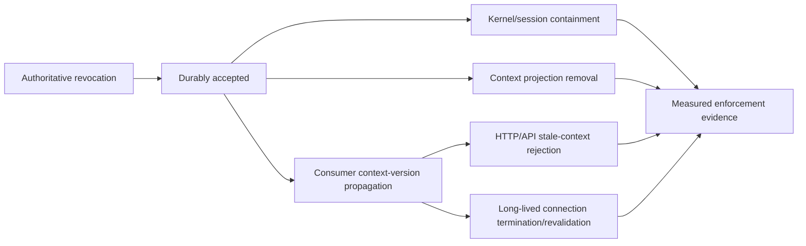

A bounded revocation claim requires evidence across every enforcing path relevant to the declared Consumer Verification Profile.

### 7.8 Federation Linking Security

- External identity uniqueness is `issuer + subject`.
- Existing local Principals are never automatically linked solely from email/phone/display-name equality.
- Linking ceremonies require a trusted proof appropriate to the population and risk; ambiguous collisions enter manual/security resolution.
- Link suspension due to upstream compromise does not silently delete the local Principal.
- Attribute mapping explicitly identifies which issuer attributes are trusted and which remain descriptive only.
- Account-link changes are included in security investigation evidence.

### 7.9 Delegated Execution Security

- Direct actor identity and delegation source are distinguishable.
- Delegation can preserve or reduce source authority, never expand it.
- Delegated artifacts are audience-, Tenant/context-, purpose-, scope-, and time-bound.
- Protected Products independently authorize the action.
- Human session credentials are not stored by Agent Runtime/Workers as a shortcut for delegation.
- Unknown or broken delegation provenance fails closed for protected actions requiring attribution.

## 8. NFR

### 8.1 Availability and Latency

Proposed mature objectives:

- discovery/public verification metadata: C0 target direction;
- authentication and token issuance: C0 target direction;
- Control Service administration and reconciliation: C1;
- Product token validation: local and independent of Identity Runtime availability.

Exact SLOs remain unclaimed until load and operational evidence exists.

### 8.2 Throughput and RPS

Capacity tests distinguish:

- password/passkey authentication;
- token refresh;
- authorization flow;
- federation;
- delegated workload/Agent issuance;
- admin/provisioning;
- containment/revocation propagation;
- event publication;
- migration.

Password/authenticator load receives attack-aware capacity and rate-limiting tests. Sizing is based on measured peak journeys rather than user count alone.

### 8.3 Scalability and Caching

- Keycloak replicas scale horizontally inside the supported cluster model.
- Control Service workers scale independently from authentication traffic.
- Admin/reconciliation workloads cannot exhaust login capacity.
- one client, Realm, external IdP, Tenant projection, or delegation source cannot consume unbounded shared resources.

### 8.4 Observability and Telemetry

Required telemetry:

- authentication success/failure by safe reason class;
- token/refresh latency and failure;
- active sessions and cache health;
- database connection, latency, and capacity;
- external IdP health and account-link conflict/suspension;
- client and projection drift;
- context-revocation propagation lag and acceptance-to-enforcement by class;
- long-lived connection termination/revalidation evidence where supplied by consumers;
- event backlog and reconciliation age;
- key and certificate expiry;
- migration progress;
- consumer verification failures by issuer/audience/profile;
- delegated identity issuance/denial by safe reason class.

Secrets, tokens, password fields, and unrestricted PII are excluded.

### 8.5 Alerting and Runbook

Runbooks cover:

- database outage;
- replica/cache failure;
- signing-key incident;
- external IdP outage or compromise;
- account-link conflict/containment;
- event backlog;
- projection drift;
- context-revocation enforcement lag;
- client credential compromise;
- Principal/session containment;
- delegated-identity compromise;
- failed upgrade and rollback;
- migration rollback;
- cross-Tenant incident.

### 8.6 Circuit Breaker, Retry, and Timeout

- external federation is isolated by provider;
- control/reconciliation retries are bounded;
- ordinary authentication does not wait for Audit, Notification, Catalog, or Tenancy;
- unsafe issuance fails closed when required local trust state is unavailable;
- ambiguity in account linking or delegated authority never degrades to an automatic broad allow.

### 8.7 Failover and Recovery

Initial target:

- multiple Keycloak replicas across availability zones;
- managed PostgreSQL high availability and tested restore;
- multiple Control Service replicas;
- event outbox replay;
- stable signing-key continuity;
- documented recovery sequence.

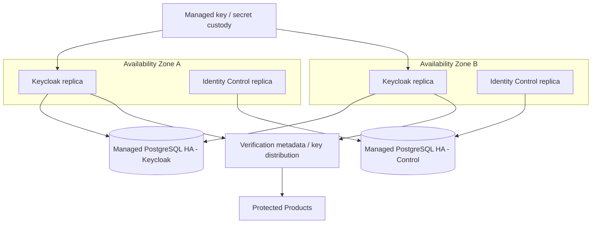

Key/recovery invariants:

- database failover does not create a new issuer identity;
- signing-key continuity survives process, node, and declared AZ failure;
- previous verification keys remain available for the lifetime of all still-valid artifacts they signed plus cache/clock-skew margin;
- recovery documentation explicitly distinguishes existing-token verification, new login, refresh, containment, and administration availability;
- a C0 runtime claim is not made until restore, failover, key rotation, and key-recovery exercises provide measured evidence.

Multi-region active-active remains a future architecture decision.

### 8.8 Blast Radius

| Failure                     | Blast Radius                                                | Containment                                                         |
| :-------------------------- | :---------------------------------------------------------- | :------------------------------------------------------------------ |
| One Keycloak replica        | Reduced authentication capacity                             | Remove replica and continue cluster service                         |
| Keycloak cluster            | New login, token, refresh, federation                       | Existing valid tokens remain locally verifiable                     |
| Keycloak database           | Identity issuance and administration                        | Fail unsafe mutations closed; restore/failover database             |
| Control Service             | New provisioning, drift repair, canonical event translation | Keycloak login continues; freeze unmanaged changes                  |
| Control database            | Control/reconciliation and migration                        | Keycloak login continues; restore control state/outbox              |
| External IdP                | One federation provider/journey                             | Isolate provider; local and other providers continue                |
| Signing key                 | Issuance or verification trust                              | activate incident key procedure; preserve valid verification window |
| Membership projection stale | Context-specific access                                     | apply consumer freshness policy and high-risk fail-closed behavior  |
| Consumer revocation lag     | Context/connection-specific access                          | alert against profile ceiling; expire/revalidate/contain            |

## 9. Deployment Strategy

### 9.1 Environment

- local development;
- integration/conformance;
- staging with production-like topology;
- production;
- migration rehearsal environment.

Production identity data is not copied into lower environments without approved anonymization or synthetic replacement.

### 9.2 Infrastructure

Initial production profile:

- one supported Keycloak cluster across multiple availability zones;
- at least two runtime replicas after capacity validation;
- managed PostgreSQL with high availability and point-in-time recovery;
- multiple Go Control Service replicas;
- managed ingress/load balancer;
- approved secret/key management;
- event broker and observability integration;
- no external Infinispan cross-site cluster in the initial phase;
- no preview stateless/multi-cluster mode.

### 9.3 CI/CD

The pipeline must:

1. build and test the Go Control Service and any approved extension;
2. scan source, dependencies, container images, and secrets;
3. validate Keycloak configuration desired state;
4. run protocol and integration conformance tests;
5. run federation-linking negative tests proving mutable attribute equality cannot auto-link an existing Principal;
6. run delegation narrowing/attribution tests;
7. run Membership/context revocation propagation and stale-token rejection tests;
8. run long-lived connection revocation contract tests against representative consumers before claiming the bounded profile;
9. run migration and rollback tests;
10. run cross-Tenant and privilege regression tests;
11. pin and sign deployment artifacts;
12. promote the same artifacts through environments;
13. rehearse database migration, backup restore, signing-key rotation, and verification-key continuity for upgrades;
14. block unsupported extension or preview-feature activation.

### 9.4 Upgrade Strategy

- version selection is managed by the technology lifecycle and pinned by artifact digest;
- upgrades are rehearsed against production-like data shape and extensions;
- compatibility tests cover realm configuration, Admin API use, themes, event adapter, clients, sessions, token/verification profiles, federation links, delegation semantics, and rollback;
- unmanaged console drift is detected before upgrade;
- rollback boundaries are explicit because database migrations may constrain downgrade;
- security releases may use an accelerated path with the same minimum safety evidence.

## 10. Architecture Decisions

### Governing

- ADR-IAM-001 — adopt Keycloak as identity protocol and authentication kernel.
- ADR for Realm/issuer strategy — required before production approval.
- ADR for signing-key custody — required before production approval.
- ADR for Membership projection representation — required after fit-gap PoC.
- ADR for legacy Principal ID migration — required before cutover.
- ADR for any restricted Keycloak SPI — required before implementation.
- Consumer Verification Profiles, context-revocation propagation, federation-linking safety, and bounded delegation SHALL remain stable architecture contracts independent of the kernel implementation.

### Rejected

- full custom Go OAuth/OIDC/session/credential engine;
- Keycloak as canonical Tenant/Membership/Entitlement/Product authorization authority;
- Realm per Tenant by default;
- direct Keycloak database integration;
- permanent Keycloak core fork;
- universal synchronous introspection on every Product request;
- automatic existing-account linking solely from email/phone/display-name equality;
- human session credential reuse by Workers/Agents as delegation;
- preview multi-cluster/stateless mode for the initial production baseline.

## 11. Compatibility Strategy

- consumers integrate through standards and Scnehaux token/Consumer Verification Profiles, not Keycloak internal APIs;
- Scnehaux identifiers remain stable across migration;
- canonical events hide Keycloak event representation;
- account-linking semantics preserve issuer-plus-subject identity across provider upgrades;
- delegated execution preserves source/direct-actor attribution across runtime implementations;
- Admin integrations use the Control Service where enterprise governance is required;
- extensions are minimized to reduce upgrade coupling;
- token/profile changes use versioned compatibility windows.

## 12. Migration Strategy

1. contain and patch critical legacy Go IAM risks;
2. inventory Principals, credentials, clients, sessions, Tenant assumptions, federation links, and consumers;
3. establish Keycloak target Realm, identifiers, clients, key strategy, and Consumer Verification Profiles;
4. create repeatable migration tooling and reconciliation reports;
5. migrate non-secret identity metadata and clients in dry runs;
6. choose credential migration strategy: verified import where compatible, first-login migration, or forced reset according to security evidence;
7. migrate federation links using issuer-plus-subject identity and collision review rather than mutable-attribute auto-link;
8. dual-run selected consumers with explicit issuer/audience separation and measured context-revocation behavior;
9. migrate Applications in bounded waves;
10. monitor authentication, session, support, authorization, projection, and revocation errors;
11. execute cutover with rollback gate;
12. freeze and retire legacy protocol endpoints after residual consumer count reaches zero;
13. supersede incompatible legacy ADRs and archive runtime infrastructure.

## 13. Alternatives

- managed proprietary identity SaaS;
- ZITADEL kernel;
- continued custom Go engine;
- Keycloak with full Tenant/role authority;
- single-node Keycloak for production.

The selected system architecture follows ADR-IAM-001 and retains alternatives as future replacement candidates if measured evidence invalidates the current decision.
