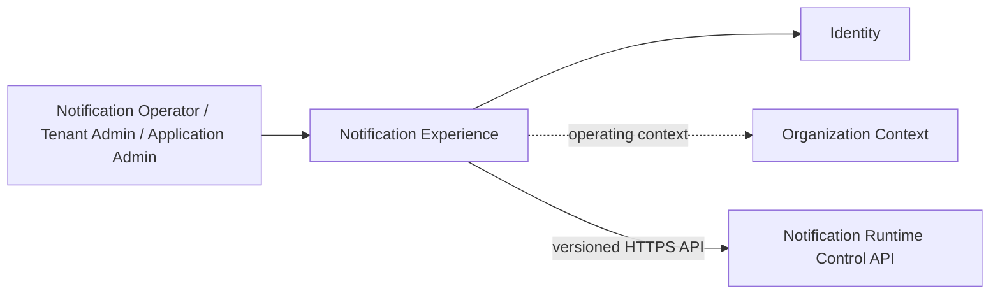
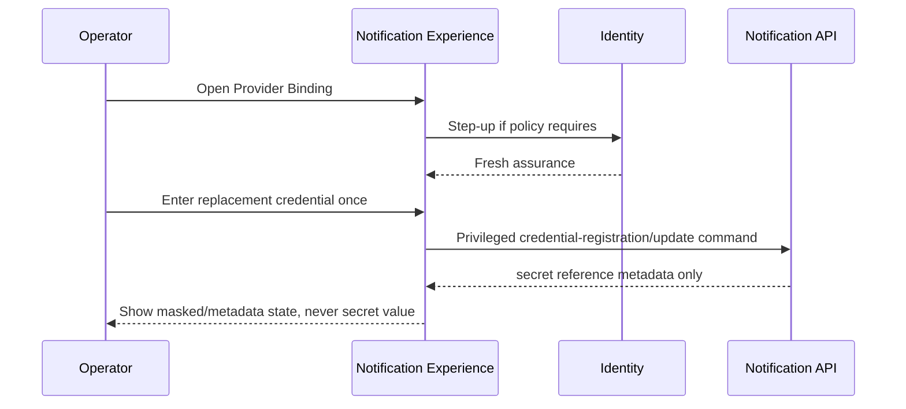

---
doc_meta:
  id: SAD-015
  title: Scnehaux Notification Experience
  owner: Notification Platform Team
  version: 1.0.0
  status: draft
  classification: restricted
  governed_by:
    - GDC-009
  parent_pad: PAD-PLT-005
  review_cycle_days: 90
  created_date: 2026-08-22
  last_reviewed: 2026-08-22
  technologies:
    - name: react
      type: frontend-framework
    - name: kubernetes
      type: orchestration
    - name: opentelemetry
      type: observability
---

# Scnehaux Notification Experience

## 1. Purpose & Scope

### 1.1 Objective

Provide a fully Scnehaux-owned administration and operations experience for templates, channel/sender profiles, provider bindings, test sends, Notification/Delivery history, retry/reconciliation, quota, and provider health without exposing provider secrets or third-party provider/task-queue dashboards.

### 1.2 Capability

The application provides:

- Template Family / Version / Channel Variant administration
- template data-schema editor/validation/preview
- Email/WhatsApp/SMS/Push/Webhook Channel Profile administration as channels are enabled
- sender identity and Provider Binding administration through secret-reference workflows
- test-send with explicit Tenant/application context and privileged confirmation
- Notification and Delivery search/detail/timeline
- provider acceptance, receipt, retry, failure, and unknown-outcome visibility
- reconciliation/replay operations
- Tenant/application/channel/provider quota and usage visibility
- provider/channel health and backlog dashboards
- audit/evidence correlation

### 1.3 Requirement

The browser uses only governed Notification Control APIs. Provider secret values never return to the browser after registration, and user interface visibility never substitutes for server authorization.

### 1.4 Constraint

- React is the frontend framework
- the adopted SPA build toolchain is used for this internal operational application
- Scnehaux UI Platform packages provide design-system and accessibility foundations
- the browser does not read Notification PostgreSQL, Kafka topics, provider admin consoles, or Scheduler internals directly
- no third-party Notification/queue dashboard is embedded as the supported product UI
- long-lived bearer credentials are not stored in browser local storage

### 1.5 Assumption

- SAD-005 exposes versioned control/query APIs
- Identity supports login and step-up
- Organization provides Tenant/operating context
- UI Platform packages are available

### 1.6 Out of Scope

- provider delivery execution
- template rendering runtime
- Gmail/mailbox ingestion
- Product recipient eligibility
- Scheduler administration
- raw secret management console
- provider vendor-console replacement

## 2. Enterprise Traceability

### 2.1 Realizes

This system realizes the administration/operations experience of PAD-PLT-005. Notification authority remains in SAD-005 and provider credential custody remains in Trust Services.

## 3. Solution Context

### 3.1 System Context



### 3.2 External

No browser-to-provider, browser-to-Kafka, or browser-to-database connection exists. Provider configuration and secret-reference operations are mediated by the Notification Control API.

### 3.3 Internal

Feature modules are organized by Notification concepts rather than provider/vendor console structure:

- Template Management
- Channel/Sender Profiles
- Provider Binding
- Notification/Delivery Explorer
- Reconciliation Operations
- Quota/Usage
- Provider/Channel Health
- Audit Correlation

## 4. Architecture Model

### 4.1 Container

One independently deployable internal React SPA using Scnehaux UI Platform packages and the enterprise web delivery path.

### 4.2 Component

```text
app-shell
  -> template-management
  -> channel-profile-management
  -> delivery-explorer
  -> reconciliation-operations
  -> quota-usage
  -> provider-health

feature modules -> notification-api client
feature modules -> scnehaux-ui-platform packages
```

### 4.3 Runtime Flow — Provider Binding Secret Update



A secret value is write-only from the browser perspective.

## 5. State & Data Architecture

### 5.1 Storage

The frontend owns no Notification-authoritative storage. Browser state contains only ephemeral editing/query state.

### 5.2 Cache

Query caching is bounded and refetched after mutations. Sensitive fields and credential input are excluded from persisted client caches.

### 5.3 Schema

Frontend API models are derived from the governed Notification contract. Template data schemas are server-owned/versioned assets edited through the API, not browser-local truth.

### 5.4 Stateless Client

Reload reconstructs durable state from SAD-005. Unsaved secret entry is intentionally lost rather than persisted.

## 6. Integration Contracts

### 6.1 API

The SPA consumes Notification APIs for templates, channel profiles, provider binding, Notification/Delivery history, test send, reconciliation, quotas, and operational views.

### 6.2 Events

Kafka is never exposed to the browser. Near-real-time status updates are delivered through a Notification-owned web API projection/stream contract when required.

### 6.3 Consumed

- Identity authentication/step-up
- Organization operating context
- Notification Control API
- Scnehaux UI Platform packages at build time

## 7. Security & Trust Boundary

### 7.1 Authentication

The enterprise browser OIDC/session pattern is used.

### 7.2 Authorization

Server-side Notification authorization controls every mutation and privileged operation. UI role/visibility state is presentation only.

### 7.3 Encryption

Enterprise TLS policy protects all runtime connections.

### 7.4 Secrets

Provider secrets are write-only from the browser perspective. They are never rendered after registration, stored in local/session storage, exposed in query caches, or emitted to client telemetry.

### 7.5 Audit

Template publication, provider/channel config, test-send, replay/reconciliation, and cross-Tenant operations capture explicit scope/reason and expose evidence correlation.

## 8. NFR

### 8.1 Blast Radius

An Experience outage prevents human administration/inspection but does not stop SAD-005 from accepting or delivering existing Notifications.

### 8.2 Latency, Scalability, and Usability

- routine interactive control queries target p95 <=500 ms excluding long aggregation views
- pagination/filtering prevents unbounded Delivery-history loading
- large timeline/table views use bounded windows/virtualization
- Tenant and Application context remain visible during privileged operations
- provider acceptance and final delivery are visually distinct states

### 8.3 Observability and Telemetry

Frontend telemetry correlates user actions with Notification API traces without collecting recipient payloads, template secrets, or credentials.

### 8.4 Accessibility

Scnehaux UI Platform accessibility standards apply, including keyboard operation, focus management, semantic status feedback, and WCAG 2.2 AA target where governed by the UI Platform.

### 8.5 Runbook

Runbooks cover API degradation, stale client data, authentication/session failures, partial provider-health query failures, frontend rollback, and accidental exposure prevention checks.

## 9. Deployment Strategy

### 9.1 Environment

Immutable frontend artifacts are promoted between governed environments. Environment configuration contains public endpoints/settings only.

### 9.2 Infrastructure

The internal React SPA uses the adopted enterprise SPA build toolchain and standard web/container delivery path. No provider/task-queue dashboard runtime is deployed as part of the Scnehaux Notification product.

### 9.3 CI/CD

Blocking gates include:

- lint/type/build tests
- UI Platform contract/accessibility tests
- Notification API contract compatibility
- authorization-negative-path E2E tests
- Tenant-context isolation tests
- secret input/non-persistence tests
- browser telemetry privacy tests
- dependency/secret scanning
- bundle/performance budgets
- architecture governance lint

## 10. Architecture Decisions

### 10.1 Accepted

- custom Scnehaux Notification UI
- Notification Control API as the only Notification runtime boundary exposed to the browser
- write-only provider-secret registration experience

### 10.2 Rejected

#### 10.2.1 Third-Party Queue/Provider Dashboard as Notification UI

Rejected because it couples product experience, Tenant semantics, authorization, and operational lifecycle to replaceable internal/provider technology.

#### 10.2.2 Browser Direct Provider Administration

Rejected because it exposes vendor credentials and bypasses Notification authorization, evidence, and normalized provider semantics.

#### 10.2.3 Browser Read Access to Stored Provider Secrets

Rejected because credential disclosure is unnecessary for administration and violates the Trust boundary.

## 11. Assumptions

- operators use enterprise Identity/Organization context
- initial screens prioritize Email and WhatsApp operational needs from real consumers

## 12. Compatibility Strategy

The UI is coupled to versioned Notification APIs, not provider SDKs, database layout, Kafka topics, or Scheduler internals. Provider or internal runtime replacement does not require UX redesign when contracts remain compatible.
