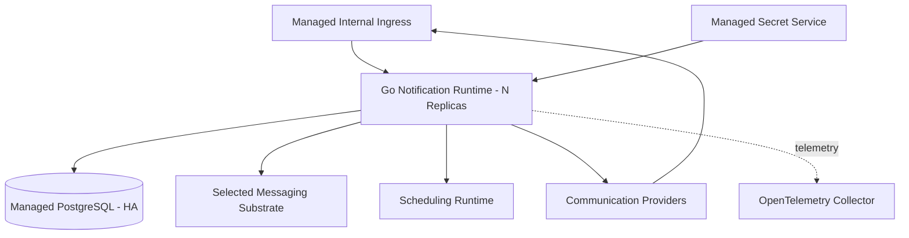
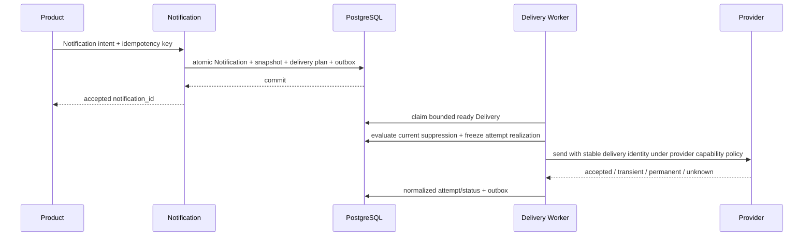
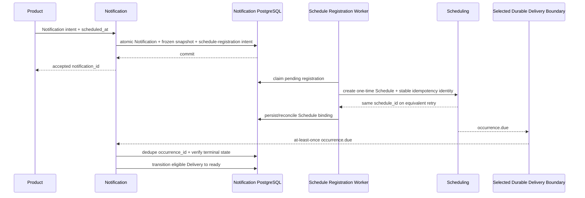
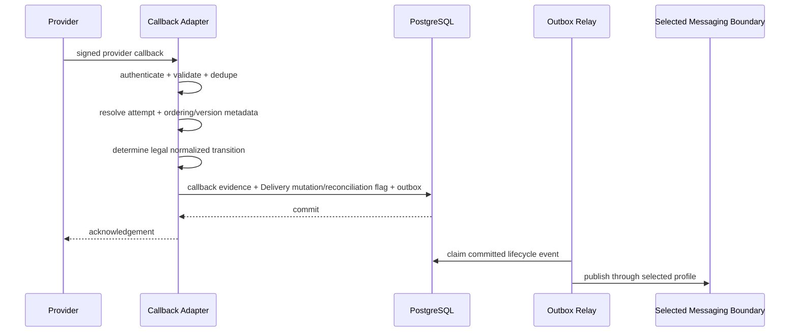
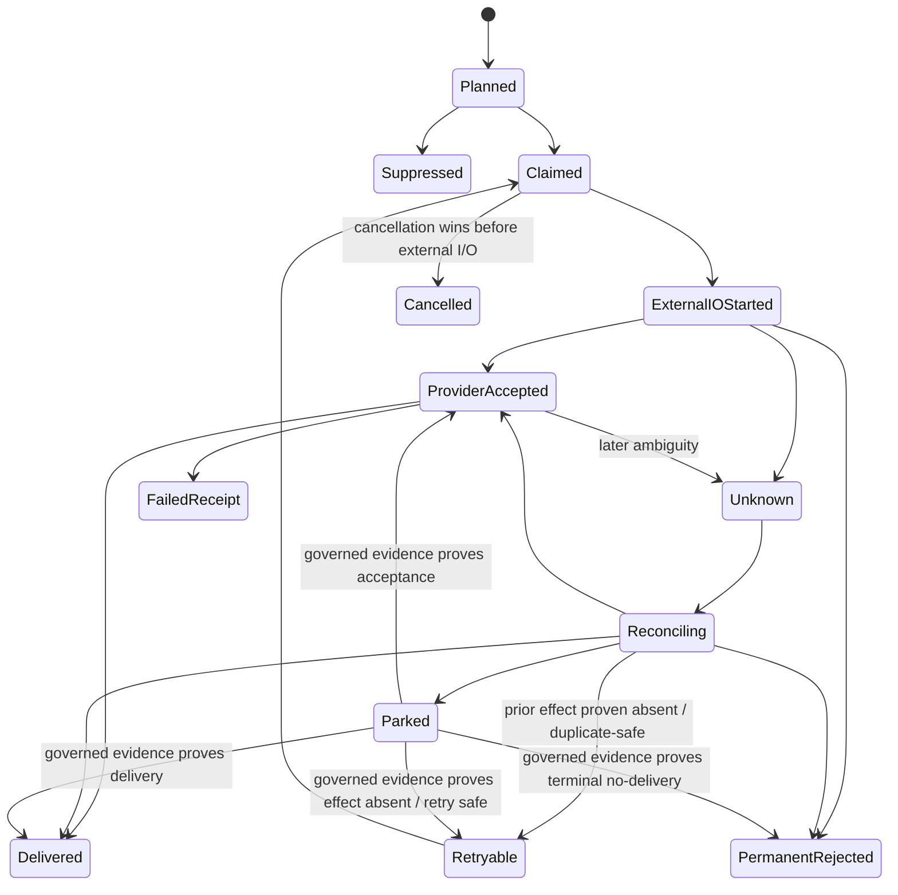
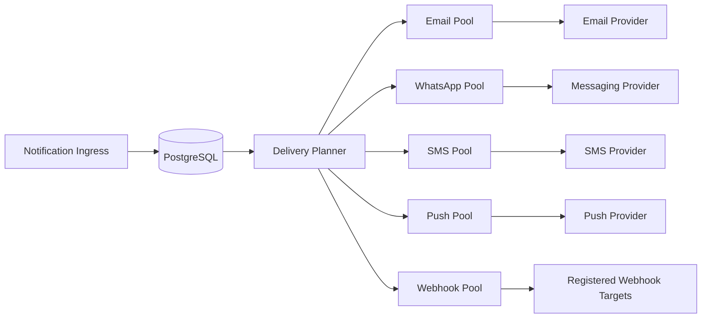

---
doc_meta:
  id: SAD-005
  title: Scnehaux Notification Runtime
  owner: Notification Platform Team
  version: 2.2.1
  status: approved
  classification: restricted
  governed_by:
    - GDC-009
    - ADR-GLB-016
    - ADR-GLB-017
  parent_pad: PAD-PLT-005
  review_cycle_days: 90
  created_date: 2026-07-06
  last_reviewed: 2026-09-10
  technologies:
    - name: golang
      type: backend-language
    - name: postgresql
      type: database
    - name: rabbitmq
      type: queue-broker-profile
    - name: kafka
      type: stream-broker-profile
    - name: kubernetes
      type: orchestration
    - name: opentelemetry
      type: observability
---

# Scnehaux Notification Runtime

## 1. Purpose & Scope

### 1.1 Objective

Realize PAD-PLT-005 as a multi-tenant asynchronous communication runtime that accepts authorized Notification intent, freezes bounded delivery state, renders governed channel variants, routes through authorized profiles, executes provider delivery with duplicate protection, and records normalized outcomes without absorbing Product business meaning.

Notification messaging contracts are transport-neutral. RabbitMQ is the default queue deployment profile, Kafka is the supported stream profile, and bounded direct durable acceptance is available where a broker is not justified.

### 1.2 Capability

The deployable provides:

- Notification command/API ingress
- immutable Recipient Snapshot
- Template Family, Version, Channel Variant, and data-schema management
- Channel/Sender Profile and Provider Binding management
- Application Notification Profile management
- Provider Capability declaration and validation
- Email, WhatsApp/messaging, SMS, Push, and governed Webhook adapter model
- Scheduling registration intent, idempotent Schedule creation, binding reconciliation, asynchronous cancellation
- delivery planning and channel/provider Worker pools
- provider callback/receipt ingestion with ordering/dedup protection
- retry/permanent/unknown/parked outcome classification
- delivery-status publication through selected messaging profile
- Scheduling trigger consumption through selected messaging profile
- provider reconciliation
- communication suppression evaluation
- operational/admin query surfaces

Email and WhatsApp remain initial priority channels.

### 1.3 Requirement

The runtime remains correct under:

- duplicate Notification commands
- process restart
- provider timeout with unknown outcome
- duplicate, delayed, and out-of-order provider callbacks
- contradictory provider receipts
- provider outage
- future-trigger duplicates
- Scheduling create timeout/process loss/binding ambiguity
- template/provider configuration rotation before frozen delivery
- suppression changes after Notification acceptance but before provider execution
- cancellation races
- selected messaging-substrate outage
- Direct-profile ambiguous acceptance
- noisy-neighbor Tenant/provider load
- one provider/channel pool saturation while unrelated channels remain healthy

### 1.4 Constraint

- Go is the application runtime
- PostgreSQL is the private authoritative Notification store
- source state mutation plus external publication intent uses source-local Transactional Outbox
- lifecycle publication and Scheduling trigger consumption use STD-GLB-004 delivery profiles
- default Scnehaux deployment uses RabbitMQ Queue profile
- Kafka is supported when retained Stream semantics are justified
- Direct Durable Delivery is permitted only through governed idempotent durable-acceptance APIs
- one logical message contract has one primary delivery path per environment
- provider delivery Workers are internal Notification execution and are not replaced by RabbitMQ/Kafka merely for uniformity
- Kubernetes is the deployment substrate
- OpenTelemetry is the instrumentation contract
- provider delivery never runs inside a Product caller's transaction/request path
- generic durable timing is delegated to PAD-PLT-011
- provider credentials remain in Trust/Secret Services
- provider-specific SDK/model types terminate at adapters
- Integration Enablement is optional reusable machinery, not mandatory hop
- no Product operational database is read directly
- no shared operational database exists with consumer Products

### 1.5 Assumptions

- Scheduling provides durable future wake-up for frozen future delivery
- Scheduling exposes the same logical `OccurrenceDue` contract independent of transport
- Identity/Organization/Application Trust provide caller and ownership context
- secret management resolves provider credentials only to Notification runtime
- providers expose channel-appropriate transport/callback capability
- Provider Capability declarations reflect evidence from the actual provider contract rather than desired behavior
- Direct-profile acceptance persists/deduplicates before successful response

### 1.6 Out of Scope

- Gmail/mailbox ingestion/polling
- Mailcast travel/PNR logic
- ATI PH public-holiday policy
- Product business eligibility
- Workflow orchestration
- generic scheduling
- secret custody
- universal messaging-broker ownership
- third-party provider/broker admin dashboard as Scnehaux Product UI

## 2. Enterprise Traceability

| Relationship | Target                                                                    |
| :----------- | :------------------------------------------------------------------------ |
| Realizes     | PAD-PLT-005 Enterprise Notification Platform                              |
| Consumes     | PAD-PLT-011 Scheduling for frozen future delivery                         |
| Consumes     | Document Platform for immutable attachment references                     |
| Consumes     | Identity/Organization/Application Trust                                   |
| Consumes     | Trust Services for provider credential material                           |
| Conforms to  | ADR-GLB-016 Transactional Publication and Durable Messaging Profiles      |
| Conforms to  | ADR-GLB-017 Enterprise Durable Scheduling Boundary with Profiled Dispatch |
| Conforms to  | STD-GLB-002 Database Standard                                             |
| Conforms to  | STD-GLB-003 Observability Standard                                        |
| Conforms to  | STD-GLB-004 Event-Driven Architecture & Messaging Standard                |
| Conforms to  | STD-GLB-005 Resilience Standard                                           |
| Conforms to  | STD-GLB-010 Durable Scheduled Work Standard                               |

## 3. Solution Context

### 3.1 System Context

```mermaid
graph LR
    PRODUCT[Product / Platform]
    UI[Notification Experience]
    NOTIF[Notification Runtime]
    DB[(Notification PostgreSQL)]
    MSG[Selected Messaging Boundary]
    SCHED[Scheduling Platform]
    DOC[Document Platform]
    TRUST[Trust / Secret Services]
    PROVIDER[Communication Provider]
    CALLBACK[Provider Callback]

    PRODUCT -->|Notification command| NOTIF
    UI -->|Control API| NOTIF
    NOTIF --> DB
    NOTIF -. lifecycle contracts .-> MSG
    NOTIF -->|frozen future wake-up| SCHED
    SCHED -. occurrence.due through selected profile .-> NOTIF
    NOTIF -->|immutable attachment version| DOC
    TRUST -->|credential resolution| NOTIF
    NOTIF --> PROVIDER
    CALLBACK --> NOTIF
```

RabbitMQ/Kafka are transport dependencies only when their deployment profile is selected.

### 3.2 External

Communication providers are external transport/delivery authorities.

Provider authentication, request format, acceptance, receipt, error, rate-limit, callback, ordering, idempotency, and reconciliation semantics terminate in provider adapters.

Scheduling remains the temporal authority and does not become Notification delivery authority.

### 3.3 Internal Modules

1. Notification Ingress
2. Notification Aggregate & Idempotency
3. Template & Data Schema
4. Recipient Snapshot
5. Channel/Sender Profile
6. Application Notification Profile
7. Provider Binding & Secret Reference
8. Provider Capability Registry
9. Scheduling Registration, Binding & Reconciliation
10. Scheduling Trigger Acceptance / Consumer
11. Delivery Planning
12. Communication Suppression Evaluation
13. Channel Dispatch Workers
14. Provider Adapters
15. Callback/Receipt Authentication, Dedup & Normalization
16. Retry & Unknown-Outcome Reconciliation
17. Webhook Egress Security
18. Outbox Relay
19. Messaging Port & Direct/RabbitMQ/Kafka Adapters
20. Operations/Admin Query

Channel/provider Worker pools share one deployable initially with independent concurrency, queues/claim budgets, circuit breakers, and bulkheads.

## 4. Architecture Model

### 4.1 Container



For Direct profile, Scheduling/lifecycle delivery terminates at a governed Notification durable-acceptance API and no broker is present for that relationship.

Provider callbacks enter a dedicated authenticated route.

### 4.2 Component

```text
adapter/http             -> app/notification -> domain/notification
adapter/messaging/http   -> app/trigger      -> domain/notification
adapter/messaging/rmq    -> app/trigger      -> domain/notification
adapter/messaging/kafka  -> app/trigger      -> domain/notification
adapter/scheduling       -> app ports
adapter/provider/*       -> app/delivery     -> domain/delivery
adapter/secrets          -> app ports
adapter/db               -> app ports
outbox-relay             -> app/publish      -> app/ports/messaging
```

Provider/broker SDK types do not enter domain packages.

### 4.3 Immediate Notification



RabbitMQ/Kafka are not required for the internal provider Worker just because provider delivery is asynchronous. PostgreSQL-backed ready Delivery state remains authoritative.

### 4.4 Frozen Scheduled Notification



No transaction spans Notification and Scheduling.

If Schedule creation succeeds but response/binding persistence is lost, retry/reconciliation uses the same registration identity.

Frozen communication semantics include:

- recipient snapshot
- immutable template/content version and data
- selected channel
- required logical sender identity
- immutable attachment versions
- business correlation

Operational provider route, current credential/secret version, endpoint, failover route, and rate-limit state are late-bound unless explicitly version-pinned. Once a provider attempt starts, its selected provider, binding/routing version, endpoint identity, and non-secret credential-reference version are frozen as attempt evidence so later configuration rotation cannot rewrite history.

### 4.5 Scheduling Trigger Delivery by Profile

The logical effect is identical across profiles.

**Direct**

```text
Scheduling Outbox Relay
  -> Notification Trigger Acceptance API
      -> atomic occurrence dedup + Delivery-ready transition
```

The API returns success only after durable idempotent acceptance.

**RabbitMQ**

```text
Scheduling
  -> Rabbit exchange
      -> Notification durable/quorum queue
          -> Notification consumer
              -> atomic occurrence dedup + Delivery-ready transition
              -> ACK
```

**Kafka**

```text
Scheduling
  -> occurrence topic
      -> Notification consumer group
          -> atomic occurrence dedup + Delivery-ready transition
          -> commit/advance according to consumer durability policy
```

The UI/business semantics never expose which profile delivered the Occurrence.

### 4.6 Cancellation Race

Notification cancellation commits terminal Notification/Delivery state first and emits evidence/outbox facts.

Cancellation of the bound Schedule is retried asynchronously.

If Scheduling already durably dispatched the Occurrence, Notification consumes/deduplicates it as a no-op when terminally cancelled.

A due Occurrence never resurrects a cancelled Notification.

If cancellation commits before a provider attempt is durably claimed/started, that attempt must not begin. If an external provider call has already begun, local cancellation prevents new attempts but does not claim that the external effect was retracted unless the provider contract explicitly supports and confirms retraction.

### 4.7 Deferred Notification Command

```mermaid
sequenceDiagram
    participant P as Product
    participant S as Scheduling
    participant M as Selected Durable Delivery Boundary
    participant N as Notification
    participant D as Notification PostgreSQL

    P->>S: target=Notification + bounded deferred command
    S-->>M: occurrence.due
    M-->>N: registered deferred Notification command
    N->>N: validate application/Tenant/channel
    N->>N: resolve Notification-owned profile
    N->>D: create Notification + snapshot + Delivery plan + outbox
    D-->>N: commit
```



Provider credentials never transit Scheduling.

When recipient/content/business eligibility requires current Product truth, Scheduling targets the Product Worker instead.

### 4.8 Application Notification Profile Administration


Normal delivery uses Notification-local validated profile state.

### 4.9 Provider Callback Resolution



The callback-resolution contract is:

1. authenticate the callback;
2. deduplicate provider event identity;
3. resolve the provider attempt/Delivery;
4. record provider event time/version/sequence when available and local receive time independently;
5. preserve normalized callback evidence;
6. apply only a legal lifecycle transition;
7. prevent a stale callback from blindly regressing normalized Delivery state;
8. route contradictory or ambiguous callback histories to reconciliation rather than last-write-wins;
9. emit lifecycle publication only after the local transaction commits.

A stronger authoritative final receipt may advance a weaker intermediate state while all prior provider facts remain preserved.

### 4.10 Delivery Attempt State Machine



Runtime invariants:

- `SUPPRESSED` is terminal for the planned external attempt and records the suppression basis used;
- `PROVIDER_ACCEPTED` is not equivalent to final `DELIVERED`;
- `UNKNOWN` means the external side effect may have occurred and is not a transient-failure synonym;
- automatic retry from `UNKNOWN` is allowed only when the provider operation is provably idempotent under the same delivery identity or reconciliation proves the previous effect absent;
- provider failover while the previous provider outcome remains `UNKNOWN` is prohibited;
- non-reconcilable ambiguity is parked and excluded from automatic retry/failover; only an attributable governed resolution with evidence may reopen it or advance it to a proven normalized state;
- callback/reconciliation may advance normalized state but never rewrites prior attempt evidence.

Exact enums, transition guards, lease/claim fields, retry budgets, and provider schemas belong in TDD.

### 4.11 Governed Webhook Delivery Boundary

Webhook is an outbound communication channel, not a general-purpose arbitrary HTTP client. Production webhook targets are registered/configured under Notification authority rather than supplied as free-form per-send destinations.

The webhook adapter enforces SSRF-resistant egress controls including DNS/address validation before connect, rebinding-safe resolution/connect policy, denial of private/loopback/link-local/metadata destinations unless an explicitly governed internal-target class exists, bounded redirect policy with revalidation on every hop, TLS hostname/certificate verification, bounded request/response size, bounded timeout, and no credential material in caller-controlled URLs.

### 4.12 Provider / Channel Bulkhead Topology



Each channel/provider/Tenant class has bounded claim and external-call concurrency. Provider-specific circuit breakers, rate-limit admission, and retry backlog cannot consume unbounded resources from unrelated pools. A provider outage reduces the affected route/channel capacity without turning the whole Notification runtime into one shared blocking worker pool.

## 5. State & Data Architecture

### 5.1 Storage

One private PostgreSQL database is authoritative for Notification runtime state.

Logical state families:

- Notification
- Recipient Snapshot
- Delivery / Delivery Attempt
- immutable per-attempt non-secret operational realization evidence
- Provider Capability declarations
- provider callback event identity, ordering/version evidence, and deduplication
- unknown-outcome reconciliation/parking metadata
- communication suppression facts/decision evidence within Notification scope
- Template Family / Version / Channel Variant / Data Schema
- Channel/Sender Profile
- Application Notification Profile
- Provider Binding with secret reference only
- bounded preference metadata within Notification scope
- Scheduling registration intent/generation/idempotency/binding/reconciliation
- Scheduling occurrence Inbox/dedup state
- transport-neutral outbox publication state

Exact DDL, queue/topic naming, adapter config, indexes, and retention partitions belong in TDDs.

### 5.2 Schema

- Atlas declarative lifecycle
- migration role separate from runtime role
- UUIDv7 durable identifiers
- Tenant-scoped data uses enterprise RLS where applicable
- PII excluded/redacted from telemetry
- immutable Template Version and Recipient Snapshot invariants
- Schedule registration state prevents one generation from binding to multiple logical Schedules
- occurrence dedup state prevents duplicate future triggers from creating duplicate Delivery effect
- attempt operational-realization evidence is immutable after the external provider call begins
- Provider Capability version used for an attempt is reconstructable
- callback dedup/ordering evidence prevents blind last-write-wins normalization
- unknown provider outcome cannot transition to a new provider attempt without a duplicate-safety/reconciliation guard
- current suppression decision is persisted with the attempt plan/evidence used to allow or block provider execution

### 5.3 Cache

Immutable Template Versions and versioned routing/Provider Capability metadata may be cached with explicit freshness.

Cache is not authoritative for Delivery, idempotency, cancellation, occurrence dedup, provider callback dedup/ordering, or suppression decision state.

### 5.4 Stateless Compute

Accepted Notification/Delivery state survives process restart in PostgreSQL.

Worker replicas are interchangeable and claim bounded ready work from authoritative state.

## 6. Integration Contracts

### 6.1 API

Versioned APIs support:

- Notification accept/query/cancel
- scheduled registration/binding/reconciliation query
- template/schema administration and preview/test send
- Channel/Sender Profile and Provider Binding administration
- Provider Capability administration/validation
- Application Notification Profile administration
- Delivery query/reconciliation/parked ambiguity resolution
- provider callback
- Direct-profile Scheduling trigger durable acceptance when selected

API acceptance never means provider delivery success.

### 6.2 Published Events

CloudEvents families include:

```text
com.scnehaux.notification.accepted.v1
com.scnehaux.notification.scheduled.v1
com.scnehaux.notification.provider-accepted.v1
com.scnehaux.notification.delivered.v1
com.scnehaux.notification.failed.v1
com.scnehaux.notification.cancelled.v1
```

Event schema is transport-neutral. If a future public event is added for parked/reconciliation state, it requires a versioned consumer contract rather than leaking internal worker enums.

### 6.3 Consumed Contracts

- Scheduling idempotent Schedule create/cancel/query
- Scheduling `occurrence.due`
- Document immutable attachment references
- locally usable Identity/Organization/Application Trust
- Trust Services runtime secret material
- Product Notification commands/events
- selected STD-GLB-004 delivery profile

The runtime imports no Product internal model.

## 7. Security & Trust Boundary

### 7.1 Authentication

Workload/privileged tokens are locally validated for Notification audience.

Provider callbacks use provider-specific signature/authentication.

Broker/direct acceptance uses attributable workload identity.

### 7.2 Authorization

- templates/profiles/Notifications/Delivery administration are application/Tenant scoped
- normal delivery uses Notification-local validated bindings
- provider configuration, capability mutation, test send, replay/reconciliation, parked ambiguity resolution, and cross-Tenant operations are privileged
- recipient endpoint never proves Tenant/application authority
- Product recipient/content input is accepted only under authorized Notification contract
- Direct Scheduling trigger endpoint accepts only registered Scheduling workload/contract context

### 7.3 Encryption

TLS 1.3 in transit and enterprise-managed encryption at rest.

Governed webhook delivery uses a constrained egress path and target-registration policy. DNS/address classes, redirects, TLS identity, response limits, and destination changes are revalidated by the runtime rather than trusted from caller input.

Recipient endpoint PII follows classification and retention policy.

### 7.4 Secrets

Provider passwords, SMTP credentials, OAuth secrets, API keys, certificates, and private keys exist only in managed secret capability.

Notification stores secret references plus non-secret routing config.

Secrets never appear in event/queue/stream payloads, browser responses after registration, attempt evidence, or telemetry.

### 7.5 Audit

Template publication, provider/channel configuration, Provider Capability change, sender change, suppression decision, test send, cancellation, replay/reconciliation, parked ambiguity resolution, callback verification/ordering conflict, messaging-profile migration, and cross-Tenant operations produce evidence.

## 8. NFR

### 8.1 Blast Radius

Provider outage affects the relevant provider/channel bulkhead.

Notification outage delays accepted work but does not lose committed state.

Scheduling outage delays frozen future Notifications only.

Messaging-substrate outage delays trigger/lifecycle transport while local outbox/Notification state remains durable.

Direct target acceptance outage affects the relevant relationship only.

Callback outage leaves final provider state unresolved until reconciliation.

Target reliability remains C1:

- mature availability >=99.95%
- RTO <=1 hour
- RPO = 0 for committed Notification/Delivery/idempotency/outbox/callback-dedup/scheduling-registration state across process, node, and declared availability-zone failover in the production HA profile
- cross-region disaster-recovery RPO <=15 minutes for the initial regional profile unless a stronger Tenant/regulatory profile is declared

### 8.2 Latency, Throughput, and Scalability

- immediate accepted-to-ready internal SLO: 99.9% <=30 seconds excluding provider latency
- capacity certification: 10x forecast peak acceptance without internal SLO breach
- channel/provider/Tenant concurrency independently bounded
- callback/reconciliation/reporting workloads cannot starve ready Delivery/provider-attempt work
- large fan-out uses bounded asynchronous expansion
- provider rate-limit pressure feeds admission/backpressure
- messaging profiles are capacity-tested independently

### 8.3 Observability

Common:

- acceptance/ready latency
- ready Delivery backlog age by channel/provider/Tenant
- provider latency/error/rate-limit
- provider acceptance vs final delivery
- retry/permanent failure
- unknown/reconciliation/parked backlog and oldest unresolved age
- provider failover blocked-by-unknown count
- suppression decisions by communication class/reason
- callback verification/dedup/stale/conflict count
- pending Schedule registration/binding reconciliation
- cancelled late-occurrence no-op count
- Notification outbox oldest age
- messaging publication latency/error
- Tenant/application/channel/provider quota pressure
- per-bulkhead active/queued/denied work
- cost units

Profile-specific:

**Direct**

- trigger acceptance latency/error
- ambiguous timeout/reconciliation count

**RabbitMQ**

- queue depth/unacked/oldest age
- publisher confirm
- redelivery/DLQ

**Kafka**

- producer acknowledgement
- consumer lag
- partition skew
- retention/replay pressure

### 8.4 Retry, Timeout, Circuit Breaker, and Failover

- provider calls use channel/provider-specific timeout and bulkhead
- only transient provider classes are auto-retried
- unknown provider outcome is reconciled before harmful duplicate send
- a provider operation with UNKNOWN outcome is never failed over to another provider until absence/duplicate-safety is proven or an explicitly evidenced resolution policy permits it
- non-reconcilable UNKNOWN outcomes are parked; they are not silently converted to transient failure
- stale/out-of-order callbacks never use blind last-write-wins normalized state mutation
- consumer/message processing follows STD-GLB-004 idempotency/failure parking
- Schedule registration/cancel calls retry with stable identities
- ambiguous Schedule create is reconciled before a new logical Schedule can exist
- Direct messaging timeout is treated as ambiguous and reconciled/retried with same identity
- Rabbit/Kafka delivery retries do not manufacture a new logical event/occurrence
- messaging transport retry never substitutes for provider business retry

### 8.5 Runbooks

Runbooks cover:

- provider outage
- credential rotation
- rate-limit exhaustion
- stuck Delivery backlog
- bulkhead saturation/noisy neighbor
- duplicate/stale/out-of-order callback
- contradictory callback history
- unknown/parked delivery outcome
- Scheduling outage
- Schedule binding reconciliation
- cancellation race/late occurrence
- selected messaging-substrate outage
- Direct ambiguous acceptance
- Rabbit queue/DLQ backlog
- Kafka lag/retention issue
- messaging profile migration
- rollback

## 9. Deployment Strategy

### 9.1 Messaging Profiles

| Profile          | Runtime dependencies                   | Intended use                                                                   |
| :--------------- | :------------------------------------- | :----------------------------------------------------------------------------- |
| `minimal-direct` | PostgreSQL + governed HTTPS acceptance | local/lab or bounded point-to-point Notification integration                   |
| `queue-rabbitmq` | PostgreSQL + RabbitMQ                  | **default Scnehaux deployment**                                                |
| `stream-kafka`   | PostgreSQL + Kafka                     | retained event-stream/replay exercises or workloads requiring stream semantics |

Notification provider Delivery Workers continue to use Notification-owned database state in all profiles.

### 9.2 Infrastructure

Common:

- OCI-compatible Go artifact
- Kubernetes across availability zones
- managed/HA PostgreSQL
- managed secret service
- OpenTelemetry
- independently bounded provider/channel Worker pools inside the deployable

Queue profile:

- RabbitMQ durable/quorum queues and publisher confirms

Stream profile:

- replicated Kafka topics and governed producer/consumer settings

Direct profile:

- authenticated TLS target/source
- durable Inbox/Operation acceptance

One logical message contract uses one primary profile per environment.

### 9.3 CI/CD

Blocking gates:

- Go format/static/build/race
- package boundaries
- Atlas/RLS
- template schema/sandbox/security
- provider adapter/callback authentication
- Provider Capability matrix validation and downgrade tests
- Delivery Attempt state-transition/property tests
- callback duplicate/out-of-order/stale/contradiction tests
- unknown-outcome transition and failover-block tests
- attempt-realization immutability and credential-reference rotation tests
- suppression race tests proving current policy is evaluated before not-yet-started provider execution
- governed-webhook SSRF/DNS-rebinding/redirect/private-address/TLS/size-limit negative tests
- event schema compatibility
- Notification/Delivery idempotency
- duplicate-send fault injection
- crash/fault around Notification acceptance and Scheduling binding
- Schedule registration/orphan reconciliation
- cancellation-race late-occurrence no-resurrection
- frozen-semantics vs late-bound provider config
- Direct idempotent trigger acceptance/lost response
- RabbitMQ publisher-confirm/redelivery/DLQ/node-loss
- Kafka producer/consumer/replay
- profile parity for `occurrence.due` and Notification lifecycle events
- dual-primary-profile rejection
- provider/channel/Tenant bulkhead and saturation-isolation tests
- retry/error classification
- secret/dependency scanning
- performance/backpressure
- architecture governance

## 10. Architecture Decisions

### 10.1 Accepted

- asynchronous provider delivery
- Product business intent/eligibility remains outside Notification
- direct external recipient endpoints may exist under bounded authorized contracts without Principal identity
- generic future scheduling is delegated to Scheduling
- communication provider relationships are Notification-owned
- Frozen Notification is default scheduled-communication mode
- local durable registration intent plus idempotent/reconcilable Schedule binding
- Notification terminal cancellation is final delivery gate
- frozen communication meaning with late-bound provider realization by default
- Application Notification Profile is Notification-owned while Tenant/application authority remains external
- source-local outbox is independent of messaging product
- queue-rabbitmq is default messaging deployment profile
- Kafka remains a supported stream profile
- Direct profile is permitted only through durable idempotent acceptance
- Provider Capabilities are explicit and UNKNOWN outcome blocks blind retry/failover
- callback arrival order is not trusted as event order without provider ordering evidence
- late-bound provider realization becomes immutable per Delivery Attempt once external execution starts
- current communication suppression is evaluated before not-yet-started provider execution according to communication class
- channel/provider/Tenant execution is bulkheaded to contain provider/noisy-neighbor failure
- webhook is a governed registered-target channel with SSRF-resistant egress controls

### 10.2 Rejected

#### 10.2.1 Synchronous Provider Send on Product Transaction Path

Rejected because provider latency/outage becomes Product latency/outage and ambiguous retries can duplicate external effects.

#### 10.2.2 Identity Principal Required for Every Recipient

Rejected because valid external recipients may have no Scnehaux account.

#### 10.2.3 Notification-Owned Product Eligibility

Rejected because Product authority can change independently.

#### 10.2.4 Plaintext Provider Credentials in Database or Browser

Rejected because credential custody belongs to Trust Services.

#### 10.2.5 Shared Operational Database with Consumers

Rejected because it creates dual authority/cross-domain coupling.

#### 10.2.6 Mandatory Integration-Platform Hop

Rejected because provider relationships remain with their natural owner unless shared machinery is justified.

#### 10.2.7 Universal Kafka Dependency

Rejected because queue/direct profiles can satisfy Notification messaging without retained-log infrastructure in every deployment.

#### 10.2.8 RabbitMQ + Kafka Dual Publish

Rejected because partial success creates duplicate/reconciliation ambiguity.

#### 10.2.9 Last-Write-Wins Provider Callback State

Rejected because callback arrival order is not reliable provider event order and can regress or fabricate Delivery state.

## 11. Assumptions

- Email and WhatsApp are first production channels
- providers differ in whether final delivery, ordering, reconciliation, and duplicate safety can be proven
- default Scnehaux deployment uses RabbitMQ for async messaging contracts
- Kafka is deployed when stream-profile learning/workload semantics justify it
- consumer migration removes legacy shared-Mongo Notification/template authority

## 12. Compatibility Strategy

API paths and logical message/event types are versioned.

Template versions/data schemas are immutable.

Provider adapter changes cannot alter normalized Delivery semantics without migration.

Provider Capability semantics, callback precedence, and normalized UNKNOWN/reconciliation behavior are versioned contracts. A provider replacement cannot weaken duplicate-safety, attempt evidence, suppression, callback integrity, or webhook egress guarantees without an explicit architecture migration.

Messaging adapter replacement preserves logical event/trigger identity and uses explicit migration/reconciliation instead of blind dual-publish.

## 13. Migration Strategy

### 13.1 Mailcast Client Solution

Move outbound WhatsApp/email delivery, Template lifecycle, provider/channel config, Provider Capability, and Delivery tracking into Notification.

Keep Gmail inbound polling, travel parsing, booking/passenger logic, and business eligibility in Mailcast.

Legacy Notification/template Mongo collections become migration sources, not shared runtime authority.

### 13.2 ATI PH

Move generic Email delivery, template/provider machinery, retry, callback normalization, and Delivery tracking into Notification.

ATI PH retains holiday rules, subscription/recipient eligibility, approvals, and Product business state.

ATI PH requests Notification only after current business state is validated.
