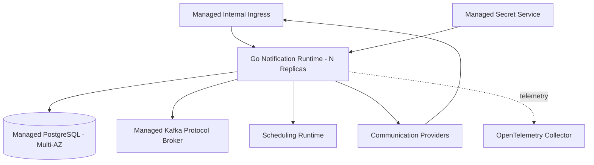
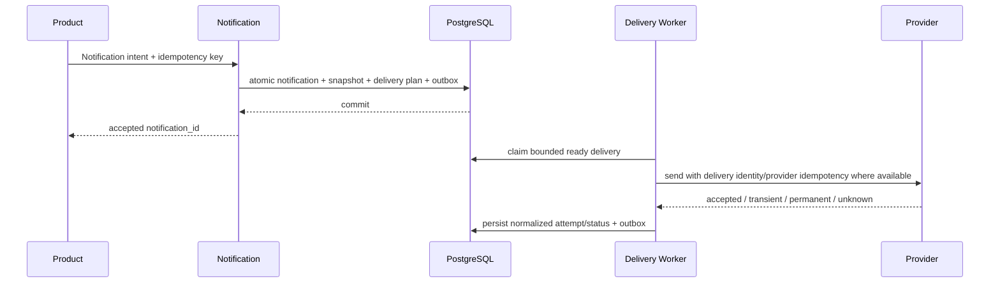
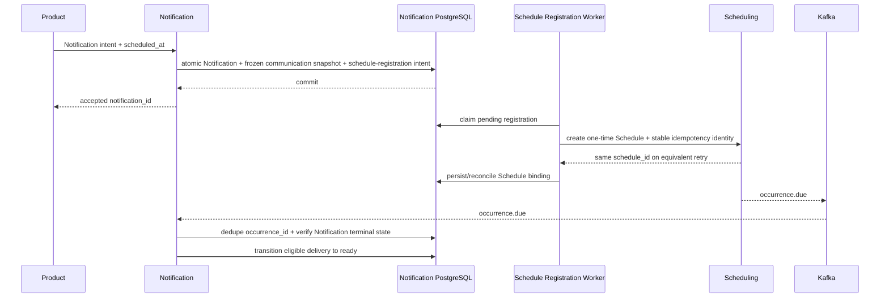
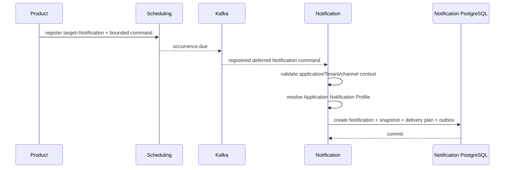
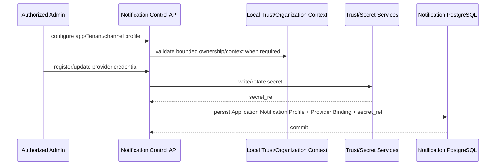
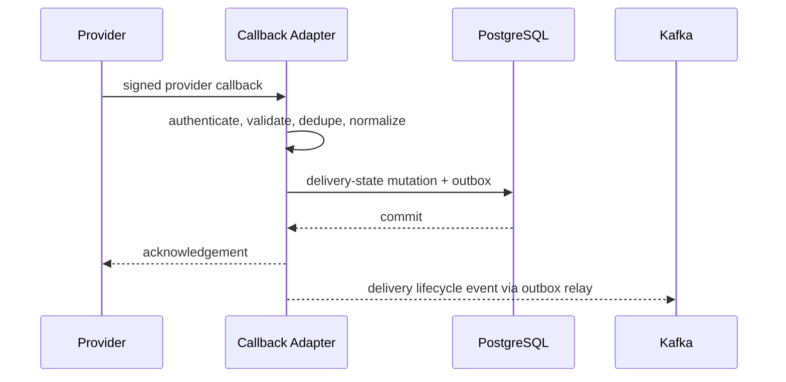

---
doc_meta:
  id: SAD-005
  title: Scnehaux Notification Runtime
  owner: Notification Platform Team
  version: 1.2.0
  status: approved
  classification: restricted
  governed_by:
    - GDC-009
  parent_pad: PAD-PLT-005
  review_cycle_days: 90
  created_date: 2026-07-06
  last_reviewed: 2026-08-24
  technologies:
    - name: golang
      type: backend-language
    - name: postgresql
      type: database
    - name: kafka
      type: event-broker
    - name: kubernetes
      type: orchestration
    - name: opentelemetry
      type: observability
---

# Scnehaux Notification Runtime

## 1. Purpose & Scope

### 1.1 Objective

Realize PAD-PLT-005 as a multi-tenant asynchronous communication runtime that accepts authorized Notification intent, freezes bounded delivery state, renders a governed channel variant, routes through an authorized Channel Profile, executes provider delivery with duplicate protection, and records normalized outcomes without absorbing Product business meaning.

### 1.2 Capability

The deployable provides:

- Notification command/API ingress
- immutable Recipient Snapshot
- Template Family, Version, Channel Variant, and data-schema management
- Channel/Sender Profile and Provider Binding management
- Application Notification Profile management and due-time profile resolution by application/Tenant/channel scope
- Email, WhatsApp/messaging, SMS, Push, and governed Webhook adapter model
- Scheduling adapter with durable registration intent, idempotent Schedule creation, binding reconciliation, and asynchronous cancellation for frozen future delivery
- delivery planning and channel-specific worker pools
- provider callback/receipt ingestion
- retry/permanent/unknown outcome classification
- delivery-status events and provider reconciliation
- operational/admin query surfaces

Initial implementation prioritizes Email and WhatsApp because they have immediate consumers. Additional channels reuse the same domain contract.

### 1.3 Requirement

The runtime must remain correct under duplicate Notification commands, process restart, provider timeout with unknown outcome, duplicate provider callback, provider outage, future-trigger duplicates, process loss or timeout during cross-platform Schedule registration, template/provider configuration rotation before a frozen delivery becomes due, cancellation races, and noisy-neighbor Tenant/provider load.

### 1.4 Constraint

- Go is the application runtime
- PostgreSQL is the private authoritative Notification store
- Kafka is the asynchronous enterprise event protocol
- Kubernetes is the deployment substrate
- OpenTelemetry is the instrumentation contract
- provider delivery never runs inside a Product caller's business transaction/request path
- generic durable future timing is delegated to PAD-PLT-011
- provider credentials remain in Trust/Secret Services; Notification stores secret references only
- provider-specific SDK/model types terminate in adapter boundaries
- Notification may connect naturally to communication providers through its governed adapter; Integration Enablement is reusable machinery rather than a mandatory hop
- no Product operational database is read directly
- no shared operational database exists with Mailcast, ATI PH, or other consumers

### 1.5 Assumption

- Scheduling provides durable future wake-up when frozen future delivery is used
- Identity/Organization/Application Trust provide caller and ownership context
- secret management can resolve provider credentials to Notification runtime only
- providers expose the transport and callback capabilities required by each Channel Profile

### 1.6 Out of Scope

- Gmail/mailbox ingestion and polling
- Mailcast travel/PNR logic
- ATI PH public-holiday business policy
- Product business eligibility
- Workflow orchestration
- generic scheduling
- secret custody
- third-party provider/admin dashboard as the Scnehaux operational UI

## 2. Enterprise Traceability

| Relationship | Target |
| :-- | :-- |
| Realizes | PAD-PLT-005 Enterprise Notification Platform |
| Consumes | PAD-PLT-011 Scheduling for frozen future delivery |
| Consumes | Document Platform for immutable attachment references |
| Consumes | Identity/Organization/Application Trust for caller and ownership context |
| Consumes | Trust Services for provider credential material |
| Conforms to | ADR-GLB-003 Transactional Outbox and Kafka Protocol |
| Conforms to | STD-GLB-002 Database Standard |
| Conforms to | STD-GLB-003 Observability Standard |
| Conforms to | STD-GLB-004 Event-Driven Architecture & Messaging Standard |
| Conforms to | STD-GLB-005 Resilience Standard |
| Conforms to | STD-GLB-010 Durable Scheduled Work Standard |

## 3. Solution Context

### 3.1 System Context

```mermaid
graph LR
    PRODUCT[Product / Platform]
    UI[Notification Experience]
    NOTIF[Notification Runtime]
    DB[(Notification PostgreSQL)]
    KAFKA[Kafka]
    SCHED[Scheduling Platform]
    DOC[Document Platform]
    TRUST[Trust / Secret Services]
    PROVIDER[Email / WhatsApp / SMS / Push / Webhook Provider]
    CALLBACK[Provider Callback]

    PRODUCT -->|Notification command| NOTIF
    UI -->|Control API| NOTIF
    NOTIF --> DB
    NOTIF -. lifecycle events .-> KAFKA
    NOTIF -->|frozen future wake-up| SCHED
    SCHED -. occurrence.due via Kafka .-> NOTIF
    NOTIF -->|immutable attachment version| DOC
    TRUST -->|runtime credential resolution| NOTIF
    NOTIF --> PROVIDER
    CALLBACK --> NOTIF
```

### 3.2 External

Communication providers are external delivery authorities for their transport. Provider-specific authentication, payload, error, acceptance, receipt, rate-limit, and callback semantics terminate inside the provider adapter.

### 3.3 Internal

The initial Go deployable is a modular application with bounded modules:

1. Notification Ingress
2. Notification Aggregate & Idempotency
3. Template & Data Schema
4. Recipient Snapshot
5. Channel/Sender Profile
6. Application Notification Profile
7. Provider Binding & Secret Reference
8. Scheduling Registration, Binding & Reconciliation
9. Delivery Planning
10. Channel Dispatch Workers
11. Provider Adapters
12. Callback/Receipt Normalization
13. Retry & Reconciliation
14. Outbox/Event Publication
15. Operations/Admin Query

Channel worker pools share one deployable initially but use independent concurrency/bulkhead controls. A channel or provider becomes a separate deployable only when measured throughput, security isolation, or failure containment justifies its own SAD.

## 4. Architecture Model

### 4.1 Container



Provider callbacks enter a dedicated authenticated route and are normalized before mutating Delivery state.

### 4.2 Component

```text
adapter/http          -> app/notification -> domain/notification
adapter/kafka         -> app/notification -> domain/notification
adapter/scheduling    -> app ports
adapter/provider/*    -> app/delivery     -> domain/delivery
adapter/secrets       -> app ports
adapter/db            -> app ports
outbox-relay          -> app/publish      -> app ports
```

Provider SDK types do not enter domain/app packages.

### 4.3 Runtime Flow — Immediate Notification



### 4.4 Runtime Flow — Frozen Scheduled Notification



No correctness-critical transaction spans Notification and Scheduling. If Schedule creation succeeds but the response/binding persistence is lost, retry/reconciliation reuses the stable registration identity and recovers the same logical `schedule_id`.

The frozen snapshot preserves communication semantics: recipient snapshot, immutable template/content version and data, selected channel, required logical sender identity, immutable attachment versions, and business correlation. Active provider route, credential/secret version, endpoint, failover route, and rate-limit state are resolved from current valid Notification-owned configuration at delivery time unless an explicit governed contract pins a configuration version.

This path is prohibited when Product business eligibility must be revalidated at due time. In that case Scheduling wakes the Product worker, which requests Notification after revalidation.

#### 4.4.1 Cancellation Race

Notification cancellation commits the terminal Notification/Delivery state first and emits the required evidence/outbox facts. Cancellation of the bound Schedule is then retried asynchronously using the stored `schedule_id`. If Scheduling has already durably dispatched the Occurrence, Notification consumes/deduplicates it but treats it as a no-op when the Notification is terminally cancelled. A due Occurrence never resurrects a cancelled Notification.

### 4.5 Runtime Flow — Deferred Notification Command



This mode is allowed only when the Scheduling trigger can remain bounded and non-secret. Notification resolves provider/channel/template policy at due time. SMTP/API credentials are resolved from Trust/Secret Services by Notification and never transit through Scheduling.

If recipient/content/business eligibility requires current Product-owned truth, Scheduling targets the Product Worker instead and the Product requests Notification after revalidation.

### 4.6 Runtime Flow — Application Notification Profile Administration



Normal delivery resolves validated Notification-local profile state and does not synchronously call Organization per send.
### 4.7 Runtime Flow — Provider Callback



## 5. State & Data Architecture

### 5.1 Storage

One private PostgreSQL database is authoritative for Notification runtime state. Logical state families include:

- Notification
- Recipient Snapshot
- Delivery and Delivery Attempt
- Provider Callback/Event deduplication
- Template Family / Version / Channel Variant / Data Schema
- Channel/Sender Profile
- Application Notification Profile
- Provider Binding with secret references only
- communication preference metadata within Notification scope
- Scheduling registration intent, registration generation/idempotency identity, binding, and reconciliation metadata
- outbox publication state

Exact DDL, indexes, retention partitions, provider-specific fields, and queries belong in TDDs.

### 5.2 Schema

- Atlas declarative lifecycle
- migration role separate from runtime role
- UUIDv7 durable identifiers
- Tenant-scoped data uses enterprise RLS where applicable
- PII columns are classified and excluded/redacted from telemetry
- immutable Template Version and Recipient Snapshot records are enforced by application/schema invariants
- Schedule registration state supports crash-safe retry/reconciliation and prevents one Notification registration generation from being rebound to multiple logical Schedules

### 5.3 Cache

Immutable Template Versions and versioned Channel Profile routing metadata may be cached with explicit keys/freshness. Cache is not authoritative for Delivery state, idempotency, cancellation, or provider callback deduplication.

### 5.4 Stateless Compute

Accepted Notification and Delivery state survive process restart in PostgreSQL. Worker replicas are interchangeable and claim bounded ready work through the authoritative store.

## 6. Integration Contracts

### 6.1 API

The versioned API supports:

- Notification acceptance/query/cancel
- scheduled-Notification registration/binding status and reconciliation query
- Template Family/Version/Channel Variant/schema administration
- template validation/preview/test-send
- Channel/Sender Profile and Provider Binding administration
- Application Notification Profile administration and validation
- Delivery query and reconciliation
- provider callback endpoints

API acceptance never means provider delivery success.

### 6.2 Published Events

CloudEvents families include:

```text
com.scnehaux.notification.accepted.v1
com.scnehaux.notification.scheduled.v1
com.scnehaux.notification.provider-accepted.v1
com.scnehaux.notification.delivered.v1
com.scnehaux.notification.failed.v1
com.scnehaux.notification.cancelled.v1
```

### 6.3 Consumed Events and Capabilities

- Scheduling idempotent Schedule create/cancel/query semantics and `occurrence.due` for frozen future delivery
- Document immutable attachment references
- locally usable Identity/Organization/Application Trust context
- secret material resolved at runtime from Trust Services
- Product Notification commands/events

The runtime imports no Product internal model.

## 7. Security & Trust Boundary

### 7.1 Authentication

Workload and privileged tokens are validated locally for the Notification protected-resource audience. Provider callbacks use provider-specific authentication/signature verification.

### 7.2 Authorization

- Templates, Channel Profiles, Application Notification Profiles, Notifications, and Delivery administration are application/Tenant scoped
- Application/Tenant ownership is validated from trusted context/projection during profile administration; normal delivery uses Notification-local validated bindings rather than a mandatory synchronous Organization lookup
- provider configuration, test-send, replay/reconciliation, and cross-Tenant operations are privileged
- recipient endpoints cannot be used to infer Tenant/application authority
- Product-supplied recipient or content data is accepted only under the caller's authorized Notification contract

### 7.3 Encryption

TLS 1.3 in transit and enterprise-managed encryption at rest. Recipient endpoint PII is handled according to data classification and retention policy.

### 7.4 Secrets

Provider passwords, SMTP credentials, OAuth client/refresh secrets, API keys, certificates, and private keys exist only in the managed secret capability. Notification persists a secret reference and non-secret configuration required for routing. Secret values are never returned to browser clients after registration and never emitted in logs/events.

### 7.5 Audit

Template publication, provider/channel configuration, sender identity changes, test sends, cancellation, replay/reconciliation, callback verification failures, and privileged cross-Tenant operations produce evidence facts.

## 8. NFR

### 8.1 Blast Radius

A provider outage affects only the relevant provider/channel bulkhead. A Notification Runtime outage delays accepted work but does not lose committed Notification state. A Scheduling outage delays only frozen future Notifications; immediate Notification acceptance/delivery processing remains independent. A callback outage leaves final provider state unresolved and reconciliation resumes later when provider capability permits it.

Target reliability is C1: >=99.95% mature availability, RTO <=1 hour, RPO <=15 minutes.

### 8.2 Latency, Throughput, and Scalability

- immediate accepted-to-ready internal SLO: 99.9% <=30 seconds excluding provider latency
- capacity certification: 10x forecast peak acceptance rate without internal SLO breach
- channel/provider/Tenant concurrency is independently bounded
- large fan-out uses bounded asynchronous expansion
- provider rate limits feed admission/backpressure rather than unbounded retry queues

### 8.3 Observability and Telemetry

OpenTelemetry exposes:

- acceptance and ready latency
- ready-delivery backlog age
- provider request latency/error/rate-limit state
- provider acceptance vs final delivery where measurable
- retry and permanent-failure counts
- unknown-outcome/reconciliation backlog
- callback verification/deduplication state
- pending/failed Schedule-registration age and binding-reconciliation backlog
- cancelled-Notification late-occurrence no-op count
- Tenant/application/channel/provider quota pressure
- cost units per channel/provider

### 8.4 Retry, Timeout, Circuit Breaker, and Failover

- provider calls use channel-specific timeout and bulkhead policy
- only transient classes are automatically retried
- permanent validation/authentication failures are not blindly retried
- an unknown provider outcome is reconciled before duplicate send when provider semantics require it
- circuit breakers isolate a failing provider from other providers/channels
- consumer/event processing follows the enterprise idempotency and DLQ standard
- Schedule registration and cancellation calls are retried with stable idempotency identities; an ambiguous create response is reconciled before any new logical Schedule may be created

### 8.5 Runbook

Runbooks cover provider outage, sender credential rotation, provider rate-limit exhaustion, stuck backlog, duplicate callback, unknown delivery outcome, Scheduling outage, pending/ambiguous Schedule binding reconciliation, cancellation race/late occurrence, callback outage, replay/reconciliation, and rollback.

## 9. Deployment Strategy

### 9.1 Environment

Immutable artifacts are promoted across environments. Production provider credentials and recipient data do not enter preview/test environments outside governed test identities/data.

### 9.2 Infrastructure

- OCI-compatible Go artifact
- Kubernetes deployment across multiple availability zones
- managed PostgreSQL
- Kafka protocol broker
- managed secret service
- OpenTelemetry export
- initial production is single-region multi-AZ; per-Tenant silo/regional profiles are available when risk/residency requires them

### 9.3 CI/CD

Blocking gates include:

- Go format/static/build/race tests
- package-boundary enforcement
- Atlas migration and Tenant-RLS tests
- Template schema/sandbox/security tests
- provider-adapter contract tests
- provider callback authentication and duplicate tests
- event schema compatibility
- Notification and Delivery idempotency tests
- duplicate-send fault-injection tests
- crash/fault tests across Notification acceptance, Schedule creation, lost response, and binding persistence
- Schedule-registration idempotency and orphan/missing-binding reconciliation tests
- cancellation-race tests proving late/duplicate `occurrence.due` cannot resurrect a terminal Notification
- frozen-semantics tests proving immutable communication fields remain fixed while non-pinned provider credentials/routes may rotate before due time
- retry/error-classification tests
- secret scanning and dependency vulnerability scans
- performance/backpressure/bulkhead tests
- architecture governance lint

## 10. Architecture Decisions

### 10.1 Accepted

- asynchronous provider delivery
- Product business intent/eligibility remains outside Notification
- direct external recipient endpoints are allowed under an authorized bounded contract and need not map to Principal
- generic future scheduling is delegated to Scheduling
- communication provider relationships are naturally Notification-owned; reusable Integration machinery is optional
- custom Notification operational experience is realized separately by SAD-015
- Frozen Notification is the default scheduled-communication mode; bounded Deferred Notification Command is also supported when Scheduler does not become a communication-data authority
- Frozen Notification uses local durable registration intent plus idempotent/reconcilable Schedule binding; no distributed transaction is assumed across Notification and Scheduling
- Notification terminal cancellation remains the final delivery gate when Scheduler cancellation races with durable occurrence dispatch
- Frozen communication meaning is immutable while operational provider realization is late-bound by default unless an explicit governed version pin is required
- Application Notification Profile is Notification-owned configuration; Organization/Application Trust remain canonical for Tenant/application identity and ownership

### 10.2 Rejected

#### 10.2.1 Synchronous Provider Send on Product Transaction Path

Rejected because provider latency/outage would become Product latency/outage and ambiguous retries could duplicate external side effects.

#### 10.2.2 Identity Principal Required for Every Recipient

Rejected because passengers, customers, partners, and external contacts may be valid delivery endpoints without Scnehaux accounts.

#### 10.2.3 Notification-Owned Product Eligibility

Rejected because authoritative Product state can change independently and Product owns business meaning.

#### 10.2.4 Plaintext Provider Credentials in Database or Browser

Rejected because credential custody belongs to Trust Services and browser exposure defeats the secret boundary.

#### 10.2.5 Shared Operational Database with Consumers

Rejected because it creates dual authority and cross-domain coupling.

#### 10.2.6 Mandatory Integration-Platform Hop for Every Communication Provider

Rejected because EAD-002/EAD-004 preserve the external relationship with its natural owner. Shared Integration is consumed only when its reusable machinery is justified.

## 11. Assumptions

- Email and WhatsApp are the first production channels
- providers differ in whether final delivery can be proven
- consumer migration removes legacy shared-Mongo notification/template authority

## 12. Compatibility Strategy

API paths and event types are versioned. Template versions and data schemas are immutable. Provider adapter changes cannot alter published normalized Delivery semantics without a contract migration.

## 13. Migration Strategy

### 13.1 Mailcast Client Solution

Move outbound WhatsApp/email provider delivery, Template lifecycle, channel/provider configuration, and Delivery tracking into Notification. Keep Gmail inbound polling, travel parsing, booking/passenger logic, and business eligibility in Mailcast. Legacy Notification/template Mongo collections become migration sources, not shared runtime authority.

### 13.2 ATI PH

Move generic Email delivery, template/provider machinery, retry, and Delivery tracking into Notification. ATI PH retains holiday rules, subscription/recipient eligibility, approvals, and Product business state. ATI PH requests Notification only after current business state is validated.
