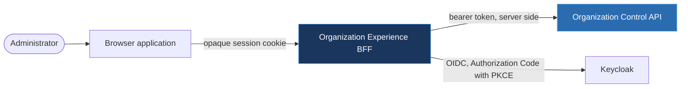
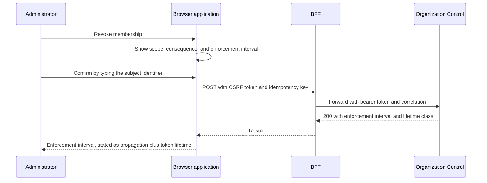

---
doc_meta:
  id: SAD-012
  title: Organization Experience Software Architecture
  owner: Principal Frontend Architect
  version: 1.0.0
  status: approved
  classification: restricted
  governed_by:
    - EAD-006
  parent_pad: PAD-PLT-002
  review_cycle_days: 180
  created_date: 2026-08-18
  last_updated: 2026-08-18
  last_reviewed: 2026-08-18
  technologies:
    - name: react
      type: frontend-framework
    - name: golang
      type: language
    - name: opentelemetry
      type: observability
    - name: kubernetes
      type: orchestration
    - name: aws
      type: cloud-provider
---

# Organization Experience Software Architecture (SAD-012)

---

## 1. Purpose & Scope

The administrative surface for Organization, Tenant, Workspace, and Membership, delivered as a browser application and the Backend-for-Frontend that serves it. It realizes the administrative experience half of PAD-PLT-002.

### 1.1 Objective

Let an administrator perform a tenancy operation with the consequence visible before they commit to it, and leave an attributable record of what they did. A revocation is the operation this surface exists to make correct.

### 1.2 Capability

Organization and Subscriber Account administration; Tenant and Workspace lifecycle; Membership grant, suspension, revocation, and restoration; invitation issue and tracking; and offboarding initiation.

### 1.3 Constraint

- **The browser holds no token.** Tokens live in the server-side session held by the BFF, per STD-IAM-001 §3.9. The browser holds an opaque, `HttpOnly`, `SameSite` cookie and nothing else.
- **The BFF holds no authority.** It proxies to the Organization Control API, which reauthorizes every command. UI-side authorization is defence in depth and never the decision.
- **`privileged` audience class**, lifetime class `L0` at four minutes, per STD-IAM-002 §3.1 and §3.3.
- **No direct database access** and no broker consumption. Every read and write transits the Organization Control API.

### 1.4 Requirement

Authorization Code with PKCE `S256`; a confidential client for the BFF; CSRF protection on every state-changing request; and an enforcement interval displayed with every revocation rather than implied.

### 1.5 Assumption

The Organization Control API is the authority and is reachable. When it is not, this surface degrades to read-only rather than presenting a stale write path.

---

## 2. Enterprise Traceability

| Relationship | Target |
| :-- | :-- |
| Realizes | PAD-PLT-002 — the administrative experience for Organization and Tenancy |
| Governed by | ADR-ORG-001 — the five concepts remain distinct in the interface as well as the model |
| Conforms to | STD-IAM-002 §3.1, §3.3 — `privileged` audience class, lifetime class `L0` |
| Conforms to | STD-IAM-001 §3.9 — no browser-held token; BFF session control for a privileged experience |
| Depends on | SAD-004 Organization & Tenancy Control — the authority this surface presents |
| Depends on | SAD-001 Identity Control Service — authentication is delegated, never implemented here |

---

## 3. Solution Context

### 3.1 System Context



### 3.2 External Dependencies

The identity kernel for the login redirect, and the Organization Control API for everything else. No other synchronous dependency exists.

### 3.3 Internal Structure

Two deployable artifacts from one repository: a static browser bundle and a Go BFF. The BFF is the only component holding a token, which is what makes the browser's compromise bounded.

---

## 4. Architecture Model

### 4.1 Container View

| Container | Responsibility |
| :-- | :-- |
| Browser application | Presentation, client-side validation, and consequence preview. Holds no credential |
| BFF | OIDC client, server-side session, CSRF enforcement, and a narrow proxy to the Organization Control API |

### 4.2 Component View, BFF

```text
cmd/organization-experience-bff/   composition root
internal/
  oidc/                            Authorization Code with PKCE, token exchange, refresh
  session/                         server-side session store, rotation, containment
  proxy/                           allowlisted route forwarding, header stripping
  csrf/                            double-submit enforcement on state-changing methods
```

The proxy forwards an allowlist rather than an arbitrary path. An open proxy in front of an authority turns any authorization defect in the BFF into access to every route the API exposes.

### 4.3 Revocation Sequence



The typed confirmation exists because a revocation is not undoable in effect: the sessions it removes do not come back. A dialog that a reflex dismisses is not a control.

---

## 5. State & Data Architecture

### 5.1 Storage

The BFF owns a server-side session store keyed by an opaque identifier and holds nothing else. It has no database of domain state, because a second copy of Membership would be a second authority.

### 5.2 Cache

Read models are cached in the browser for the duration of a view, with an explicit staleness marker. A cached authorization decision is never used to permit an action; the API reauthorizes.

### 5.3 Schema

None owned. The BFF's session store is keyed state with a bounded lifetime and no relational schema.

### 5.4 Stateless Browser Application

The bundle is a static artifact with no per-user build. Session state lives on the server, so a replica change does not sign a user out.

---

## 6. Integration Contracts

### 6.1 Consumed API

The Organization Control API, over REST with `Idempotency-Key` on every mutation and `expected_version` on every administrative mutation. Errors are RFC 9457 problem documents, and the interface presents `detail` without pattern-matching on it, because `detail` is prose that changes and `type` is the stable member.

### 6.2 Published API

`/api/*` to the browser only. The BFF strips the `/api` prefix when forwarding and removes every inbound header the browser could use to influence identity.

### 6.3 Events

None consumed and none published. This surface reads and writes through the authority's API, so it has no independent view to keep synchronised.

---

## 7. Security & Trust Boundary

**Authentication** is delegated to the identity kernel through Authorization Code with PKCE `S256`. The BFF is a confidential client and holds its secret server-side. The browser never receives a token of any kind.

**Authorization** shown in the interface is presentational. Every command is reauthorized by the Organization Control API, and the interface is built so that hiding a control is never the only thing preventing an action.

**Encryption**: TLS 1.3 to the browser and to the API. Session cookies are `Secure`, `HttpOnly`, and `SameSite`.

**Secrets**: the client secret and the session signing key are brokered from the managed store and rotate on independent schedules. Neither is present in the browser bundle, and the build fails if a value shaped like either appears in it.

**Audit**: the BFF attaches a correlation identifier to every forwarded request, so an operator action is traceable from the click through the API and into the projection that enforced it. Evidence is published by the authority rather than by this surface, because a client-published audit record can be suppressed by the client.

**Containment**: signing out destroys the server-side session, and a `terminate-all` includes the session that issued the request.

---

## 8. NFR

### 8.1 Blast Radius

| Failure | Impact | Blast radius | Degradation |
| :-- | :-- | :-- | :-- |
| Organization Control API unavailable | No administration possible | This surface only. Authority and enforcement are unaffected | Read views serve cached data with a visible staleness marker; every write control is disabled rather than failing on submit |
| Identity kernel unavailable | No new login | This surface only | Existing sessions continue for their remaining lifetime; new logins fail closed |
| BFF replica lost | Sessions on that replica | Users on that replica re-authenticate | Session store is shared, so a replica loss is not a sign-out |
| Browser bundle compromised | Presentation only | No token is reachable | The attacker gains the user's session for its remaining lifetime and no credential, which is the reason the token is not in the browser |

### 8.2 Latency

First contentful paint under 1.5 s on a broadband connection; interaction to next paint under 200 ms. Proxy overhead added by the BFF under 20 ms at p95.

### 8.3 Scalability

Both artifacts scale horizontally. The BFF is stateless apart from the shared session store.

### 8.4 Timeout and Retry

The BFF's upstream timeout is set strictly below the browser's request budget, so an upstream stall surfaces as a named dependency error rather than a blank failure. Retries are performed for idempotent reads only; a mutation carries an idempotency key and is retried by the operator, never silently by the proxy.

### 8.5 Observability, Telemetry, Alerting, and Runbook

OpenTelemetry traces from the browser through the BFF into the API, joined by one correlation identifier. Structured JSON logs from the BFF carrying `correlation_id` and the acting Principal, never a token. Alerting on session store availability, upstream error rate, and CSRF rejection rate, since a rise in the last is either a defect or an attack. Runbooks required before production: session store outage, upstream degradation, and suspected session theft.

---

## 9. Deployment Strategy

### 9.1 Environment and Infrastructure

The browser bundle is served as an immutable, digest-addressed static artifact behind the CDN. The BFF runs on Kubernetes across multiple availability zones with a minimum of two replicas.

#### 9.1.1 Configuration

Environment only, read once at start. The browser bundle receives no build-time secret; runtime configuration reaches it through a served document rather than being compiled in, so one artifact is promoted unchanged between environments.

### 9.2 CI/CD

Formatting, static analysis, type checking, unit and component tests, an accessibility gate against WCAG 2.2 AA, a bundle-budget gate, and a secret scan over the built bundle. The secret scan is a release gate rather than an advisory: a token compiled into a bundle is published to every visitor.

An end-to-end suite asserts the properties that make this surface safe: no token in browser storage or in any cookie readable by script, a state-changing request without a CSRF token is refused, and a control hidden in the interface is still refused by the API when called directly.

---

## 10. Architecture Decisions

### Accepted

A Backend-for-Frontend holding tokens server-side, matching the pattern established for the identity administration surface. Reauthorization at the authority rather than trust in the client.

### Rejected

#### 10.1 Tokens held in the browser

Rejected. A token in `localStorage` is readable by any script that reaches the page, and a token in a script-readable cookie is the same exposure with extra steps. STD-IAM-001 §3.9 prohibits it for a privileged experience, and the BFF exists to make the prohibition structural.

#### 10.2 A refresh token in the browser

Rejected. It converts a bounded session compromise into a renewable one. Refresh happens server-side inside the BFF session.

#### 10.3 A general-purpose proxy to the authority API

Rejected. An arbitrary-path proxy makes any BFF defect equivalent to direct access to every API route. The proxy forwards an allowlist.

#### 10.4 A read model owned by this surface

Rejected. A second copy of Membership state is a second authority, and the two diverge during exactly the incident when the interface is most needed.

---

## 11. Assumptions

- The session store is available and provides bounded-lifetime keyed storage.
- The Organization Control API reauthorizes every command, so a UI defect cannot produce an unauthorized mutation.

---

## 12. Compatibility Strategy

The browser application and the BFF are released together as one system and share a version. The API they consume is versioned in the path, and this surface pins a major version and upgrades deliberately rather than tracking the authority's latest.
