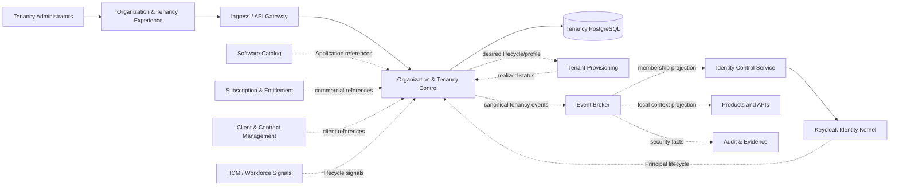
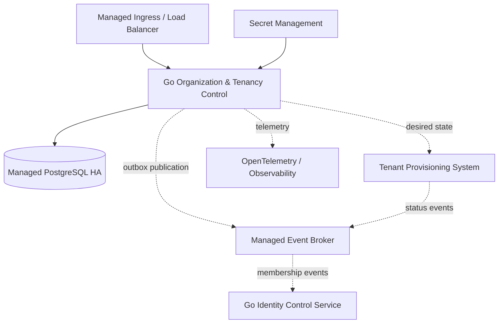
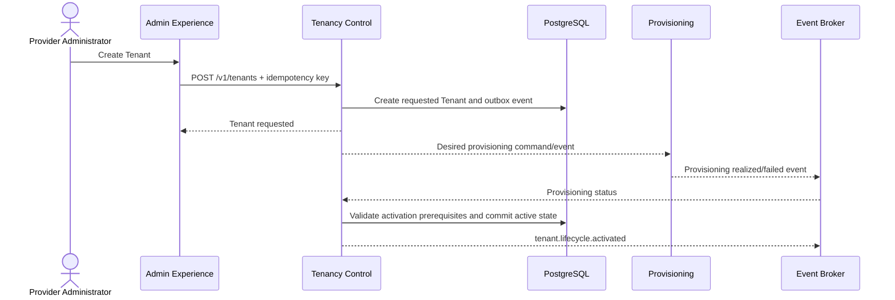
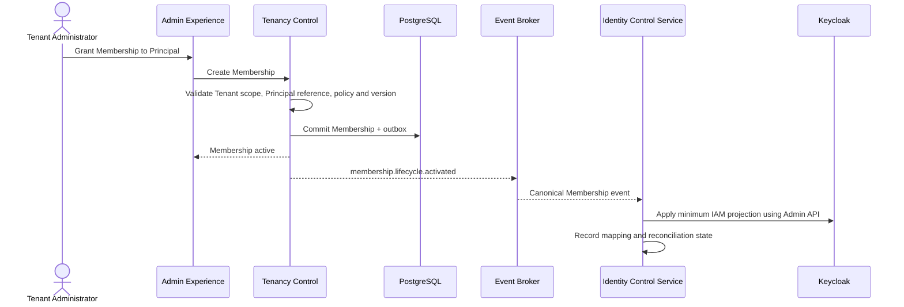
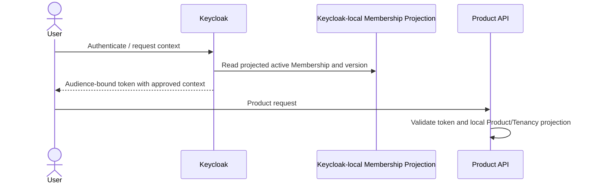
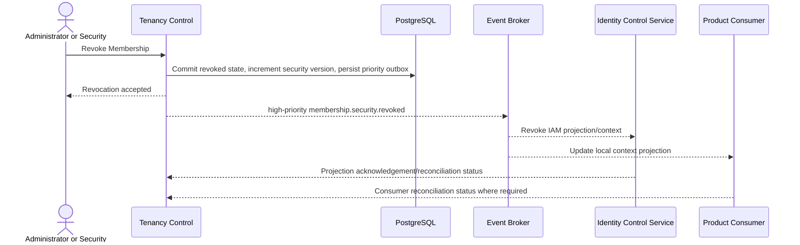
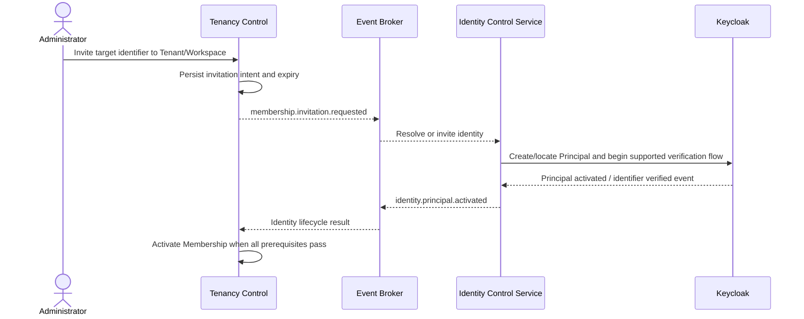
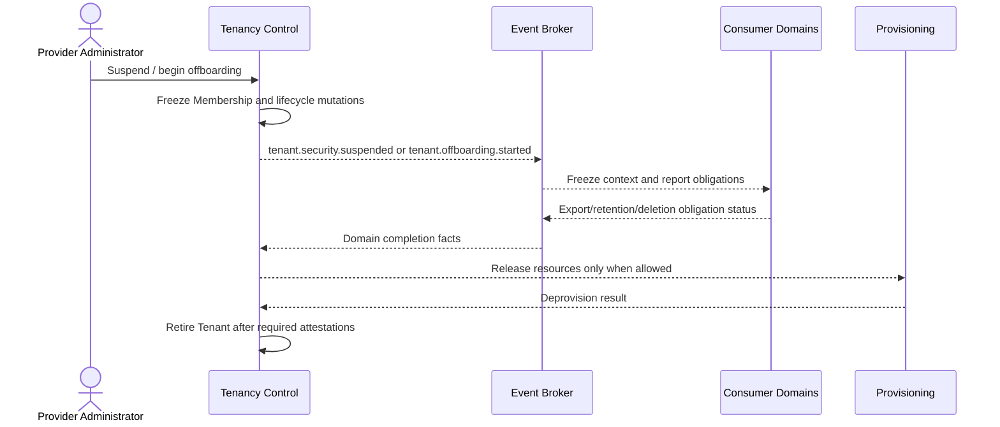

---
doc_meta:
  id: SAD-004
  title: Scnehaux Organization & Tenancy Control
  owner: Core Platform Team
  version: 2.0.0
  status: draft
  classification: restricted
  governed_by:
    - GDC-009
    - ADR-TEN-001
  review_cycle_days: 90
  created_date: 2026-08-06
  last_reviewed: 2026-08-06
  parent_pad: PAD-PLT-002
---

# Scnehaux Organization & Tenancy Control

## 1. Purpose & Scope

### Objective

Realize PAD-PLT-002 through one authoritative control-plane runtime for Organization, Tenant, Workspace, Membership, operating-context, projection, and offboarding state.

### Capability

The system provides:

- Organization registry and tenancy-relevant relationships;
- Tenant and Workspace lifecycle;
- Membership and tenancy-administrative roles;
- invitation and onboarding coordination;
- operating-context eligibility;
- lifecycle event publication and snapshot bootstrap;
- revocation-priority propagation and projection reconciliation;
- desired provisioning/isolation/residency profile references;
- Tenant offboarding coordination;
- migration from legacy Workspace and IAM-owned tenant data.

### Requirement

The system must become the only authoritative runtime for Tenant, Workspace, and Membership state, while allowing IAM and Products to enforce context from bounded local projections without a network call on every request.

### Constraint

- Go is the application runtime language.
- PostgreSQL is the authoritative transactional store.
- Identity and credentials remain in Keycloak through the Scnehaux Identity Runtime.
- The system never writes directly to Keycloak persistence.
- Membership projection to Keycloak is mediated by the Identity Control Service.
- Product roles and permissions are prohibited in the Tenancy data model.
- Physical Tenant provisioning is external to this system.
- Initial production is single-region and multi-availability-zone.
- Initial realization is one deployable control application; premature microservice extraction is prohibited.

### Assumption

- Keycloak-backed Identity Runtime provides stable Principal/workload identifiers and authenticated administrative artifacts.
- A managed PostgreSQL service, event broker, secret manager, ingress, and observability platform are available.
- Products and IAM can bootstrap and maintain local Tenant/Membership projections.
- Existing IAM and Workspace data can be exported for controlled migration.

### Out of Scope

- authentication, credentials, sessions, tokens, federation, and OAuth/OIDC;
- Subscription, Entitlement, Client Contract, HCM, and Workforce authority;
- Product authorization;
- infrastructure provisioning implementation;
- Product configuration values;
- enterprise evidence retention;
- Organization & Tenancy user-interface architecture — SAD-012.

## 2. Enterprise Traceability

### Realizes

This system realizes PAD-PLT-002 and the boundary decision in ADR-TEN-001.

It inherits:

- Organization/Tenant/Workspace/Membership authority from EAD-001 and EAD-003;
- system relationships and local-projection posture from EAD-002;
- event, reconciliation, and long-running lifecycle principles from EAD-004;
- runtime, deployment-profile, and reliability posture from EAD-005;
- contextual access and cross-tenant trust boundaries from EAD-006.

## 3. Solution Context

### System Context



### External

External system dependencies are:

- Scnehaux Identity Runtime and Identity Control Service;
- Software Catalog;
- Subscription & Entitlement when introduced;
- Client & Contract Management when introduced;
- HCM and Workforce lifecycle signals;
- Tenant Provisioning & Configuration;
- event broker, Audit & Evidence, and Notification;
- Product and platform consumers of context projections.

### Internal

The runtime contains one deployable application and one private database:

1. **Organization & Tenancy Control Application** — Go HTTP/gRPC-capable control application containing Organization, Tenant, Workspace, Membership, invitation, projection, reconciliation, and offboarding modules.
2. **Tenancy PostgreSQL Database** — private authoritative persistence, outbox, idempotency, projection-consumer state, and migration state.

Background delivery and reconciliation execute inside the same application deployment using bounded worker pools and database-backed coordination. Extraction requires a later SAD/ADR when independent scaling or failure isolation is demonstrated.

## 4. Architecture Model

### 4.1 Container Architecture



### 4.2 Application Modules

| Module | Responsibility |
| :-- | :-- |
| Organization Registry | Organization identity, type, status, relationship, succession, external references |
| Tenant Lifecycle | Tenant identity, lifecycle, sponsor/reference links, security version, desired profile |
| Workspace Lifecycle | Workspace identity, type, parent Tenant, lifecycle, context version |
| Membership | Principal/workload context, status, validity, provenance, administrative roles |
| Invitation | invitation intent, sponsor, expiry, identity-onboarding correlation |
| Operating Context | eligible contexts, context-switch validation, current authoritative query |
| Projection | snapshots, lifecycle stream, revocation priority, consumer cursor, reconciliation |
| Provisioning Coordination | desired provisioning state and realized-status correlation |
| Offboarding | access freeze, obligation tracking, final retirement |
| Administration | provider/Tenant scoped commands, approvals, reason, evidence facts |
| Migration | legacy mapping, dual-read comparison, cutover, rollback, deprecation |

### 4.3 Dependency Rule

Modules communicate through explicit application interfaces and domain events. They do not read another module's tables directly.

The application may initially use one PostgreSQL database, but each module has explicit schema/table ownership and migrations. Direct access by external systems is prohibited.

### 4.4 API Surface

Representative administrative and consumer endpoints:

```text
POST   /v1/organizations
GET    /v1/organizations/{organization_id}
POST   /v1/tenants
GET    /v1/tenants/{tenant_id}
POST   /v1/tenants/{tenant_id}:activate
POST   /v1/tenants/{tenant_id}:suspend
POST   /v1/tenants/{tenant_id}:restore
POST   /v1/tenants/{tenant_id}:begin-offboarding
POST   /v1/tenants/{tenant_id}/workspaces
POST   /v1/tenants/{tenant_id}/memberships
POST   /v1/memberships/{membership_id}:suspend
POST   /v1/memberships/{membership_id}:revoke
POST   /v1/memberships/{membership_id}:restore
GET    /v1/principals/{principal_id}/contexts
GET    /v1/context/{tenant_id}/{principal_id}:verify
GET    /v1/projections/tenancy/snapshot
POST   /v1/projections/tenancy:reconcile
```

Exact schemas are defined by the API contract and versioned independently. Sensitive administrative commands require idempotency keys, optimistic version, reason, and authenticated actor context.

### 4.5 Process Model

Each application replica runs:

- HTTP administration and exceptional fresh-query handlers;
- transactional domain command processing;
- outbox dispatcher with database-backed claim/lease;
- lifecycle event consumer workers;
- projection snapshot and reconciliation workers;
- migration and repair jobs explicitly enabled by operation profile.

Worker concurrency is bounded by configuration. Duplicate work is handled through idempotency and aggregate version constraints.

## 5. Runtime Flows

### 5.1 Create and Activate Tenant



A Tenant is not active until required provisioning and policy prerequisites are confirmed.

### 5.2 Grant Membership and Project to Keycloak



Tenancy does not call Keycloak directly. Keycloak-local Organization/Group membership is a projection, not the authoritative Membership.

### 5.3 Token Context Issuance



Neither token issuance nor Product request handling synchronously calls Tenancy in the normal path.

### 5.4 Membership Revocation



The security dashboard measures acceptance-to-enforcement delay per required consumer class.

### 5.5 Invitation and Identity Onboarding



Invitation possession alone never proves identity.

### 5.6 Tenant Suspension and Offboarding



Offboarding is resumable and does not infer completion from one infrastructure response.

## 6. State & Data Architecture

### 6.1 Persistence

The system uses managed PostgreSQL with private network access, encrypted storage, point-in-time recovery, and multi-availability-zone failover.

Logical schema ownership:

| Schema / Module | Primary Records |
| :-- | :-- |
| `organization` | organizations, relationships, external references |
| `tenant` | tenants, lifecycle transitions, profile references, security version |
| `workspace` | workspaces, lifecycle, context version |
| `membership` | memberships, validity, provenance, admin assignments, security version |
| `invitation` | invitation intent, target reference, expiry, onboarding correlation |
| `operation` | lifecycle operations, approvals, offboarding obligations |
| `projection` | consumer registration, cursor, snapshot generation, reconciliation status |
| `platform` | idempotency keys, outbox, inbox, migration maps, repair tasks |

### 6.2 Core Keys and Constraints

- `organization_id`, `tenant_id`, `workspace_id`, and `membership_id` are immutable opaque identifiers.
- Workspace foreign key must reference exactly one Tenant.
- Membership has one Tenant and nullable Workspace constrained to the same Tenant.
- Active duplicate Membership for the same subject/context/type is prevented by a database constraint.
- Aggregate rows carry monotonic version for optimistic concurrency.
- lifecycle transitions are constrained by domain state-machine validation and transaction boundaries.
- acknowledged revocation/suspension commits include the outbox record in the same transaction.

### 6.3 Tenant Isolation

The authoritative control database serves all Tenants but uses:

- explicit Tenant-scoped repository interfaces;
- mandatory Tenant predicates for Tenant-administrator paths;
- PostgreSQL Row-Level Security on Tenant-scoped tables where the query model is compatible;
- separate migration/owner role and non-owner runtime role;
- runtime roles without `SUPERUSER` or `BYPASSRLS`;
- provider-administration paths requiring a distinct authorization context;
- negative tests for database, export, job, replay, and administrative access.

RLS is defense in depth. Application authorization remains mandatory.

### 6.4 Data Classification

- Organization, Tenant, Workspace, Membership, administrative assignment, invitation, and security-event data are Restricted unless explicitly published.
- Full identity profiles, credentials, Product business data, payroll, and Contract documents are not stored.
- Principal references are pseudonymous stable identifiers.
- logs and traces must not include invitation secrets, unrestricted PII, or authorization tokens.

### 6.5 Retention

- active authority records follow domain lifecycle;
- revoked Membership and privileged-administration facts are retained according to security/audit policy;
- invitation data expires and is minimized after completion;
- offboarding records remain until all obligations and evidence retention requirements complete;
- projections and reconciliation cursors retain only operationally required history;
- legal hold prevents destructive retirement until released.

### 6.6 Backup and Restore

- encrypted automated backups and point-in-time recovery are mandatory;
- restore testing includes Tenant, Membership, outbox, projection cursor, and offboarding state;
- restore cannot silently roll back a security version without a reconciliation and containment plan;
- quarterly restore evidence is required before external production commitment.

## 7. Integration Contracts

### 7.1 Identity Runtime

- accepts Keycloak-issued administrative access tokens for API authorization;
- consumes canonical Principal/workload lifecycle events through the broker;
- publishes Membership/Tenant events consumed by the Identity Control Service;
- never writes Keycloak DB or invokes Keycloak directly for projection.

### 7.2 Software Catalog

Consumes Application and owner references for Tenant/Application association and provider administration. Catalog outage blocks new association changes but does not invalidate existing Tenant authority.

### 7.3 Subscription & Entitlement

Consumes commercial references and lifecycle events when implemented. Subscription status does not overwrite Tenant identity. Suspension behavior is an explicit cross-domain policy.

### 7.4 Client & Contract, HCM, Workforce

Consumes bounded identifiers and lifecycle signals. These systems may request Membership changes but cannot directly mutate Tenancy tables.

### 7.5 Provisioning

Publishes desired lifecycle and profile references and consumes realized status. Commands use idempotency, correlation, timeout, and reconciliation. Ambiguous provisioning outcome remains pending/failed, never inferred as success.

### 7.6 Event Broker

Published event families:

```text
organization.registry.*
tenant.lifecycle.*
tenant.security.*
tenant.profile.*
workspace.lifecycle.*
membership.lifecycle.*
membership.security.*
tenancy.admin-role.*
operating-context.*
tenancy.projection.*
tenant.offboarding.*
tenancy.reconciliation.*
```

All events use the enterprise event envelope and versioning standard. At-least-once delivery is assumed; consumers must be idempotent.

### 7.7 Projection Bootstrap

Consumers obtain:

1. versioned snapshot;
2. snapshot high-water mark;
3. incremental events after that mark;
4. reconciliation endpoint/report;
5. declared stale and revocation policy.

### 7.8 Notification and Audit

Notification requests and enterprise evidence facts are asynchronous. Local authoritative mutation does not depend on synchronous delivery, but undelivered facts remain visible and retried.

## 8. Security & Trust Boundary

### 8.1 Authentication and Service Identity

- administrative users authenticate through Keycloak;
- service-to-service calls use approved workload identity and audience-bound access tokens;
- browser clients never call the Control API without the BFF or approved protected-client profile;
- anonymous access is limited to explicitly approved invitation/public lookup endpoints with enumeration resistance.

### 8.2 Authorization

Authorization combines:

- valid Principal/workload;
- active provider or Tenant administrative context;
- active Membership where applicable;
- operation-specific tenancy role;
- aggregate scope and lifecycle state;
- elevated assurance for high-risk actions;
- reason/approval for provider cross-tenant operations.

Product permission is never evaluated here.

### 8.3 Input and Context Validation

- Tenant/Workspace identifiers from clients are treated as requested scope;
- authoritative scope is resolved from the authenticated administrative context and current Membership;
- all mutation requests use strict schemas and reject unknown privileged fields;
- optimistic version and idempotency key are required for sensitive commands;
- bulk operations validate each item independently and return per-item outcome.

### 8.4 Secrets and Encryption

- no credentials are stored in application configuration or source control;
- database and broker credentials come from approved secret management;
- TLS is required in transit;
- restricted fields are encrypted at rest by managed storage, with field-level protection where threat analysis requires it;
- export artifacts use time-bounded, auditable access and approved encryption.

### 8.5 Cross-Tenant Administration

Provider administration requires:

- distinct provider scope;
- strong authentication and step-up;
- short-lived privileged context;
- explicit Tenant/operation scope;
- reason and external ticket/approval where required;
- security event and enterprise evidence;
- no implicit privilege from ordinary Tenant or Product roles.

### 8.6 Threat Controls

Threats and controls include:

| Threat | Control |
| :-- | :-- |
| Tenant-context spoofing | derive authoritative scope from token and current Membership, not request headers |
| IDOR across Tenant | scope-aware repository, RLS defense, negative tests |
| stale revoked access | priority event, version, bounded freshness, reconciliation |
| privilege escalation | narrow tenancy roles, step-up, approval, deny by default |
| duplicate/racing lifecycle commands | idempotency and optimistic concurrency |
| event loss | transactional outbox and delivery reconciliation |
| direct Keycloak drift | Identity Control Service reconciliation; Tenancy remains source |
| destructive offboarding | staged obligations and explicit finalization |
| invitation takeover | Identity-owned verification and expiry; invitation is not proof |

## 9. NFR

### 9.1 Resilience & Failure Modes

#### 9.1.1 Failure Matrix

| Failure | Behavior | Blast Radius |
| :-- | :-- | :-- |
| One application replica fails | load balancer removes replica; remaining replicas continue | In-flight requests on one replica |
| PostgreSQL primary fails | managed failover; mutations pause briefly; no local fallback authority | All new Tenancy mutations; existing consumer projections continue |
| Event broker unavailable | mutations commit with outbox; publication backlog grows and alerts | New projection propagation across consumers; authoritative API remains available |
| Identity Control Service unavailable | events remain on broker; Keycloak projection becomes stale according to policy | New/changed IAM context only; Tenancy authority remains correct |
| Keycloak unavailable | administrative login/new identity journeys pause; authenticated service operations with valid token may continue by policy | New admin sessions and identity onboarding |
| Provisioning unavailable | new Tenant activation/profile change pauses; current active Tenants continue | Affected provisioning operations |
| One consumer projection diverges | consumer marked stale; targeted rebuild/reconciliation | One consumer/system, unless security policy forces broader containment |
| Bad bulk import | transaction/item constraints reject invalid items; resumable report | Submitted batch/items only |
| Cross-tenant policy defect | emergency provider-admin disable and affected Tenant containment | Potential multi-Tenant; treated Sev-1 |
| Database restore to older point | security-version reconciliation and containment before normal operation | Full Tenancy control plane until reconciled |
| Offboarding dependency never completes | Tenant remains offboarding/frozen; no final deletion | One Tenant |

#### 9.1.2 Degradation

- Products and IAM continue using bounded local projections during central Tenancy outage.
- New Membership grants, revocations, Tenant changes, and authoritative administration fail closed when the database is unavailable.
- Existing contexts may continue only within consumer freshness and security policy.
- High-risk action must fail closed or perform an approved fresh authoritative check.
- No cache or backup copy becomes writable authority.

#### 9.1.3 Circuit Breaker, Retry, Timeout, Failover

- outbound calls are limited to explicit administrative or provisioning journeys;
- synchronous dependency timeout defaults are defined per integration contract and must remain below caller budget;
- retries use bounded exponential backoff with jitter only for idempotent operations;
- circuit breakers isolate Provisioning, Catalog, Notification, and other optional dependencies;
- event publication relies on outbox and broker retry rather than request-thread retry;
- PostgreSQL and ingress failover use managed multi-AZ capability;
- cross-region failover is not part of the initial architecture.

### 9.2 Blast Radius

The maximum initial control-plane failure boundary is the Organization & Tenancy mutation plane. Existing IAM and Product request handling continues through bounded local projections. A cross-tenant authorization defect, corrupted authority restore, or invalid global suspension may affect multiple Tenants and is therefore treated as a Sev-1 enterprise incident.

### 9.3 Observability & Operations

#### 9.3.1 Telemetry

OpenTelemetry-compatible traces, metrics, and structured logs include:

- Organization/Tenant/Workspace/Membership identifiers where authorized;
- actor and Application/workload reference;
- command and aggregate version;
- correlation/causation and idempotency identifiers;
- projection consumer, version, and freshness;
- revocation acceptance-to-publication and enforcement acknowledgement;
- outbox backlog and oldest age;
- reconciliation mismatch count;
- provider versus Tenant administrative scope;
- offboarding obligation status;
- provisioning correlation state.

Secrets, tokens, unrestricted PII, and invitation proof material are excluded.

#### 9.3.2 SLIs and Alerts

| SLI | Initial Target / Alert |
| :-- | :-- |
| Administrative API availability | target 99.95% monthly after evidence |
| Mutation p95 latency | ≤ 500 ms excluding downstream workflows |
| Authoritative read p95 | ≤ 200 ms |
| Outbox oldest unpublished age | warning > 30 s; critical > 2 min for security-priority events |
| Revocation publication delay | warning/critical thresholds defined by security profile |
| Projection reconciliation age | consumer-specific; critical when stale policy exceeded |
| Cross-tenant authorization denial | monitored for anomaly and regression |
| Database replication/failover health | critical on managed-service thresholds |
| Offboarding overdue obligation | warning before contract deadline; critical after deadline |

Current SLO is `not-yet-established` until production measurement begins.

#### 9.3.3 Runbooks

Required runbooks:

- Membership/Tenant emergency containment;
- broker outage and outbox replay;
- projection rebuild and consumer reconciliation;
- Keycloak projection drift repair;
- provider-admin privilege incident;
- PostgreSQL failover and restore;
- Tenant activation/provisioning stuck state;
- offboarding blocked obligation;
- migration rollback;
- suspected cross-tenant data exposure.

#### 9.3.4 Operational Ownership

The Core Platform Team owns runtime operation. Security owns incident policy for cross-tenant exposure and privileged abuse. Consumer teams own their local projection health and enforcement.

## 10. Deployment Strategy

### 10.1 Runtime Profile

- Go application compiled as an OCI image.
- Deployed to the approved managed container runtime.
- Minimum two application replicas across availability zones; three replicas for production target profile when capacity allows.
- Managed PostgreSQL with multi-AZ failover and point-in-time recovery.
- Private network connectivity to database and broker.
- Managed ingress with TLS termination and workload-aware authorization.
- No Kubernetes or service-mesh requirement unless selected by the enterprise runtime standard.

### 10.2 Resource Profile

Initial production request/limit guidance per replica:

```text
CPU request: 250m
CPU limit:   1000m
Memory request: 256 MiB
Memory limit:   768 MiB
```

Final sizing follows load tests for administrative, bulk, projection, and reconciliation workloads. Autoscaling uses CPU, latency, and worker backlog with an explicit maximum replica count.

### 10.3 Environments

- local development;
- preview/ephemeral integration;
- shared integration;
- staging with production-like identity/broker/database behavior;
- production;
- migration rehearsal environment using sanitized data.

No production credential or customer data is used in lower environments.

### 10.4 CI/CD

Pipeline gates include:

- format, static analysis, unit and integration tests;
- migration validation;
- authority and state-machine tests;
- cross-tenant negative tests;
- API/event compatibility tests;
- race and idempotency tests;
- dependency and vulnerability scan;
- container and IaC scan;
- restore/migration rehearsal for material releases;
- approved-mode architecture lint.

Production uses immutable artifact promotion, rolling or canary deployment, automated rollback criteria, and backward-compatible database migration.

### 10.5 Scaling

- API and background pools share the initial deployment but have independent concurrency limits.
- bulk jobs and snapshot generation use admission control and bounded queues.
- scale-out does not change aggregate consistency because PostgreSQL remains authority.
- extraction of worker or projection containers requires a new SAD/ADR.

## 11. Architecture Decisions

This system is governed by:

- ADR-TEN-001 — Separate Tenancy Authority and Keycloak Projection.
- ADR-GLB-001 — Modular Monolith.
- ADR-GLB-002 — PostgreSQL RLS where applicable.
- ADR-GLB-003 — Transactional Outbox.
- ADR-GLB-006 — Event Versioning.
- ADR-GLB-007 — DDD Boundaries.

### Governing

The system is governed by the decisions listed above.

### Rejected

The following implementation directions are rejected by the current architecture:

- authoritative Tenant or Membership state inside Keycloak/IAM;
- Realm-per-Tenant as the default;
- direct database access by consumers;
- synchronous Tenancy lookup on every request;
- premature domain microservice decomposition.

Additional decisions are required for:

- exact lifecycle state machines;
- API/event contracts;
- isolation and residency profile taxonomy;
- provider-admin privilege model;
- migration and cutover;
- provisioning orchestration;
- offboarding obligation protocol.

## 12. Compatibility Strategy

- APIs and events are versioned.
- additive fields are backward compatible; semantic or authority changes require a new version.
- snapshots include schema version and high-water mark.
- database migrations use expand/migrate/contract.
- old Tenant/Workspace identifiers map to immutable new identifiers during a bounded compatibility period.
- consumers expose supported projection version and last-reconciled version.

## 13. Migration Strategy

1. Inventory existing Tenant, account, Workspace, Organization, and Membership records.
2. Define canonical identifier mapping and data-quality exceptions.
3. Backfill Organization/Tenant/Workspace/Membership authority into the new database.
4. Run comparison against legacy IAM and Workspace sources.
5. Publish snapshots and validate IAM/Product consumer projections.
6. Freeze new authoritative Tenancy features in legacy systems.
7. Cut writes to the new authority while maintaining temporary compatibility reads/events.
8. Validate revocation, context switching, and cross-tenant isolation.
9. Retire legacy tables/APIs after rollback window and evidence completion.

Dual authoritative writes are prohibited. Temporary dual publication must have one declared source of truth.

## 14. Trade-offs & Alternatives

### Alternative A — Keep Tenant and Membership Inside Keycloak/IAM

Rejected because it collapses identity and contextual authority, couples business tenancy to vendor identity semantics, and undermines global workforce Principal plus independent Product authorization.

### Alternative B — Realm per Tenant

Rejected as the default because it duplicates workforce identities, fragments issuer/key/client configuration, complicates cross-tenant operation, and creates operational scaling cost. Dedicated Realms remain an exception decision for hard trust boundaries.

### Alternative C — Universal Synchronous Tenancy Lookup

Rejected because it makes the control plane a per-request SPOF and increases latency. Bounded projections and explicit fresh checks are safer.

### Alternative D — Separate Microservices for Organization, Tenant, Workspace, Membership, and Projection

Rejected for the initial phase because lifecycle and scale evidence do not justify distributed-system cost. Logical modules remain separable for future extraction.

### Alternative E — Shared Database Access by IAM and Products

Rejected because it bypasses authority, contracts, evolution, and evidence. Consumers use APIs, events, snapshots, and local projections.

### Selected Trade-off

A single Go control application with private PostgreSQL minimizes initial operational complexity while preserving strict logical boundaries. It accepts one-system Blast Radius for control-plane mutation in exchange for rapid, safe authority separation; local projections protect normal IAM/Product runtime from that outage.
