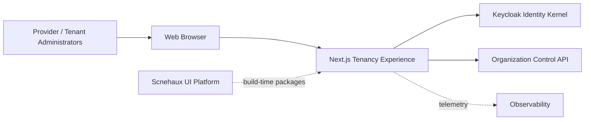
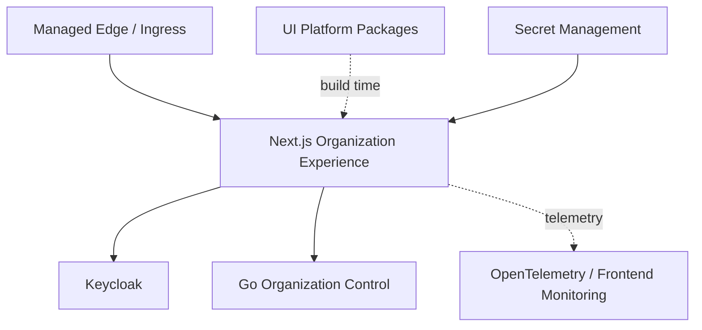
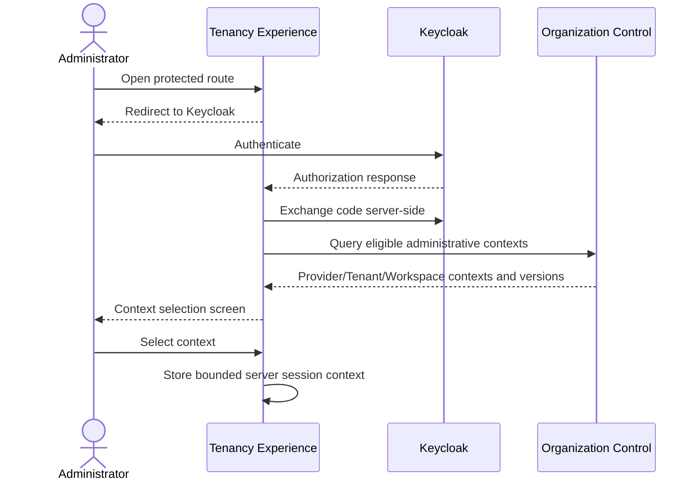
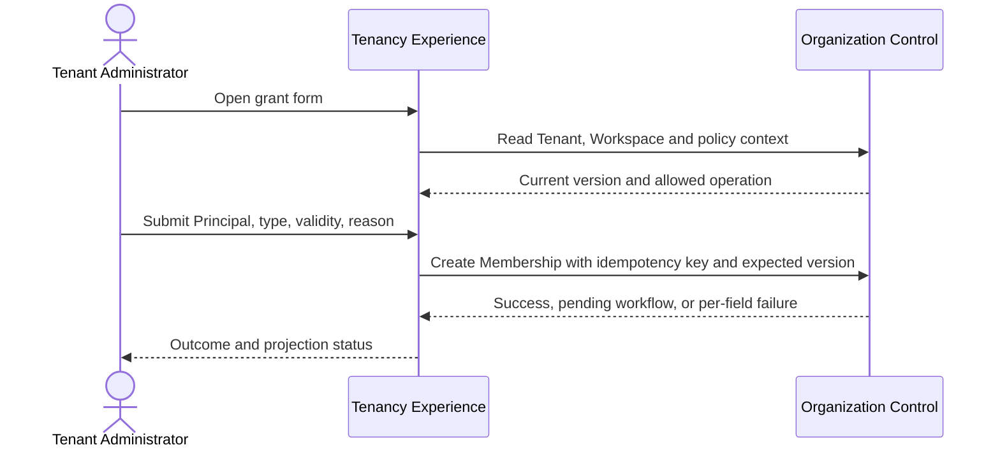
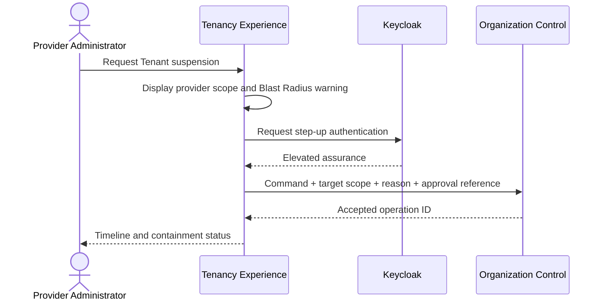
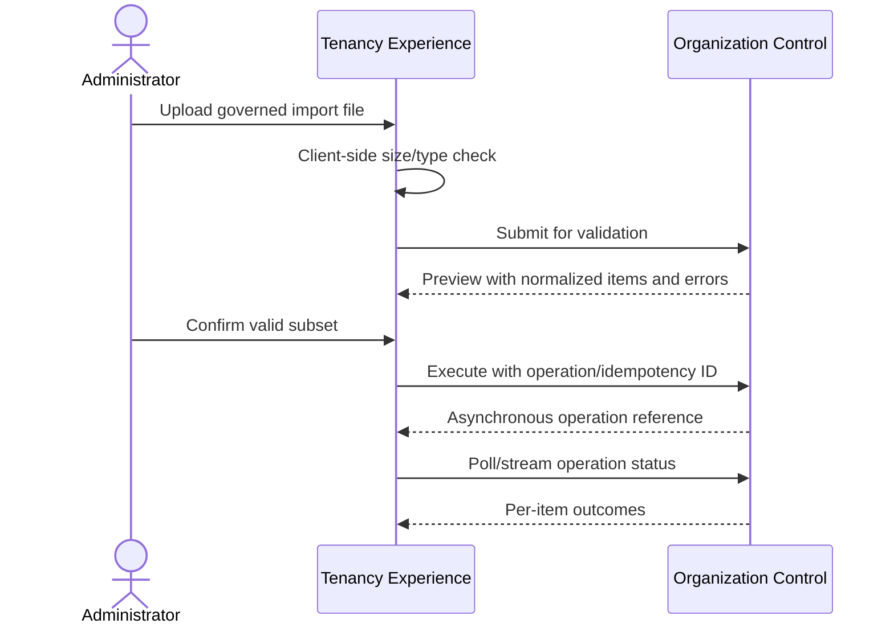
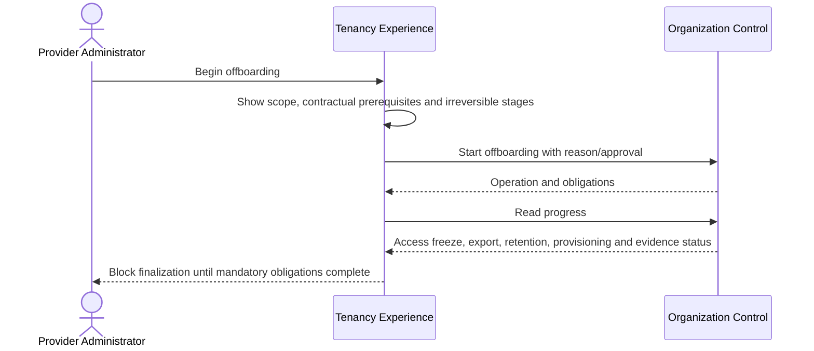

---
doc_meta:
  id: SAD-012
  title: Scnehaux Organization Experience
  owner: Core Platform Team
  version: 1.0.0
  status: approved
  classification: restricted
  governed_by:
    - GDC-009
    - ADR-ORG-001
  review_cycle_days: 90
  created_date: 2026-08-06
  last_reviewed: 2026-08-06
  parent_pad: PAD-PLT-002
---

# Scnehaux Organization Experience

## 1. Purpose & Scope

### Objective

Provide secure, accessible administrative experiences for Organization, Tenant, Workspace, Membership, projection, and offboarding operations without moving authority or business logic into the browser.

### Capability

The system provides:

- provider Organization/Tenant administration;
- Tenant and Workspace administration;
- Membership invitation, grant, suspension, revocation, expiry, and restoration;
- organization-administrative role management;
- context discovery and safe context switching;
- projection freshness and reconciliation visibility;
- Tenant activation, suspension, and offboarding workflow views;
- bulk-operation preview and per-item outcome;
- privileged-action reason, approval, and evidence capture.

### Requirement

The experience must make administrative scope explicit, prevent accidental cross-tenant action, use Keycloak authentication without exposing Keycloak administration directly, and invoke only the governed Scnehaux Organization Control API.

### Constraint

- TypeScript and Next.js are the application stack.
- Scnehaux UI Platform packages are the design-system dependency.
- Keycloak is used for sign-in and administrative session assurance.
- The browser never calls the Keycloak Admin API or Tenancy database.
- Product roles and Product permissions are not administered here.
- All mutations pass through the Organization Control API.
- No access or refresh token is stored in browser local storage.
- Initial production is single-region and multi-availability-zone.

### Assumption

- Identity Runtime provides OIDC, step-up, logout, and session capabilities.
- Organization Control exposes versioned protected APIs.
- UI Platform packages and localization infrastructure are available.
- Notification delivery is asynchronous and external.

### Out of Scope

- hosted user authentication implementation;
- identity credential, authenticator, session, or OAuth client administration;
- Subscription and Entitlement administration;
- Product permission administration;
- HCM or Workforce administration;
- physical Tenant provisioning implementation;
- customer-facing Product workspaces;
- enterprise evidence storage.

## 2. Enterprise Traceability

### Realizes

This system realizes the administrative-experience portion of PAD-PLT-002 and operates against SAD-004.

It inherits:

- Organization/Tenant/Workspace/Membership boundaries from EAD-001 and PAD-PLT-002;
- system relationships from EAD-002;
- data-minimization and authority constraints from EAD-003;
- command and long-running workflow principles from EAD-004;
- runtime and accessibility posture from EAD-005;
- privileged, cross-tenant, and contextual trust controls from EAD-006.

## 3. Solution Context

### System Context



### External

External dependencies:

- Keycloak Identity Runtime;
- Organization Control API;
- Scnehaux UI Platform packages;
- Notification and Audit capabilities through backend workflows;
- observability and deployment platform.

### Internal

The application contains:

1. **Next.js Web Application** — server-rendered administrative pages and BFF endpoints.
2. **Server Session Layer** — encrypted HttpOnly session cookie and server-side token handling.
3. **Tenancy API Client** — typed server-side client for SAD-004.
4. **Scope Guard** — provider/Tenant/Workspace context validation before rendering or mutation.
5. **UI Composition Layer** — forms, tables, status timelines, bulk-operation previews, and evidence views using UI Platform assets.

## 4. Architecture Model

### 4.1 Container Architecture



### 4.2 Application Responsibilities

- initiate OIDC Authorization Code + PKCE sign-in;
- maintain server-managed administrative session;
- request step-up authentication for high-risk operations;
- obtain and refresh backend access token server-side;
- render Organization, Tenant, Workspace, Membership, and offboarding views;
- enforce UI route and action visibility from server-authoritative permissions;
- attach current administrative context, idempotency key, aggregate version, and reason to mutations;
- prevent stale form submission through optimistic version checks;
- display backend validation and partial/bulk outcomes safely;
- expose projection freshness, reconciliation state, and unresolved obligations;
- provide accessible destructive-action confirmation and scope summary.

### 4.3 Route Model

Representative application routes:

```text
/login
/select-context
/provider/organizations
/provider/tenants
/provider/tenants/{tenant_id}
/provider/tenants/{tenant_id}/offboarding
/tenant/{tenant_id}/overview
/tenant/{tenant_id}/workspaces
/tenant/{tenant_id}/memberships
/tenant/{tenant_id}/administrators
/tenant/{tenant_id}/projections
/workspace/{workspace_id}/memberships
/operations/{operation_id}
```

Provider routes and Tenant routes use separate server authorization guards and visual scope treatment.

### 4.4 BFF Endpoints

```text
GET  /api/session
POST /api/context/switch
POST /api/tenancy/commands
GET  /api/tenancy/queries/*
POST /api/logout
```

The BFF does not duplicate domain validation. It protects browser sessions, performs token exchange/refresh when required, normalizes errors, and calls the Control API.

## 5. Runtime Flows

### 5.1 Sign-In and Administrative Context Selection



The browser-provided context is revalidated by the server and Control API.

### 5.2 Grant Membership



### 5.3 High-Risk Cross-Tenant Action



### 5.4 Bulk Membership Import



### 5.5 Tenant Offboarding



## 6. State & Data Architecture

### 6.1 Browser State

Allowed browser state:

- non-sensitive view preferences;
- active UI locale and theme;
- transient form state;
- opaque anti-CSRF values;
- no access token, refresh token, credential, unrestricted Membership export, or privileged policy in local storage.

### 6.2 Server Session

The server session contains the minimum required:

- opaque session identifier;
- Principal identifier;
- current provider/Tenant/Workspace administrative context;
- authentication assurance and expiry;
- anti-CSRF binding;
- backend token reference or encrypted server-only token material;
- session security version.

Session cookies are `HttpOnly`, `Secure`, same-site protected, rotated, and bounded in lifetime.

### 6.3 Cached Data

The application may use short-lived server cache for reference/display queries. It never caches authority-changing validation beyond the Control API's declared version and freshness.

Sensitive responses use `Cache-Control: no-store`. Shared/CDN caching is prohibited for personalized or restricted administrative pages.

### 6.4 Uploads and Exports

- imports are streamed or uploaded through protected backend contracts;
- file type, size, schema, malware policy, and row count are validated;
- temporary files have bounded retention;
- exports require explicit scope and are generated by the authoritative backend or governed export capability;
- download links are time-bounded and evidenced.

## 7. Integration Contracts

### 7.1 Keycloak

Uses supported OIDC endpoints for:

- authorization;
- token exchange/refresh;
- logout;
- step-up authentication;
- session assurance.

The application does not call the Keycloak Admin API and does not model canonical Membership from Keycloak Organizations/Groups.

### 7.2 Organization Control

All queries and commands use the versioned protected API. The BFF passes:

- audience-bound service/user token;
- current administrative context;
- correlation and idempotency identifiers;
- expected aggregate version for mutations;
- reason/approval metadata for privileged operations.

### 7.3 UI Platform

UI Platform is a build-time dependency for tokens, headless primitives, components, accessibility behavior, and interaction standards. The deployed application does not require a runtime UI Platform service.

### 7.4 Observability

Frontend and server telemetry use common correlation identifiers with backend operations. Sensitive Tenant/Membership details are minimized and masked.

## 8. Security & Trust Boundary

### 8.1 Authentication

- Authorization Code + PKCE through Keycloak;
- server-side callback and session creation;
- step-up for provider cross-tenant, Tenant suspension, admin delegation, bulk grant, export, and offboarding finalization;
- session termination on logout, security version change, or backend rejection.

### 8.2 Authorization

Server-side route and action guards validate:

- active authenticated session;
- current administrative context;
- allowed organization-administrative operation;
- required assurance;
- target Tenant/Workspace scope;
- backend authorization result.

UI hiding is not authorization. Every command is reauthorized by SAD-004.

### 8.3 CSRF, XSS, and Browser Security

- state-changing BFF endpoints use CSRF protection and same-site cookies;
- Content Security Policy restricts scripts, frames, connections, and form destinations;
- output encoding and safe component APIs prevent XSS;
- no unsafe HTML rendering without explicit sanitization;
- clickjacking protection and strict transport security are mandatory;
- redirect destinations use an allowlist.

### 8.4 Scope Safety

Every privileged page shows:

- provider or Tenant scope;
- Tenant/Workspace identity;
- affected resource count where known;
- action severity;
- whether action is reversible;
- required reason and approval.

Cross-tenant bulk selection is prohibited unless the provider role and operation explicitly allow it.

### 8.5 Error Handling

- user messages do not reveal internal identifiers, policies, stack traces, or other-Tenant existence;
- authorization failure is distinguishable from validation failure only where safe;
- correlation ID is shown for support;
- stale version triggers refresh/review instead of blind retry;
- ambiguous long-running outcomes show pending/reconciliation status.

## 9. NFR

### 9.1 Resilience & Failure Modes

| Failure | Behavior | Blast Radius |
| :-- | :-- | :-- |
| One web replica fails | load balancer retries or user refreshes; server session remains recoverable | One request/session interaction |
| Control API unavailable | read/mutation pages show controlled outage; no local authority fallback | Tenancy administration only; normal Product/IAM projection use continues |
| Keycloak unavailable | new login, token refresh, step-up and logout completion may fail | New/expiring admin sessions |
| UI Platform registry unavailable | existing immutable build continues | New build/deployment only |
| Server session store/cookie invalid | user reauthenticates; no privilege retained locally | One administrative session |
| Stale aggregate version | command rejected; UI reloads and requests confirmation | One attempted mutation |
| Bulk operation partly fails | per-item status shown; valid items are not silently rolled back unless backend contract states atomic | Submitted batch/items |
| Telemetry unavailable | core administration continues; telemetry backlog/drop is alerted according to policy | Observability only |
| Bad client release | canary/rollback restores previous immutable artifact | Administrative UI users on affected release |

#### 9.1.1 Degradation

- the experience never becomes a writable offline authority;
- cached pages do not permit stale mutation;
- if step-up is unavailable, high-risk operations fail closed;
- if the Control API reports stale projection or pending reconciliation, the UI exposes that state rather than claiming completion.

#### 9.1.2 Circuit Breaker, Retry, Timeout, Failover

- server-side read calls may retry once for transient network failure;
- mutation calls are not automatically retried without stable idempotency key;
- API timeout is below the web request budget; long operations return operation IDs;
- circuit breaker prevents request pile-up during Control API outage;
- multiple web replicas run across availability zones;
- no cross-region active-active in the initial architecture.

### 9.2 Blast Radius

Failure of this experience blocks Organization administration but does not block ordinary product use, existing token validation, or local context enforcement. A defective provider-scope user interface could expose multi-Tenant administrative actions, so provider-scope releases use canary rollout, explicit scope presentation, and immediate rollback.

### 9.3 Observability & Operations

#### 9.3.1 Telemetry

Track:

- sign-in, context selection, and step-up outcome;
- page and BFF latency;
- backend API latency/error by operation class;
- provider versus Tenant route use;
- destructive confirmation abandonment;
- stale-version conflicts;
- bulk-operation size and outcome;
- offboarding workflow progress;
- accessibility and frontend error signals;
- deployment version and feature flag state.

Tokens, invitation proof, unrestricted PII, and secret data are excluded.

#### 9.3.2 SLIs and Alerts

| SLI | Initial Target / Alert |
| :-- | :-- |
| Web application availability | target 99.9% monthly after evidence |
| Server page/BFF p95 | ≤ 500 ms excluding backend long-running operation |
| Control API dependency error | alert on sustained > 2% over 5 minutes |
| Authentication callback error | alert on sustained increase by client/version |
| CSRF/session validation failure | anomaly alert |
| Cross-tenant authorization denial | security signal when pattern deviates |
| Frontend unhandled error | alert by release and route |
| Accessibility regression | CI hard block for defined automated checks |

#### 9.3.3 Runbooks

- failed authentication callback;
- administrative-session compromise;
- provider-scope incident;
- Control API outage;
- stale-version/reconciliation confusion;
- bad frontend deployment and rollback;
- import/export incident;
- CSP or browser compatibility regression;
- accessibility critical defect.

## 10. Deployment Strategy

### 10.1 Runtime Profile

- Next.js application built as an immutable OCI image;
- deployed to approved managed container runtime;
- minimum two replicas across availability zones;
- managed ingress and TLS;
- configuration and secrets injected at runtime;
- static assets fingerprinted and safely cached;
- personalized routes and BFF responses not shared-cacheable.

### 10.2 Resource Profile

Initial per-replica guidance:

```text
CPU request: 100m
CPU limit:   500m
Memory request: 192 MiB
Memory limit:   512 MiB
```

Final sizing follows SSR, concurrent session, route, and bulk-operation load tests.

### 10.3 CI/CD

Pipeline gates include:

- TypeScript type checking and lint;
- unit, component, and integration tests;
- OIDC callback/session tests;
- server authorization and cross-tenant negative tests;
- accessibility automated checks;
- CSP and dependency security checks;
- browser compatibility tests;
- API contract compatibility;
- container and IaC scans;
- immutable artifact promotion and canary/rollback.

### 10.4 Environments

- local with mocked or development Identity/Control dependencies;
- preview with isolated client and test Tenant;
- integration;
- staging with production-like OIDC and API policy;
- production.

No production customer data or credentials are copied to lower environments.

## 11. Architecture Decisions

Governed by:

- ADR-ORG-001 — Separate Tenancy Authority and Keycloak Projection.
- ADR-IAM-001 — Adopt Keycloak Identity Kernel.
- approved UI Platform ADRs and standards.

### Governing

The system is governed by the decisions listed above.

### Rejected

The following directions are rejected:

- Keycloak Admin Console as the canonical Tenancy UI;
- direct browser access to Keycloak Admin API or Tenancy database;
- Product permission administration in this experience;
- client-side token storage in local storage;
- unbounded provider cross-Tenant UI scope.

Additional decisions may cover:

- BFF/session implementation;
- bulk import/export UX;
- provider-scope visual and authorization pattern;
- localization and branding;
- customer self-administration exposure.

## 12. Compatibility Strategy

- frontend consumes versioned Control APIs;
- generated/typed clients are pinned and compatibility-tested;
- additive backend fields do not break older UI;
- destructive semantic changes require coordinated release and migration;
- browser support policy follows UI Platform standard;
- deep links preserve stable opaque identifiers, not display names;
- old Workspace administration routes redirect during a bounded migration period.

## 13. Migration Strategy

1. Introduce the new experience in read-only mode against migrated authority.
2. Compare displayed Tenant/Workspace/Membership state with legacy administration.
3. Enable low-risk Membership operations for internal provider users.
4. Add step-up and cross-tenant control evidence.
5. Move Tenant lifecycle and bulk operations.
6. disable legacy mutation routes.
7. retain read-only legacy access during rollback window.
8. remove legacy UI after user acceptance, support, and evidence criteria pass.

## 14. Trade-offs & Alternatives

### Alternative A — Use Keycloak Admin Console as the Enterprise Tenancy UI

Rejected because it exposes vendor-local projection semantics, permits drift from canonical Tenancy authority, and mixes identity administration with Tenant/Product concepts.

### Alternative B — Browser Calls Tenancy API Directly

Rejected for privileged administration because token/session management, CSRF, backend credential handling, and policy composition are safer in a BFF.

### Alternative C — Merge Identity and Tenancy Administration into One Portal Immediately

Rejected because the domains have different authority, roles, and change lifecycle. Shared shell/navigation may be introduced later without merging system boundaries.

### Alternative D — Build a Generic Low-Code Admin Console

Rejected because high-risk Tenant lifecycle, cross-tenant scope, and offboarding require explicit purpose-built safety and evidence.

### Selected Trade-off

A dedicated Next.js BFF application adds one operational component but provides stronger session security, context safety, accessibility, and vendor abstraction than exposing Keycloak or backend APIs directly to the browser.
