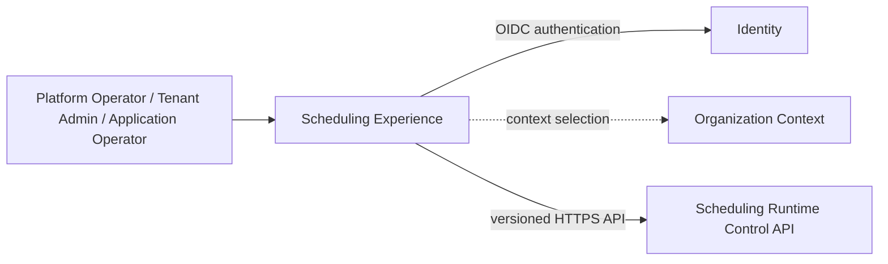
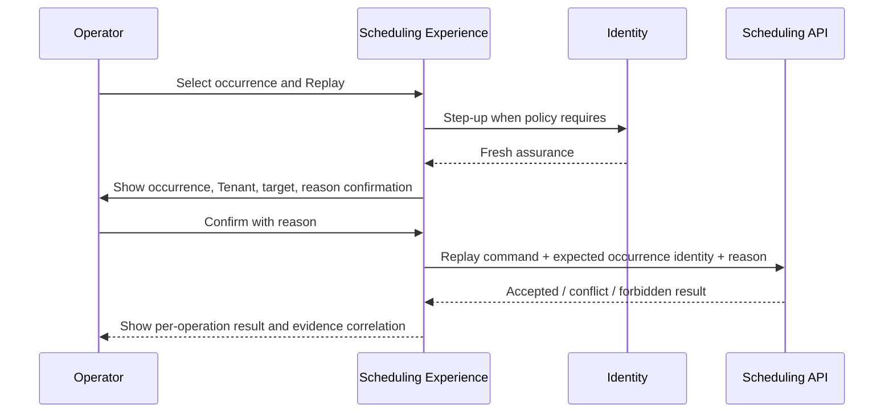

---
doc_meta:
  id: SAD-014
  title: Scnehaux Scheduling Experience
  owner: Scheduling Platform Team
  version: 1.0.0
  status: draft
  classification: restricted
  governed_by:
    - GDC-009
  parent_pad: PAD-PLT-011
  review_cycle_days: 90
  created_date: 2026-08-22
  last_reviewed: 2026-08-22
  technologies:
    - name: react
      type: frontend-framework
    - name: kubernetes
      type: orchestration
    - name: opentelemetry
      type: observability
---

# Scnehaux Scheduling Experience

## 1. Purpose & Scope

### 1.1 Objective

Provide a fully Scnehaux-owned administrative and operational user experience for Schedule lifecycle, Occurrence inspection, misfire/replay operations, Tenant/application usage, and Scheduler health without exposing database, Kafka, or third-party task-queue dashboards.

### 1.2 Capability

The application provides:

- Schedule search/list/detail and ownership context
- create/update/pause/resume/cancel operations
- recurrence/time-zone preview
- upcoming Occurrence timeline
- Occurrence/misfire/dispatch/replay history
- per-Tenant/application quota and usage visibility
- target registration visibility
- privileged replay and quota-override workflows
- dispatch-lateness and backlog dashboards
- audit/evidence correlation links

### 1.3 Requirement

Every operation must display explicit Tenant and Application scope, preserve server-side authorization, and use only the governed Scheduling Control API.

### 1.4 Constraint

- React is the rendering framework
- the internal-tool build follows the adopted SPA build-toolchain decision
- Scnehaux UI Platform packages provide tokens, primitives, accessibility, and interaction foundations
- the browser never reads Scheduling PostgreSQL, Kafka topics, broker admin endpoints, or internal recurrence-library state
- Asynqmon, Bull Board, RabbitMQ Management UI, Kafka admin UI, or other vendor/library operational UI is not embedded or exposed as the Scheduler product experience
- authorization is never inferred from hidden/disabled client controls
- access and refresh tokens are not persisted in browser local storage

### 1.5 Assumption

- SAD-013 exposes versioned control/query APIs
- Identity provides browser authentication and step-up capability
- Organization supplies canonical operating context
- UI Platform packages are available

### 1.6 Out of Scope

- Schedule execution
- due claiming
- Kafka publication
- database administration
- Product worker monitoring beyond linked correlation facts
- Notification administration
- infrastructure cluster administration

## 2. Enterprise Traceability

### 2.1 Realizes

This system realizes the administrative-experience portion of PAD-PLT-011. Scheduling authority remains in SAD-013.

It inherits Identity, Tenant, application ownership, accessibility, audit, and API-contract rules from the enterprise architecture and global standards.

## 3. Solution Context

### 3.1 System Context



### 3.2 External

The browser communicates only with enterprise Identity/context endpoints needed for sign-in/context and the Scheduling Control API. It has no direct broker/database/provider integration.

### 3.3 Internal

The SPA is organized by platform capability rather than vendor UI concepts:

- Schedule Management
- Occurrence Timeline
- Misfire & Replay Operations
- Usage & Quota
- Target Discovery
- Operational Health
- Audit Correlation

UI state does not become Scheduling authority.

## 4. Architecture Model

### 4.1 Container

One independently deployable React SPA served through the enterprise web delivery path. It consumes versioned Scheduling APIs and Scnehaux UI Platform packages.

### 4.2 Component

```text
app-shell
  -> schedule-management
  -> occurrence-operations
  -> quota-usage
  -> platform-health
  -> audit-correlation

feature modules -> scheduling-api client
feature modules -> scnehaux-ui-platform packages
```

### 4.3 Runtime Flow — Privileged Replay



## 5. State & Data Architecture

### 5.1 Storage

No authoritative business or Scheduling database exists in the browser application. Durable state is owned by SAD-013.

### 5.2 Cache

Client-side query caching is bounded and invalidated/refetched after mutations. Cached authorization does not grant actions.

### 5.3 Schema

API models are generated or validated from the governed Scheduling API contract. Frontend types are not independent domain schemas.

### 5.4 Stateless Client

Reloading the SPA loses only ephemeral UI state. Schedule/Occurrence state is reconstructed from the Control API.

## 6. Integration Contracts

### 6.1 API

The SPA consumes only the versioned Scheduling Control API for schedules, occurrences, preview, replay, quotas, targets, and operational projections.

### 6.2 Events

The browser does not consume Kafka directly. Near-real-time UI updates, if required, are exposed by a Scheduling-owned API projection/stream contract rather than broker credentials in the browser.

### 6.3 Consumed

- Identity browser authentication and step-up
- Organization operating-context discovery where required
- Scnehaux UI Platform packages at build time
- Scheduling Control API at runtime

## 7. Security & Trust Boundary

### 7.1 Authentication

Browser authentication uses the enterprise OIDC flow. Session/token handling follows the UI/IAM standards and does not store long-lived bearer credentials in local storage.

### 7.2 Authorization

The Scheduling API is authoritative for authorization. The SPA passes context and intent but cannot grant itself Tenant, application, replay, or quota authority.

### 7.3 Encryption

All runtime network traffic uses enterprise TLS policy.

### 7.4 Secrets

No Scheduler infrastructure secret, database credential, Kafka credential, or provider credential is shipped to the browser bundle.

### 7.5 Audit

Privileged operations require explicit reason capture and expose resulting evidence correlation. UI telemetry never replaces server-side evidence.

## 8. NFR

### 8.1 Blast Radius

An Experience outage prevents human administration but does not stop existing Schedule materialization or dispatch. SAD-013 continues independently.

### 8.2 Latency and Scalability

- interactive control queries target p95 <= 500 ms excluding explicitly asynchronous aggregation views
- list views use server-side pagination/filtering rather than loading unbounded Schedule history
- timeline/history views use bounded windows and virtualized presentation when needed
- control mutations return explicit accepted/conflict/forbidden outcomes

### 8.3 Observability and Telemetry

Frontend telemetry is OpenTelemetry-compatible where supported and correlates UI actions with Scheduling API traces without recording schedule secrets or sensitive trigger payloads.

### 8.4 Accessibility and Usability

- Scnehaux UI Platform accessibility baseline applies
- Tenant/Application scope is visually persistent for destructive or privileged operations
- destructive actions require explicit confirmation and safe defaults
- time is shown with both user-facing zone context and unambiguous canonical instant on detail screens

### 8.5 Runbook

Operational guidance covers API degradation, stale client cache, authentication/session failures, partial list-query failures, and rollback of the frontend artifact.

## 9. Deployment Strategy

### 9.1 Environment

Immutable frontend artifacts are promoted across governed environments. Environment configuration contains only public runtime endpoints and non-secret settings.

### 9.2 Infrastructure

The application is built as an internal React SPA using the adopted enterprise build toolchain and deployed through the standard web/container delivery path. No third-party scheduler dashboard runtime is required.

### 9.3 CI/CD

Blocking gates include:

- frontend lint/type/build tests
- UI Platform contract tests
- accessibility checks
- API contract compatibility
- authorization-negative-path E2E tests
- Tenant-context isolation E2E tests
- secret scanning and dependency vulnerability checks
- bundle and performance budgets
- architecture governance lint

## 10. Architecture Decisions

### 10.1 Accepted

- fully custom Scnehaux operational experience
- Scheduling Control API is the only Scheduling runtime boundary exposed to the browser
- React SPA for this internal operational tool

### 10.2 Rejected

#### 10.2.1 Embedded Third-Party Queue/Scheduler UI

Rejected because it couples the Scnehaux product surface, authorization model, Tenant semantics, and lifecycle to an internal implementation that must remain replaceable.

#### 10.2.2 Direct PostgreSQL or Kafka Administration from Browser

Rejected because it bypasses domain authorization, evidence, contract versioning, and least privilege.

#### 10.2.3 Client-Side Authorization

Rejected because visibility state cannot establish server authority.

## 11. Assumptions

- Scheduler operators and Tenant/application administrators are represented by enterprise Identity/Organization context
- UI Platform primitives satisfy the required accessibility baseline

## 12. Compatibility Strategy

The SPA follows Scheduling API versions and supports the enterprise deprecation window. A replacement of PostgreSQL, Kafka, recurrence library, or due-claim mechanism requires no UI rewrite when the Control API remains compatible.
