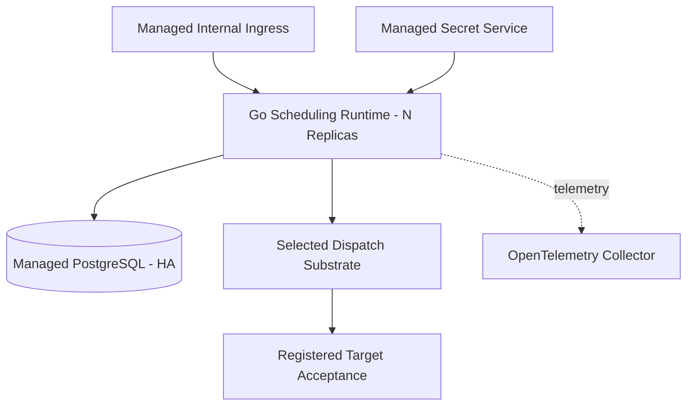
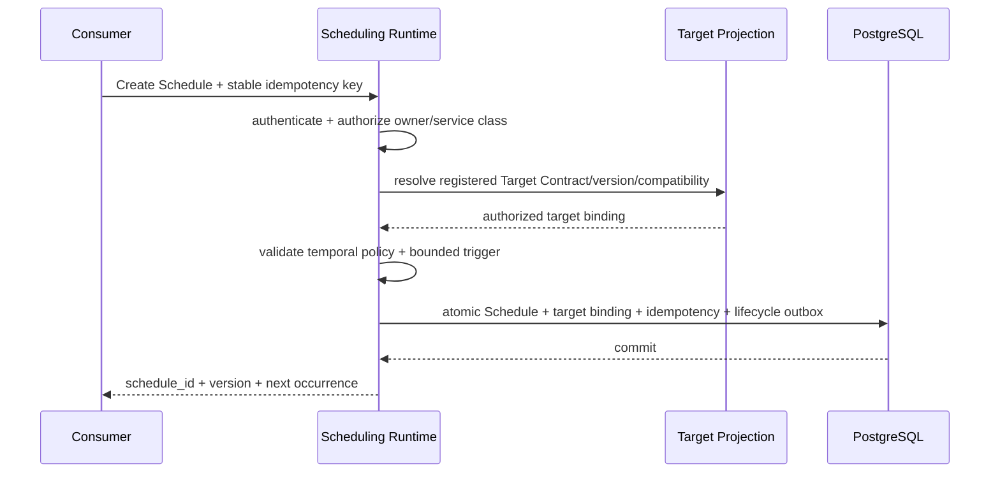
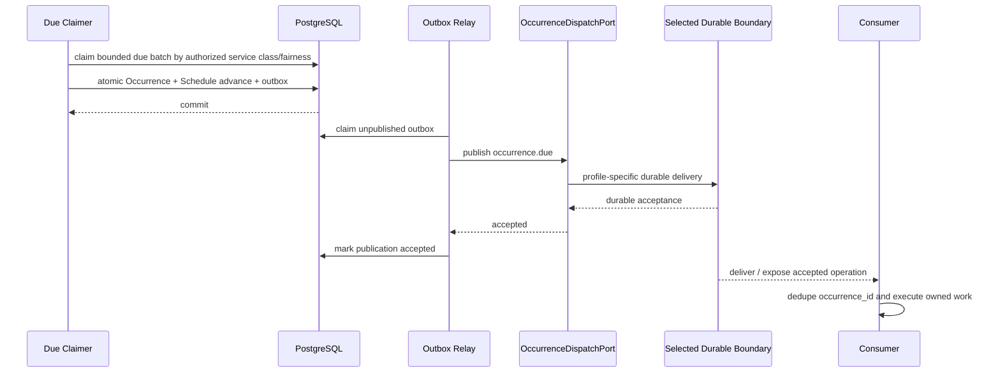
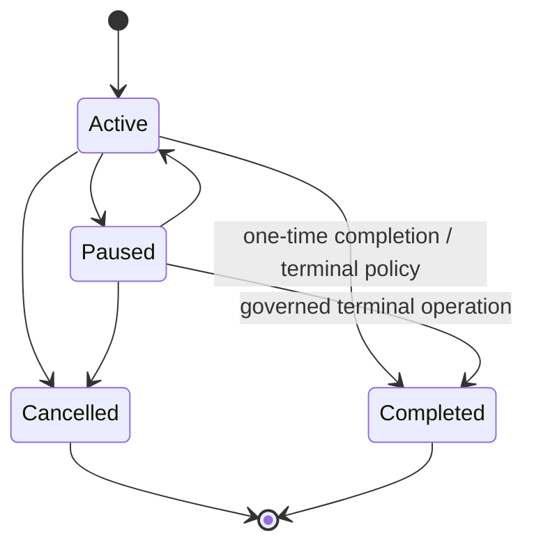
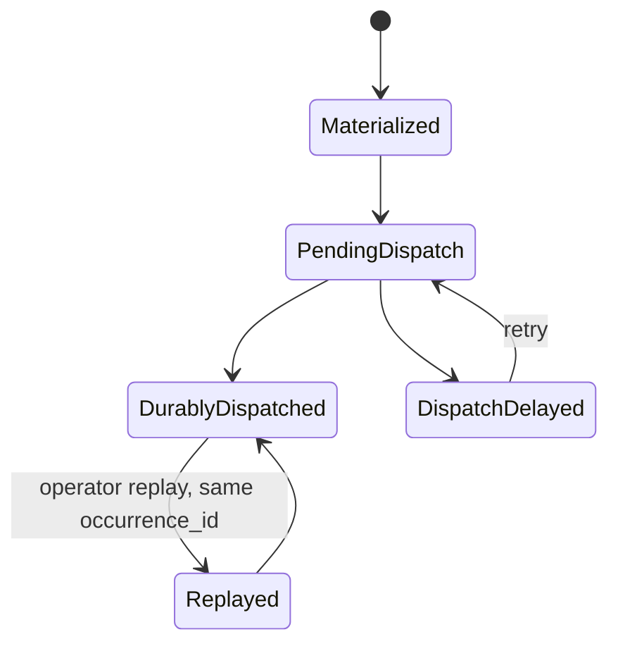
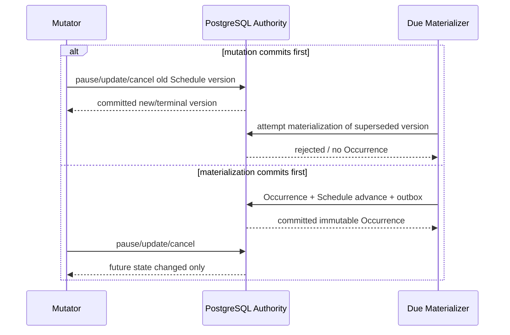
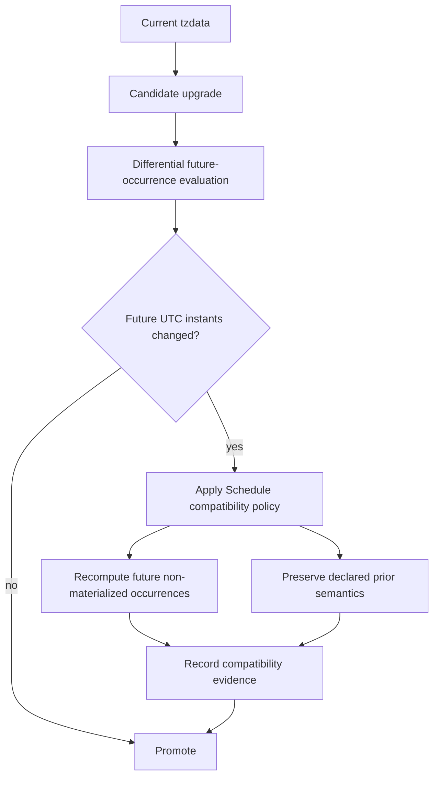
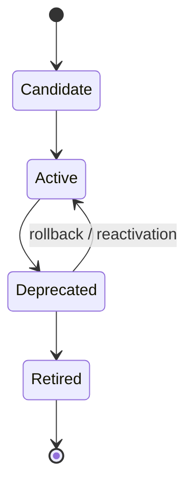
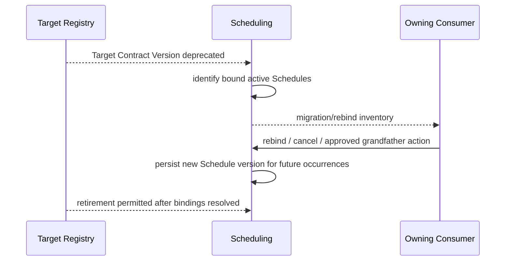
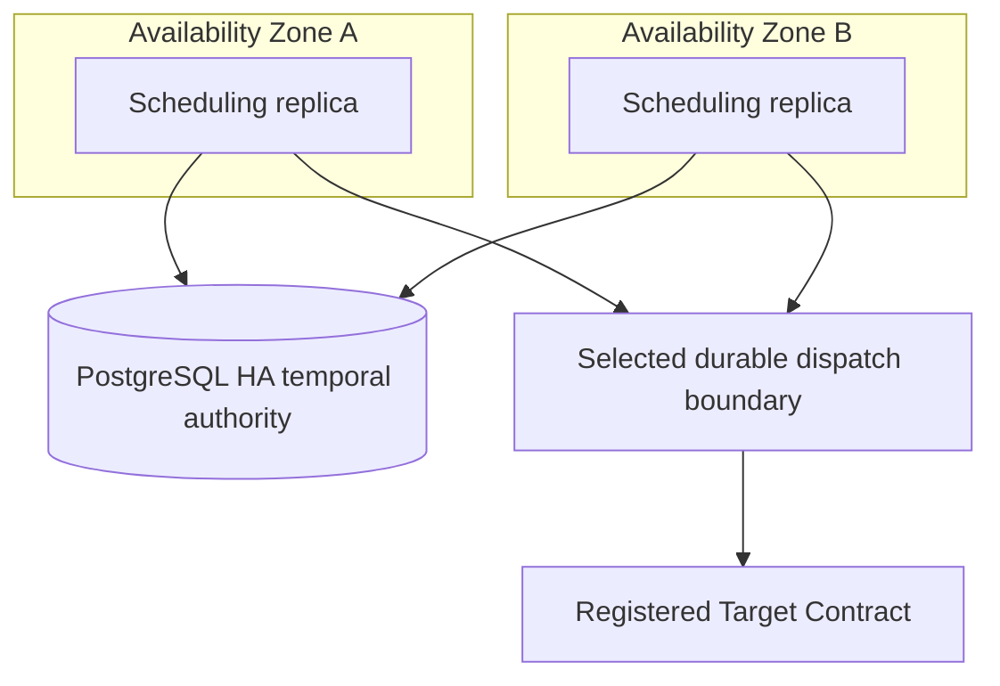

---
doc_meta:
  id: SAD-013
  title: Scnehaux Scheduling Runtime
  owner: Scheduling Platform Team
  version: 2.2.0
  status: approved
  classification: restricted
  governed_by:
    - GDC-009
    - ADR-SCH-002
  parent_pad: PAD-PLT-011
  review_cycle_days: 90
  created_date: 2026-08-22
  last_reviewed: 2026-09-09
  technologies:
    - name: golang
      type: backend-language
    - name: postgresql
      type: database
    - name: rabbitmq
      type: queue-broker-profile
    - name: kafka
      type: stream-broker-profile
    - name: kubernetes
      type: orchestration
    - name: opentelemetry
      type: observability
---

# Scnehaux Scheduling Runtime

## 1. Purpose & Scope

### 1.1 Objective

Realize PAD-PLT-011 as a durable multi-tenant Scheduling runtime that accepts Schedule lifecycle commands, persists authoritative temporal state, materializes each logical due Occurrence once, and dispatches that Occurrence at least once through a selected durable-delivery profile without running consumer business code.

Scheduling correctness is independent of RabbitMQ, Kafka, or direct HTTP.

### 1.2 Capability

The deployable provides:

- Schedule control API
- one-time and recurring temporal calculation
- Schedule lifecycle and optimistic mutation
- multi-replica due claiming
- durable Occurrence materialization
- misfire recovery
- source-local transactional outbox
- transport-neutral Outbox Relay
- Direct/RabbitMQ/Kafka dispatch adapters
- Target Contract registration/projection and version binding
- Target deprecation/retirement reconciliation
- bounded Scheduling Service Class admission/fairness metadata
- target/application ownership projection
- Tenant/application/target admission and quota
- operational query, replay, and reconciliation

### 1.3 Requirement

The runtime remains correct under:

- duplicate commands
- lost/ambiguous create responses
- concurrent replicas
- process termination during due processing
- selected delivery-substrate outage
- target outage in Direct profile
- duplicate transport delivery
- time-zone/DST transitions and tzdata upgrades that change future instants
- near-due update/cancel races
- Target Contract deprecation/retirement while recurring Schedules remain active
- prolonged outage followed by recovery
- profile migration without duplicate logical Occurrence creation
- service-class saturation and noisy-neighbor load

The inherited mature default SLO remains 99.9% of due Occurrences durably dispatched within 30 seconds of `scheduled_for`.

### 1.4 Constraint

- Go is the application runtime
- PostgreSQL is the authoritative Scheduling store
- source state mutation and publication intent use one local transactional-outbox transaction
- dispatch occurs only through the `OccurrenceDispatchPort`
- default Scnehaux deployment uses the Queue profile with RabbitMQ
- Kafka is the supported Stream profile
- Direct Durable Delivery is permitted only for bounded deployments/relationships whose target exposes governed idempotent durable acceptance
- one Occurrence contract has one primary delivery adapter per environment
- blind RabbitMQ+Kafka dual-publish is prohibited
- Kubernetes is the approved orchestration substrate
- OpenTelemetry is the instrumentation contract
- Product business code never executes inside Scheduling
- no Product operational database is read directly
- no arbitrary URL, shell command, function body, or container image is accepted as a Target
- every durable Target is a registered Target Contract with explicit ownership and compatibility metadata
- a registered Notification deferred-command Target is permitted only with bounded non-secret trigger input
- Scheduling never resolves Notification provider/channel credentials or Application Notification Profiles
- Scheduling Service Class is bounded and derived from authorized application/Target profile, never an arbitrary caller priority number
- relational durable state and short transactional due claims remain the initial timing mechanism
- physical module extraction requires measured scale/security/fault-containment evidence and a separate SAD

### 1.5 Assumptions

- Identity publishes locally verifiable workload/user trust
- Organization provides canonical Tenant context through bounded contracts
- application/service ownership and Target Contract ownership can be projected from enterprise trust/catalog capability
- PostgreSQL and the selected dispatch substrate are operated to the declared reliability class
- consumers enforce `occurrence_id` idempotency
- Direct-profile target APIs persist/deduplicate before successful acknowledgement

### 1.6 Out of Scope

- Product Worker implementation
- Product retry, compensation, or business completion state
- Workflow process state
- Notification provider delivery
- secret/credential custody
- broker administration as a Product experience
- universal enterprise broker ownership
- arbitrary routing endpoints supplied in Schedule payload

## 2. Enterprise Traceability

| Relationship | Target                                                                     |
| :----------- | :------------------------------------------------------------------------- |
| Realizes     | PAD-PLT-011 Enterprise Scheduling Platform                                 |
| Governed by  | ADR-SCH-002 PostgreSQL Temporal Authority and Replaceable Durable Dispatch |
| Conforms to  | ADR-GLB-016 Transactional Publication and Durable Messaging Profiles       |
| Conforms to  | ADR-GLB-017 Enterprise Durable Scheduling Boundary with Profiled Dispatch  |
| Conforms to  | ADR-GLB-014 Background Worker Network Boundary                             |
| Conforms to  | ADR-GLB-004 Declarative Schema Lifecycle                                   |
| Conforms to  | STD-GLB-002 Database Standard                                              |
| Conforms to  | STD-GLB-003 Observability Standard                                         |
| Conforms to  | STD-GLB-004 Event-Driven Architecture & Messaging Standard                 |
| Conforms to  | STD-GLB-005 Resilience Standard                                            |
| Conforms to  | STD-GLB-010 Durable Scheduled Work Standard                                |

The runtime does not redefine Product, Workflow, Notification, Identity, Organization, Background Job, or Event & Messaging authority.

## 3. Solution Context

### 3.1 System Context

```mermaid
graph LR
    CONSUMER[Product / Platform Consumer]
    UI[Scheduling Experience]
    SCHED[Scheduling Runtime]
    DB[(Scheduling PostgreSQL)]
    MSG[Selected Durable Delivery Boundary]
    TARGET[Registered Target Contract Acceptance]
    TRUST[Identity / Organization / App Trust Projections]
    CATALOG[Target Contract / Application Metadata]
    AUDIT[Audit & Evidence]

    CONSUMER -->|Schedule command| SCHED
    UI -->|Control API| SCHED
    SCHED --> DB
    TRUST -. bounded/local control facts .-> SCHED
    CATALOG -. target ownership/version metadata .-> SCHED
    SCHED -. occurrence.due .-> MSG
    MSG -. at-least-once .-> TARGET
    SCHED -. lifecycle/evidence facts .-> MSG
    MSG -. governed subscription/acceptance .-> AUDIT
```

The target consumer is not a Scheduling container. A target is a registered Product/Platform acceptance contract, Worker-owning application boundary, or bounded Notification command contract.

### 3.2 External Dependencies

Always required:

- PostgreSQL
- enterprise trust/context artifacts
- registered application/Target ownership metadata
- secret delivery for runtime infrastructure credentials
- observability export

Profile-dependent:

- Direct — registered target durable-acceptance API
- Queue — RabbitMQ
- Stream — Kafka protocol broker

No business-vendor dependency exists in Scheduling.

### 3.3 Internal Modules

The initial Go deployable contains:

1. **Control API** — authentication context, command idempotency, validation, authorization, query
2. **Schedule Domain** — lifecycle invariants and temporal policy
3. **Temporal Calculator** — versioned replaceable recurrence calculation
4. **Due Claimer** — horizontally safe due-Schedule acquisition
5. **Occurrence Materializer** — creates stable Occurrence and advances Schedule state atomically
6. **Outbox Relay** — claims committed transport-neutral publication intents
7. **Occurrence Dispatch Port** — stable application contract for durable dispatch
8. **Direct Adapter** — idempotent target durable-acceptance API
9. **RabbitMQ Adapter** — queue-oriented dispatch
10. **Kafka Adapter** — stream-oriented dispatch
11. **Target Projection** — registered Target Contract ownership/version/compatibility metadata
12. **Service Class, Quota & Admission** — bounded criticality, Tenant/application/Target limits, saturation protection
13. **Operations & Reconciliation** — target retirement/rebinding, replay, repair, state comparison, support query

Only adapters required by the selected deployment profile need to be enabled/deployed.

## 4. Architecture Model

### 4.1 Container



For Direct profile, `MSG` is the governed target durable-acceptance boundary rather than a broker.

### 4.2 Component

```text
adapter/http           -> app/command       -> domain/schedule
adapter/http           -> app/query         -> app/ports
adapter/db             -> app/ports
due-runner             -> app/materialize   -> domain/schedule
outbox-relay           -> app/publish       -> app/ports/occurrence-dispatch
adapter/dispatch/http  -> app/ports
adapter/dispatch/rmq   -> app/ports
adapter/dispatch/kafka -> app/ports
adapter/trust          -> app/ports
adapter/target-catalog -> app/ports
```

Domain packages depend on no network, database, broker, Kubernetes, or UI package.

### 4.3 Runtime Flow — Create Schedule



The idempotency record is scoped to authenticated application/Tenant ownership.

Equivalent retry with the same identity returns the same logical `schedule_id`. Conflicting semantic reuse is rejected.

The Control API exposes owned recovery/reconciliation so a caller can recover an ambiguous create result without creating a second Schedule.

### 4.4 Runtime Flow — Due Occurrence and Dispatch



No external network call occurs inside the authoritative due-state transaction.

### 4.5 Schedule State Machine



Persistence invariants:

- each state mutation is version-checked and committed atomically in PostgreSQL;
- cancellation is terminal for future materialization;
- pause/update affect future non-materialized work according to the persisted misfire/compatibility policy;
- Product business completion never changes Schedule state implicitly.

### 4.6 Occurrence State Machine



- Materialization, Schedule advance, and outbox intent share the authoritative transaction.
- No external I/O occurs inside materialization.
- Replay never creates a second `occurrence_id`.
- Consumer success/failure is outside Scheduler-owned Occurrence state.

### 4.7 Profile Durability Points

| Profile        | Dispatch durability point                                    | Consumer durability point                                            |
| :------------- | :----------------------------------------------------------- | :------------------------------------------------------------------- |
| Direct         | registered target confirms persisted/deduplicated acceptance | target Inbox/Operation or atomic effect                              |
| RabbitMQ Queue | publisher confirm under durable queue contract               | ACK only after local dedup/durability                                |
| Kafka Stream   | producer acknowledgement under replicated stream contract    | offset/consumer acknowledgement only after declared local durability |

Scheduler dispatch state never represents Product business completion.

### 4.8 Misfire Recovery

After restart/outage the Due Claimer discovers elapsed Schedule state and applies persisted policy:

- `skip` advances to the first future occurrence and records skip evidence
- `fire_once` materializes exactly one recovery Occurrence using the latest missed logical instant as its `scheduled_for`
- `catch_up_bounded` materializes only the permitted finite recovery set

Every recovery Occurrence preserves a logical `scheduled_for`. One-time Schedules that become overdue while paused/unavailable use an explicit one-time misfire policy rather than implicit immediate firing.

### 4.9 Replay

Operational replay republishes the existing Occurrence with the same `occurrence_id`.

Replay does not create a second logical business occurrence.

Profile adapter changes do not change replay identity.

### 4.10 Mutation Linearization and Schedule-Version Binding

The authoritative transaction that materializes an Occurrence is the linearization point between a due Schedule version and later pause/update/cancel mutations.



- if pause/update/cancel commits before materialization, the superseded/paused/cancelled Schedule version cannot materialize that future Occurrence
- if Occurrence materialization commits first, the Occurrence remains valid, immutable, and dispatchable even if pause/update/cancel commits immediately afterward
- an update changes only future non-materialized Occurrences; already materialized Occurrences retain the Schedule version, Target Contract Version, recurrence-semantics version, DST policy version, and computed `scheduled_for` that produced them
- a cancelled Schedule is terminal for future materialization, but cancellation does not fabricate retraction of an already materialized or durably dispatched Occurrence
- consumers still enforce occurrence idempotency and their own terminal-state/business-validity checks before irreversible effects

Exact locking/optimistic-version predicates and outbox state transitions belong in TDD, but CI must prove the externally visible linearization semantics under concurrent replicas.

### 4.11 Temporal Compatibility Evidence

Each Schedule version carries versioned recurrence interpretation and DST policy. Materialized Occurrence evidence records the time-zone identifier and time-zone-data version used for computation. The platform default follows governed current IANA time-zone data rather than pinning obsolete civil-time rules indefinitely.



Materialized Occurrences are never rewritten. Upgrades that change future computed instants are surfaced as compatibility evidence before rollout and handled under the Schedule version's declared compatibility policy.

### 4.12 Target Contract Lifecycle & Retirement



Scheduling persists or resolves the following logical binding fields:

```text
target_contract_id
target_contract_version
target_owner_application_id
target_compatibility_policy
```

Rules:

- new Schedules cannot bind to `Retired` Target Contract Versions;
- existing bindings to `Deprecated` versions continue only inside their declared support window;
- automatic rebind is permitted only when the compatibility policy explicitly proves semantic compatibility;
- otherwise the owning consumer must rebind, cancel, or explicitly grandfather the Schedule before retirement;
- retirement never silently redirects to a semantically different handler.

Target-retirement reconciliation:



A Target Contract identifies an acceptance contract, not a concrete replica/URL. Physical target replicas may change without Schedule mutation when the contract remains compatible.

### 4.13 Scheduling Service Classes & Saturation

Initial bounded classes are:

```text
C1 Critical    - mission-critical due dispatch; protected capacity
C2 Business    - normal business scheduling
C3 Best Effort - reports, maintenance, non-critical triggers
```

Rules:

- service class is authorized from registered application/Target profile and never trusted from an arbitrary caller priority field;
- exact reserved capacity/weighted-fairness algorithm belongs in TDD, but starvation and uncontrolled priority escalation are prohibited;
- due materialization/dispatch protects its declared C1/C2/C3 budgets before admin/list/preview bulk work;
- admin/list/preview and heavy reconciliation shed before authoritative due-dispatch correctness;
- per-Tenant/application/Target quotas remain active inside each class;
- lower classes may be delayed under saturation but cannot be silently dropped outside their declared misfire/failure policy.

## 5. State & Data Architecture

### 5.1 Storage

One private PostgreSQL database is authoritative for Scheduling runtime state.

Logical state families:

- Schedule aggregate including recurrence-semantics/DST policy version
- Target Contract ID/version/owner/compatibility binding
- Scheduling Service Class
- Occurrence including producing Schedule/Target version and time-zone-data computation evidence
- command idempotency
- create-command semantic fingerprint and idempotency-to-`schedule_id` mapping
- registered-target projection
- application/Tenant/Target quota and consumption
- transport-neutral outbox publication state
- dispatch profile/route reference where operationally required
- replay/reconciliation/target-retirement metadata

Exact DDL, indexes, table partitioning, claim queries, queue/topic names, and adapter configuration belong in TDDs.

### 5.2 Schema

- declarative Atlas lifecycle
- migration role separate from runtime role
- runtime role has no DDL privilege
- UUIDv7 durable identifiers
- Tenant-scoped state uses enterprise RLS where applicable
- due-access paths are performance-tested at forecast and 10x forecast peak
- the authoritative uniqueness model prevents more than one logical Occurrence for the same Schedule version and logical `scheduled_for`
- materialized Occurrence temporal/Target/version evidence is immutable
- service-class mutation is versioned and attributable
- Target retirement cannot delete binding evidence needed to explain historical Occurrences

### 5.3 Cache

Cache is non-authoritative.

Schedule lifecycle, Occurrence identity, Target Contract binding, idempotency, service class, and dispatch durability never depend on cache survival.

### 5.4 Stateless Compute

Replicas hold no correctness-critical state exclusively in memory.

PostgreSQL transaction time is canonical for due claiming so host clock skew cannot become competing temporal authority.

## 6. Integration Contracts

### 6.1 API

The versioned Control API provides:

- idempotent create
- create-result recovery/reconciliation
- read/list
- update
- pause/resume/cancel
- preview
- occurrence query
- replay
- Target Contract discovery/binding/rebind inventory
- reconciliation

Mutating commands require:

- authenticated identity/workload context
- canonical ownership scope
- authorized Scheduling Service Class/profile
- idempotency key
- semantic consistency with prior use of that scoped identity
- expected Schedule version where races are possible
- registered Target Contract/version or governed compatible-version selection
- privileged reason/evidence for replay, target-retirement override, service-class override, quota override, cross-Tenant administration

Errors use the enterprise RFC 9457 contract.

### 6.2 Published Contracts

CloudEvents lifecycle/event families include:

```text
com.scnehaux.scheduling.schedule.created.v1
com.scnehaux.scheduling.schedule.updated.v1
com.scnehaux.scheduling.schedule.cancelled.v1
com.scnehaux.scheduling.occurrence.due.v1
com.scnehaux.scheduling.occurrence.misfired.v1
```

The logical `OccurrenceDue` contract contains:

- stable Schedule/Occurrence IDs
- `scheduled_for`
- application/Tenant ownership
- stable Target Contract ID/version or immutable resolved dispatch reference sufficient to reproduce the binding decision
- correlation
- bounded trigger data

It contains no credential and no RabbitMQ/Kafka-specific field.

### 6.3 Consumed Contracts

- Identity local verification material
- Organization Tenant/context projection
- Application/Service Trust and Target Contract ownership/version projection
- enterprise secret delivery for infrastructure credentials
- selected STD-GLB-004 durable-delivery profile
- enterprise schema-contract registry/catalog
- OpenTelemetry export

No per-occurrence synchronous Identity/Organization/catalog fan-in exists.

## 7. Security & Trust Boundary

### 7.1 Authentication

Human/workload callers use audience-bound enterprise Identity credentials.

Protected-resource tokens are validated locally according to IAM standards.

### 7.2 Authorization

- application ownership and Tenant scope are enforced on every command
- privileged provider operations use an explicit cross-Tenant path
- caller-supplied `application_id` never replaces authenticated ownership
- Target Contract binding/change requires authorization against registered-target projection
- Scheduling Service Class is resolved from authorized profile rather than arbitrary caller priority
- replay, target-retirement override, service-class override, and quota override are privileged

### 7.3 Dispatch Security

All profiles enforce authenticated workload identity, encrypted transport, least privilege, payload minimization, and governed Target Contract registration.

Direct-profile target endpoints come from trusted target registration, never Schedule payload URLs.

RabbitMQ/Kafka admin surfaces are not Product APIs.

### 7.4 Secrets

Schedule/outbox/due-event records never store provider credentials, API keys, OAuth refresh tokens, or private keys.

Runtime infrastructure credentials arrive through enterprise secret delivery.

### 7.5 Audit

Create, update, cancel, pause/resume, Target change/deprecation/retirement reconciliation, misfire-policy change, tzdata compatibility decision, service-class change, replay, quota override, repair, profile migration, and cross-Tenant operations produce traceable evidence with actor, scope, reason, and correlation.

## 8. NFR

### 8.1 Blast Radius

A Scheduling Runtime outage delays future dispatch but does not mutate Product business truth.

A selected delivery-boundary outage retains committed publication intent in the local outbox.

A Direct target outage affects that target relationship only.

A RabbitMQ queue/route failure must be isolated from unrelated target queues where topology permits.

A Kafka partition/consumer issue must be isolated according to topic/partition design.

Target Contract deprecation affects only Schedules bound to the relevant contract/version and cannot silently route unrelated Schedules.

Target reliability remains C1:

- mature service availability >=99.95% monthly
- RTO <=1 hour
- RPO = 0 for committed Schedule/Occurrence/idempotency/Target-binding/outbox state across process, node, and declared availability-zone failover in the production HA profile
- cross-region disaster-recovery RPO <=15 minutes for the initial regional profile unless a stronger Tenant/regulatory profile is declared

### 8.2 Latency, Throughput, Scalability, and Fairness

- default due-dispatch SLO: 99.9% within 30 seconds of `scheduled_for`
- production capacity gate: 10x forecast peak due rate without SLO breach
- compute scales horizontally
- bounded claim batches and short transactions limit database lock duration
- per-application/Tenant/Target quotas enforce fairness
- bounded C1/C2/C3 service classes protect declared criticality without arbitrary priority escalation
- control/list/preview and bulk reconciliation traffic sheds before due-dispatch work
- lower-class starvation is prohibited; delayed work follows its declared misfire/failure semantics
- profile capacity is certified independently

### 8.3 Observability

Common telemetry:

- dispatch lateness distribution by service class
- active Schedule count
- due/materialized Occurrence rate
- oldest undispatched Occurrence by service class
- misfire/replay count
- outbox oldest age
- dispatch publication latency/error
- database claim latency/contention
- per-Tenant/application/Target/service-class quota utilization
- admission reject/saturation
- Target Contract deprecated-binding inventory and oldest unresolved retirement
- tzdata differential/compatibility decision counts

Profile telemetry:

**Direct**

- target acceptance latency/error
- ambiguous response count
- retry backlog age

**RabbitMQ**

- publisher confirm latency
- queue ready/unacked count
- oldest queue age
- redelivery and DLQ depth

**Kafka**

- producer acknowledgement latency
- consumer lag
- partition skew
- retention/storage pressure
- replay position/age

### 8.4 Retry, Timeout, Circuit Breaker, and Failover

- database transaction contains no external network call
- Outbox Relay retries selected dispatch only
- Direct profile uses bounded timeout, exponential backoff/jitter, circuit breaker, and ambiguous-result reconciliation
- RabbitMQ profile retries publish without manufacturing a new `occurrence_id`
- Kafka profile retries publish without manufacturing a new `occurrence_id`
- consumer business retry remains outside Scheduling
- application replicas span availability zones
- database and broker failover follow profile recovery contracts
- Target retirement/rebind retries are idempotent and do not rewrite historical Occurrences

### 8.5 Runbooks

Production runbooks cover:

- PostgreSQL failover
- selected messaging-substrate outage
- Direct target outage/ambiguous acceptance
- stuck outbox
- dispatch-lateness breach
- queue backlog/DLQ
- stream lag/partition skew
- quota/service-class saturation
- time-zone regression or tzdb semantic delta
- near-due mutation/materialization race
- Target Contract deprecation/retirement with unresolved bindings
- misfire surge
- duplicate dispatch
- replay
- profile migration
- rollback

### 8.6 Multi-AZ Failure-Domain View



Failure semantics:

- loss of one runtime replica or AZ reduces capacity but does not create a second temporal authority;
- PostgreSQL failover preserves one authoritative Schedule/Occurrence timeline and is proven through recovery tests;
- dispatch-substrate outage accumulates committed outbox/lateness and does not re-materialize Occurrences;
- recovery resumes delivery from durable state and applies the persisted misfire policy;
- target outage does not mutate Schedule/Occurrence truth and is contained to the relevant Target relationship/profile.

## 9. Deployment Strategy

### 9.1 Deployment Profiles

| Profile          | Runtime dependencies               | Intended use                                                                |
| :--------------- | :--------------------------------- | :-------------------------------------------------------------------------- |
| `minimal-direct` | PostgreSQL + governed target HTTPS | local/lab or tightly bounded point-to-point deployments                     |
| `queue-rabbitmq` | PostgreSQL + RabbitMQ              | **default Scnehaux deployment** for targeted due-trigger delivery           |
| `stream-kafka`   | PostgreSQL + Kafka                 | retained/replayable stream learning or workloads requiring stream semantics |

One Occurrence contract uses one primary profile in an environment.

A mixed environment may run RabbitMQ and Kafka only for **different contracts** with different semantics or an explicitly governed migration.

### 9.2 Infrastructure

Common:

- OCI-compatible Go artifact
- Kubernetes across multiple availability zones for production
- managed/HA PostgreSQL capability
- enterprise secret management
- OpenTelemetry collector/export

Queue profile:

- RabbitMQ durable/quorum topology appropriate to C1
- publisher-confirm and DLQ configuration

Stream profile:

- replicated Kafka-protocol topics
- producer durability, retention, partition, consumer-group policy

Direct profile:

- source Outbox Relay
- registered target TLS/auth
- target durable Inbox/Operation acceptance

Initial production is single-region multi-AZ. Regional/silo profiles are introduced from Tenant/residency/fault-containment requirements rather than code forks.

### 9.3 CI/CD

Blocking gates include:

- formatting, static analysis, build, race, dependency integrity
- package-boundary enforcement
- Atlas migration integrity and RLS tests using runtime roles
- Schedule and Occurrence state-machine transition/property tests
- recurrence property tests and DST/time-zone golden corpus
- tzdb-version differential tests proving governed compatibility behavior for existing Schedule versions
- concurrent-replica Occurrence uniqueness tests
- near-due pause/update/cancel vs materialization race tests proving the declared linearization point
- fire-once golden tests proving the latest missed logical instant is preserved as `scheduled_for`
- overdue one-time Schedule misfire tests
- restart/fault tests around materialization and outbox
- Target Contract create/bind/deprecate/rebind/retire compatibility tests
- test proving retirement cannot silently route to a different semantic handler
- service-class authorization, weighted-fairness/reservation, starvation, and saturation-shedding tests
- profile-parity contract tests for stable `OccurrenceDue`
- Direct lost-response/idempotent-target tests
- RabbitMQ publisher-confirm, redelivery, DLQ, node-loss tests
- Kafka producer-ack, duplicate, consumer-group, replay tests
- dual-adapter startup/config rejection test
- lost-create-response test proving same logical `schedule_id`
- conflicting idempotency-key reuse test
- Notification binding-reconciliation tests
- Tenant isolation, quota, saturation tests
- multi-AZ replica loss and PostgreSQL failover exercises before production SLO claims
- secret/vulnerability scanning
- architecture traceability/linting

Deployments are progressive and reversible.

## 10. Architecture Decisions

### 10.1 Accepted

- ADR-SCH-002 selects PostgreSQL temporal authority and replaceable durable dispatch
- ADR-GLB-016 defines source-local outbox and delivery profiles
- queue-rabbitmq is the default Scnehaux Scheduling deployment profile
- Kafka remains a first-class stream profile rather than a universal dependency
- Direct profile is permitted only through registered durable acceptance
- Schedule creation remains idempotent/recoverable after ambiguous responses
- Target Contract ID/version is explicit and retirement/rebind is reconciled rather than silently redirected
- bounded C1/C2/C3 Scheduling Service Classes govern saturation/admission without arbitrary user priority
- tzdata upgrades use differential compatibility evaluation and never rewrite materialized Occurrences
- custom Scheduling Experience remains separate under SAD-014
- bounded Deferred Notification Command remains supported under STD-GLB-010

### 10.2 Rejected

#### 10.2.1 Product Code Inside Scheduler

Rejected because it collapses Product authority, dependencies, deployment lifecycle, and failure semantics into Scheduling.

#### 10.2.2 In-Memory Cron as Authority

Rejected because restart/multi-replica correctness requires durable Schedule/Occurrence state outside process memory.

#### 10.2.3 Universal Kafka Dependency

Rejected because queue/direct deployments can satisfy Scheduling dispatch without retained-log semantics.

#### 10.2.4 RabbitMQ + Kafka Dual Publish

Rejected because partial acknowledgement creates duplicate delivery and reconciliation ambiguity.

#### 10.2.5 Arbitrary HTTP Worker Target

Rejected because target trust/routing must come from registered contracts and pure Workers do not gain public ingress.

#### 10.2.6 Third-Party Scheduler Dashboard as Product UI

Rejected because the Scnehaux operational experience remains independent of internal technology.

#### 10.2.7 Active-Active Multi-Region Initial Build

Rejected until measured residency/latency/availability evidence justifies distributed temporal ownership.

#### 10.2.8 Arbitrary Numeric Priority

Rejected because caller-controlled priority escalation can starve shared due work and bypass platform fairness/admission policy.

## 11. Assumptions

- initial measured workload fits the relational timing profile
- RabbitMQ is available for the baseline queue profile
- Kafka can be deployed when stream-profile exercises/workloads require it
- consumers operate their own handler/Worker and implement occurrence idempotency
- Target Contract ownership/version metadata is available through a bounded local projection or registry contract
- no applicable business requirement currently requires two brokers for the same trigger contract

## 12. Compatibility Strategy

API paths and logical event/trigger types are versioned.

Recurrence/time-zone semantics are compatibility-sensitive and protected by golden-corpus and time-zone-data differential tests. Schedule versions carry recurrence/DST semantic versions and materialized Occurrences retain the computation evidence needed to explain historical UTC instants.

Target Contract Version and compatibility policy are part of the Schedule-facing compatibility boundary. A target deployment may change transparently when the contract remains compatible; semantic target changes require explicit rebind/migration.

Internal claim strategy, recurrence library, table partitioning, service-class scheduling algorithm, and dispatch adapter may change without changing PAD or `OccurrenceDue` semantics.

A transport migration preserves message identity and runs through explicit reconciliation rather than blind dual-publish.

## 13. Migration Strategy

### 13.1 ATI PH

ATI PH retains public-holiday policy, recipient eligibility, business revalidation, and Product Worker execution.

Durable future reminder triggers move to Scheduling. A due Occurrence wakes ATI PH, which revalidates current Product state and requests Notification.

ATI PH registers a stable Target Contract before migrating durable Schedules; later Target versions follow the explicit compatibility/rebind policy.

### 13.2 Mailcast Client Solution

Mailcast retains Gmail ingestion/polling, travel/PNR parsing, booking/passenger state, travel-specific rules, and client Worker execution.

Durable future travel reminders/reconciliation wake-ups move to Scheduling.

Tight Gmail polling remains local connector execution and is not modeled as an enterprise Schedule.

Legacy company identifiers are explicitly mapped to canonical Tenant/Application identity during migration, and migrated Schedules bind to registered Target Contract versions rather than raw worker URLs.
