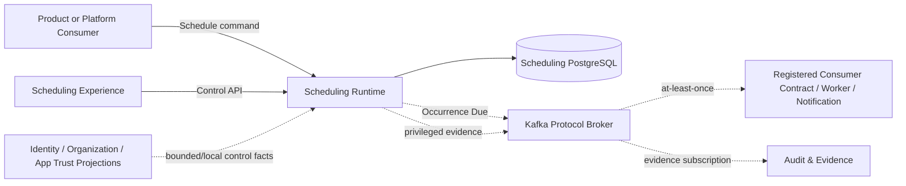
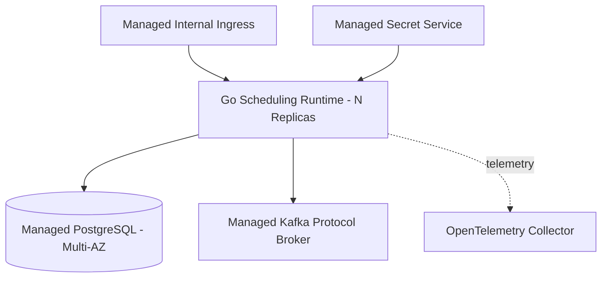
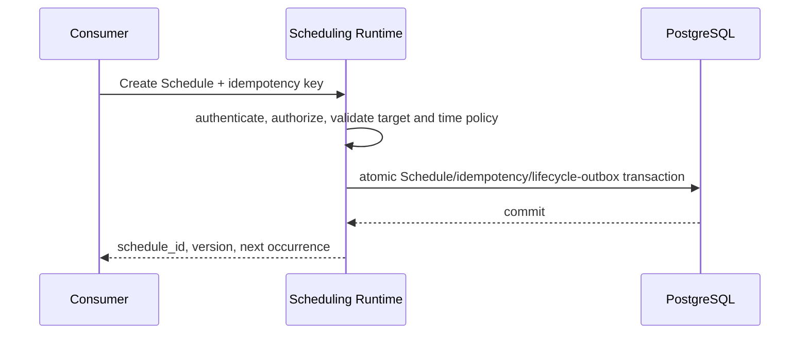
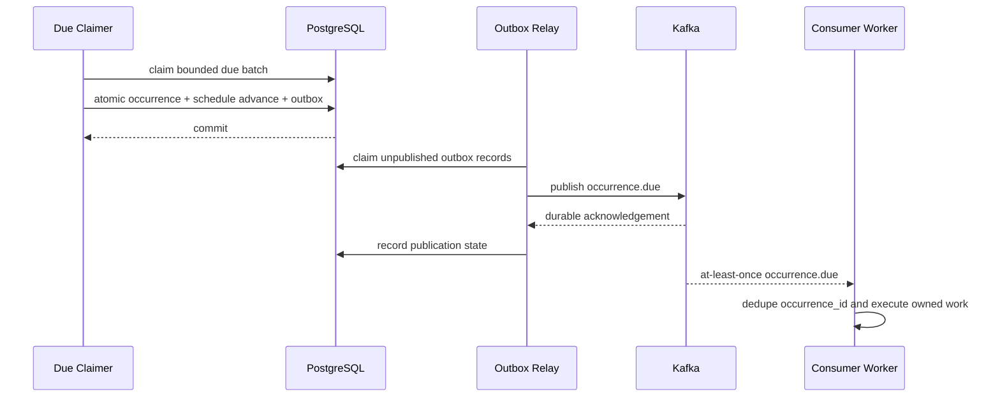

---
doc_meta:
  id: SAD-013
  title: Scnehaux Scheduling Runtime
  owner: Scheduling Platform Team
  version: 1.1.0
  status: draft
  classification: restricted
  governed_by:
    - GDC-009
    - ADR-SCH-001
  parent_pad: PAD-PLT-011
  review_cycle_days: 90
  created_date: 2026-08-22
  last_reviewed: 2026-08-22
  technologies:
    - name: golang
      type: backend-language
    - name: postgresql
      type: database
    - name: kafka
      type: event-broker
    - name: kubernetes
      type: orchestration
    - name: opentelemetry
      type: observability
---

# Scnehaux Scheduling Runtime

## 1. Purpose & Scope

### 1.1 Objective

Realize PAD-PLT-011 as a durable multi-tenant scheduling runtime that accepts Schedule lifecycle commands, persists authoritative temporal state, materializes each logical due Occurrence once, and dispatches that Occurrence at least once through the enterprise Kafka contract without running consumer business code.

### 1.2 Capability

The deployable provides:

- Schedule control API
- one-time and recurring temporal calculation
- Schedule lifecycle and optimistic mutation
- multi-replica due claiming
- durable Occurrence materialization
- misfire recovery
- transactional outbox publication
- target/application ownership projection
- Tenant/application admission and quota
- operational query, replay, and reconciliation

### 1.3 Requirement

The runtime must remain correct under duplicate commands, concurrent replicas, process termination during due processing, broker outage, time-zone/DST transitions, near-due update/cancel races, and prolonged outage followed by recovery.

The default platform SLO inherited from PAD-PLT-011 is 99.9% of due Occurrences durably dispatched within 30 seconds of `scheduled_for` at mature production state.

### 1.4 Constraint

- Go is the application runtime
- PostgreSQL is the authoritative Scheduling store
- Kafka is the due-occurrence and lifecycle publication protocol
- Kubernetes is the approved orchestration substrate for this deployable
- OpenTelemetry is the instrumentation contract
- Product business code never executes inside this runtime
- no Product operational database is read directly
- no arbitrary URL, shell command, function body, or container image is accepted as a Target
- a registered Notification deferred-command Target is permitted only with bounded non-secret trigger input; Scheduling never resolves provider/channel credentials or Application Notification Profiles
- state mutation and publication intent use the enterprise transactional-outbox pattern
- the initial timing mechanism uses relational durable state and short transactional due claims rather than a bespoke consensus/timer cluster
- physical worker extraction requires measured scale or fault-containment evidence and a separate SAD

### 1.5 Assumption

- Identity publishes locally verifiable workload/user trust
- Organization provides canonical Tenant context through bounded contracts
- application/service ownership can be projected from the enterprise trust/catalog capability
- Kafka and PostgreSQL are operated according to their enterprise standards
- consumers enforce `occurrence_id` idempotency

### 1.6 Out of Scope

- Product worker implementation
- Product retry, compensation, or business completion state
- Workflow process state
- Notification provider delivery
- secrets or credentials
- third-party scheduler administration UI

## 2. Enterprise Traceability

| Relationship | Target |
| :-- | :-- |
| Realizes | PAD-PLT-011 Enterprise Scheduling Platform |
| Governed by | ADR-SCH-001 PostgreSQL Temporal Authority and Kafka Dispatch |
| Conforms to | ADR-GLB-003 Transactional Outbox and Kafka Protocol |
| Conforms to | ADR-GLB-004 Declarative Schema Lifecycle |
| Conforms to | STD-GLB-002 Database Standard |
| Conforms to | STD-GLB-003 Observability Standard |
| Conforms to | STD-GLB-004 Event-Driven Architecture & Messaging Standard |
| Conforms to | STD-GLB-005 Resilience Standard |
| Conforms to | STD-GLB-010 Durable Scheduled Work Standard |

The runtime does not redefine Product, Workflow, Notification, Identity, Organization, or Event & Messaging authority.

## 3. Solution Context

### 3.1 System Context



The target consumer is not a Scheduling container and the Scheduler does not synchronously invoke it. A target may be an owning Product/Platform Worker or a registered bounded Notification command contract.

### 3.2 External

The runtime has no business-vendor integration. Its external platform dependencies are PostgreSQL, Kafka, enterprise trust/context artifacts, secret delivery for its own infrastructure credentials, and observability export.

### 3.3 Internal

The initial Go deployable contains compile-time bounded modules:

1. **Control API** — authentication context, command idempotency, validation, authorization, and query endpoints
2. **Schedule Domain** — lifecycle invariants and temporal policy
3. **Temporal Calculator** — versioned recurrence calculation using a replaceable free/open-source parser/calculator
4. **Due Claimer** — horizontally safe acquisition of due Schedules through short PostgreSQL coordination
5. **Occurrence Materializer** — creates the stable logical Occurrence and advances Schedule state atomically
6. **Outbox Relay** — publishes occurrence/lifecycle events through Kafka
7. **Target Projection** — locally usable registered-target ownership metadata
8. **Quota & Admission** — per-application/Tenant limits and saturation protection
9. **Operations & Reconciliation** — replay, repair, state comparison, and support query surfaces

The modules share one deployable and one private database initially. Logical module ownership remains explicit so measured hot paths can be split later without changing PAD contracts.

## 4. Architecture Model

### 4.1 Container



### 4.2 Component

```text
adapter/http   -> app/command     -> domain/schedule
adapter/http   -> app/query       -> app/ports
adapter/db     -> app/ports
due-runner     -> app/materialize -> domain/schedule
outbox-relay   -> app/publish     -> app/ports
adapter/kafka  -> app/ports
adapter/trust  -> app/ports
```

Domain packages depend on no network, database, Kafka, Kubernetes, or UI package.

### 4.3 Runtime Flow — Create Schedule



### 4.4 Runtime Flow — Due Occurrence and Dispatch



No network call occurs inside the authoritative due-state transaction.

### 4.5 Runtime Flow — Misfire Recovery

After restart or outage, the Due Claimer discovers elapsed Schedule state and applies the persisted policy:

- `skip` advances to the first future occurrence and records the skipped condition
- `fire_once` materializes one recovery occurrence
- `catch_up_bounded` materializes only the permitted finite recovery set

Every recovery Occurrence preserves the logical `scheduled_for` instant required by STD-GLB-010.

### 4.6 Runtime Flow — Replay

Operational replay re-publishes the existing Occurrence with the same `occurrence_id`. Replay never manufactures a second business occurrence for the same logical due instant.

## 5. State & Data Architecture

### 5.1 Storage

One private managed PostgreSQL database is authoritative for Scheduling runtime state. No Product or Platform consumer receives a database connection.

Logical state families include:

- Schedule aggregate state
- Occurrence state
- command idempotency state
- registered-target projection
- application/Tenant quota and consumption state
- outbox publication state
- replay/reconciliation metadata

Exact table names, DDL, indexes, partitioning, and query plans belong in TDDs.

### 5.2 Schema

- declarative Atlas lifecycle
- migration role is separate from runtime role
- runtime role has no DDL privilege
- UUIDv7 for durable primary identifiers
- Tenant-scoped state uses the enterprise RLS isolation pattern where applicable
- due-access paths are performance-tested against forecast and 10x forecast-peak certification load

### 5.3 Cache

Any cache is non-authoritative. Temporal calculation metadata or target projections may be cached only with explicit version/freshness bounds. Schedule lifecycle, Occurrence identity, and publication durability never depend on cache survival.

### 5.4 Stateless Compute

Replicas hold no correctness-critical state exclusively in memory. PostgreSQL transaction time is the canonical comparison source for due claiming so host clock skew does not create competing due-state authority.

## 6. Integration Contracts

### 6.1 API

The Control API is versioned under the enterprise API standard and provides command/query capabilities for create, read/list, update, pause, resume, cancel, preview, occurrence query, replay, target discovery, and reconciliation.

Mutating commands require:

- authenticated identity/workload context
- canonical ownership scope
- idempotency key
- expected Schedule version where mutation races are possible
- privileged reason/evidence metadata for replay, quota override, or cross-Tenant administration

Errors use the enterprise RFC 9457 contract.

### 6.2 Published Events

CloudEvents 1.0 event families include:

```text
com.scnehaux.scheduling.schedule.created.v1
com.scnehaux.scheduling.schedule.updated.v1
com.scnehaux.scheduling.schedule.cancelled.v1
com.scnehaux.scheduling.occurrence.due.v1
com.scnehaux.scheduling.occurrence.misfired.v1
```

Occurrence events contain stable Schedule/Occurrence IDs, `scheduled_for`, application/Tenant ownership, target contract, correlation, and bounded trigger data. They contain no credential.

### 6.3 Consumed Contracts

- Identity local verification material
- Organization Tenant/context projection
- Application/Service Trust target ownership projection
- enterprise secret delivery for runtime credentials
- Kafka protocol and schema registry
- OpenTelemetry export

There is no per-occurrence synchronous control-plane fan-in.

## 7. Security & Trust Boundary

### 7.1 Authentication

Human and workload callers use audience-bound enterprise Identity credentials. Protected-resource tokens are validated locally according to the IAM standard.

### 7.2 Authorization

- application ownership and Tenant scope are enforced on every command
- privileged provider operations use an explicit cross-Tenant path
- caller-supplied `application_id` does not replace authenticated application ownership
- target changes require authorization against the registered target projection
- replay and quota override are privileged operations

### 7.3 Encryption

TLS 1.3 in transit and enterprise-managed encryption at rest. Trigger metadata is minimized by default.

- deferred Notification triggers remain bounded and non-secret; arbitrary communication bodies, provider configuration, and unbounded recipient/contact datasets are rejected.

### 7.4 Secrets

Schedule records and due events never store provider credentials, application API keys, OAuth refresh tokens, or private keys. Runtime infrastructure credentials arrive only through the enterprise secret mechanism.

### 7.5 Audit

Create/update/cancel/pause/resume, target change, misfire-policy change, replay, quota override, repair, and cross-Tenant operations emit traceable evidence facts with actor, scope, reason, and correlation.

## 8. NFR

### 8.1 Blast Radius

A Scheduling Runtime outage delays future trigger dispatch but does not mutate Product business truth. Accepted Schedule state remains durable and recovery follows the stored misfire policy. A Kafka outage retains publication intent in the outbox. A single consumer outage does not stop materialization or dispatch for unrelated targets.

The target reliability class is C1: >=99.95% mature service availability, RTO <=1 hour, RPO <=15 minutes.

### 8.2 Latency, Throughput, and Scalability

- default due-dispatch SLO: 99.9% within 30 seconds of `scheduled_for`
- production capacity gate: 10x forecast peak due rate without SLO breach
- compute replicas scale horizontally across availability zones
- bounded claim batches and short transactions limit database lock duration
- per-application/Tenant quotas and fair admission prevent noisy-neighbor starvation
- control/list traffic is lower priority than due-dispatch work under saturation

### 8.3 Observability and Telemetry

OpenTelemetry traces, metrics, and structured logs expose:

- dispatch lateness distribution
- active Schedule count
- due/materialized Occurrence rate
- oldest undispatched Occurrence
- misfire/replay counts
- outbox age
- Kafka publication error/latency
- database claim latency/contention
- per-Tenant/application quota utilization
- admission rejects and saturation

Every alert has an owner and runbook action.

### 8.4 Retry, Timeout, Circuit Breaker, and Failover

- database transactions are bounded and contain no external network call
- outbox publication retries only Kafka publication using the enterprise retry policy
- consumer business retry is outside this system
- control-plane downstream lookups use bounded projections rather than hot-path synchronous dependencies
- application replicas span availability zones
- database/broker failover follows managed-substrate recovery contracts

### 8.5 Runbook

Production release is blocked until runbooks cover database failover, Kafka outage, stuck outbox, dispatch-lateness breach, quota saturation, time-zone regression, misfire surge after outage, duplicate dispatch, replay, and rollback.

## 9. Deployment Strategy

### 9.1 Environment

Separate development, test, staging, and production environments use promoted immutable artifacts. Production data and secrets are not copied into preview/test environments without explicit governed handling.

### 9.2 Infrastructure

- OCI-compatible Go artifact
- Kubernetes deployment across multiple availability zones
- managed PostgreSQL capability
- managed Kafka-protocol broker
- enterprise secret management
- OpenTelemetry collector/export path
- initial production profile is single-region multi-AZ; regional/silo profiles are introduced from Tenant requirements rather than code forks

### 9.3 CI/CD

Blocking gates include:

- formatting, static analysis, build, race tests, and dependency integrity
- package-boundary enforcement
- Atlas migration integrity and RLS tests using runtime roles
- recurrence property tests and DST/time-zone golden corpus
- concurrent-replica occurrence uniqueness tests
- restart/fault tests around materialization and outbox publication
- Kafka schema compatibility and duplicate-delivery tests
- Tenant isolation, quota, and saturation tests
- secret and vulnerability scanning
- architecture-document traceability/linting

Deployments are progressive and reversible according to EAD-005.

## 10. Architecture Decisions

### 10.1 Accepted

- ADR-SCH-001 selects PostgreSQL temporal authority and Kafka dispatch
- global outbox, database, event, resilience, and observability standards are inherited rather than redefined
- custom Scnehaux Scheduler Experience is a separate deployable under SAD-014
- registered Deferred Notification Command is supported as a target only under STD-GLB-010 bounded-payload rules; business revalidation still targets the owning Product/Platform Worker

### 10.2 Rejected

#### 10.2.1 Product Code Inside Scheduler

Rejected because it collapses Product authority, deployment lifecycle, dependencies, and business failure semantics into a shared runtime.

#### 10.2.2 In-Memory Cron as Authority

Rejected because restart and multi-replica correctness require durable Schedule/Occurrence state outside process memory.

#### 10.2.3 Additional Queue/Broker Substrate for Initial Dispatch

Rejected because Kafka already satisfies the enterprise asynchronous dispatch contract. Adding another broker increases operational and disaster-recovery surface without a current requirement.

#### 10.2.4 Third-Party Scheduler Dashboard as Product UI

Rejected because the operational experience is a Scnehaux contract independent of the internal scheduling implementation.

#### 10.2.5 Active-Active Multi-Region in Initial Build

Rejected because no measured residency, latency, or availability requirement currently justifies distributed temporal ownership across regions. The PAD and API contracts preserve a later regional realization.

## 11. Assumptions

- Initial measured workload fits the relational timing profile
- Kafka and PostgreSQL are available as adopted enterprise capabilities
- consumers can operate their own worker/handler deployment and implement occurrence idempotency

## 12. Compatibility Strategy

API paths and event types are versioned. Recurrence semantics and time-zone calculation are compatibility-sensitive and protected by golden-corpus tests. Internal claim strategy, recurrence library, table partitioning, or future timer kernel may change without changing the PAD contract.

## 13. Migration Strategy

### 13.1 ATI PH

ATI PH retains public-holiday policy, recipient eligibility, business revalidation, and Product worker execution. Durable future reminder triggers move to Scheduling. A due occurrence wakes ATI PH, which revalidates current Product state and requests Notification.

### 13.2 Mailcast Client Solution

Mailcast retains Gmail ingestion/polling, travel/PNR parsing, booking/passenger state, travel-specific rules, and client-owned worker execution. Durable future travel reminders/reconciliation wake-ups migrate to Scheduling. Tight Gmail polling remains local connector execution and is not modeled as an enterprise Schedule.

Legacy company identifiers are explicitly mapped to canonical Scnehaux Tenant/Application identity during migration; string equality is not treated as tenancy authority.
