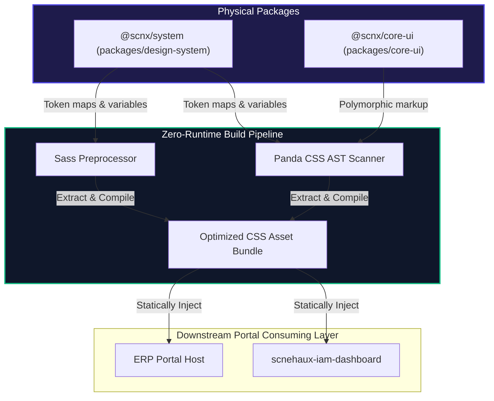
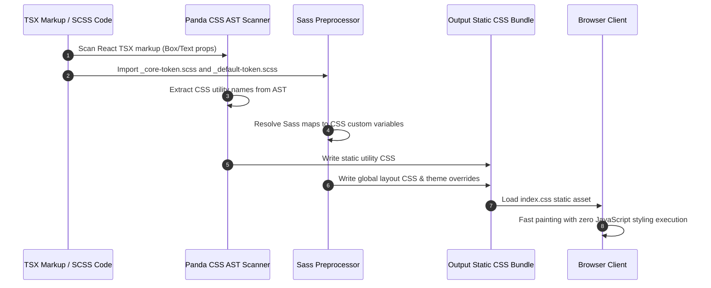
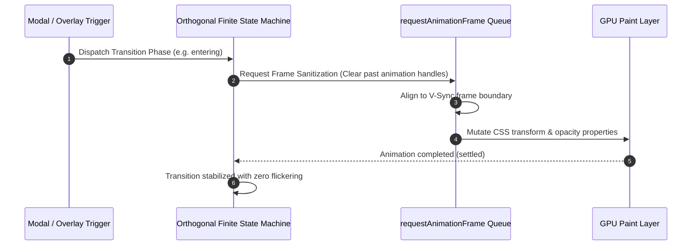
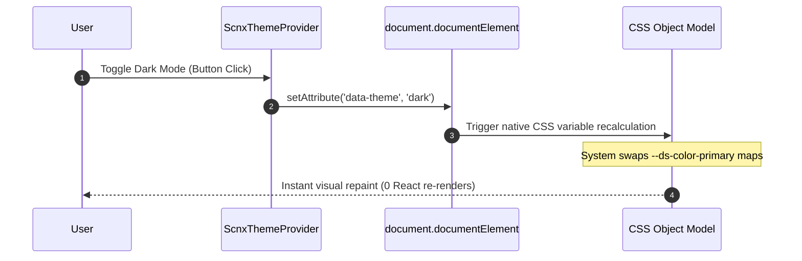
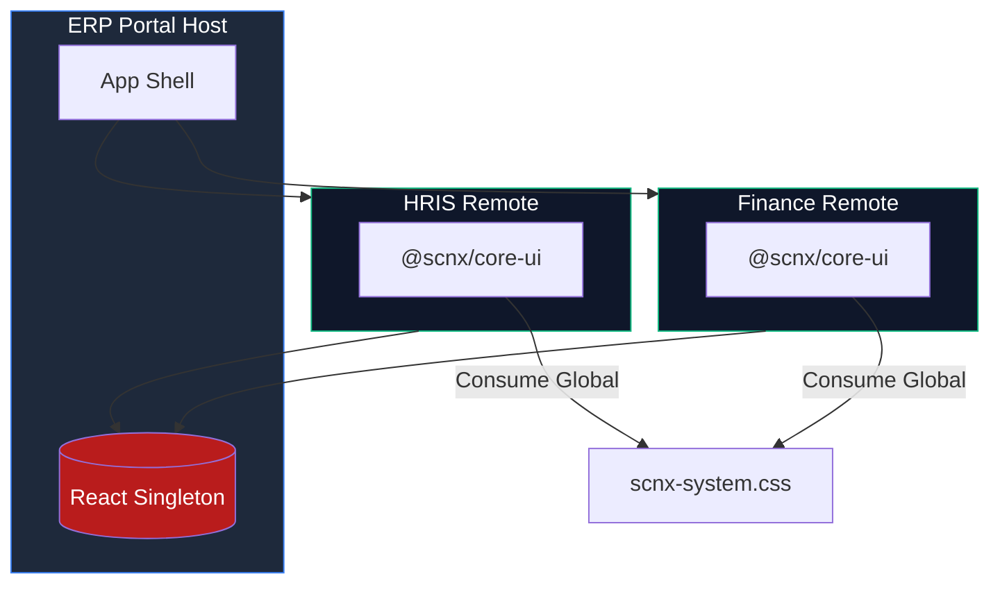
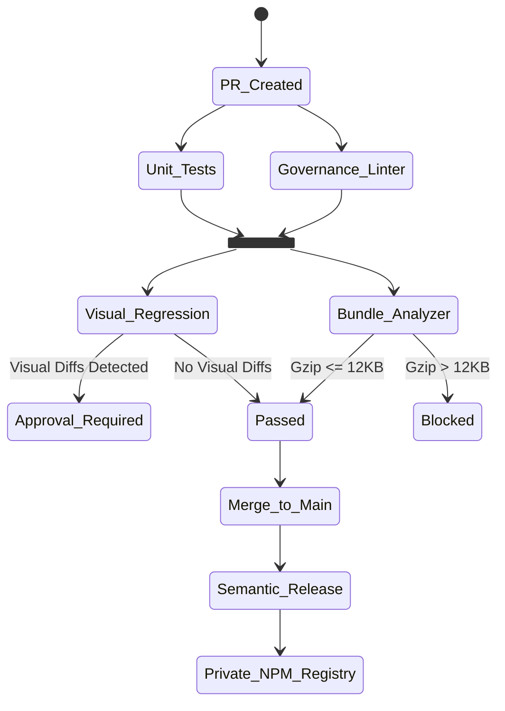

---
doc_meta:
  id: SAD-003
  title: Scnehaux UI Platform Software Architecture (SAD)
  owner: Principal UI/UX Architect
  version: 1.0.1
  status: approved
  classification: public
  governed_by: [GDC-000]
  review_cycle_days: 180
  last_reviewed: '2026-05-19'
  parent_pad: PAD-002
---

# Scnehaux UI Platform Software Architecture (SAD-003)

---

## 1. Purpose

**Capability Realized.** This system realizes the logical UI Platform capability defined in [scnehaux-ui-platform.pad.md](../../03-domain/scnehaux-ui-platform/scnehaux-ui-platform.pad.md) (PAD-002). It is the concrete physical styling compiler and component infrastructure for that capability.

It provides the physical visual foundation consumed by all frontend portals across the monorepo — including the [Scnehaux IAM Dashboard (SAD-002)](../scnehaux-iam-dashboard/scnehaux-iam-dashboard.sad.md) and the federated ERP Portal. It is developed as isolated packages to guarantee zero runtime visual pollution, maximum build-time optimization, and strict style encapsulation.

**System Context (C1).** A set of build-time packages (`@scnx/system`, `@scnx/core-ui`) consumed by downstream portals via pnpm workspace (local) or the private NPM registry (production), with shared scoping under Module Federation. It has no runtime backend and serves only static, compiled CSS/JS assets.

**Objectives.** Deliver a single, brand-consistent, accessible visual foundation with zero-runtime styling overhead, propagating a single primitive-layer improvement across all portals.

**Constraints.** Zero-runtime styling only (no runtime CSS-in-JS); all styles resolve to design tokens; React must resolve to a singleton under Module Federation; the compressed token bundle is hard-capped.

**Requirements.** Headless accessible primitives, a 3-tier token engine, multi-theme support, and a build-time extraction pipeline.

**Assumptions.** Consumers use the supported bundlers (Vite/Rspack) and wrap entry roots with the platform's namespace classes.

### 1.1 Architectural Principles

The platform inherits and enforces the [Enterprise Frontend Performance and Rendering Standard](../../02-standards/_global/frontend/STD-GLB-FE-002-performance.md) across all layers:

1. **Zero Layout Thrashing (60FPS Render Guarantee)**: Synchronous geometry queries during high-frequency cycles are prohibited; dynamic layout adjustments are deferred and batched via `requestAnimationFrame`.
2. **Polymorphic Rendering Safety**: The `asChild` composition pattern via the native `<Slot>` proxy is the approved polymorphism engine. However, its usage is strictly restricted to `@scnx/core-ui` layer-1 layout primitives to prevent unchecked mapping/cloning overhead in downstream feature code. Dynamic `as` prop injection is deprecated.
3. **Compound & Headless UI Separation**: Logic, state, and event orchestration hooks are separated from visual markup; headless engines remain blind to HTML wrappers.
4. **Token-Strict Styling**: Styling definitions must resolve to established design tokens — no hardcoded properties or raw layout declarations.

---

## 2. Solution Architecture

The platform is structured into two physical package containers, married by a build-time Zero-Runtime styling extraction pipeline:

### 2.1 Physical Package Boundaries

- **`@scnx/system` (`packages/design-system`)**: The visual core. Declares raw core primitives (Tier-1), global semantic theme contracts (Tier-2), and compiles them to CSS Custom Properties. Orchestrates build-time configuration for static layout compilers.
- **`@scnx/core-ui` (`packages/core-ui`)**: The component library of style-agnostic, accessible, polymorphic React primitives (`<Box>`, `<Flex>`, `<Grid>`, `<Text>`). Relies 100% on `@scnx/system` for styling; decoupled from any vendor CSS framework.

### 2.2 Zero-Runtime Build Pipeline

The platform rejects runtime CSS-in-JS injection, using a dual build-time engine:

1. **Panda CSS AST Scanner**: Scans downstream JS/TS source at compile time, extracting utility token classes from markup into static atomic CSS rules.
2. **Sass Preprocessor**: Orchestrates global static structures, layout grids, and theme contracts (`_core-token.scss`, `_default-token.scss`), outputting a consolidated optimized CSS bundle.

### 2.3 Base Layer & Reset Isolation

The `@scnx/system` package ships a dedicated **Base Layer** to equalize default browser rendering before styling:

1. **Normalization & Reset**: `_normalize.scss` equalizes cross-viewport inconsistencies; `_reset.scss` cleans native element properties; `_base.scss`/`_typography.scss` define global defaults.
2. **Cascade Layer Isolation**: All reset rules are wrapped in native CSS `@layer reset` / `@layer base`, with an explicit precedence order (`@layer reset, base, tokens, recipes, utilities;`) so base rules can never override tokens or utilities.

### 2.4 Realizing C3 Designs (Reference)

> **Abstraction Leakage Rule (GDC-000 §2.3)**: As a C2 SAD, this document does not contain component-level mechanics, raw SASS maps, or CSS Custom Property payloads. The exhaustive C3 blueprints live in the **downstream project repository** under `docs/02-designs/scnx-ui-js/` (all `parent_sad: SAD-003`):

<!-- lint_disable: inline_reference_missing (reason: Table contains illustrative TDD references) -->

| TDD | Scope |
| :-- | :-- |
| `TDD-SCNX-UI-JS-001` | Build-Time Extraction Pipeline (Panda + Sass + tsup, dual ESM/CJS, `"use client"` restoration, packaging). |
| `STD-UIP-ENG-001` | Polymorphic Headless Primitives (`@scnx/core-ui` — `Slot`/`asChild`, `as`-prop, primitive + compound inventory, `data-slot` contract). |
| `TDD-SCNX-UI-JS-003` | Semantic Token Dictionary & OKLCH Reference (3-tier engine, `generate-scheme-matrix`, validator, `--ds-*` contract). |
| `TDD-SCNX-UI-JS-004` | Design System Components (`@scnx/system` atoms/layouts/organisms; SCSS-class vs Panda-recipe styling). |
| `TDD-SCNX-UI-JS-005` | Theme Transitions & Context Engine (`ScnxThemeProvider`, Transition OFSM, Disclosure registry). |

### 2.5 Component Taxonomy & Theme Families (Physical)

- **`@scnx/core-ui` structural layer**: headless primitives (`Box`/`Flex`/`Grid`/`Text`/`Heading`/`List`/`Divider`/`Button`) plus stateful compounds (`accordion`, `collapsible`, `disclosure`, `navigation`, `navigation-bar`, `sidebar`, `table-of-contents`, `edge-layout`, `floating-layout`, `transition`). Behavior/ARIA only; styling delegated.
- **`@scnx/system` styled layer**: organized atomic-design as **atoms / layouts / organisms**, each wrapping a headless primitive and styled by one of two zero-runtime strategies — **SCSS class + `data-variant`** (skinned atoms, e.g. `Button`) or **Panda recipe** (structural layouts, e.g. `Flex`). Dependency direction is strictly `@scnx/system → @scnx/core-ui`.
- **Theme families**: the always-on **`default`** baseline (light + dark) plus a partial-override brand theme **`achromatic`** (primary→neutral remap), validated against a partial-subset contract — the physical realization of the Cascading Multi-Theme Invariant (PAD-002 §5).

---

## 3. Runtime Flows

### 3.1 Build-Time Compilation & Static Style Extraction

How raw SCSS variables and React primitive markup compile to a zero-runtime static CSS bundle:

### 3.2 Transition & Overlay Frame Sanitization

Ensures dynamic overlays/modals/transitions execute cleanly without visual queue piling or flickering:

### 3.3 Theme Context Mutation

State transition when a user swaps global themes (Light↔Dark, Tenant A↔B), bypassing heavy React trees for sub-50ms execution:

---

## 4. Data Architecture

The platform has no runtime datastore; its "data" is the design-token dictionary, resolved at build time.

- **Database**: Not Applicable — no runtime datastore.
- **Storage**: The authoritative token data is SCSS/CSS-variable source (`_core-token.scss`, `_default-token.scss`) compiled to static CSS assets; published as immutable, hash-versioned bundles.
- **Caching**: Compiled CSS assets are content-hashed for long-lived browser and CDN caching.
- **Data Classification**: Public — design tokens and component markup carry no PII or secrets.

---

## 5. Integration

- **Published API (packages)**: `@scnx/system` (token API as CSS custom properties + Sass maps) and `@scnx/core-ui` (polymorphic React primitives) are **Published** to the private NPM registry.
- **Consumed by**: Downstream portals (IAM Dashboard SAD-002, ERP host + remotes) via pnpm workspace (local) or NPM (production).
- **Federated Distribution**: Under Module Federation, the platform relies on strict `shared` scoping so all hosts/remotes resolve a **React Singleton** and a single global `scnx-system.css` asset — no duplicated CSS payloads, no context tearing.
- **Events (Producer/Consumer)**: None — distribution is build-time/package-based, not event-driven.

---

## 6. Security

- **Strict Content-Security-Policy (CSP)**: The presentation layer prevents inline style injections (`style-src 'unsafe-inline'`). All compiled utilities load via static assets linked to build-time hashes, or via trusted stylesheet nonces.
- **Polymorphic ARIA Accessibility Core**: Accessible behaviors are built directly into the polymorphic Layer-1 primitives of `@scnx/core-ui` (focus-trapping in modal overlays, ARIA state bindings, keyboard navigation), guaranteeing WCAG 2.2 AA compliance at the visual root of trust.
- **Supply-Chain Integrity**: Packages are published immutably with content hashes; consumers pin versions, preventing silent style/markup substitution.

---

## 7. Resilience & Failure Modes

- **Missing CSS Variables Fallback (Graceful Degradation)**: For environments with restricted stylesheet imports, Sass maps are pre-compiled into static fallback utility classes, allowing layout systems to degrade gracefully without breaking structural functionality.
  - _Blast Radius_: **Single Client Render** — degrades gracefully to a fallback layout without affecting other users or backend services.
- **Cumulative Layout Shift (CLS) Mitigation**: Async components are matched with strict width/height sizing from Tier-1 primitives, rendering structured skeletons immediately to keep CLS under `0.1`.
  - _Blast Radius_: **Component Level** — only the affected async component remains in a skeleton state; the rest of the page stays interactive.
- **Momentum Reversal Interruption**: An interrupted transition purges the active animation handle, recalculates elapsed transform coordinates, and gracefully reverses without resetting the layout.
  - _Blast Radius_: **Single User Interaction** — confined to the specific overlay state machine.

---

## 8. Observability & Operations

- **Performance Benchmarks (SLI)**: CLS ≤ `0.1`; Interaction-to-Next-Paint (INP) ≤ `200ms`; P95 layout-reflow paint ≤ `100ms`; gzip CSS bundle hard-capped at `12KB`.
- **Monitoring / Tracing**: Bundle-size and visual-regression metrics are tracked per release; consumer-side render telemetry correlates by component tag and theme state.
- **Logging / Telemetry**: `@scnx/core-ui` components are wrapped in Error Boundaries; rendering errors or CSS injection failures emit Sentry events with component tag references and active theme identifiers.
- **Alerting / Runbook**: Bundle-budget breaches block release (see §9); the runbook covers token-regression rollback and theme-contract reconciliation.

---

## 9. Deployment & Source Code Management

The platform packages are developed within the monorepo and integrated into downstream applications via workspace linkages, then published for production.

- **Repository Topology (Monorepo)**: Structured as a monorepo utilizing **pnpm workspaces** for isolated dependency resolution and rapid local hot-reloading (Vite/Rspack).
- **SDLC & Branching Strategy**: Enforces strict **Trunk-Based Development**. Manual merges to the `main` branch are prohibited. All features must be integrated via short-lived branches.
- **Pull Request (PR) Quality Gates**:
  - Requires a minimum of **1 Approval** from a peer engineer.
  - Changes modifying `/styles/` or core tokens require explicit approval from the Principal Architect (enforced via `.github/CODEOWNERS`).
  - Pre-commit code formatting and linting are strictly enforced locally via **Husky** hooks to prevent CI pipeline congestion.
- **Environment / Infrastructure**: Production assets published to the private NPM registry and served globally via CDN (AWS S3 / CloudFront).
- **Encapsulation Boundary**: `@scnx/system` provides namespace classes (e.g., `.scnx-theme-wrapper`); consuming micro-frontends wrap their entry roots to enforce isolated styling sandboxes.
- **CI/CD & Release Governance**: A change to a core utility/token can blast-radius across 50+ downstream apps, so every change passes a mandatory quality gate before merge and `Semantic Release` to NPM:

---

## 10. Trade-offs & Alternatives

### 10.1 Runtime CSS-in-JS

- _Rejected_: Runtime style injection adds per-render execution overhead and conflicts with strict CSP. A zero-runtime build-time extraction pipeline was chosen instead.

### 10.2 Dynamic `as` Prop Pattern

- _Rejected_: Pushing the `as` prop downwards complicates strict type-checking and ref-forwarding in polymorphic trees. _Accepted trade-off_: We utilize a highly-optimized `<Slot>` engine (`asChild`) strictly at the `@scnx/core-ui` level, accepting minor cloning overhead in exchange for superior composition API ergonomics.

### 10.3 External CSS Frameworks / Component Libraries

- _Rejected_: Vendor frameworks (Tailwind config sprawl, MUI runtime) compromise brand consistency and bundle budget; the platform owns its token engine and headless primitives.

### 10.4 Single Monolithic Package vs Two-Package Split

- _Rejected (monolith)_: A single package would couple token data to component markup. _Accepted trade-off_: a two-package split (`@scnx/system` + `@scnx/core-ui`) adds release coordination cost in exchange for clean token/markup separation and independent versioning.

## 11. Assumptions

- Consuming applications use a modern bundler capable of tree-shaking ESM modules.
- Server-side rendering (SSR) environments support React 19 / RSC architectures.

## 12. Compatibility Strategy

- The design system adheres to Semantic Versioning (SemVer).
- Breaking changes require a major version bump and a migration guide.

