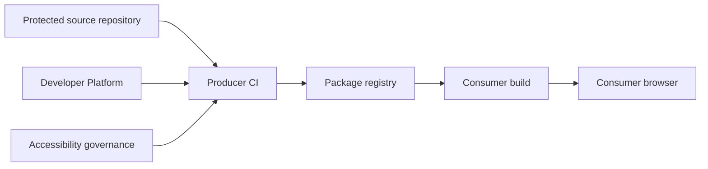
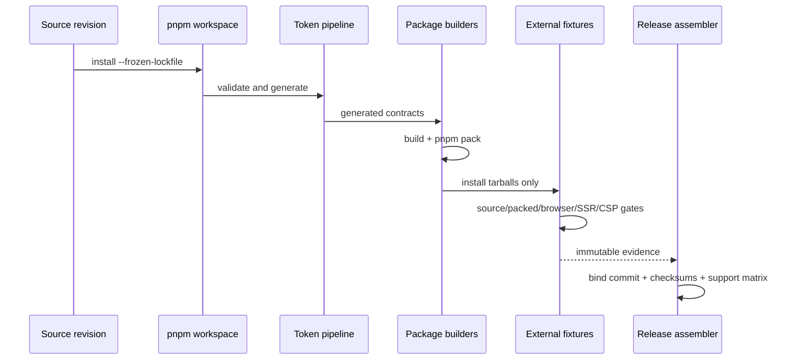
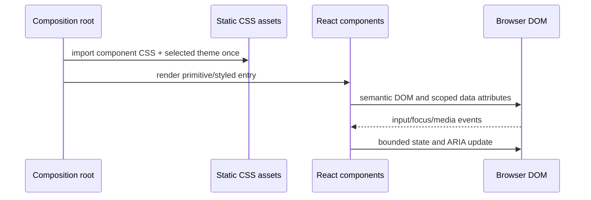

---
doc_meta:
  id: SAD-003
  title: Scnehaux UI Platform Software Architecture
  owner: Principal UI/UX Architect
  version: 2.1.0
  status: approved
  classification: public
  governed_by: [GDC-009]
  review_cycle_days: 180
  created_date: 2026-01-01
  last_reviewed: 2026-10-02
  parent_pad: PAD-PLT-003
  technologies:
    - name: react
      type: framework
    - name: module-federation
      type: frontend-architecture
    - name: sass
      type: css-preprocessor
    - name: panda-css
      type: css-generator
    - name: tsup
      type: build-tool
    - name: vitest
      type: test-runner
    - name: storybook
      type: component-workshop
    - name: chromatic
      type: visual-regression-service
    - name: cyclonedx
      type: sbom-format
    - name: github-artifact-attestations
      type: provenance-service
---

# Scnehaux UI Platform Software Architecture (SAD-003)

> **Revision pending exact-commit ratification.** The removal of "proposed"
> before ADR-UIP-WKS-001 and ADR-UIP-SEC-001, after both were accepted on
> 2026-10-02, is pending under GDC-000 section 2.6.7; the revision ratified on
> 2026-10-02 (`19a1442`) remains binding until the authorized human authority
> approves the exact commit containing it.

> **Approved design baseline.** Approval establishes the architecture contract,
> not implementation conformance or production release authority.

## 1. Purpose & Scope

### Objective

Build and release two independently consumable React packages that realize
[PAD-PLT-003](../../03-domain/PAD-PLT-003-scnehaux-ui-platform/PAD-PLT-003-scnehaux-ui-platform.pad.md):
`@scnx/core-ui` for behavior and `@scnx/system` for tokens, themes, styled
components, and static assets.

### Constraint

The system is a producer and library system, not a shared render service. It is
absent from a Product request path after artifacts are installed. It owns no
Product state, user authorization, backend API, or runtime database. Consumers
must not require workspace aliases, UI Platform source, or Panda execution.

### Capability

The system provides versioned JavaScript, TypeScript declarations, static CSS,
Sass assets, token data, fonts, behavior contracts, compatibility metadata,
and release evidence. Standalone, SSR/RSC, and separately authorized federated
consumers are verified from packed artifacts.

### Requirements

| ID          | Requirement                                                                                                    |
| :---------- | :------------------------------------------------------------------------------------------------------------- |
| UIP-SYS-001 | A clean checkout installs deterministically with lifecycle scripts enabled and an unchanged lockfile.          |
| UIP-SYS-002 | Both packages build and pack independently; packed manifests contain no workspace-only dependency.             |
| UIP-SYS-003 | Every documented JS, type, CSS, Sass, token, and font entry resolves from an external consumer.                |
| UIP-SYS-004 | `@scnx/core-ui` remains style-agnostic and never depends on `@scnx/system`.                                    |
| UIP-SYS-005 | `@scnx/system` consumes `@scnx/core-ui` through a compatible peer contract.                                    |
| UIP-SYS-006 | Themes and resets are scoped; portals inherit the originating theme; package import has no global side effect. |
| UIP-SYS-007 | Server-safe and client entry boundaries are explicit and survive bundling.                                     |
| UIP-SYS-008 | Strict CSP operation requires neither `unsafe-eval` nor `unsafe-inline`.                                       |
| UIP-SYS-009 | Required conformance evidence is produced against exact source and artifact digests.                           |

Out of scope: Product UI composition, registry infrastructure implementation,
runtime Product telemetry, application routing, and business authorization.

## 2. Enterprise Traceability

The system fulfills approved PAD-PLT-003. Global frontend authority includes
ADR-GLB-FE-010 and replacement decisions ADR-GLB-FE-011 through -013 according
to their lifecycle. UI authority includes ADR-UIP-PLT-001, ADR-UIP-TKN-001
through -003, ADR-UIP-BLD-001, ADR-UIP-WKS-001, ADR-UIP-SEC-001, STD-UIP-ENG-001, STD-UIP-PRM-001,
STD-UIP-STY-001, STD-UIP-TKN-001, and STD-UIP-TKN-002. Component
designs live in the UI repository with `parent_sad: SAD-003`.

The physical implementation may evolve, but it must preserve PAD-owned logical
contracts and the public compatibility surface declared by a release.

### 2.1 Document topology and authority

The UI Platform uses one normative design hierarchy and one deliberately small
project-repository execution set:

| Location                    | Artifact                                                                  | Authority boundary                                                                            |
| :-------------------------- | :------------------------------------------------------------------------ | :-------------------------------------------------------------------------------------------- |
| `scnehaux-architecture`     | GDC, EAD, PAD, SAD, ADR, STD, and Technology Radar                        | Enterprise, capability, system, decision, and standard authority according to lifecycle state |
| `ui-platform/docs/designs/` | Exactly the five TDDs attached to `SAD-003`                               | Component design and implementation contract                                                  |
| `ui-platform/PLAN.md`       | Ordered work, accountable role, decision authority, and binary acceptance | Execution control only; cannot approve architecture or release                                |
| `ui-platform/ROADMAP.md`    | Phase state, target date, dependency, and exit gate                       | Delivery milestone control only                                                               |
| `ui-platform/docs/reviews/` | One non-normative record per review round or reviewed object              | Audit trail and finding disposition only                                                      |
| `ui-platform/README.md`     | Links to the preceding authorities and developer entry points             | Navigation only                                                                               |

The project repository must not introduce a second architecture source of truth,
decision register, working-consensus document, ratification manifest, local
schema fork, or narrative migration authority. Package-adjacent Markdown is
implementation commentary and cannot override the central architecture, TDDs,
PLAN, or ROADMAP. Review records are split per round or object; combining
independent reviews into one mutable narrative is prohibited.

## 3. Solution Context

### 3.1 System Context


```mermaid
graph LR
  SRC[Protected source repository] --> CI[Producer CI]
  CI --> REG[Package registry]
  REG --> BUILD[Consumer build]
  BUILD --> BROWSER[Consumer browser]
  DP[Developer Platform] --> CI
  A11Y[Accessibility governance] --> CI
```

### 3.2 External actors and systems

| Actor/system           | Contract                                                                     |
| :--------------------- | :--------------------------------------------------------------------------- |
| UI Platform engineer   | Changes source and TDD-governed implementation through protected review      |
| Developer Platform     | Supplies CI runners and package storage; provenance and signing once offered |
| Sigstore public good   | Interim signing and public transparency log for `main` build attestations    |
| Product build          | Installs a declared version and imports supported public entries             |
| Product browser        | Executes component behavior and static CSS without UI Platform network calls |
| Accessibility reviewer | Provides manual assistive-technology evidence and Component ACR review       |

### 3.3 Internal boundaries

- **Token producer:** canonical token input, validation, and output generation.
- **Core library producer:** headless React behavior, state, contexts, and types.
- **System library producer:** styled wrappers, CSS, themes, assets, and token
  subpaths.
- **Conformance harness:** source, packed, browser, SSR/RSC, CSP, accessibility,
  and conditional federation fixtures.
- **Component workshop:** Storybook stories of every supported component,
  state, theme, and mode, rendered from the built CSS artifacts; story browser
  tests, accessibility checks, and Chromatic visual review (ADR-UIP-WKS-001).
  Producer-only: nothing in it enters a package tarball.
- **Release assembler:** inventory, checksums, provenance, evidence, and channel
  promotion.

### 3.4 Supported-scenario policy

Exact Node, pnpm, TypeScript, React, framework, browser, bundler, and assistive-
technology versions belong to the release support matrix. A scenario is
supported only when its packed fixture passes. An untested version is unknown,
not implicitly compatible.

## 4. Architecture Model

### 4.1 Container and component model

```mermaid
graph TB
  subgraph Producer[UI Platform producer boundary]
    TOK[Token compiler and validator]
    CORE[@scnx/core-ui builder]
    SYS[@scnx/system builder]
    HAR[Conformance harness]
    REL[Release assembler]
    TOK --> SYS
    CORE --> SYS
    CORE --> HAR
    SYS --> HAR
    HAR --> REL
  end
  REL --> ART[Immutable package artifacts]
  ART --> APP[Consumer application]
```

| Physical component     | Technology                         | Responsibility                                         | Persistent output                  |
| :--------------------- | :--------------------------------- | :----------------------------------------------------- | :--------------------------------- |
| Workspace orchestrator | pnpm 10.x                          | Dependency graph and deterministic commands            | Lockfile                           |
| Core builder           | TypeScript + tsup                  | ESM/CJS and declaration artifacts for headless entries | `@scnx/core-ui` tarball            |
| Token pipeline         | Sass + Panda build-time generation | Validate and generate theme/token contracts            | CSS, JSON, Sass, generated recipes |
| System builder         | TypeScript + tsup + Sass           | Styled entries and static assets                       | `@scnx/system` tarball             |
| Test harness           | Vitest + browser/consumer fixtures | Prove source and external-consumer behavior            | Reports and traces                 |
| Component workshop     | Storybook 10 + Vitest browser mode | Operable stories, story tests, a11y, visual review     | Static Storybook CI artifact       |
| Release assembler      | CI scripts + `pnpm pack`           | Inventory, checksum, SBOM, provenance, evidence        | Release record                     |

### 4.2 Dependency invariants

```text
@scnx/core-ui  <-peer-  @scnx/system  <-install-  consumer
       ^                                        /
       +----------------install----------------+
```

- `core-ui` has no import, build, or runtime dependency on `system` or Panda.
- `system` declares `core-ui`, React, and React DOM as peers and development
  dependencies using aligned tested ranges.
- Public entries are explicit; wildcard exports are prohibited.
- Component JavaScript imports no CSS as a side effect.
- Generated files have one producer and are never hand-edited.

### 4.3 Producer Runtime Flow


```mermaid
sequenceDiagram
  participant G as Source revision
  participant P as pnpm workspace
  participant T as Token pipeline
  participant B as Package builders
  participant F as External fixtures
  participant R as Release assembler
  G->>P: install --frozen-lockfile
  P->>T: validate and generate
  T->>B: generated contracts
  B->>B: build + pnpm pack
  B->>F: install tarballs only
  F->>F: source/packed/browser/SSR/CSP gates
  F-->>R: immutable evidence
  R->>R: bind commit + checksums + support matrix
```

No publication step runs when a preceding required gate is skipped or fails.

### 4.4 Consumer Runtime Flow


```mermaid
sequenceDiagram
  participant H as Composition root
  participant CSS as Static CSS assets
  participant R as React components
  participant D as Browser DOM
  H->>CSS: import component CSS + selected theme once
  H->>R: render primitive/styled entry
  R->>D: semantic DOM and scoped data attributes
  D-->>R: input/focus/media events
  R->>D: bounded state and ARIA update
```

The browser performs no UI Platform network request. Failure to load an asset
is a consumer build/deployment failure, not a runtime fallback to a central
service.

### 4.5 Conditional federation flow

Module Federation remains `assess`. A fixture may evaluate it, but adoption
requires separate owning-SAD/ADR authorization. Under such authorization the
host owns share policy, CSS loading, nonce/hash propagation, and controlled
route-local failure. Remotes do not inject UI Platform CSS.

## 5. State & Data Architecture

### 5.1 Build-time records

| Record             | Required identity and content                                                                   | Authority                              |
| :----------------- | :---------------------------------------------------------------------------------------------- | :------------------------------------- |
| Token definition   | Logical name, tier, type, value/reference, theme coverage, lifecycle                            | Canonical token source                 |
| Export inventory   | Package, public subpath, artifact kind, resolved file, server/client classification             | Package manifest + generated inventory |
| Consumer scenario  | Fixture, declared versions, imports, expected behavior                                          | TDD and support matrix                 |
| Release evidence   | Source SHA, package version, tarball digest, SBOM digest, gate results, known limits, authority | Release assembler                      |
| Component contract | Public name, semantic root, state/ARIA, styling hooks, stability                                | TDD and generated documentation        |

Generated artifacts are derived and reproducible. Registry artifacts and
release records are immutable. CI caches are expendable and never authority.

### 5.2 Browser state

Runtime state is local to a component instance or an explicit provider/store.
Theme state belongs to a named theme root. Context identity must not split
between host and remote. No global mutable callback or module-evaluation DOM
mutation is permitted.

### 5.3 Data classification and retention

Build inputs and outputs are public/internal engineering assets and contain no
Product PII. CI logs retain technical identifiers and digests, not secrets.
Release evidence is retained for the support life of the major version plus the
governed audit window. Temporary fixture output may be discarded after evidence
is published. Build attestations of `main` are written to the Sigstore public
transparency log: they are public and permanent, and contain only artifact
digests and the repository, workflow, ref, and commit identity
(ADR-UIP-SEC-001).

## 6. Integration Contracts

### 6.1 Published API and assets

| Package         | Stable v1 contract                                                                                                                                                           |
| :-------------- | :--------------------------------------------------------------------------------------------------------------------------------------------------------------------------- |
| `@scnx/core-ui` | Explicit component, hook, provider, and type entries classified as server-safe or client-only                                                                                |
| `@scnx/system`  | Explicit styled component entries, aggregate component CSS, theme CSS, `tokens/css/<theme-id>.css`, `tokens/json/<theme-id>.json`, `tokens/scss`, and documented font assets |

Every entry resolves for ESM, declarations, and any supported CJS surface from
the packed tarball. Package manifests define peers and `sideEffects` accurately;
a bundler honoring them must not drop required CSS or execute hidden effects.

### 6.2 Consumed interfaces

- npm-compatible package storage and provenance service;
- React/React DOM peer APIs inside declared ranges;
- browser DOM, CSS, media-query, and accessibility APIs;
- consumer-controlled CSP nonce/hash integration when inline bootstrap or
  dynamic chunks are explicitly supported; and
- optional federation runtime only in an authorized scenario.

### 6.3 Compatibility contract

Public package names, subpaths, types, token names, CSS asset names, theme root,
documented data attributes, behavior, and accessibility outcomes are versioned.
Internal file layout, private classes, and build tools are not. A breaking
change requires a major version, migration guide, dual-run or rehearsal where
applicable, and rollback evidence.

## 7. Security & Trust Boundary

| Threat                      | Control                                                                               | Evidence                           |
| :-------------------------- | :------------------------------------------------------------------------------------ | :--------------------------------- |
| Compromised dependency      | Frozen lockfile, CycloneDX SBOM, advisory and license gates over every resolved graph | Audit, license, and SBOM reports   |
| Artifact substitution       | Content digest and SLSA Build L2 provenance attestation (ADR-UIP-SEC-001)             | `gh attestation verify`            |
| Build-script execution      | Reviewed lifecycle scripts; no bypassed clean-install gate                            | Clean-checkout CI                  |
| DOM/code injection          | React escaping by default; no dynamic code evaluation; reviewed rich-content API only | CSP and adversarial tests          |
| CSS escape or theme leakage | Scoped roots, declared layers, two-root/federated tests                               | Computed-style fixture             |
| Secret disclosure           | No secrets in package/config/token output; CI redaction                               | Package inspection and secret scan |
| Unauthorized release        | Protected source, engineering identity, human release authority                       | Audit record                       |

Strict CSP rejects `unsafe-eval` and `unsafe-inline`. Bootstrap and conditional
dynamic chunk loading use a consumer-controlled nonce/hash or an external asset.
Failure blocks the capability; policy is not weakened. Package import alone
must cause no DOM, global, stylesheet, timer, storage, or network mutation.

## 8. NFR

### 8.1 Reliability and performance

- Producer builds are deterministic from a clean checkout and pinned lockfile.
- Published artifacts are immutable and reproducible from the recorded source.
- Declaration generation completes on the declared runner without a heap
  override; a larger heap is diagnostic evidence only.
- Package, CSS, parse/evaluation, build, and interaction budgets are declared
  per scenario with baseline and tool metadata.
- UI rendering has zero UI Platform service RPS because no central runtime is
  contacted.

### 8.2 Observability, Telemetry, Alerting, and Runbook

CI emits at minimum:

| Signal                                                     | Meaning                          |
| :--------------------------------------------------------- | :------------------------------- |
| `ui_platform_install_duration_seconds`                     | Clean-install duration           |
| `ui_platform_build_duration_seconds{package}`              | Producer build duration          |
| `ui_platform_build_peak_memory_bytes{package}`             | Peak build memory                |
| `ui_platform_artifact_size_bytes{package,entry,encoding}`  | Scenario-qualified artifact size |
| `ui_platform_fixture_result{scenario}`                     | Binary external-consumer result  |
| `ui_platform_csp_violations_total{scenario}`               | CSP policy violations            |
| `ui_platform_accessibility_failures_total{component,rule}` | Automated accessibility failures |

Structured logs include source SHA, workflow/run ID, package, version, fixture,
artifact digest, gate, duration, and outcome. They exclude credentials and user
data. Alerts fire when main/release clean-install or packing fails, a release
digest differs, a required fixture is missing, or supported-version security
exposure is detected. Runbooks cover failed publication, compromised artifact,
broken consumer, CSP regression, accessibility regression, and rollback.

### 8.3 Resilience and failure modes

| Failure                          | Detection                         | Response                                                                      | Blast Radius                                             |
| :------------------------------- | :-------------------------------- | :---------------------------------------------------------------------------- | :------------------------------------------------------- |
| Source test failure              | Required CI gate                  | Block merge/release                                                           | Candidate revision only                                  |
| Token/compiler defect            | Token and computed-style fixtures | Block affected artifact                                                       | Candidate release; if escaped, consumers on that version |
| Package registry outage          | Publish/install failure and SLO   | Retry only bounded idempotent upload; consumers retain cached/pinned versions | New installs/releases; existing builds unaffected        |
| Corrupt or substituted artifact  | Digest/provenance mismatch        | Quarantine version; restore known digest                                      | One artifact version                                     |
| Theme/CSS leak                   | Two-root and remote fixtures      | Block theme/component promotion                                               | One consuming document if escaped                        |
| Duplicate React/context identity | Federation identity fixture       | Controlled route-local rejection                                              | Evaluated federated route, not standalone consumers      |
| CSP incompatibility              | Zero-violation fixture            | Disable unsupported capability; never weaken policy                           | Affected consumer scenario                               |
| Accessibility regression         | Behavior, axe, manual AT evidence | Withhold release or roll back                                                 | Affected primitives and adopting pages                   |

Circuit Breaker behavior is unnecessary in the browser because the packages make
no runtime service call. Registry/network operations in CI use bounded timeout
and Retry only when idempotency is proven; publication is never blindly retried
after an ambiguous response without digest verification. Failover selects the
previous immutable version.

### 8.4 Blast Radius

The largest credible system-wide failure is publication of a defective package
version to every consumer that elects to adopt it. It does not affect consumers
that remain pinned to another immutable version and cannot make an existing
Product unavailable through a central UI runtime, because none exists. Package
pairing, prerelease channels, consumer fixtures, exact digests, staged adoption,
and rollback to the prior version are the containment boundaries.

## 9. Deployment Strategy

The deliverable is a pair of versioned packages and static assets, not a server.
Environments are release channels: local/candidate, prerelease, and stable.

### CI/CD

1. Validate central governance and local documentation.
2. Clean-install with scripts enabled and verify no lockfile mutation.
3. Typecheck, lint, and run real source tests with retry disabled.
4. Generate and validate tokens; build both packages in dependency order.
5. `pnpm pack` both packages and inspect contents/manifests.
6. Install tarballs into isolated supported-scenario fixtures.
7. Run browser, SSR/RSC, CSP, accessibility, visual, and conditional federation
   gates; story tests and Chromatic visual review run on the static Storybook
   build.
8. Generate SBOM, provenance, checksums, support matrix, and release evidence.
9. Human release authority promotes an exact artifact digest.

Promotion is forward-only. Rollback pins the previous immutable release and
rebuilds the consumer; a published tarball is never overwritten. An interrupted
publication is reconciled by version and digest before retry.

## 10. Architecture Decisions

The proposed target has two packages, three logical token tiers, explicit
exports, composition-root CSS loading, scoped theme roots, native/custom simple
primitives, selected hidden implementation hooks for complex widgets, and
scenario-qualified evidence. Federation remains conditional and does not change
the standalone contract.

### Rejected

- A mandatory UI runtime service: couples Product availability to the Platform.
- A third token package before independent demand: adds release complexity
  without a separate lifecycle.
- Workspace aliases as release proof: they bypass packed-manifest behavior.
- CSS side effects in component JavaScript: make loading order implicit.
- Per-component CSS in v1: expands an unproven public surface.
- Unscoped global resets or singleton theme callbacks: break coexistence.
- Vendor-shaped public props: turn implementation choice into migration cost.
- Regex inference of client boundaries: cannot prove emitted entry behavior.
- Source compilation alone as release evidence: does not prove consumption.

## 11. Assumptions

- Consumers can load static CSS and satisfy declared peer ranges.
- Product builds can pin and verify package versions.
- Supported environments are explicit rather than inferred.
- Manual assistive-technology review remains available for complex widgets.
- The UI Platform baseline has not reached production.

## 12. Compatibility Strategy

SemVer classification is based on observable consumer contracts. Additive
experimental entries do not become Stable implicitly. Deprecation records the
replacement, owner, first deprecated version, support window, and removal major.
Compatibility is tested at both ends of every supported peer range using packed
artifacts, not workspace source.

## 13. Migration Strategy

The extracted baseline is remediated before its first stable release, so known
invalid token names, wildcard exports, global theme behavior, and incomplete CSS
delivery are corrected without legacy aliases unless an external consumer is
proven. The implementation sequence is: deterministic bootstrap, package
contract, token contract, CSS/theme behavior, primitive behavior, consumer
fixtures, release evidence, and human promotion. Each step retains the prior
green boundary and has a documented rollback commit/artifact.

## 14. Alternatives

A single package was rejected because behavior-only consumers must not inherit
styles and assets. Three packages remain a future option when token-only demand
has an independent lifecycle. Shadow DOM is deferred because portals, fonts,
cross-root ARIA, and consumer override contracts remain unresolved. A single CSS
engine is eligible if the bounded dual-engine evaluation fails correctness,
security, accessibility, or an approved scenario budget.
