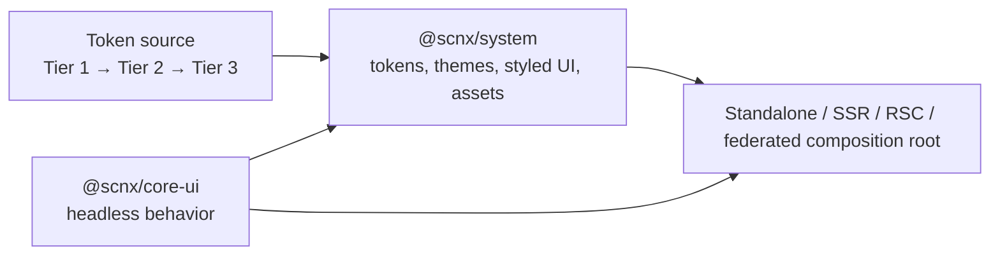

---
doc_meta:
  id: SAD-003
  title: Scnehaux UI Platform Software Architecture
  owner: Principal UI/UX Architect
  version: 2.0.0
  status: proposed
  classification: public
  governed_by: [GDC-009]
  review_cycle_days: 180
  created_date: 2026-01-01
  last_reviewed: 2026-09-28
  parent_pad: PAD-PLT-003
  technologies:
    - name: react
      type: framework
    - name: module-federation
      type: frontend-architecture
    - name: sass
      type: css-preprocessor
    - name: panda-css
      type: css-generator
    - name: tsup
      type: build-tool
    - name: vitest
      type: test-runner
---

# Scnehaux UI Platform Software Architecture (SAD-003)

> **Pre-production review candidate.** The `proposed` status runs full structural validation and carries no production authority. Approval requires the authorizing ADRs and named reviewers.

## 1. Purpose & Scope

### Objective

Provide versioned design tokens, accessible headless primitives, styled components, themes, and static assets that external React consumers can install and verify from published packages.

### Constraint

The platform owns no product business workflow, application shell, user authorization policy, or runtime backend. It supports only declared React, SSR/RSC, browser, and Module Federation scenarios. Package source aliases and consumer-side Panda compilation are outside the release contract.

### Capability

The system realizes [PAD-PLT-003](../../03-domain/PAD-PLT-003-scnehaux-ui-platform/PAD-PLT-003-scnehaux-ui-platform.pad.md) through two publishable packages, three logical token tiers, scoped theme assets, interaction contracts, and release evidence.

## 2. Enterprise Traceability

The parent capability is PAD-PLT-003. Global authority includes ADR-GLB-FE-010 and the frontend standards it authorizes, and the replacement decisions ADR-GLB-FE-011 (federated toolchain), ADR-GLB-FE-012 (Module Federation runtime contract), and ADR-GLB-FE-013 (static CSS output). Until they are ratified, ADR-GLB-FE-002, ADR-GLB-FE-004, and ADR-GLB-FE-006 remain the binding accepted decisions. UI authority includes ADR-UIP-PLT-001, ADR-UIP-TKN-001 through ADR-UIP-TKN-003, and the five UI Platform standards. Component designs live in the UI Platform repository under `docs/designs/` and attach to this SAD through `parent_sad: SAD-003`.

## 3. Solution Context

External applications install immutable tarballs or registry artifacts. The UI Platform is absent from their request path.

Standalone and SSR/RSC consumers import supported JS, type, CSS, font, and token entries. Federated consumers add a host-owned share policy for React and every context-bearing UI request. Product applications retain complete-page WCAG conformance and business behavior.

## 4. Architecture Model

```mermaid
graph LR
  Tokens["Token source<br/>Tier 1 → Tier 2 → Tier 3"]
  Core["@scnx/core-ui<br/>headless behavior"]
  System["@scnx/system<br/>tokens, themes, styled UI, assets"]
  Host["Standalone / SSR / RSC / federated composition root"]
  Tokens --> System
  Core --> System
  Core --> Host
  System --> Host
```

### 4.1 Package boundaries

- `@scnx/core-ui` owns style-agnostic primitives, widget behavior, state, contexts, and stable interaction APIs.
- `@scnx/system` owns the canonical token source, generated Sass/Panda contracts, themes, styled wrappers, aggregate component CSS, fonts, and `@scnx/system/tokens/*` exports.
- `@scnx/system` may depend on `@scnx/core-ui`. The reverse dependency is prohibited.
- Published exports and asset paths are compatibility contracts.

### 4.2 Token and CSS flow

Tier 1 contains raw scales. Tier 2 expresses shared semantic intent. Tier 3 aliases component-specific intent. The canonical logical names are defined by ADR-UIP-TKN-003 and generated into CSS names.

The v1 style pipeline uses Sass component rules and a frozen set of Panda recipes from one generated token contract. The canonical cascade order is `reset, tokens, base, components, recipes, utilities, overrides`. A composition root imports one aggregate component stylesheet and one selected theme stylesheet. Component JavaScript and remotes do not inject CSS.

### 4.3 Interaction and theme flow

Native/custom behavior serves Button, Disclosure/Accordion, Navigation, Sidebar, and layout primitives. Selected React Aria hooks implement Combobox, Select, Menu, Dialog, Popover, Listbox, and Tabs behind the public API.

Theme variables and resets live under `[data-scnx-theme]`. A separate `:root` compatibility asset may serve a single-brand document. Multiple-brand and federated support require scoped roots. Portaled UI mounts inside the originating theme container. Shadow DOM is outside v1.

## 5. State & Data Architecture

The versioned token dictionary is build input. Generated CSS, JavaScript, declarations, Sass assets, fonts, and manifests are immutable release artifacts.

Runtime component state belongs to a component instance or explicit provider. Theme state belongs to a named root or explicit host-owned store. Providers use subscriber sets with cleanup and avoid singleton mutable callbacks on `window`. The federation contract preserves context identity across host and remote.

## 6. Integration Contracts

- Package tarballs are produced with `pnpm pack`. Packed manifests contain publishable dependency versions and no `workspace:` ranges.
- Every documented JS, type, CSS, Sass, font, and token subpath resolves without workspace aliases.
- Server-safe and client entries are explicit. A hook-name or filename regex is insufficient.
- A strict Content Security Policy rejects `unsafe-eval` and `unsafe-inline` for scripts and styles; inline bootstrap code runs only through a consumer-controlled nonce or hash.
- The federation host follows ADR-GLB-FE-012: explicit singleton share keys for React, React DOM, `@scnx/core-ui`, and every context-bearing entry, `requiredVersion` from the consumer's declared range, lazy remotes, and a controlled failure for an incompatible version.
- Both remote load orders produce one React identity, one context identity, one aggregate component stylesheet hash, and one instance of each selected theme asset.
- Public token references resolve to valid computed property values inside every supported theme scope.

## 7. Security & Trust Boundary

The producer build, package registry, host application, and browser consumer are separate trust boundaries. Release provenance records source commit, checksum, package contents, dependencies, and licenses.

No package evaluates generated strings as code. Inline bootstrap behavior requires a host-controlled nonce/hash or an external asset. Components do not own product authorization. Rich content requires a separately reviewed API. Token and configuration inputs contain no secrets.

## 8. NFR

### Blast Radius

A defective package version can affect every adopting product. Immutable versions, prerelease channels, packed-consumer gates, migration notes, and rollback to the prior version contain that blast radius. A theme leak can cross remotes sharing a DOM; scoped selectors and two-root tests contain it. A duplicated context can split component state; federation identity tests contain it.

### Performance and compatibility

Budgets name the import scenario, tool, environment, representation, baseline, and threshold. Release evidence records raw, minified, gzip, Brotli, and parsed costs where applicable. Interaction traces cover dynamic-height motion and theme changes. Universal zero-reflow, fixed-FPS, zero-CLS, and arbitrary byte claims have no authority.

### Accessibility and reliability

Component Accessibility Conformance Reports cover applicable WCAG 2.2 and APG behavior. Contrast gates enforce SC 1.4.3 and SC 1.4.11. Every focusable part shows a `:focus-visible` outline, verified in a forced-colors fixture; shadows only enhance it. Required widget behavior covers keyboard, focus, accessible name, disabled state, controlled/uncontrolled state, reduced motion, and cleanup.

Failures include unresolved CSS variables, invalid substituted properties, missing fonts, missing exports, duplicate package identity, incompatible federation versions, missing transition completion events, and provider coexistence errors. Each required scenario has a pass/fail test or keeps the affected capability outside stable exports.

## 9. Deployment Strategy

The system deploys as versioned packages and static assets. It has no server runtime. Consumers choose an approved version and import the assets at their composition root. Prerelease channels precede stable promotion. Rollback selects the previous immutable package version.

### CI/CD

CI runs source tests, producer generation/build tests, `pnpm pack` consumers, export/type checks, browser computed-style checks, SSR/RSC, strict CSP, two-theme roots, portal propagation, and a host with two remotes. The release record links every gate, package checksum, measured budget, Component ACR, known limitation, and approver. Any required gate that does not run is a failure.

## 10. Architecture Decisions

ADR-UIP-PLT-001 owns seven v1 decisions: interaction foundation, theme isolation, styling ownership, polymorphism, token package boundary, CSS delivery, and federation sharing. ADR-GLB-FE-010 resolves the related global conflicts and authorizes the revised global standards. ADR-GLB-FE-011, ADR-GLB-FE-012, and ADR-GLB-FE-013 replace ADR-GLB-FE-002, ADR-GLB-FE-004, and ADR-GLB-FE-006 on ratification. ADR-UIP-TKN-001 through ADR-UIP-TKN-003 own token tiering, OKLCH authoring, alpha behavior, and canonical names.

### Rejected

- A third token package in v1 without an independent consumer or release cadence.
- CSS side-effect imports from component JavaScript.
- Per-component CSS subpaths in v1.
- Shadow DOM as the v1 multi-brand boundary.
- Vendor types in public component APIs.
- Regex inference for RSC client boundaries.
- Release approval from type checking or source builds alone.

## 11. Assumptions

Target consumers can load static CSS assets and satisfy declared React peer ranges. Federated applications provide a composition host. Supported assistive technology, browsers, bundlers, and framework versions are listed per release.

The UI Platform packages have not reached production, so UI Platform ADR corrections follow the pre-production in-place rule of GDC-010. The global frontend ADRs also govern the approved Experience systems SAD-002, SAD-012, SAD-014, and SAD-015, whose production status is not recorded in this repository; their changes therefore use replacement ADRs.

## 12. Compatibility Strategy

Public behavior, token names, token subpaths, package exports, CSS assets, theme selectors, data attributes, and supported peer ranges are versioned contracts. Breaking changes require a major package release, migration guide, and consumer rehearsal. Deprecations state replacement, owner, and removal window.
