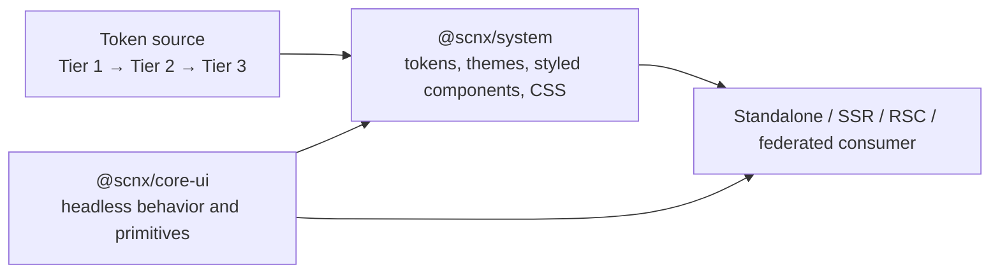

---
doc_meta:
  id: SAD-003
  title: Scnehaux UI Platform Software Architecture (SAD)
  owner: Principal UI/UX Architect
  version: 2.0.0
  status: draft
  classification: public
  governed_by: [GDC-000]
  review_cycle_days: 180
  created_date: 2026-09-28
  initial_created_date: 2026-01-01
  last_reviewed: '2026-09-28'
  parent_pad: PAD-PLT-003
  technologies:
    - name: react
      type: framework
---

# Scnehaux UI Platform Software Architecture (SAD-003)

> **Pre-production review draft.** Revision 2.0 was opened on 2026-09-28; the original SAD dates to 2026-01-01. Principal review accepted the evidence corrections and composition-root CSS contract, while consolidated ratification remains pending. It has no new production conformance claim; normative changes require the proposed authorizing ADRs and architecture review.

## 1. Purpose & Scope

This system realizes the [Enterprise UI Platform capability](../../03-domain/PAD-PLT-003-scnehaux-ui-platform/PAD-PLT-003-scnehaux-ui-platform.pad.md). It distributes versioned design tokens, headless interaction primitives, styled components, and static CSS to web consumers. It does not own product business behavior, an application shell, or a runtime backend.

The objective is a predictable consumer contract across standalone applications, SSR/RSC consumers, and federated host/remote compositions. Accessibility, theme isolation, package resolution, and performance are verified per declared scenario. The copied implementation is an extracted baseline, not an approved global release.

## 2. Enterprise Traceability

The parent capability is PAD-PLT-003. Applicable standards include [token architecture](../../02-standards/ui-platform/STD-UIP-TKN-001-design-tokens.md), [primitives](../../02-standards/ui-platform/STD-UIP-PRM-001-primitive-components.md), [styled components](../../02-standards/ui-platform/STD-UIP-STY-001-styled-components.md), [build and delivery](../../02-standards/ui-platform/STD-UIP-ENG-001-build-and-delivery.md), and [frontend performance](../../02-standards/_global/STD-GLB-FE-002-performance.md).

## 3. Solution Context

Consumers install published package artifacts, including their explicitly exported styles. The UI Platform itself is not in their request path. Module Federation consumers additionally require a verified shared-module policy for React and every public package subpath that carries shared context or state.

The model has **three logical token tiers**: core values, semantic intent, and component aliases. The baseline has **two physical packages**, not three. A third package is an option only if consumer evidence justifies the additional release and dependency boundary.

## 4. Architecture Model

```mermaid
graph LR
  Core["@scnx/core-ui<br/>headless behavior and primitives"]
  System["@scnx/system<br/>tokens, themes, styled components, CSS"]
  Source["Token source<br/>Tier 1 → Tier 2 → Tier 3"]
  Consumer["Standalone / SSR / RSC / federated consumer"]
  Source --> System
  Core --> System
  System --> Consumer
  Core --> Consumer
```

### 4.1 Package boundaries

- `@scnx/core-ui` owns style-agnostic React primitives, compound behavior, state, and accessible interaction contracts. It must not import `@scnx/system`.
- `@scnx/system` owns token source and generated contracts, themes, styled components, and their static styles. It may depend on `@scnx/core-ui`.
- Published JS, types, CSS, fonts, and subpath exports form the consumer contract. An internal source import is not proof that a published asset is reachable.
- React and context-bearing package subpaths must have a single tested identity in a federated shell and remote. Sharing only a package root does not automatically share every subpath.

### 4.2 Token and style flow

Tier 1 core values map to Tier 2 semantic intent. Tier 3 aliases are introduced where a component needs independent semantic control. The baseline compiles Sass and Panda output; one documented token contract and explicit style ownership are required across both. Both engines remain during P0 and are measured before a later consolidation decision. Panda is a producer build tool and does not scan `@scnx/core-ui` after the absence of Panda callsites is verified.

CSS custom properties and emitted stylesheet assets are checked in the packed consumer. `@scnx/system` exports aggregate component CSS and explicit theme CSS. A host or standalone composition root imports each required stylesheet once; component JavaScript and federated remotes do not inject duplicates. Theme selectors and resets are scoped to the consumer root. Cascade layers control precedence; they do not provide selector scope. Multiple brands and portaled UI require explicit tested scope and propagation contracts.

### 4.3 Component and interaction flow

Native elements provide their native keyboard behavior. Each exposed composite widget needs a behavior matrix based on its relevant APG pattern, covering focus order, keyboard actions, state, disabled behavior, and screen-reader naming. Selected React Aria hooks are a candidate for high-risk composite widgets behind the `@scnx/core-ui` API; simple primitives retain native/custom behavior. OFSM is an implementation technique for complex transitions; its presence does not prove interaction quality. `asChild` is the preferred polymorphism candidate, but it remains subject to semantics, refs, typing, handler order, single-child failure, consumer cost, and `Slot.tsx` provenance evidence.

### 4.4 C3 realization

Component-level mappings, generated variables, build scripts, and fixtures belong in versioned implementation specifications and the UI Platform package repository. This SAD defines boundaries and evidence obligations; it does not imply that all current source code conforms.

The C3 drafts in `ui-platform/docs/02-designs/` are TDD-ui-platform-packaging-001 (build/package), TDD-ui-platform-primitives-002 (behavior), TDD-ui-platform-tokens-003 (token output), TDD-ui-platform-styled-004 (styled CSS), and TDD-ui-platform-theme-005 (provider/transitions). They replace the extracted platform's reliance on the read-only microfrontend TDD-SCNX-UI-JS-001…005. They are drafts until reviewed against this SAD and the authorizing ADRs.

## 5. State & Data Architecture

The token dictionary is build input, and compiled CSS is a published artifact. Theme state may be local to a provider or inherited from a scoped subtree root. Document-wide mode is optional and does not establish multi-brand isolation. Provider implementation must work with multiple roots, explicit portal containers, SSR/hydration, and strict CSP without `unsafe-eval`. A single global callback is not a valid multi-provider subscription model.

Runtime component state belongs in the primitive instance or its explicit context boundary. Federation tests must demonstrate context identity across shell and remote when those components interact.

## 6. Integration Contracts

- Package exports must resolve from an installed tarball without source aliases. Documented JS, type, CSS, font, and subpath imports are tested.
- The P0 delivery target exports aggregate component CSS and explicit theme CSS. The host or standalone composition root imports each required stylesheet once. Component JS and remotes do not inject duplicate UI Platform CSS. Optional per-component CSS exports require packed-consumer evidence.
- SSR and RSC boundaries must be explicit. Build heuristics that guess `"use client"` from a short hook list are insufficient; a packed Next App Router consumer is the release evidence.
- Module Federation verification covers React singleton identity, package/context identity, version compatibility, remote loading, and duplicate CSS behavior.
- Versioned package artifacts and migration notes define compatibility. No current publication or CDN topology is assumed merely from a plan.

## 7. Security & Accessibility Boundary

The build and consumer must pass a strict CSP scenario without `unsafe-eval`; any inline style or script requirement must be documented and tested under the actual policy. Package integrity and provenance are part of the release process.

Accessibility evidence is reported for each component and state in a **Component Accessibility Conformance Report (Component ACR)** based on applicable WCAG 2.2 and APG criteria. It is not labeled a VPAT and does not certify the consuming page. Reflow, target size, focus visibility, contrast, motion, and keyboard scenarios are measured where applicable. A dependency does not transfer conformance responsibility.

## 8. Nonfunctional Requirements

Performance budgets are specified by consumer scenario, environment, metric, baseline, and threshold. Record CSS size by import path, JavaScript cost, build time, theme switch behavior, and layout work on representative interactions. Size evidence identifies raw/minified/compressed representation, tool, and incremental consumer cost. No universal zero-reflow, 60 FPS, zero-CLS, sub-50 ms, `<2 KB`, or fixed 12 KB guarantee is made without measured scope.

Failure handling includes missing CSS, unresolved variables, font load failure, duplicate package instances, and a provider mounted beside another provider. These are release tests, not presumed graceful fallbacks.

## 9. Delivery and Release Evidence

The standalone repository uses a pnpm workspace with `packages/core-ui` and `packages/design-system`. CI and publication workflow remain implementation work. Before release, gates must include:

1. **Source checks:** type check, build, state-machine/interaction tests, static analysis, and component accessibility behavior.
2. **Packed-package checks:** install tarballs in an isolated consumer without aliases; resolve exports and types; parse and compute CSS custom properties for every supported theme; verify fonts and styled rendering.
3. **Integration checks:** SSR/RSC, strict CSP, multiple provider roots, portal theme propagation, shell/remote package identity, one intended stylesheet set, deterministic CSS order, and relevant visual and accessibility scenarios.
4. **Governance:** review the conformance report, deviations, compatibility impact, and measured budgets before promotion.

The first phase establishes a running test harness and diagnoses the extracted baseline; passing TypeScript alone does not qualify a release.

## 10. Architecture Decisions

The [three-tier ADR](../../05-decisions/ui-platform/ADR-UIP-TKN-001-three-tier-isolation-architecture.md) governs token meaning. Proposed authorizing ADRs for changed global and UI standards are pending review. Six governed choices are tracked: React Aria scope, multi-brand isolation, Sass/Panda ownership, public polymorphism, token package topology, and CSS delivery. The CSS composition-root model has working consensus; the remaining candidate choices retain empirical gates. A decision record must include alternatives, measured evidence, migration impact, and review authority.

## 11. Assumptions & Constraints

Target consumers include standalone React applications, supported SSR/RSC environments, and federated applications. Support is declared per tested version and scenario; no framework or bundler compatibility is inferred from package metadata alone. The source microfrontend workspace remains untouched during the split.

## 12. Compatibility Strategy

Public behavior, token names, package exports, style import paths, and theme selectors are versioned contracts. Breaking changes use a major release and migration guide. Before first production deployment, accepted ADR wording may be edited in place under GDC-010; major STD rule changes still require an authorizing ADR under GDC-007. The current edits are review drafts until that governance path is completed.
