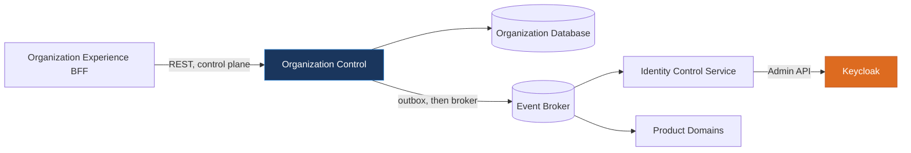
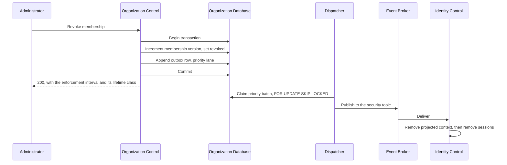

---
doc_meta:
  id: SAD-004
  title: Organization & Tenancy Control Software Architecture
  owner: Principal Platform Architect
  version: 1.0.0
  status: approved
  classification: restricted
  governed_by:
    - EAD-003
    - EAD-006
  parent_pad: PAD-PLT-002
  review_cycle_days: 180
  created_date: 2026-07-06
  last_updated: 2026-08-18
  last_reviewed: 2026-08-18
  technologies:
    - name: postgresql
      type: database
    - name: golang
      type: language
    - name: kafka
      type: event-broker
    - name: atlas
      type: schema-migration
    - name: opentelemetry
      type: observability
    - name: kubernetes
      type: orchestration
    - name: aws
      type: cloud-provider
---

# Organization & Tenancy Control Software Architecture (SAD-004)

---

## 1. Purpose & Scope

This document describes the Organization & Tenancy Control application, the deployable that realizes the Workspace Platform capability defined in PAD-PLT-002. It is the enterprise authority for Organization, Subscriber Account, Client Account, Tenant, Workspace, and Membership.

### 1.1 Objective

Hold the authoritative record of who belongs to which Tenant, and make a revocation of that belonging reach enforcement within a stated interval. Every other property of this system is subordinate to those two.

### 1.2 Capability

Organization and Subscriber Account lifecycle; Tenant and Workspace lifecycle; Membership grant, suspension, revocation, and restoration; invitation and onboarding correlation; Tenant offboarding coordination; and the published snapshot contract consumers reconcile against.

### 1.3 Constraint

- **Single deployable**, one bounded context, modules separated at compile time per ADR-GLB-001 §5.1 and STD-GLB-BE-001 Rule 1.
- **PostgreSQL is the only datastore.** Row-Level Security enforces Tenant isolation at the engine, per ADR-GLB-002.
- **No Keycloak credential and no network route to Keycloak.** ADR-ORG-001 §5.4 prohibits this system from writing to Keycloak, and the absence of the credential makes the prohibition structural rather than procedural.
- **No cross-domain database access.** Consumers obtain state through published events and the snapshot contract, never through a connection to this database.
- **Every domain mutation and its outbox append commit in one transaction**, using the shared substrate rather than a local reimplementation.

### 1.4 Requirement

Accept-to-outbox-commit within 100 ms; outbox-commit-to-dispatch-claim within 1 s; Tier-0 availability per EAD-001; Membership history retained through offboarding per ADR-ORG-001 §5.1.

### 1.5 Assumption

Consumers validate tokens locally and reconcile projections asynchronously. The identity kernel is reachable by the Identity Control Service and not by this one.

---

## 2. Enterprise Traceability

This system realizes PAD-PLT-002, the Workspace Platform capability, which EAD-001 classifies as Core Platform at Tier-0.

| Relationship | Target |
| :-- | :-- |
| Realizes | PAD-PLT-002 — Organization & Tenancy Platform |
| Governed by | ADR-ORG-001 — separate Organization authority from its Keycloak projection |
| Governed by | ADR-GLB-002 — Row-Level Security as the tenant isolation boundary |
| Governed by | ADR-GLB-003 — transactional outbox and the Kafka protocol |
| Conforms to | STD-IAM-002 — the lifetime class that bounds enforcement, which this system does not own |
| Conforms to | STD-GLB-BE-001 — internal package structure and boundary assertion |
| Consumed by | SAD-001 Identity Control Service, SAD-012 Organization Experience, and every Product domain reading Membership context |

---

## 3. Solution Context

### 3.1 System Context

The system sits behind the API Gateway. Its callers are the Organization Experience BFF and privileged administrative surfaces; its consumers are asynchronous.



The absent edge is the important one. There is no arrow from Organization Control to Keycloak. The projection reaches the kernel through the broker and the Identity Control Service, which is the only process holding the administration credential.

### 3.2 External Dependencies

The event broker, and nothing else on the request path. There is no synchronous call from this system into another domain, so no other domain's availability bounds a Membership mutation.

### 3.3 Internal Structure

A modular monolith in Go. Modules correspond to aggregates and interact through internal interfaces rather than by reaching into one another's repositories.

---

## 4. Architecture Model

### 4.1 Container and Component View

```text
cmd/organization-control/        composition root, the only place anything is constructed
internal/
  organization/                  Organization and Subscriber Account aggregates
  tenant/                        Tenant lifecycle, security version, offboarding
  workspace/                     Workspace lifecycle inside a Tenant
  membership/                    Membership authority, versions, revocation
  invitation/                    invitation issue, acceptance, expiry
  snapshot/                      the published projection contract consumers reconcile against
  httpapi/                       route registration over the shared middleware chain
  projectionfeed/                driving adapter for the outbox dispatcher
```

Boundaries are declared in a manifest and asserted against the package graph on every build, per STD-GLB-BE-001 Rule 3. The transaction handle is an explicit parameter throughout, per Rule 6, which is what makes the outbox append impossible to perform outside a domain transaction.

### 4.2 Revocation Runtime Flow

The sequence below is the system's reason for existing. Each step is a checkpoint that bounds the enforcement interval.



The response to the administrator carries the enforcement interval rather than implying immediacy. STD-IAM-002 §3.4 requires that figure to be presented as the sum of propagation and the remaining token lifetime, naming the class assumed.

### 4.3 Event Flow and Ordering

Security events occupy a topic separate from lifecycle events, with their own consumer group and partition allocation, so a lifecycle backlog cannot delay a revocation. Producers partition by aggregate identifier, which yields per-aggregate ordering — the guarantee consumers depend on, since the outbox stream position is publisher-global and Kafka preserves order only within a partition.

---

## 5. State & Data Architecture

### 5.1 Storage and Schema

PostgreSQL, accessed through the shared pool and transaction manager. Schemas are declarative under Atlas per ADR-GLB-004; the `platform` schema is applied from the shared module rather than re-declared here, per ADR-GLB-004 §5.3.

Two schemas exist in one database: `organization` for domain state, and `platform` for the outbox, deduplication, dead-letter, and idempotency tables. They are never joined across a domain boundary because both belong to this domain.

Primary keys are UUIDv7 per STD-GLB-002. Membership carries a monotonic version, and Tenant carries a security version; both are the values consumers compare to decide whether an event is current or superseded.

### 5.2 Tenant Isolation

Row-Level Security is enabled and forced on every tenant-scoped table. The runtime role owns no table and holds neither `SUPERUSER` nor `BYPASSRLS`, so an omitted predicate returns zero rows rather than another tenant's. The tenant identifier is bound by `SET LOCAL` at the start of every transaction through the session binder the shared substrate invokes.

Isolation is asserted as the runtime role rather than as the owner. A test run as the table owner passes while Row-Level Security is bypassed entirely, which is the failure mode that makes the control look present when it is absent.

### 5.3 Cache

None on the request path. A cached authority read would introduce a staleness window in the system that defines what current means. Consumers cache; the authority does not.

### 5.4 Stateless Runtime

The process holds no session and no in-memory state that survives a request, so replicas are interchangeable and scale horizontally.

### 5.5 Invitation Possession Never Proves Identity

An invitation token proves that someone received a message. It does not prove who they are.

Accepting an invitation therefore requires an authenticated Principal, and the acceptance binds the invitation to that Principal's canonical identifier. An invitation MUST NOT create a Principal, MUST NOT grant a Membership on possession alone, and MUST NOT be accepted by an unauthenticated caller.

An invitation is single-use, expires, and is bound at issue to the Tenant and role it was created for. Escalating an invitation to a broader scope after issue is prohibited, because the record of what was approved is the record of what was issued.

---

## 6. Integration Contracts

### 6.1 Published API

REST over HTTP, JSON, path-versioned. This is a control-plane interface: its volume is proportional to operator actions rather than to end-user traffic, which is the criterion STD-GLB-006 uses to permit REST rather than requiring gRPC. It depends on HTTP semantics with registered meanings — `Idempotency-Key`, optimistic-concurrency preconditions, and `202 Accepted` with a polled operation resource.

Every mutation requires an idempotency key, and every administrative mutation additionally requires the expected version, a reason, and a correlation identifier. Errors are RFC 9457 problem documents drawn from a compiled registry.

`GET /v1/projections/organization/snapshot` is the authority read every consumer reconciles against. It is paged, carries a version watermark, and is the only sanctioned path to the authoritative set. No privileged read path, replica, or database connection exists for that purpose.

### 6.2 Published Events

`com.scnehaux.organization.*` in the CloudEvents 1.0 envelope, carrying the aggregate version, the Tenant security version, correlation, and causation. Security-classified events route to the priority lane.

### 6.3 Consumed Events

`com.scnehaux.identity.principal.*`, to learn that a Principal exists before a Membership can reference it. Every consumption passes the shared deduplication guard inside the same transaction as its effect.

### 6.4 Consumed Platform Capabilities

Identity, through locally verified tokens. This system validates a token and applies its own authorization; it makes no synchronous call to the Identity Platform per request.

---

## 7. Security & Trust Boundary

**Authentication** is not performed here. A token arrives already verified at the edge and is verified again locally per STD-IAM-002 §3.5, including the requirement that `principal_id` be present for an internal or privileged audience.

**Authorization** is applied to every command, and the API reauthorizes rather than trusting that the caller's surface already did. UI-side authorization is defence in depth; this layer is authoritative.

**Membership is context, not permission.** Per ADR-ORG-001 §5.6 a Membership conveys a contextual relationship and tenancy-administrative authority and nothing else. It carries no Product permission and no commercial Entitlement.

**Encryption**: TLS 1.3 in transit, AES-256 at rest, per EAD-006 §5.5.

**Secrets** are brokered from the managed store and injected as environment configuration. No secret is present in source or in an image. This system holds no Keycloak credential to protect, which is the strongest available control over its misuse.

**Audit**: every administrative mutation publishes an attributable evidence event carrying actor, subject, reason, correlation, and outcome. Privileged reads are evidenced too, because Membership state across a Tenant is useful reconnaissance.

---

## 8. NFR

### 8.1 Blast Radius

| Failure | Impact | Blast radius | Degradation |
| :-- | :-- | :-- | :-- |
| Organization Database unavailable | No Membership mutation, no authority read | **Enterprise-wide for provisioning.** Existing tokens keep working; consumers serve from their projections | Readiness reports unhealthy and the replica leaves the load balancer. Writes fail closed |
| Event broker unavailable | Propagation paused | **Enforcement delayed, not lost.** Rows remain in the outbox and publish on recovery | Priority rows return to the pool with escalating claim backoff and are never dead-lettered for unavailability. Consumers exceeding their staleness bound under a fail-closed policy deny |
| Dispatcher stalled | Same as broker loss | Delayed enforcement | Oldest-unpublished-priority-row alert at 30 s, critical at 2 min |
| Identity Control unavailable | Projection not applied | Revoked context still asserted at next authentication | Bounded by the consumer's staleness policy, not by this system. Reconciliation repairs on recovery |
| A single Tenant's data corrupted | That Tenant | Contained by Row-Level Security and per-Tenant versioning | Restore is per-Tenant rather than estate-wide |

The enforcement interval is not owned here. This system owns propagation; the remaining token lifetime belongs to STD-IAM-002 §3.3. Any figure published as an enforcement guarantee states both terms.

### 8.2 Latency and Throughput

Accept-to-outbox-commit p95 within 100 ms. Outbox-commit-to-dispatch-claim within 1 s, of which the 500 ms poll interval is the floor — which makes that interval a security parameter rather than a tuning preference. Snapshot page p95 within 500 ms.

### 8.3 Scalability

Replicas scale horizontally and contend safely on the outbox through `SKIP LOCKED`. Two pools exist with different ceilings: the cross-tenant provider pool is deliberately smaller than the tenant-facing pool, so a runaway reconciliation job exhausts its own capacity rather than the capacity serving requests.

### 8.4 Timeout, Retry, and Circuit Breaker

Every inbound request carries a deadline into its context, and the transaction manager and every outbound call inherit it. Downstream timeouts are configured strictly below the caller's budget, so a slow dependency surfaces as a dependency error rather than as a caller timeout that names nothing. Retries apply to transient classes only, three attempts with exponential backoff and jitter, per STD-GLB-005.

### 8.5 Observability, Telemetry, Alerting, and Runbook

OpenTelemetry traces, RED metrics, and structured JSON logs to stdout, every line carrying `deployable`, `system`, `correlation_id`, and `tenant_id`. Alerting is symptom-first on the propagation signals above. Runbooks required before production: revocation not enforced within budget, dead-letter triage and replay, dispatcher stall, broker outage and backlog drain, and Tenant-scoped restore.

---

## 9. Deployment Strategy

### 9.1 Environment and Infrastructure

Kubernetes across multiple availability zones, with a minimum of three replicas for Tier-0. PostgreSQL with one primary and two read replicas; authority reads target the primary because a replica read of the system that defines current state can be stale.

#### 9.1.1 Migration Job

Schema application runs as a separate job under a migration role distinct from the runtime role. The runtime role holds no DDL privilege, so the application cannot alter its own schema.

#### 9.1.2 Configuration

Environment only, read once at the composition root per STD-GLB-BE-001 Rule 8. A required setting that is absent fails startup.

#### 9.1.3 Timeout Budget

Timeouts are assigned from the edge inward, each strictly below its caller's remaining budget: gateway 30 s, inbound handler 5 s, database query 3 s, single outbound attempt 500 ms. A downstream budget equal to or above its caller's produces a caller timeout that names no cause.

### 9.2 CI/CD

Every gate blocks a merge, and each corresponds to a named rule: formatting, static analysis, build, tests under the race detector, a coverage floor, package-graph boundary assertion per STD-GLB-BE-001, Atlas directory integrity and the destructive gate per ADR-GLB-004 §5.1, event schema compatibility per ADR-GLB-006, dependency tidiness, and a scheduled vulnerability scan.

Row-Level Security isolation and the runtime role's privilege boundary are asserted against a real PostgreSQL service container, with a flag that turns a skipped suite into a failure. A container that never came up would otherwise leave the isolation claim unasserted and the run green.

Canary rollout is mandatory for any change to the revocation path.

---

## 10. Architecture Decisions

### Accepted

Authority here, projection in the kernel, propagation through the outbox — ADR-ORG-001. Row-Level Security as the isolation boundary — ADR-GLB-002. The Kafka protocol as the event backbone — ADR-GLB-003.

### Rejected

#### 10.1 Writing the Keycloak projection directly from this system

Rejected. It requires this system to hold the Keycloak administration credential, which makes every defect in Tenant, invitation, or Membership code a path to authenticator reset for every Principal in the enterprise. It also creates a second writer over one store, so two reconciliation loops repair toward two views. Argued in full in ADR-ORG-001 §8 Alternative A.

#### 10.2 Application-layer tenant filtering instead of Row-Level Security

Rejected. It depends on every developer remembering a predicate, and the failure mode is silent cross-tenant disclosure rather than an error. ADR-GLB-002 places the boundary in the engine for that reason.

#### 10.3 A shared database with the Identity Control Service

Rejected. Prohibited by EAD-003 §6.5, and it is the precise mechanism by which decomposed services re-fuse into a distributed monolith.

#### 10.4 Publishing directly to the broker inside the domain transaction

Rejected. If the broker is unreachable the transaction blocks and connection pools exhaust; if the publish is moved outside the transaction the write can commit without its event. The outbox makes the mutation and the event atomic.

#### 10.5 Exposing a database replica for consumer reconciliation

Rejected. A replica is a cross-domain database dependency wearing different clothes, and it would let a consumer read state this system has not published. The snapshot contract is the sanctioned path.

---

## 11. Assumptions

- Consumers tolerate an eventual-consistency window and declare a staleness bound with a behaviour when it is exceeded.
- The managed PostgreSQL provides connection pooling at the platform layer.
- The event broker provides a replication factor of at least three across availability zones.

---

## 12. Compatibility Strategy

The API is versioned in the path. Events are versioned in the type, and a breaking change promotes the major version rather than altering the existing one, per ADR-GLB-006. Backward-compatible event changes add optional fields only; a field is deprecated before removal and removed only after every consumer has migrated.

The snapshot contract carries its own version, because a consumer reconciling against it during an upgrade must be able to tell which shape it received.
