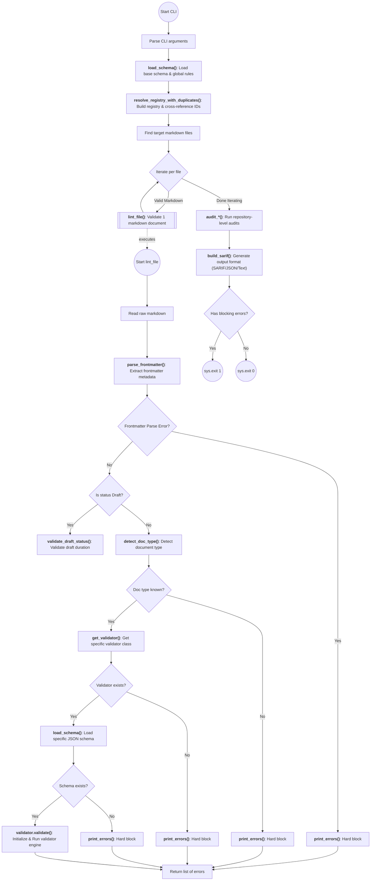
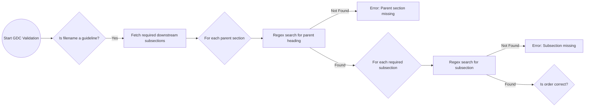
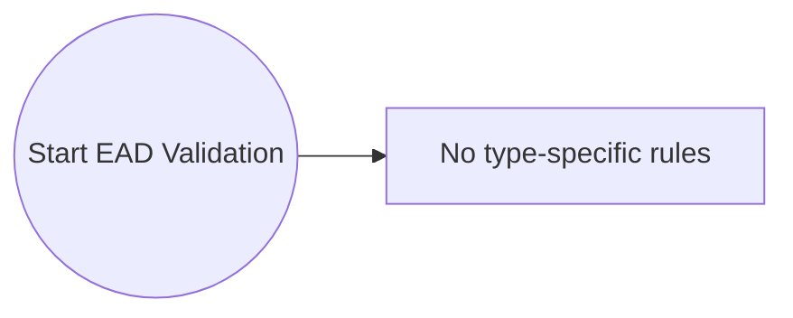
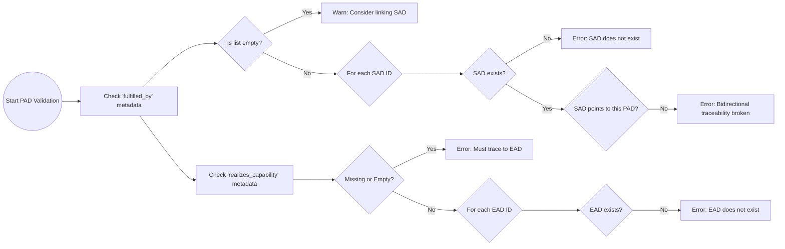
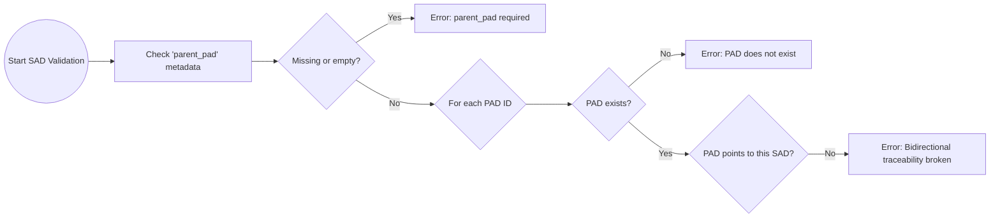
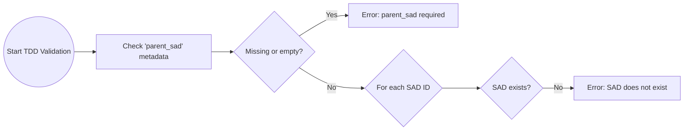
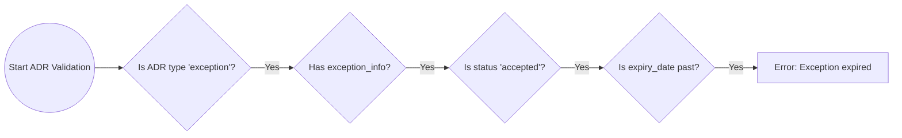
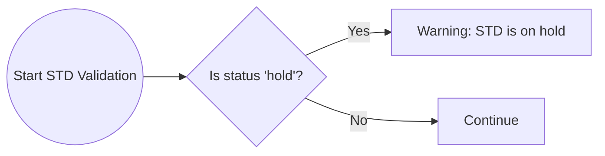

# Engine Capabilities

This index documents the internal functions and classes of the Fitness Function Engine.

> [!WARNING]
>
> **DO NOT EDIT THIS TABLE MANUALLY.** This table is automatically generated by parsing the docstrings of the core auditor and validator scripts. If you add or modify an engine function, regenerate this block by running: `python 06-fitness-function/generators/generate_functions_doc.py`

<!-- AUTO-GENERATED-FUNCTIONS:START -->

## List of functions

### `engine/auditors/git_auditor.py`

| Function | Description |
| :--- | :--- |
| **_resolve_base_ref** | Resolve the git ref the working tree is compared against for the immutability audit. In CI (pull request) the baseline is the target branch, NOT HEAD: comparing against HEAD is a no-op there because the checked-out tree already equals HEAD. We therefore prefer the integration branch and fall back to HEAD for local pre-commit use. Priority: $SCNEHAUX_BASE_REF (injected by CI) -> origin/main -> origin/master -> main -> master -> HEAD. |
| **audit_version_bump** | Enforce Git-Aware Version Bump Mandate (GDC-000 Section 2.5). If an 'approved' artifact is modified relative to the integration branch, its version must be incremented. |

### `engine/auditors/graph_auditor.py`

| Function | Description |
| :--- | :--- |
| **_as_list** | Coerce a scalar value or None into a list format. Used for normalizing metadata fields that can be either strings or lists. |
| **audit_duplicate_ids** | Evaluate duplicate document IDs across the repository to enforce the SSOT (Single Source of Truth) invariant. This auditor iterates over the duplicate map generated during the pre-scan phase. For every duplicated ID, it generates an error tuple pointing to the conflicting file paths. Returns: list[tuple[str, str, str]]: A list of (severity, message, filepath) tuples. |
| **audit_hierarchy_tiers** | Enforce C4 Tier Mapping (GDC-000 Section 2.3.1). TDD -> SAD -> PAD -> EAD. ADR & STD -> EAD or PAD. |
| **audit_orphans** | Enforce architectural connectivity by ensuring no orphaned artifacts exist below the EAD tier. This check validates that nodes with an in-degree of 0 (no incoming upward edges) are exclusively top-level constructs (EADs or GDCs). Any lower-tier document (TDD, SAD, PAD) missing its requisite parent reference (e.g. `parent_pad`, `governed_by`) is flagged as a traceability violation. Returns: list[tuple[str, str, str]]: A list of (severity, message, filepath) tuples for orphaned nodes. |
| **audit_traceability_graph** | Return a list of (category, message) tuples for global traceability defects. Currently detects circular dependencies (length >= 2) in the upward-reference graph and emits them as 'traceability_violation' (a blocking ERROR). |
| **build_upward_graph** | Build an adjacency map of upward references restricted to known, non-self ids. This function parses specific metadata fields (`UPWARD_EDGE_FIELDS`) across all registered documents to map their upward topological dependencies. Self-references are explicitly filtered out to avoid false-positive cycles. Returns: dict: A mapping from document ID to a set of its upstream parent IDs. |

### `engine/cli.py`

| Function | Description |
| :--- | :--- |
| **_disable_info** | Capture the state of any `lint_disable` governance directives from the validator. This includes rules that the author successfully disabled (along with their justification) and CRITICAL rules that the author attempted to disable but were rejected by the engine. Returns: dict: A dictionary containing 'disabled' (mapping rule -> reason) and 'rejected' (set of rules that could not be silenced). |
| **lint_file** | Orchestrate validation for a single markdown file. This executes the core lifecycle: Read -> Parse Metadata -> Identify Type -> Validate. Returns (errors, is_clean, has_blocking, disable_info). # @flow: StartLint((Start lint_file)) --> Read[Read raw markdown] |
| **main** | Main entrypoint for the Linter engine. Execution phases: 1. Parse CLI arguments and configure logging. 2. Load global governance schemas (`base.schema.json`). 3. Perform a fast pre-scan of the repository to build a global cross-reference registry and detect ID duplicates. 4. Traverse the file tree and invoke `lint_file` for each valid markdown document. 5. Execute repository-level audits (e.g., orphan detection, circular dependency checks). 6. Aggregate results into the requested format (text, json, sarif) and exit with code 1 if any CRITICAL or ERROR violations are found, else exit 0. |

### `engine/config/loader.py`

| Function | Description |
| :--- | :--- |
| **deep_update** | Recursively merge two dictionaries. This is used to overlay specific document rules (e.g., SAD, PAD) on top of the global governance rules. |
| **load_schema** | Load and parse a JSON schema file. Terminates the program if the file cannot be found. |

### `engine/fs/crawler.py`

| Function | Description |
| :--- | :--- |
| **resolve_all_doc_registry** | Backward-compatible wrapper returning (set of doc_ids, dict id -> doc_meta). Use resolve_registry_with_duplicates() when duplicate detection is required. |
| **resolve_registry_with_duplicates** | Scan the target directory to build a registry of document IDs, their metadata, AND a map of any duplicate IDs (which violate the SSOT uniqueness invariant). Returns: tuple: (set of doc_ids, dict mapping doc_id -> doc_meta, dict mapping duplicated doc_id -> list of conflicting file paths) |

### `engine/parsing/markdown_ast.py`

| Function | Description |
| :--- | :--- |
| **clean_content_for_length** | Remove all semantic markdown structures (YAML frontmatter, code blocks, HTML blocks) and collapse the remaining text nodes into a single flat string. Used to accurately count the substantive prose length of a document or section. |
| **extract_doc_id_references** | Extract architecture document IDs referenced in prose (e.g. '(**ADR-018**)'). Code fences and frontmatter are excluded via clean_content_for_length. Returns a de-duplicated, order-preserving list. |
| **extract_links** | Traverse the Markdown AST to find and extract all hyperlink targets (href values). Used to validate internal repository links and prevent link rot. |
| **extract_section_contents** | Extract all H2 (##) level sections from a markdown document. Returns a dictionary mapping the lowercased, raw heading text to its content body. Note: The heading text retains numbering. Use extract_sections_normalized for strict matching. |
| **extract_sections_normalized** | Return {section_title: section_content} for H2 sections, with any leading numbering stripped and the ORIGINAL case preserved (e.g. '## 1. Context & Scope' -> key 'Context & Scope'). This is the canonical source of section identity for JSON-Schema validation: schemas declare required/recommended sections by their Title-Case, unnumbered name, and `content_policies` run `pattern` checks against the section's text. (`extract_section_contents` lowercases the key and keeps the numeric prefix, so it can neither satisfy a `required` match nor feed content patterns.) |
| **normalize_section** | Normalize section name for comparison by stripping numbering. |
| **parse_date** | Safely parse a date value from YAML frontmatter (which could be a string or native datetime object) into a standard datetime.date object. Supports YYYY-MM-DD and YYYY/MM/DD formats. |
| **parse_frontmatter** | Extract and parse the YAML frontmatter block from the beginning of a markdown document. Returns a tuple containing the `doc_meta` dictionary and an optional error message if parsing fails. |
| **strip_code_fences** | Remove fenced code blocks (``` and ~~~) so that directives or examples embedded inside documentation (e.g. an illustrative `<!-- lint_disable: ... -->`) are NOT parsed as live directives by the engine. |

### `engine/reporting/reporter.py`

| Function | Description |
| :--- | :--- |
| **build_sarif** | Convert aggregated results into a SARIF 2.1.0 document so violations surface as inline annotations on GitHub PRs (via code-scanning upload). `results` is a list of {"file": path, "errors": [(severity, message), ...]}. |
| **print_errors** | Format and aggregate errors for a specific file. Returns (errors, is_clean, has_blocking). - is_clean: True only when there are zero issues (no errors, no warnings). - has_blocking: True when CRITICAL or ERROR level findings exist. |

### `engine/validators/base.py`

| Function | Description |
| :--- | :--- |
| **BaseValidator._validate_schema** | Execute JSON-Schema validation against the document's metadata block and section bodies. Translates raw jsonschema exceptions into actionable, governance-aware error messages (e.g., mapping pattern failures to missing keywords). |
| **BaseValidator.add_error** | Record a validation finding. Resolves the severity level from global governance rules. If the rule is suppressed via a `lint_disable` directive, the finding is dropped UNLESS its severity is CRITICAL, in which case the disable is rejected and the finding fires anyway. |
| **BaseValidator.validate** | Execute the complete validation lifecycle for this document. The lifecycle runs in three sequential phases: 1. JSON-Schema Validation: Strict structural and pattern checking based on the domain schema. 2. Global Rules Validation: Execution of governance rules applicable to all documents. 3. Domain-Specific Rules: Execution of custom rules defined in the specific subclass validator. Returns: list[tuple[str, str]]: An aggregated list of (severity, message) error tuples. |
| **BaseValidator.validate_type_specific** | Override in subclass for doc-type-specific checks. |

### `engine/validators/domains/adr_validator.py`

| Function | Description |
| :--- | :--- |
| **ADRValidator.validate_type_specific** | Execute rules specific to Architecture Decision Records (ADRs). Enforces lifecycle rules for architecture exceptions: - If the ADR type is 'exception' and status is 'accepted', it must have a valid `expiry_date`. - If the `expiry_date` is in the past, an `exception_expired` error is raised to force a review. |

### `engine/validators/domains/ead_validator.py`

| Function | Description |
| :--- | :--- |
| **EADValidator.validate_type_specific** | Execute rules specific to Enterprise Architecture Documents (EAD). Currently, EADs serve as the top-level anchor for the architecture hierarchy. They have no type-specific rules beyond the global governance constraints. |

### `engine/validators/domains/gdc_validator.py`

| Function | Description |
| :--- | :--- |
| **GDCValidator.validate_type_specific** | Execute rules specific to Governance Documents (GDC). Enforces meta-governance constraints for guideline artifacts: - If the document is a guideline (e.g., *-guideline.md), it dynamically fetches required downstream subsections from `base.schema.json`. - It strictly enforces the presence and sequential order of these subsections nested under their respective parent headings to ensure structural consistency across all domain templates (SAD, PAD, etc.). |

### `engine/validators/domains/pad_validator.py`

| Function | Description |
| :--- | :--- |
| **PADValidator.validate_type_specific** | Execute rules specific to Platform Architecture Documents (PAD). Enforces bidirectional traceability and capability realization: - Downward traceability: Validates the `fulfilled_by` field. If populated, it must reference valid SAD IDs. Additionally checks that those SADs declare this PAD as their `parent_pad` (bidirectional link). - Upward traceability: Validates the `realizes_capability` field. It is strictly mandatory and must point to a valid EAD ID in the registry, ensuring the platform architecture maps back to business capabilities. |

### `engine/validators/domains/sad_validator.py`

| Function | Description |
| :--- | :--- |
| **SADValidator.validate_type_specific** | Execute rules specific to System Architecture Documents (SAD). Enforces upward traceability and bidirectional consistency: - Validates the mandatory `parent_pad` field, ensuring the system maps to a recognized platform. - Checks that the referenced PAD exists in the repository. - Checks that the referenced PAD declares this SAD in its `fulfilled_by` array (bidirectional link). |

### `engine/validators/domains/std_validator.py`

| Function | Description |
| :--- | :--- |
| **STDValidator.validate_type_specific** | Execute rules specific to Standard Documents (STD). Enforces lifecycle constraints for enterprise standards: - Checks the `status` field. If a standard is marked as 'hold' (meaning it is slated for retirement or deprecation), an `operational_stability_violation` is raised to warn implementers against adopting it for new work. |

### `engine/validators/domains/tdd_validator.py`

| Function | Description |
| :--- | :--- |
| **TDDValidator.validate_type_specific** | Execute rules specific to Technical Design Documents (TDD). Enforces upward traceability: - Validates the mandatory `parent_sad` field, ensuring the technical design maps to a system architecture. - Checks that the referenced SAD actually exists in the repository registry. |

### `engine/validators/global_rules.py`

| Function | Description |
| :--- | :--- |
| **_is_example_id** | True if the referenced ID belongs to the reserved example/placeholder namespace. |
| **_validate_content_quality** | Ensure the content avoids prohibited boilerplate words and vague claims based on the governance constraints. |
| **_validate_cross_references** | Verify that any architecture IDs referenced in the document metadata (e.g., parent_pad, governed_by) actually exist in the registry. |
| **_validate_inline_references** | Detect architecture document IDs cited inline in prose (e.g. '(**ADR-018**)') that do not resolve to any document in this repository. Reported as a non-blocking WARNING because a citation may legitimately point at an external or downstream document not present in this registry. |
| **_validate_internal_links** | Verify that all internal markdown links resolve to existing files in the repository to prevent link rot. |
| **_validate_naming** | Enforce the naming convention (filename pattern) as defined in the global governance metadata rules. |
| **_validate_nfr_taxonomy** | Ensure NFRs strictly map to AWS WAF pillars (GDC-000 Section 2.4). |
| **_validate_quantification** | Ensure that non-functional requirements and other specific sections contain quantified metrics and mandatory keywords. |
| **_validate_review_age** | Check if a document's last review date exceeds the maximum allowed age, triggering a review requirement. |
| **_validate_structure** | Validate the document structural integrity, including checking minimum section content lengths. |
| **_validate_technology_hold** | Check if the document references technologies on HOLD status in the tech radar. Only fires for document types that describe deployable technology surfaces (SAD, TDD). Centralised here to eliminate DRY violation (previously duplicated in sad.py and tdd.py). |
| **run_common_validations** | Execute the suite of global governance rules (e.g. naming, review age, NFR taxonomy, traceability) that apply universally across all architecture document types. |
| **validate_draft_status** | Check if a draft document has exceeded the maximum allowed draft age. |

### `engine/validators/registry.py`

| Function | Description |
| :--- | :--- |
| **detect_doc_type** | Determine the architecture document type based on cascading fallback logic. Resolution order: 1. Parse the explicit `id` field from the document's YAML frontmatter (e.g. 'SAD-001'). 2. Fallback: Check if the filename uses legacy/domain extensions (e.g. `.sad.md`). 3. Fallback: Parse the filename prefix itself (e.g. 'GDC-001.md'). Returns: str \| None: The 3-letter uppercase document type (e.g. 'SAD', 'PAD') or None if unknown. |
| **get_validator** | Return the corresponding Validator subclass for the detected document type. Maps strings like 'SAD' to `SADValidator`, 'PAD' to `PADValidator`, etc. Returns None if the document type is not supported by the validation engine. |

<!-- AUTO-GENERATED-FUNCTIONS:END -->

## CLI Execution Flow

> [!NOTE]
>
> This diagram maps the exact step-by-step execution path of the core orchestrator (`cli.py`), generated automatically from inline `# @flow:` comments.

<!-- AUTO-GENERATED-CLI-FLOW:START -->



<!-- AUTO-GENERATED-CLI-FLOW:END -->

## Validation Engine Lifecycle (base.py)

> [!NOTE]
>
> This diagram maps the internal execution of `validator.validate()`, detailing how the JSON Schema and governance rules are applied.

```mermaid
graph TD
    Validate((Start validator.validate)) --> ExtractSections
    ValTech --> TypeSpecific["<b>validate_type_specific()</b>: Execute Domain Rules"]
    TypeSpecific --> ReturnErrors((Return aggregate errors))
    subgraph SchemaPhase[JSON Schema Validation Phase]
    ExtractSections["<b>extract_sections_normalized()</b>: Parse sections"] --> BuildDocInstance["Build validation instance dict"]
    BuildDocInstance --> ExecJsonSchema["<b>jsonschema.validate()</b>"]
    ExecJsonSchema -->|Valid| CommonRules((Start Global Rules))
    ExecJsonSchema -->|ValidationError| MapError["Map jsonschema errors to category"]
    MapError --> AddError["<b>add_error()</b>: Record finding"]
    AddError --> CommonRules
    end
    subgraph GlobalRulesPhase[Global Rules Validation Suite]
    CommonRules((Start Global Rules)) --> ValNaming["<b>_validate_naming()</b>: Check filename against GDC rules"]
    ValNaming --> ValRevAge["<b>_validate_review_age()</b>: Ensure doc is not expired/too old"]
    ValRevAge --> ValContent["<b>_validate_content_quality()</b>: Reject prohibited/vague terms"]
    ValContent --> ValStruct["<b>_validate_structure()</b>: Enforce minimum section lengths"]
    ValStruct --> ValCross["<b>_validate_cross_references()</b>: Validate doc-to-doc relationships"]
    ValCross --> ValInternal["<b>_validate_internal_links()</b>: Prevent internal markdown link rot"]
    ValInternal --> ValInline["<b>_validate_inline_references()</b>: Verify inline ID citations"]
    ValInline --> ValQuant["<b>_validate_quantification()</b>: Require metrics/keywords in sections"]
    ValQuant --> ValNFR["<b>_validate_nfr_taxonomy()</b>: Validate NFRs against AWS WAF pillars"]
    ValNFR --> ValTech["<b>_validate_technology_hold()</b>: Flag 'HOLD' status from tech radar"]
    end
```

<!-- AUTO-GENERATED-VALIDATOR-FLOW:START -->



<!-- AUTO-GENERATED-VALIDATOR-FLOW:END -->

## Domain-Specific Validation Lifecycles

> [!NOTE]
>
> These diagrams map the isolated execution flow for each specific domain validator (e.g., SAD, PAD) inside the `validate_type_specific()` step.

<!-- AUTO-GENERATED-DOMAIN-FLOWS:START -->

### GDC Validator (`gdc_validator.py`)


### EAD Validator (`ead_validator.py`)


### PAD Validator (`pad_validator.py`)


### SAD Validator (`sad_validator.py`)


### TDD Validator (`tdd_validator.py`)


### ADR Validator (`adr_validator.py`)


### STD Validator (`std_validator.py`)


<!-- AUTO-GENERATED-DOMAIN-FLOWS:END -->
