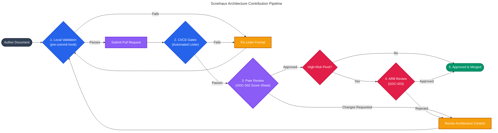

# Contributing to Scnehaux Architecture

Whether you are authoring a local component blueprint (**TDD**) in a downstream project repository, or submitting a global strategy (**EAD**) to this root repository, you must adhere to the highest standards of engineering rigor.

> [!IMPORTANT]
>
> **Mandatory Prerequisite:** Before making any contributions, you **MUST** read the [Enterprise Governance Policy (GDC-000)](./00-governance/GDC-000-governance-policy.md). It serves as the constitution for this repository and defines the exact architectural laws you are legally bound to follow within this ecosystem.

## Core Philosophy

Please refer to **[GDC-000 § 1.1 Core Philosophy](./00-governance/GDC-000-governance-policy.md#11-core-philosophy-zero-waste--determinism)** for the foundational principles (Zero Waste, Determinism, Explicit Contracts) governing this repository. Do not submit a PR without understanding these rules.

## How to Contribute

Contributions are strictly bifurcated into two paths: **Authoring System Designs** (Path A) and **Modifying Governance Frameworks** (Path B).

### Universal Requirements (The Enforcement Pipeline)

Regardless of your contribution path, all Pull Requests are subject to the following merciless enforcement pipeline:

1. **Local Validation (Shift-Left)**: You MUST install the pre-commit hook (`make install-hooks`). This forces a localized AST validation to automatically block commits that violate structural integrity or contain prohibited terminology.
2. **CI/CD Gates (Hard Block)**: Your PR must pass the automated linter pipeline (100% pass) to be eligible for merge. The CI pipeline is the ultimate source of truth.
3. **Qualitative Peer Review**: After passing the machine linter, human reviewers will evaluate your PR against the 10-parameter [Quality Rubric (GDC-002)](./00-governance/GDC-002-quality-rubric.md) using the [review-score-sheet-template.md](./00-governance/review-score-sheet-template.md). This ensures architectural boundaries, measurable NFRs, and trade-offs are logically sound.
4. **ARB Strategic Review**: High-risk PRs (e.g., enterprise pivots, standard waivers, core domain shifts, or high-blast-radius systems) are escalated to a formal audit by the Architecture Review Board. See the [Review Process (GDC-003)](./00-governance/GDC-003-review-process.md) for exact escalation triggers.
5. **Resolution**: All blocker feedback must be resolved before merging.

### Contribution Pipeline

---

### Path A: Authoring Architecture Documents (System Design)

When designing a system, executing an architectural decision, or defining a domain boundary, select the appropriate document type and submit a PR:

- [`GDC` (Governance Document Contract)](./00-governance/GDC-005-gdc-guideline.md): For defining the overarching governance rules and schemas.
- [`EAD` (Enterprise Architecture)](./00-governance/GDC-006-ead-guideline.md): For defining the global strategic architecture map.
- [`STD` (Standard)](./00-governance/GDC-007-std-guideline.md): For defining a mandatory engineering standard or paved road.
- [`PAD` (Platform Architecture)](./00-governance/GDC-008-pad-guideline.md): For defining a logical domain's business capability and trust boundaries.
- [`SAD` (Software Architecture)](./00-governance/GDC-009-sad-guideline.md): For defining a specific physical system's topology and internal reality.
- [`ADR` (Architecture Decision Record)](./00-governance/GDC-010-adr-guideline.md): For recording a significant architecture pivot or formal paved-road exception.
- [`TDD` (Technical Design Document)](./00-governance/GDC-011-tdd-guideline.md): For defining detailed component-level blueprints (Level C3).

> [!WARNING]
>
> **Boundary Enforcement:**
>
> - **GDCs** (Governance Policies) must be authored or modified exclusively via **Path B**.
> - **TDDs** (Component Designs - Level C3): While strictly governed by the rules and templates defined in this repository, physical TDD files **MUST** be authored inside the target application's local source code repository to synchronize with code and prevent documentation rot. Do not commit TDDs here.

### Path B: Modifying Governance Rules (Framework Design)

> [!IMPORTANT]
>
> **Path B Mandatory Reading:** Modifying governance rules alters the compliance pipeline for the entire enterprise. Before attempting to modify this layer, you **MUST** thoroughly understand the mechanics of the core enforcement engines:
>
> 1. [GDC-001: Fitness Functions & Compliance Engine](./00-governance/GDC-001-fitness-functions.md) (The Linter framework)
> 2. [GDC-002: Quality Rubric](./00-governance/GDC-002-quality-rubric.md) (The 10-parameter human assessment)
> 3. [GDC-003: Review Process](./00-governance/GDC-003-review-process.md) (The ARB escalation flow)

When contributing to the `00-governance` directory, your workflow depends entirely on whether you are changing an enforceable constraint or simply improving context.

#### Scenario 1: Contextual & Editorial Updates

If you are fixing typos, improving semantic clarity, adding Mermaid diagrams, or updating historical context, you may edit the Markdown documents (`GDC-*.md`) directly and submit a PR.

#### Scenario 2: Modifying Architectural Rules & Constraints

When you need to introduce a new architectural rule, add a structural constraint, or modify an existing validation (e.g., prohibiting a format, adding a mandatory metadata field), you **cannot just type it into the Markdown document**.

At Scnehaux, **if a rule is not enforceable by the linter, it is merely a suggestion**.

You MUST follow the declarative reconciliation workflow. The granular, step-by-step procedure for modifying YAML schemas, regenerating documentation, and updating the human governance rubric is explicitly defined in **[GDC-005 — GDC Guideline](./00-governance/GDC-005-gdc-guideline.md)** (Section 3: The Reconciliation Flow).

> [!CAUTION] **Validator Engine Modification:** If your rule modification requires writing custom Python logic in `validators/` (e.g., adding a new conditional check in `validators/adr.py`), you **MUST** also update the Pytest suite in the `validators/tests/` directory. The CI pipeline enforces a strict **>=95% test coverage** for the Python linter engine. Pull Requests that drop the coverage below 95% will be automatically rejected.

> [!WARNING]
>
> **Exception Protocol**: If you must deviate from a paved road without permanently modifying the global rules, you must submit an ADR explaining the rationale, the risk mitigation, and receive explicit approval from the ARB.
