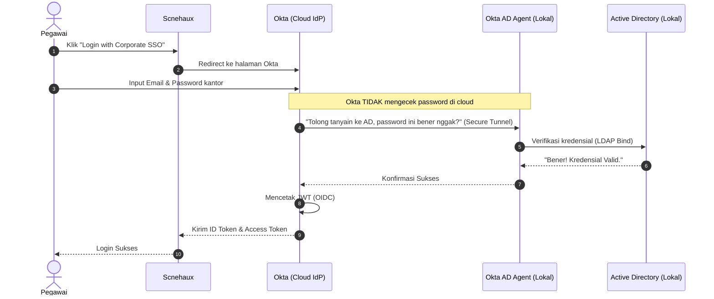

# The Enterprise Ecosystem: GRC Platforms & Hybrid IAM Architecture

Dokumen ini melengkapi arsitektur Identity & Access Management (IAM) dengan membedah dua elemen esensial di perusahaan *Enterprise*: **Lapis Manajemen Kepatuhan (GRC)** dan **Arsitektur Hibrida Klasik (AD + Okta)**.

---

## Bagian 1: Pasar Software GRC (Governance, Risk, and Compliance)

Pasar *software* GRC adalah industri bernilai miliaran dolar. *Software* ini beroperasi di atas IAM, berfungsi sebagai "Kokpit Auditor" untuk melacak kepatuhan keamanan dan manajemen risiko. Pasar ini terbagi menjadi dua kategori utama:

### 1. The Enterprise Heavyweights (Favorit Korporat Tua & Bank)
Ini *software* yang harganya bisa ratusan ribu sampai jutaan dolar per tahun. Sangat *customizable* tapi butuh tim konsultan buat *setup*.
- **ServiceNow GRC (IRM)**: Rajanya saat ini. Karena banyak perusahaan sudah memakai ServiceNow untuk sistem IT *Helpdesk* (ITSM), mereka sekalian membeli modul GRC-nya agar terintegrasi.
- **RSA Archer**: Pemain paling tua dan paling legendaris di dunia GRC. Standar *risk management* di bank-bank besar.
- **MetricStream**: *Software* yang murni fokus berjualan GRC untuk perusahaan berskala global.
- **OneTrust**: Raja regulasi Privasi Data (GDPR, UU PDP). *Pop-up cookie consent* di website besar biasanya menggunakan mesin OneTrust.

### 2. Modern Compliance Automation (Favorit Tech Company & SaaS)
Ini *software* GRC generasi baru. Nilai jual utamanya adalah **API Integrations**. *Software* ini menempel langsung ke AWS, GitHub, dan IdP (Okta/Zitadel) untuk mengecek kepatuhan secara *real-time* (Misal: mendeteksi kode yang di-*push* tanpa *review*).
- **Vanta**: Rajanya GRC modern saat ini. Paling sering dipakai perusahaan SaaS/Cloud untuk mendapatkan sertifikat **SOC 2** dan **ISO 27001** dengan super cepat.
- **Drata**: Pesaing berat Vanta, fiturnya sangat mirip dengan UX yang sangat mulus untuk tim *engineering*.
- **Secureframe**: Pemain kuat lainnya di ranah otomatisasi *compliance*.

> **Konteks Scnehaux**: Jika Scnehaux *pitching* platform BPO ke klien *Enterprise* dan diminta bukti sertifikasi keamanan (ISO/SOC2), perusahaan (ATI) kemungkinan besar akan berlangganan Vanta atau Drata untuk menyusun bukti audit secara otomatis.

---

## Bagian 2: Hybrid IAM Architecture (Active Directory + Okta)

Kombinasi arsitektur Enterprise paling klasik dan *textbook* di seluruh dunia saat ini. Jika umur perusahaan lebih dari 10 tahun (Bank, Telco, BUMN), 90% arsitekturnya adalah **Active Directory (AD/LDAP) + Okta (atau Microsoft Entra)**.

### Peran Masing-Masing Sistem
1. **Active Directory (AD) / LDAP = The Local Database (Blok 1)**
   - AD adalah "raja lokal" di jaringan kantor (*on-premise*). AD mengatur password karyawan untuk *login* laptop Windows, akses *printer*, atau *file server* lokal.
   - **Masalahnya**: Sangat berbahaya jika membuka *server* AD ke internet publik agar aplikasi web bisa *login*.
   
2. **Okta = The Cloud Bridge & Token Engine (Blok 2-6)**
   - Untuk menjembatani AD lokal dengan aplikasi Cloud (Office 365, Salesforce, Scnehaux), perusahaan membeli Okta.
   - Perusahaan meng-*install* **Okta AD Agent** (*software* kecil) di *server* lokal yang sama dengan AD.
   - *Agent* ini bertugas mengobrol dengan AD dan menyinkronkan data *user* ke server Okta di Cloud lewat jalur yang aman.

### Flow Delegated Authentication
Saat karyawan melakukan *login* ke aplikasi Scnehaux, Okta tidak memverifikasi *password* di Cloud, melainkan mendelegasikannya kembali ke AD.

### Integrasi dengan Scnehaux IdP (The Win-Win Scenario)
Dengan *setup* klien yang sudah menggunakan AD + Okta, **Zitadel** atau **Keycloak** yang akan dipasang di ekosistem Scnehaux nanti akan sangat mudah diintegrasikan:
- Scnehaux IdP cukup disambungkan ke Okta mereka via OIDC/SAML (*Identity Brokering* di Blok 3). 
- **Klien senang**: Pegawai mereka tidak perlu membuat *password* baru.
- **Scnehaux senang**: Tidak perlu menyimpan atau mengurus *password* dan data sensitif pegawai klien. Semua ditangani oleh Okta dan AD mereka.
