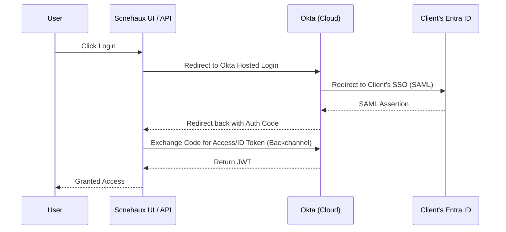
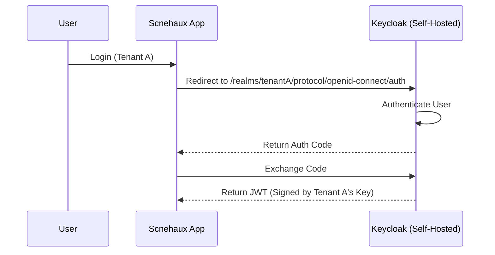
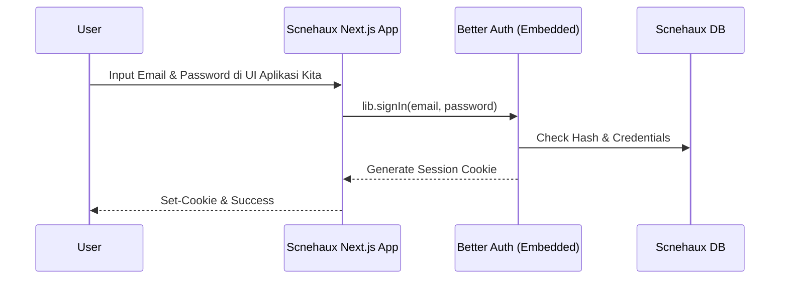
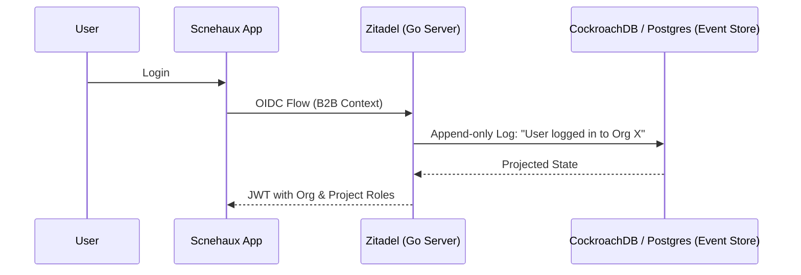

# Enterprise IAM Evaluation: Scnehaux Operations Platform

Sebagai platform BPO & Enterprise SaaS, **Scnehaux** memiliki kebutuhan *Identity* yang sangat spesifik:
1. **B2B Multi-Tenancy**: Klien BPO (Tenant) butuh isolasi.
2. **Enterprise Federation**: Klien BPO mau pegawainya login pakai sistem mereka sendiri (Entra ID, Google, Okta) via SAML/OIDC.
3. **Auditability**: Bukti login/akses harus *tamper-evident* (EAD-003).

Berikut adalah evaluasi mendalam untuk 4 kelas *Identity Provider* dari kacamata arsitektur enterprise.

---

## 1. Okta / Auth0 (The Managed SaaS Giant)
Okta (dan Auth0 yang sudah diakuisisi Okta) adalah standar industri untuk *Identity-as-a-Service* (IDaaS).

**Fitur Utama**: Universal Directory, Enterprise Federation, B2B Organization management, Adaptive MFA, Lifecycle Management.

### Authentication Flow (OIDC Authorization Code)

> [!TIP]
> **Kelebihan**:
> - **Zero Maintenance**: Lo nggak perlu ngurus server, *database*, rotasi *key*, atau *security patching*.
> - **Integrasi Terluas**: Konek ke IdP klien manapun sangat mudah.
> - **Highly Secure & Compliant**: SOC2, HIPAA, FedRAMP out-of-the-box.
> 
> **Kelemahan**:
> - **Vendor Lock-in & Data Residency**: Data user dan kredensial ada di *server* Okta (US/Global), bisa masalah buat regulasi lokal Indonesia (PDP/OJK).
> - **Harga**: Sangat mahal. Skema *B2B pricing*-nya bisa mencekik seiring bertambahnya MAU (Monthly Active Users).

---

## 2. Keycloak (The Open Source Standard)
Keycloak (di-back oleh RedHat) adalah *Gold Standard* untuk *self-hosted* IAM. Ini adalah *default choice* untuk perusahaan yang nggak mau bayar Okta.

**Fitur Utama**: OIDC, SAML, Identity Brokering, User Federation (LDAP/AD), Fine-grained AuthZ, SPIs (Extensibility).

### Multi-Tenant Flow (Realm-based)

> [!WARNING]
> **Kelebihan**:
> - **Gratis & Mature**: Fiturnya selengkap Okta tapi *open-source*.
> - **Identity Brokering**: Bisa jadi perantara ke Entra ID / Okta milik klien.
> - **Extensible**: Bisa nulis *custom plugin* (SPI) pakai Java.
>
> **Kelemahan**:
> - **Tech Stack**: Berbasis Java/JVM. Membutuhkan alokasi *memory* (RAM) yang cukup besar.
> - **B2B Multi-tenancy yang Kaku**: Keycloak memisahkan *tenant* menggunakan konsep **Realm**. Bikin 10 Realm itu gampang, tapi kalau lo punya 10,000 klien BPO, punya 10,000 Realm akan bikin server Keycloak "choke" karena tiap Realm makan *memory footprint* sendiri.
> - **Customisasi UI Login**: Harus pakai FreeMarker templates yang kuno. Nggak bisa *headless* murni dengan mudah.

---

## 3. Better Auth (The Modern Headless Library)
Better Auth (seperti Auth.js / NextAuth, atau Lucia) adalah *library-based authentication*. Ini **bukan** standalone IdP server, melainkan kode yang lo *embed* ke dalam aplikasi lo (biasanya Node.js/TypeScript).

**Fitur Utama**: Session Management, Social Login, Passkeys, Headless/Bring-Your-Own-UI, Multi-tenant plugins.

### Flow (Embedded / Headless)

> [!CAUTION]
> **Kelebihan**:
> - **Total UI Control**: Lo yang bikin halaman loginnya sendiri pakai React/Vue/Svelte. Nggak ada *redirect* ke *domain* aneh.
> - **Ringan & Nyatu**: Hidup di dalam *framework* lo (Next.js/Node). Database-nya nyatu sama *database* aplikasi lo.
> - **Modern DX**: Developer experience sangat bagus untuk ekosistem TypeScript.
>
> **Kelemahan**:
> - **Language Locked**: Hanya untuk ekosistem TypeScript/Node.js. `scnehaux-iam` lo saat ini ditulis pakai **Go**.
> - **Bukan Enterprise Federation**: Sangat lemah untuk konek ke SAML klien BPO (*Enterprise SSO*). Better Auth lebih cocok buat aplikasi B2C (jualan ke *end-user*) atau B2B skala kecil.
> - **Bukan Standalone IdP**: Aplikasi lain di perusahaan lo (misal: ada aplikasi Golang atau Python) akan susah mau *federate* ke sistem lo.

---

## 4. Zitadel (The Cloud-Native B2B Challenger)
Zitadel adalah IAM modern dari Swiss, ditulis dengan **Go** (Golang), dan dirancang secara spesifik dari hari pertama untuk **B2B SaaS Multi-Tenancy**.

**Fitur Utama**: B2B Organizations & Projects, Unlimited Audit Trail (Event Sourced), OIDC/SAML, Machine-to-Machine, Turnkey & Headless UI.

### Architecture Flow (Event Sourced)

> [!IMPORTANT]
> **Kelebihan**:
> - **B2B as a First-Class Citizen**: Di Zitadel, multi-tenancy dibangun lewat konsep **Organizations** dan **Projects**. User bisa jadi *member* di Org A, tapi juga *manager* di Org B. Ini SANGAT COCOK untuk kasus BPO Scnehaux!
> - **Satu Tech Stack dengan Scnehaux**: Ditulis pakai **Go**. Ringan, kencang, dan secara kultural cocok dengan tim lo.
> - **Event Sourced**: *Database* Zitadel bersifat *append-only*. Lo dapet **Audit Trail** gratis yang *tamper-evident* (memenuhi syarat EAD-003 Evidence kita).
> - **Headless / Custom UI**: Support *API-first* sehingga lo bisa bikin UI Login lo sendiri, tapi tetep dapet keamanan dari IdP *standalone*.
>
> **Kelemahan**:
> - Ekosistemnya belum sebesar Keycloak.
> - Butuh CockroachDB atau PostgreSQL versi terbaru sebagai *storage*.
