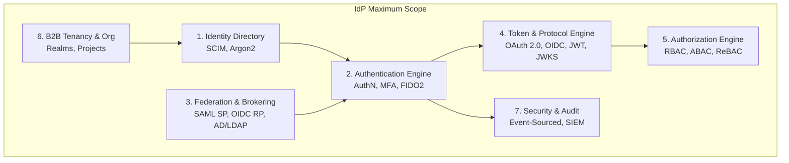
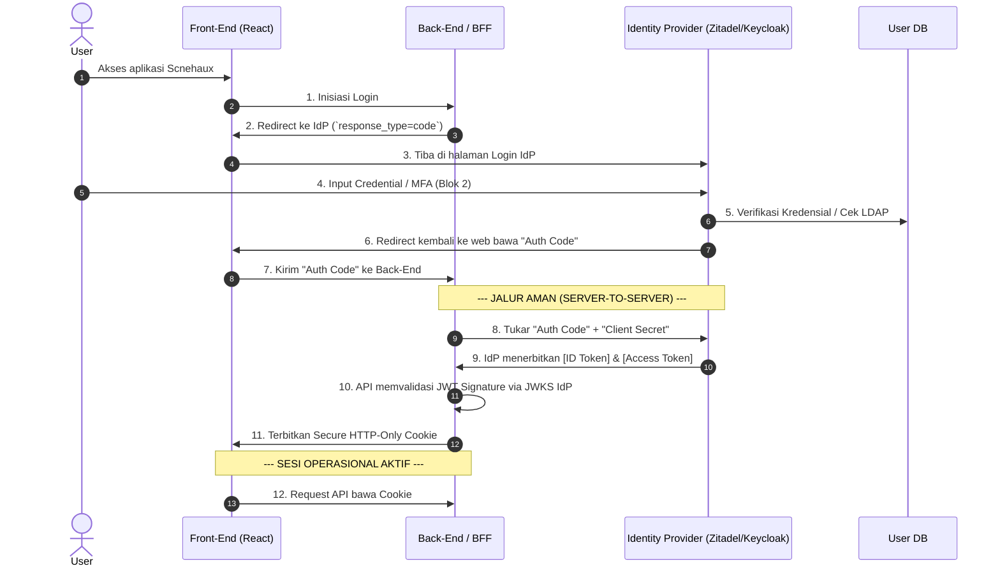

# The Anatomy of Enterprise IAM (Identity & Access Management)

Cetak biru arsitektur *Identity & Access Management* (IAM) skala *Enterprise*, membedah hierarki dari lapis regulasi hingga eksekusi teknis (OIDC/JWT).

---

## 1. Hierarki Sistem: Posisi IAM di Perusahaan

IAM adalah **puncak tertinggi penegakan teknis (*Technical Enforcement*)**. IAM menerjemahkan SOP manajemen menjadi blokade kode.

```text
1. [HUMAN & LEGAL]       : Regulasi, UU PDP, Rapat Direksi, SOP CISO.
2. [MANAGEMENT SOFTWARE] : GRC Platform (ServiceNow, OneTrust). Audit & pelacakan kepatuhan.
3. [TECHNICAL ENFORCER]  : IAM Platform. Eksekutor aturan (Siapa boleh apa).
4. [APPLICATION LAYER]   : Scnehaux HCM, Travel Ops, Cloud DB. (Tunduk pada IAM).
```

---

## 2. 4 Pilar Utama IAM (The IAM Universe)

IAM adalah ekosistem, bukan satu *software*. Terdiri dari 4 pilar fungsional:

1. **IGA (Identity Governance & Administration)**: Tata kelola. *Approval workflow*, *access reviews*, *onboarding/offboarding*. (Tools: SailPoint, Saviynt).
2. **PAM (Privileged Access Management)**: Akses level Dewa (Root/Admin). *Vaulting*, *session recording*. (Tools: CyberArk, Vault).
3. **AM (Access Management)**: Akses operasional harian (SSO, MFA, API Gateway). **Di sinilah IdP (Identity Provider) beroperasi.**
4. **Directory Services**: Basis data fisik identitas (Active Directory, LDAP, Google Workspace).

---

## 3. Anatomi IdP (Identity Provider) & Jargon Pemetaannya

Sebuah IdP skala raksasa memiliki 7 blok komponen yang memproses standar teknologi (*jargon*).



1. **Identity Directory**: Penyimpanan profil & kredensial. **[Jargon: SCIM, Bcrypt/Argon2]**.
2. **Authentication (AuthN)**: Mesin pembuktian identitas. **[Jargon: MFA, TOTP, FIDO2/WebAuthn, Passkeys]**.
3. **Federation & Brokering**: Delegasi login ke sistem pihak ketiga. **[Jargon: SAML 2.0, OIDC Relying Party, LDAP/AD Federation]**.
4. **Token & Protocol Engine**: Pabrik pencetak tiket/token. **[Jargon: OAuth 2.0, OIDC, JWT, JWKS, Refresh Token]**.
5. **Authorization (AuthZ)**: Evaluasi hak akses. **[Jargon: RBAC, ABAC, ReBAC/Zanzibar, UMA]**.
6. **B2B Tenancy**: Pemisahan isolasi antar klien. **[Jargon: Realms, Organizations, Projects]**.
7. **Security & Audit**: Pencatatan jejak mutasi yang *tamper-evident*. **[Jargon: Event-Sourced, SIEM]**.

---

## 4. Perbandingan Tool IAM & Dukungan AD/LDAP

Tidak semua *tool* memiliki cakupan penuh. Berikut perbandingan arsitektural dan dukungan *legacy directory* (AD/LDAP) yang krusial untuk klien Enterprise BPO.

| Tool / Product | Posisi Ekosistem | Cakupan Blok IdP | Dukungan AD / LDAP | Use Case Utama & Kelemahan |
| :--- | :--- | :--- | :--- | :--- |
| **Okta / Microsoft Entra** | Full IAM Platform (termasuk IGA & PAM) | 1-7 | **Sangat Kuat**. Punya *Lightweight Agent* yang di-*install* di server lokal klien untuk *sync* AD/LDAP dua arah tanpa buka *firewall* inbound. | Raja *Enterprise*. Cepat *deploy*, tapi mahal & terjadi *vendor lock-in*. |
| **Keycloak** | Enterprise AM (IdP) | 1-7 | **Native & Terbaik di kelas Open Source**. Mendukung *User Federation* langsung ke *server* LDAP/AD. Atribut dan grup bisa di-*map* dua arah. | Standar *Self-Hosted*. Lemah di UI *customization* (FreeMarker) & arsitektur *Tenancy* (Realms) yang boros memori jika jumlah klien ribuan. |
| **Zitadel** | B2B Cloud-Native IdP | 1-7 | **Tersedia**. Mendukung LDAP sebagai eksternal IdP, namun tidak sedalam penetrasi agen lokal Okta atau *native federation* Keycloak. Fokus utamanya di integrasi modern (OIDC/SAML). | Ideal untuk **SaaS B2B modern**. Punya arsitektur *Organizations/Projects* asli dan basis *database Event-Sourced* (Audit trail abadi). |
| **Clerk** | Frontend-Heavy IDaaS | 1, 2, 4 | **Tidak Ada**. Harus dibungkus via SAML eksternal. Tidak didesain untuk *direct* LDAP *sync*. | Bagus untuk *Startup* B2C/B2B ringan dengan DX React yang luar biasa. Lemah di *Enterprise Federation* berat. |
| **Better Auth / Auth.js** | Headless Auth Library | 2, 4 (Sebagian) | **Tidak Ada**. Hanya *library* kode, bukan IdP. Pembuat aplikasi yang harus merakit koneksi LDAP sendiri. | Cocok untuk aplikasi *custom* yang mengontrol penuh UI dan *Database*, tapi bukan untuk arsitektur SSO BPO. |

---

## 5. Konsep Inti Protokol: OIDC vs OAuth 2.0 vs JWT

- **OAuth 2.0 (Authorization)**: Protokol delegasi akses. (Menganalogikan: Memberikan kunci valet mobil). Menghasilkan **Access Token**.
- **OIDC / OpenID Connect (Authentication)**: Protokol verifikasi identitas di atas lapisan OAuth 2.0. (Menganalogikan: Menunjukkan KTP). Menghasilkan **ID Token**.
- **JWT (JSON Web Token)**: Format fisik dari token. Terdiri dari Header (Algoritma), Payload (Data User/Claims), dan Signature (Bukti keaslian via Kriptografi).

> **Konsep JWKS (JSON Web Key Set)**: JWT ditandatangani oleh IdP menggunakan *Private Key*. Aplikasi (API Scnehaux) memverifikasi JWT tersebut dengan mengunduh *Public Key* dari *endpoint* `/.well-known/jwks.json` milik IdP.

---

## 6. Standard OIDC Authorization Code Flow

Alur paling aman (mencegah kebocoran JWT di URL browser) dengan memisahkan komunikasi *Front-channel* dan *Back-channel*.


