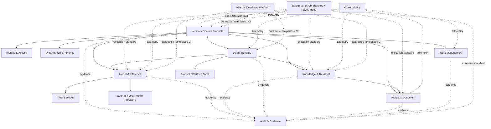

# Scnehaux Shared Platform Capability Evidence Report

> **Status:** Working evidence artifact — non-authoritative, non-normative, not an architecture approval  
> **Analysis date:** 2026-09-10  
> **Target architecture baseline:** `anshacerbia2/scnehaux-architecture@943c6cb95f3efe43af7f90bf75dd2a0f7dff9fc4`  
> **Purpose:** Reverse-engineer capabilities from six independent AI-related projects, qualify reusable platform responsibilities from empirical evidence, and identify evidence-driven refinement opportunities in `scnehaux-architecture` without silently changing Product authority.

---

## 0. Executive Decision

The six projects provide strong empirical evidence for a shared platform portfolio, but they **do not justify one monolithic “AI Platform.”** The existing Scnehaux logical architecture is directionally strong: Product authority, Knowledge & Retrieval, Model & Inference, Agent Runtime, Artifact, Work Management, Audit & Evidence, Identity, and Organization are already separated at the correct authority boundaries.

The main gap is not missing platform taxonomy. The main gap is that several high-value Platform PADs are approved while their physical SADs remain `chartered`, and several older cross-cutting standards do not yet express the operational semantics demonstrated by the six projects.

### Recommended disposition

| Capability | Evidence from six projects | Current Scnehaux posture | Recommendation |
|---|---:|---|---|
| Model & Inference | **Very strong** — five current runtime consumers; Codex future only | PAD-PLT-008 approved; SAD-011 chartered | **Proceed to physical SAD design first** |
| Artifact & Document | **Very strong** — four heavy content pipelines; two document/governance systems | PAD-PLT-009 approved; SAD-008 chartered | **Proceed to physical SAD design in Wave 1** |
| Audit & Evidence | **Very strong** — provenance/evidence/audit patterns across all six | PAD-PLT-007 approved; SAD-010 chartered | **Proceed to physical SAD design in Wave 1** |
| Knowledge & Retrieval | **Strong** — two mature concrete implementations, one semantic-contract framework, narrower local retrieval elsewhere | PAD-PLT-015 approved; SAD-019 chartered | **Proceed to staged physical SAD design** |
| Work Management / Human Review | **Strong** — repeated human review mechanics in Themis, FareXlate, Scribe; governance review elsewhere | PAD-PLT-013 approved; SAD-017 chartered | **Design now; preserve Product acceptance authority** |
| Agent Runtime | **Strong logical need, limited current cross-project runtime evidence** — Scribe is the primary current anchor; Codex runtime is explicitly deferred | PAD-PLT-016 approved; SAD-020 chartered | **Refine entry requirements now; do not make it the first implementation** |
| Background Job Execution | **Very strong repeated mechanics** | No independent Platform Product; STD-GLB-011 adopted | **Keep as standard + SDK/test kit first; do not create central arbitrary worker platform** |
| Evaluation | **Very strong repeated need** | Capability-local evaluation exists in AI/K&R/Agent architecture | **Share contracts, datasets/artifact mechanics, and test infrastructure; do not create one evaluation authority** |
| Prompt / Skill lifecycle | **Strong repeated mechanics, Product-owned meaning** | Product meaning intentionally remains outside shared AI authorities | **Share packaging/version/binding mechanics only; no Prompt Platform** |
| Secure / Isolated Execution | **Moderate evidence** — Scribe runner and Ragnarok SQL boundary | Agent ADR explicitly leaves this separately qualifiable | **Create paved road / threat model first; platformize only after more demand evidence** |
| Rules & Decisioning | Repeated deterministic validation exists, but semantics are highly local | PAD-PLT-014 chartered | **Keep chartered; do not equate deterministic code repetition with shared rule authority** |
| Workflow | Some durable/local state machines, but insufficient evidence for universal shared process runtime | PAD-PLT-004 chartered | **Keep chartered; adopt only where true durable process semantics exist** |
| Integration | Many external adapters, but natural ownership differs | PAD-PLT-006 chartered | **Selective use only; never a universal provider hop** |

### Highest-confidence architecture actions

1. **Keep EAD-001 through EAD-007 and ADR-GLB-012/013/014/015/016/017 as the structural baseline.** The six-project evidence validates their core boundaries more than it challenges them.
2. **Move SAD-011 Model & Inference toward `draft` using real consumer profiles from Themis, FareXlate, Ragnarok, architecture-knowledge, and Scribe.** Codex must not be counted as a current inference runtime consumer because its roadmap explicitly defers model-provider/agent runtime work.
3. **Move SAD-008 Artifact & Document and SAD-010 Audit & Evidence toward `draft` in parallel.** These are foundational to trustworthy AI pipelines and are evidenced across more projects than Agent Runtime.
4. **Move SAD-019 Knowledge & Retrieval toward `draft` using architecture-knowledge and Ragnarok as independent empirical inputs, not as reference architecture.** Preserve domain/source authority and isolated knowledge scopes.
5. **Design SAD-017 Work Management from repeated human-review needs, but retain Product business acceptance, eligibility, and mutation in each Product.**
6. **Keep SAD-020 Agent Runtime physically uncommitted until consumer profiles beyond Scribe are validated or an approved enterprise obligation independently justifies the runtime economics.** Use Scribe now to strengthen the failure/recovery requirements.
7. **Refine STD-GLB-003 Observability.** Its current HTTP-centric RED/5xx framing does not adequately govern inference, retrieval, streaming, background jobs, agent runs, artifacts, evaluation, or evidence correlation.
8. **Refine STD-GLB-007 Data Governance.** It needs explicit treatment of prompts, outputs, embeddings, retrieval indexes, context snapshots, agent memory, evaluation data, provider egress, derived-data restrictions, and policy-referenced retention.
9. Introduce a small **AI execution standards pack** for Product-local implementations during the migration period so governance does not depend on shared platforms being finished first.
10. Build common **language-neutral contracts + generated thin SDKs + conformance test kits** before large migrations. Shared libraries must not become a second semantic authority.

---

# 1. Analysis Boundary and Non-Negotiable Rules

## 1.1 Six independent evidence projects

This report treats the following as **six independent projects**. Similar implementation patterns are used only as independent evidence of repeated capability needs. No shared lineage, dependency, complementarity, or intended integration is inferred unless a project itself declares that relationship internally.

1. `scnehaux/codex`
2. `anshacerbia2/architecture-knowledge`
3. `sq-fare-main.zip` — project name **Themis**
4. `farexlate-main.zip` — project name **FareXlate**, Python package `jaen`
5. `ragnarok-main.zip` — **Office RAG** / Ragnarok snapshot
6. `scribe-v2.zip` — **Scribe v2** snapshot

`anshacerbia2/scnehaux-architecture` is **not a seventh evidence project**. It is the target enterprise-architecture baseline against which findings are assessed.

## 1.2 Source snapshot identity

### Current GitHub source

- **Codex:** `main@b79f8c07d088820722b3644a396c89bf42fcd370`
  - https://github.com/scnehaux/codex/tree/b79f8c07d088820722b3644a396c89bf42fcd370
- **architecture-knowledge:** `main@9a21e019d85a458a796151437bd088c36201ce3b`
  - https://github.com/anshacerbia2/architecture-knowledge/tree/9a21e019d85a458a796151437bd088c36201ce3b
- **Target Scnehaux Architecture:** `main@943c6cb95f3efe43af7f90bf75dd2a0f7dff9fc4`
  - https://github.com/anshacerbia2/scnehaux-architecture/tree/943c6cb95f3efe43af7f90bf75dd2a0f7dff9fc4

### User-supplied source snapshots

The four ZIPs are analyzed as the supplied snapshots. This report does not claim they match any upstream repository state after the supplied archive was created.

- `sq-fare-main.zip`
- `farexlate-main.zip`
- `ragnarok-main.zip`
- `scribe-v2.zip`

No `.env` secret contents are reproduced or used as report evidence.

## 1.3 Evidence labels

The report distinguishes four levels:

- **OBSERVED** — directly present in source/contracts/workflows/configuration reviewed.
- **INFERRED CAPABILITY** — stable responsibility reconstructed from observed behavior, state, and failure semantics.
- **PLATFORM CANDIDATE** — a capability that may justify shared ownership after applying the Scnehaux platform-qualification test.
- **ARCHITECTURE RECOMMENDATION** — proposed action in `scnehaux-architecture`; this is not an approved architecture decision.

## 1.4 Core rule: share mechanics, not Product meaning

A repeated implementation is not sufficient reason to centralize its semantics.

```text
SHARE WHEN JUSTIFIED
  provider access mechanics
  model execution mechanics
  content/version lifecycle
  evidence lifecycle
  knowledge/retrieval mechanics
  generic work lifecycle
  durable agent execution mechanics
  standardized job semantics
  telemetry/evaluation contracts

KEEP WITH PRODUCT / SOURCE AUTHORITY
  business meaning
  domain invariants
  Product authorization
  Product acceptance
  Product workflow meaning
  domain prompts/skills
  domain rules
  final business outcome
  source facts
```

This is consistent with EAD-005's platform qualification principle and ADR-GLB-012/015 authority separation.

---

# 2. Method: Capability Reverse Engineering

For each project, capability extraction asks the same questions:

1. **What state is authoritative here?**
2. **What input becomes what output?**
3. **Which state must survive restart?**
4. **What is deterministic and what is probabilistic?**
5. **What external systems/providers are called?**
6. **What does success mean, and what does it explicitly not mean?**
7. **What failures require retry, reconciliation, human review, or explicit stop?**
8. **Where is identity/authorization enforced?**
9. **What evidence/provenance is necessary to explain an outcome?**
10. **Which responsibility has a lifecycle independent enough to be reusable?**

Platform qualification then applies the current Scnehaux model:

```text
Shared Platform Justification
=
Enterprise Responsibility
+ Authority Need
+ Consumer Friction
+ Reuse Evidence
+ Lifecycle Independence
+ Operational Economics
+ Risk Reduction

minus

Shared Dependency Cost
+ Cognitive Load
+ Platform Operating Cost
+ Blast Radius
+ Migration Cost
```

A capability can therefore end in one of five dispositions:

- **SHARED PLATFORM**
- **SHARED STANDARD**
- **SHARED SDK / LIBRARY / CONTRACT PACKAGE**
- **PAVED ROAD / REFERENCE PROFILE**
- **PRODUCT LOCAL**

---

# 3. Project 1 — `scnehaux/codex`

## 3.1 Purpose and current boundary

**OBSERVED:** Codex is currently a reusable governance framework and executable control plane. Its current roadmap rebaselines canonical architecture instances into a separate architecture repository, while Codex owns governance framework roots such as `governance/`, `schemas/`, `templates/`, `engine/`, `generators/`, `scripts/`, and `tests/`.

The current `ROADMAP.md` remains in **Phase 10 SCM enforcement/stabilization**, with Phase 11 executable declarative framework semantics still planned. Importantly, the roadmap explicitly defers AI routing, model-provider, MCP, agent, studio, and chatbot runtime beyond Phase 11.

**Consequence for this report:** Codex is **not counted as a current Model & Inference or Agent Runtime consumer**. Treating its intelligence contracts as an existing agent/model runtime would overstate evidence.

Primary source anchors:

- `ROADMAP.md`
- `PLAN.md`
- `engine/core/knowledge/provenance.py`
- `engine/core/knowledge/context.py`
- `engine/core/knowledge/retrieval.py`
- `engine/core/knowledge/compiler.py`
- `engine/intelligence/planning/contracts.py`
- `engine/intelligence/research/contracts.py`
- `engine/intelligence/synthesis/contracts.py`
- `engine/intelligence/review/contracts.py`
- `governance/scm/*`
- `engine/adapters/scm/github.py`

## 3.2 Reverse-engineered capabilities

| Capability | Observation | Authority | Shared-platform implication |
|---|---|---|---|
| Executable architecture/governance validation | Global metadata scan, schema/lint, repository-level audits, lifecycle/traceability/version/waiver checks | Codex governance framework | Governance/Assurance evidence; **not an AI runtime** |
| SCM enforcement contract | Provider-neutral SCM policy projected through GitHub adapter; candidate code cannot self-authorize guardrails | Codex governance semantics + external authority | Strong evidence for authority/evidence separation and provider adapter pattern |
| Provenance model | `SourceAuthority`, `KnowledgeRevision`, `Evidence`, `Claim`; evidence binds source + authority + revision | Codex knowledge model | Useful contract evidence for provenance, but not automatically enterprise Audit authority |
| Context model | Bounded context scopes and budgets | Codex knowledge/intelligence contracts | Future-compatible with Knowledge & Retrieval; current semantic contract only |
| Retrieval abstraction | Exact, graph, full-text, semantic, observed, research modes; replaceable `RetrievalStrategy` and `ContextCompiler` | Codex contract surface | Evidence that retrieval implementation should remain replaceable |
| Planning/research/synthesis/review contracts | Capability-oriented plan; evidence-backed research; proposed claims; advisory review | Codex intelligence semantics | Product/governance semantics remain local; potential future consumer of shared AI substrates |
| Evidence-qualified governance decisions | Current Phase 10 distinguishes live proof, publisher proof, effective enforcement, and authority binding | Codex governance control plane | Strong evidence that evidence records must be precise about **what they prove and do not prove** |

## 3.3 Reusable mechanics versus local semantics

### Strong reusable lessons

- **Evidence must be typed and scope-limited.** “Observed live instance” must not silently become “effective enforcement proven.” This principle should carry into AI evidence.
- **Provider-specific adapters must not redefine semantic authority.** This maps well to Model & Inference provider adapters and K&R storage/index adapters.
- **Candidate/runtime self-report is not sufficient authority evidence.** Independent evidence and provenance matter.
- **Contracts should remain stable while topology evolves.** Codex's current knowledge/retrieval/intelligence contracts are intentionally separated from future execution topology.

### Must remain Codex-local

- Governance control semantics.
- Architecture artifact admission semantics.
- SCM trust-boundary governance.
- Review/advisory semantics specific to architecture governance.
- Normative control registry and architecture lifecycle rules.

## 3.4 Platform qualification contribution

Codex materially supports:

- **Audit & Evidence** requirements: precise evidence claims, source authority, immutable revision binding.
- **Governance & Assurance**: policy-as-code and fail-closed evidence gating.
- **Knowledge & Retrieval** contract design: provider-independent retrieval modes and bounded context.

Codex does **not** currently provide empirical runtime evidence for shared Model & Inference or Agent Runtime throughput/topology. Those remain deferred by its own roadmap.

---

# 4. Project 2 — `architecture-knowledge`

## 4.1 Purpose and maturity

**OBSERVED:** `architecture-knowledge` is a version-controlled, evidence-governed architecture knowledge system. Its current codebase includes a knowledge kernel, deterministic validation, graph projection/query, hybrid retrieval, governed RAG, decision-guide validation, and decision-recommendation validation.

Current source anchors include:

- `ROADMAP.md`
- `src/model.ts`
- `src/kernel.ts`
- `src/evidence-validator.ts`
- `src/lifecycle-validator.ts`
- `src/graph-projector.ts`
- `src/retrieval-query.ts`
- `src/rag-context.ts`
- `src/rag-provider.ts`
- `src/rag-engine.ts`
- `src/decision-guide-validator.ts`
- `src/decision-recommendation-validator.ts`
- `package.json`
- `.github/workflows/validate.yml`
- current M7.2 implementation/regression reports under `docs/`

## 4.2 Reverse-engineered capabilities

| Capability | Observation | Authority | Shared-platform implication |
|---|---|---|---|
| Governed knowledge kernel | Concepts, claims, sources, relationships, decision guides, ledgers, lifecycle events | architecture-knowledge Product | Domain content/ontology remains local; mechanics inform K&R |
| Evidence/source lifecycle | Admitted/restricted source status, locators, claim grounding, human-only lifecycle transitions | architecture-knowledge Product | Strong provenance/evidence requirements |
| Graph projection | Deterministic graph/index projection with traversal eligibility and default-deny semantics | Derived representation | Strong evidence graph is a retrieval representation, not source truth |
| Hybrid retrieval | PostgreSQL FTS + pgvector, weighted fusion, graph expansion, budgets, degraded lexical fallback | architecture-knowledge retrieval runtime | Strong K&R consumer/runtime evidence |
| Governed RAG | Retrieval → bounded context → classification gate → strict model output → grounding validation → citations | architecture-knowledge Product composition | Strong evidence for K&R + M&I separation; **do not move RAG answer authority into K&R** |
| Model provider adapter | OpenAI Responses API, strict JSON Schema output, timeout/retry, `store:false`, classification allow-list | architecture-knowledge Product provider adapter | Strong M&I consumer evidence |
| RAG citation authority | Citations are resolved by application/platform logic rather than invented by model | architecture-knowledge Product | Strong K&R citation/evidence requirement |
| Decision-guide validation | Deterministic guide/session/recommendation constraints, evidence-chain validation, human-confirmed context | architecture-knowledge Product | Product-local decision semantics; not evidence for central business rule authority |
| Evaluation | Retrieval/RAG benchmarks, invocation gates, mutation tests, DB integration tests | architecture-knowledge Product | Strong evidence for shared evaluation contracts/test infrastructure |

## 4.3 High-value failure evidence: correct answer status, wrong runtime behavior

The current M7.2 regression is especially useful architecture evidence. A deterministic fake-vector collision caused unrelated evidence to enter retrieval. The final RAG status still ended as insufficient evidence, but the model was invoked when the evaluation contract said it should not be. The evaluator correctly failed the run.

This proves an important shared-platform rule:

> **Evaluation must measure behavioral contracts, not only final output correctness.**

For shared K&R/M&I this means evaluation should cover:

- whether a model should be invoked at all;
- retrieval false positives/false negatives;
- authorization exclusion;
- fallback activation;
- provider/model selection;
- citation/grounding integrity;
- cost/latency budgets;
- degradation behavior.

## 4.4 Reusable mechanics versus local semantics

### Strong reusable mechanics

- Source/version/provenance binding.
- Rebuildable lexical/vector/graph/metadata indexes.
- Hybrid retrieval with bounded budgets.
- Retrieval generation/currentness identity.
- Strict structured model-output contract.
- Classification-aware provider invocation.
- Server/platform-resolved citations.
- Grounding validation.
- Retrieval/RAG evaluation gates.

### Must remain Product-local

- Architecture knowledge ontology and taxonomy.
- Source-admission policy specific to this knowledge product.
- Architecture claim semantics.
- Decision-guide corpus and decision-assistant semantics.
- Human content approval/lifecycle authority.
- Product-specific RAG prompt/recommendation meaning.

## 4.5 Platform qualification contribution

This project is one of the strongest evidence sources for **Knowledge & Retrieval** and a strong current consumer for **Model & Inference**. It should be used as an empirical benchmark and failure corpus, not as a wholesale implementation template for the enterprise K&R platform.

---

# 5. Project 3 — Themis (`sq-fare-main.zip`)

## 5.1 Purpose and runtime shape

**OBSERVED:** Themis automates airline fare filing from fare-sheet/pricebook Excel inputs into ATPCO-oriented Excel outputs. Its pipeline combines deterministic transforms, keyword/rule resolution, constrained model interpretation, visible unresolved work, human review, background processing, and workbook-preserving output generation.

Key snapshot anchors:

- `README.md`
- `pyproject.toml`
- `src/themis/pipeline.py`
- `src/themis/models.py`
- `src/themis/worker.py`
- `src/themis/rules/engine.py`
- `src/themis/rules/keywords.py`
- `src/themis/llm/interpreter.py`
- `src/themis/db/store.py`
- `src/themis/xlsx/patcher.py`
- `src/themis/reader/fare_sheet.py`
- `src/themis/web/*`
- `tests/test_*.py`

## 5.2 Core capability pipeline

```text
Fare / pricebook source
    ↓
Deterministic extraction & transforms
    ↓
Keyword / configured rule resolution
    ↓
Constrained model fallback only when required
    ↓
Confidence / evidence / provenance
    ↓
Visible unresolved gaps
    ↓
Human review / approval
    ↓
Workbook-safe artifact generation
```

The order is architecturally important: deterministic and keyword logic is authoritative where it can decide; probabilistic interpretation is a bounded fallback.

## 5.3 Reverse-engineered capabilities

| Capability | Observation | Authority | Shared-platform implication |
|---|---|---|---|
| Fare rule execution | Deterministic transforms, field rules, keyword mapping | Themis Product | **Must remain Product-local** unless generic rule lifecycle is independently justified |
| Bounded model interpretation | Constrained JSON Schema, allowed values, confidence, retry/fallback | Themis Product currently | Strong M&I consumer profile |
| Structured output validation | Model output cannot silently bypass allowed-value/pattern checks | Themis Product | Strong shared invocation-standard requirement |
| Provenance per output | Cell writes carry source class, label, confidence, review need, trace | Themis Product | Strong Audit/Evidence and result-correlation requirement |
| Human review | `needs_review`, manual correction, approval freeze/reopen audit | Themis Product approval | Strong Work Management mechanics; Product approval effect stays local |
| Background jobs | SQLite WAL, atomic claim, stale-processing recovery, retry/requeue | Themis Product runtime | Strong STD-GLB-011 validation; no need for central worker runtime yet |
| Artifact transformation | Excel input/output, package fidelity, direct XML patching | Themis Product transform + Artifact candidate | Strong Artifact Platform requirement |
| Identity | Keycloak OIDC, PKCE, session gating, proxy trust boundary | Product | Existing IAM/Trust adoption requirement |

## 5.4 High-value failure evidence: generic document library can destroy authoritative content

The snapshot documents an empirical workbook-fidelity issue: rewriting the final workbook with a common Excel library dropped embedded images/drawings, so the final writer directly patches XLSX XML parts to preserve unrelated package content.

Shared-platform implication:

- Artifact Platform must treat the **exact immutable source version** as authoritative content.
- Conversion/patching is a derivative process and needs lineage/fidelity validation.
- Generic conversion libraries cannot be assumed lossless.
- Product-specific workbook mutation semantics should remain local until a truly reusable processor profile is proven.
- “File successfully saved” is not equivalent to “artifact fidelity preserved.”

## 5.5 Must remain Themis-local

- Fare-category semantics.
- ATPCO-specific mappings and transforms.
- Cell-level business meaning.
- Keyword/rule meaning.
- Product-specific completeness criteria.
- Approval meaning and final fare-filing outcome.
- Specialized workbook patch semantics unless generalized with independent evidence.

## 5.6 Shared-platform evidence

Themis is a strong consumer candidate for:

- **Model & Inference** — constrained structured inference, fallback, cost/usage, provider policy.
- **Artifact & Document** — immutable XLSX versions, integrity, derivatives, content processing.
- **Work Management** — review queue/claim/review history mechanics.
- **Audit & Evidence** — model/result/provenance/review evidence.
- **Identity & Trust** — existing enterprise identity contracts.
- **Background Job standard / SDK** — durable claim/recovery/test kit.

---

# 6. Project 4 — FareXlate (`farexlate-main.zip`)

## 6.1 Purpose and runtime shape

**OBSERVED:** FareXlate translates Japanese airline tariff PDF/Excel content into industry-standard English while preserving fare codes, amounts, dates, terminology, workbook/PDF layout, and approved human wording. It uses translation memory, layered glossaries, model translation, deterministic QA, repair, independent verification, rendering, confidence calculation, and human review.

Key snapshot anchors:

- `README.md`
- `src/jaen/pipeline.py`
- `src/jaen/llm.py`
- `src/jaen/qa.py`
- `src/jaen/glossary.py`
- `src/jaen/tm.py`
- `src/jaen/confidence.py`
- `src/jaen/render.py`
- `src/jaen/pdfout.py`
- `src/jaen/xlsxio.py`
- `src/jaen/server.py`
- test suite under `tests/`

## 6.2 Core capability pipeline

```text
PDF / Excel
  ↓
Extract layout / cell units
  ↓
Approved Translation Memory exact match
  ↓
Layered terminology retrieval
  ↓
Model translation
  ↓
Deterministic QA
  ↓
Repair only flagged segments
  ↓
Independent verification
  ↓
Measured rendering / fit
  ↓
Confidence + human review
  ↓
Approved memory feedback
```

## 6.3 Reverse-engineered capabilities

| Capability | Observation | Authority | Shared-platform implication |
|---|---|---|---|
| Translation Memory | Approved exact source→target reuse bypasses model | FareXlate Product | Product-owned accepted memory; do not automatically centralize as enterprise Knowledge |
| Terminology/glossary | Layered precedence: pinned/user knowledge before lower layers; exact relevant terminology | FareXlate Product | K&R mechanics may help, but terminology authority stays local |
| Model execution | Anthropic API or Claude Code provider seam; typed structured output; retry | FareXlate Product currently | Strong M&I evidence |
| Provider access mode | API credential or local Claude login/CLI mode | Product currently | Strong evidence for typed Provider Access Profiles and human-vs-workload distinction |
| Deterministic QA | Protected tokens, numbers, dates, glossary, CJK, polarity/direction | FareXlate Product | Product-local validation; shared evaluation contracts only |
| Repair / verifier | Repair only flagged units; verifier change accepted only when no new fatal deterministic defect appears | FareXlate Product | Strong “probabilistic repair cannot override deterministic invariants” principle |
| Artifact transform | PDF/Excel preservation, geometry, formula/style/merge preservation, measured fit | FareXlate Product transform | Strong Artifact Platform evidence |
| Human review | Reviewer edits, origin, AI vs human wording, approval into TM | FareXlate Product | Work Management mechanics; Product acceptance remains local |
| Cost/usage | Usage/cost ledger and provider concurrency behavior | FareXlate Product | Strong M&I FinOps/telemetry evidence |

## 6.4 Provider identity lesson

A provider seam supporting both workload API credentials and local interactive CLI/login is useful in a developer/product context, but enterprise shared execution must not silently treat those identities as equivalent.

Migration requirement:

- classify each provider access as workload API, cloud workload identity, delegated user OAuth, interactive/seat session, or local/self-hosted runtime;
- unattended workers must use an explicitly supported machine/delegated contract;
- a local human login must not become pooled machine authority merely because the CLI works.

This directly supports existing EAD-006 and PAD-PLT-008 Provider Access Profile rules.

## 6.5 Must remain FareXlate-local

- Translation-quality semantics.
- Terminology precedence.
- Translation-memory acceptance semantics.
- Protected airline/fare tokens and date/polarity rules.
- Repair and verifier business meaning.
- Layout/translation acceptance criteria.

## 6.6 Shared-platform evidence

Strong evidence for:

- **Model & Inference** — provider abstraction, batch/high-quality profile, structured output, concurrency, cost.
- **Artifact & Document** — source/rendered versions and derivatives.
- **Work Management** — reviewer work lifecycle.
- **Audit & Evidence** — origin, validation, correction, reviewer evidence.
- **Evaluation contracts/test infrastructure** — deterministic and independent verifier layers.
- **Identity/Provider Trust** — interactive-vs-workload access profiles.

---

# 7. Project 5 — Ragnarok / Office RAG (`ragnarok-main.zip`)

## 7.1 Purpose and runtime shape

**OBSERVED:** Ragnarok is an internal Office RAG MVP using a Next.js frontend, FastAPI backend, Celery/Redis worker, PostgreSQL/pgvector, object storage, model/embedding providers, and a separate spreadsheet analytical path using DuckDB. It ingests PDF/Word/PowerPoint/Excel/CSV/images/text and produces grounded chat answers with citations.

The snapshot's own security documentation describes it as a serious MVP rather than production-secure and explicitly lists production hardening gaps.

Key snapshot anchors:

- `README.md`
- `SECURITY.md`
- backend retrieval/ingestion/chat/auth modules
- spreadsheet SQL guard/execution module
- worker configuration
- Next.js authentication/middleware integration
- backend tests for chunking, ingestion progress, projects, SQL guard, streaming

## 7.2 Core RAG pipeline

```text
Authorized project/document scope
      ↓
ACL-filtered candidate retrieval
      ↓
Vector + PostgreSQL FTS
      ↓
RRF fusion / reranking
      ↓
Bounded source set
      ↓
Optional visual analysis
      ↓
Model answer
      ↓
Server-owned citation mapping
```

A separate spreadsheet path uses authorized source selection before generating one constrained `SELECT` query over server-created table aliases and then runs that query inside restricted DuckDB.

## 7.3 Reverse-engineered capabilities

| Capability | Observation | Authority | Shared-platform implication |
|---|---|---|---|
| Document ingestion | Original files in object storage; derived chunks/indexes/Parquet | Ragnarok Product | Strong Artifact + K&R ingestion evidence |
| Authorization-aware retrieval | Document-access filter applies before vector/lexical retrieval | Ragnarok Product | Strong K&R security requirement |
| Hybrid retrieval | vector + PostgreSQL FTS + RRF + reranker | Ragnarok Product | Strong K&R runtime evidence |
| Citations | Model returns source IDs; server maps to canonical citation objects | Ragnarok Product | Strong citation-authority pattern |
| Model execution | Claude provider / local bridge; JSON generation; vision support | Ragnarok Product | M&I consumer evidence |
| Spreadsheet computation | LLM proposes one SELECT; static deny-list/alias checks; server loads authorized Parquet into DuckDB; external access disabled | Ragnarok Product | Evidence for isolated execution/tool contract; not a universal SQL platform |
| Background work | Celery + Redis worker for ingestion | Ragnarok Product runtime | Strong job standard evidence |
| Identity boundary | Backend trusts headers injected by Next middleware; JWT verification not yet implemented in backend | Staging/MVP trust boundary | Strong IAM/Application Trust migration priority |
| Tenant/project authorization | project/document scopes, groups, `shared_workspace` posture | Ragnarok Product | Strong Organization/Auth context requirement for shared K&R |

## 7.4 High-value security evidence

The snapshot intentionally documents that the backend does not independently verify JWTs and relies on a trusted middleware/network boundary to remove browser-supplied headers and inject identity context. This is acceptable as explicit MVP debt; it must not become the shared-platform trust model.

Shared-platform requirements:

- authenticate workload/application identity independently of client-supplied headers;
- derive Tenant/Workspace/Principal context from trusted security artifacts;
- do not infer Product document authorization from access to the K&R platform itself;
- preserve authorization-before-retrieval;
- fail closed on ambiguous cross-Tenant scope.

## 7.5 Spreadsheet execution lesson

Ragnarok's SQL path provides useful evidence for a future **isolated execution paved road**:

- authorize data first;
- expose generated aliases rather than arbitrary paths;
- static validation before execution;
- prohibit extension/file/network escape;
- cap output;
- explain exact executed result.

However, this does **not** justify a shared “LLM SQL Platform” from the six-project evidence. It is better modeled as Product-owned Tool semantics running on an isolated execution substrate if that substrate later qualifies independently.

## 7.6 Must remain Ragnarok-local

- Product/project document semantics.
- User chat experience and question rewrite semantics.
- Spreadsheet analytical meaning and allowed business operations.
- Product document authorization policy.
- Product-specific answer behavior and fallback UX.

## 7.7 Shared-platform evidence

Strong evidence for:

- **Knowledge & Retrieval**.
- **Model & Inference**.
- **Artifact & Document**.
- **Identity / Application Trust / Organization context**.
- **Background Job standard**.
- **Observability and evaluation**.

Moderate evidence for a **secure isolated execution paved road**, not yet an independent Platform Product.

---

# 8. Project 6 — Scribe v2 (`scribe-v2.zip`)

## 8.1 Internal project-declared topology

The Scribe snapshot explicitly declares four internal components; modeling their internal relationship is therefore valid within this project:

1. `scribe-ui`
2. `scribe-be`
3. `claude-runner`
4. `scribe-plugin`

The high-level flow is:

```text
Next.js UI
   ↓ HTTP/SSE
Scribe BE API
   ↓ durable DB job state
Scribe BE Worker
   ↓ authenticated runner request
Claude Runner
   ↓ spawns Claude CLI with allowed tools + plugin
Scribe Plugin / skills
   ↓ result contract + output artifacts
Scribe BE
   ↓ Product-owned publication to Drive
```

The BE API and worker share PostgreSQL state rather than in-memory process state. The runner has short-lived/in-memory event state, while durable Product job state is held by the BE.

Key snapshot anchors:

- `API-FLOWS.md`
- `scribe-be/src/domain/result.ts`
- `scribe-be/src/server/jobs/publish.ts`
- Scribe BE worker/supervisor job logic
- `claude-runner` process-spawn and job-registry logic
- `scribe-plugin` skills:
  - `document-standard`
  - `feedback-log`
  - `generate`
  - `generate-from-template`
  - `publish-and-log`
  - `refine`
  - `verify-document`

## 8.2 Reverse-engineered capabilities

| Capability | Observation | Authority | Shared-platform implication |
|---|---|---|---|
| Durable Product job | DB job, kind, state, events, worker claim with `FOR UPDATE SKIP LOCKED` | Scribe Product | Strong job-standard evidence |
| Agent/session execution | runner session IDs, held workdir, resume/fork, stage events, tool allow-list | Scribe execution runtime | **Strongest current Agent Runtime evidence** |
| Result contract | `result.json` validated; clean CLI exit alone is insufficient; self-check failures block semantic success | Scribe Product/runtime contract | Strong Agent result-validation requirement |
| Tool execution | allowed tools are explicit; no shell interpolation; plugin drives filesystem/CLI work | Scribe agent execution | Strong Tool Binding + isolated execution requirements |
| Resume/recovery | session-limit detection, held workspace, not-before resume, worker restart handling | Scribe execution runtime | Strong durable Agent Run requirement |
| Artifact generation | video/audio/transcript/screenshots/DOCX/review package | Scribe Product + artifact mechanics | Very strong Artifact Platform evidence |
| Publication | BE — not plugin/CLI — performs Drive write before successful Product completion | Scribe Product | Excellent authority separation: runner declares output; Product owns publish side effect |
| Human feedback/refinement | feedback items, refine job, explicit applied/not-applicable outcomes | Scribe Product | Work Management mechanics; feedback meaning remains Product-local |
| Identity/auth | shared bearer token plus separately supplied user identity in current staging posture; runner has separate bearer | Current Product trust boundary | Strong IAM/Application Trust migration priority |
| Event streaming | runner in-memory SSE + BE durable JobEvent poll/SSE with `Last-Event-ID` | Scribe Product/runtime | Strong durable event/trace requirement |

## 8.3 High-value failure/recovery evidence

Scribe contributes several concrete failure modes that should become Agent Runtime SAD entry requirements:

### Process success is not semantic success

A runner process can exit cleanly but the Product job must still fail if:

- `result.json` is unreadable;
- `ok:false` is reported;
- a required self-check fails;
- a writing job does not declare a document/publish result.

### Cancellation is not rollback and not necessarily executor termination

The snapshot notes that BE cancellation can stop listening while the runner may continue executing because a full remote-cancel endpoint is not implemented. Shared Agent Runtime must therefore distinguish:

```text
Cancel Requested
≠ Executor Confirmed Stopped
≠ External Side Effects Rolled Back
```

### Resume depends on explicit durable handles

Resume needs prior runner/job identity, session identity, and retained workdir/workspace. “Retry the prompt” is not equivalent to resuming the same Agent Run.

### Event durability has two hops

Runner-local events are transient; BE JobEvent state is durable. A future shared runtime must define which event/log state is recoverable authority and what clients may replay.

## 8.4 Document-generation semantics must remain local

The plugin's document standard is domain/Product meaning, including:

- only claim what the recording shows;
- do not invent missing steps;
- screenshot each procedure step;
- preserve exact UI labels;
- maintain confidentiality/redaction rules;
- use template style as style source, not instructions;
- perform surgical refine rather than full regeneration where required;
- verify visual/document invariants before publication.

These are valuable Product semantics but should not become Agent Runtime policy.

## 8.5 Shared-platform evidence

Scribe is the strongest current evidence source for:

- **Agent Runtime**.
- **Artifact & Document**.
- **Model & Inference** provider/runtime access.
- **Audit & Evidence** run/result/publication lineage.
- **Work Management** feedback/review mechanics.
- **Background Job standard**.
- **Secure/isolated execution paved road**.
- **Identity/Application Trust** migration.

---

# 9. Cross-Project Capability Evidence Matrix

## 9.1 Legend

- **●** strong current implementation / material capability
- **◐** meaningful but narrow/local implementation
- **◇** contract/future capability, not current runtime evidence
- **—** not materially observed for this report

The matrix compares independent evidence. It does not assert inter-project relationships.

| Capability | Codex | architecture-knowledge | Themis | FareXlate | Ragnarok | Scribe | Evidence conclusion |
|---|:---:|:---:|:---:|:---:|:---:|:---:|---|
| Bounded model invocation | ◇ | ● | ● | ● | ● | ● | **Very strong shared need** |
| Structured model output | ◇ | ● | ● | ● | ◐ | ◐ | **Strong standard + M&I capability** |
| Provider routing/fallback | ◇ | ◐ | ● | ● | ◐ | ◐ | **Strong M&I capability** |
| Provider access mode separation | ◇ | ◐ | ◐ | ● | ◐ | ● | **Strong M&I/IAM security requirement** |
| Embeddings | ◇ | ● | — | — | ● | — | **M&I + K&R profile** |
| Exact/lexical retrieval | ◇ | ● | ● | ● | ● | ◐ | **Strong mechanics; scope remains local unless K&R selected** |
| Vector retrieval | ◇ | ● | — | — | ● | — | **Strong K&R evidence from two independent systems** |
| Graph retrieval | ◇ | ● | — | — | — | — | **First-class K&R mode, not universal** |
| Hybrid retrieval/rerank | ◇ | ● | ◐ | ◐ | ● | ◐ | **Strong K&R architecture evidence** |
| Knowledge/source provenance | ● | ● | ◐ | ◐ | ◐ | ◐ | **Pervasive provenance need** |
| Citation/evidence assembly | ◇ | ● | — | — | ● | ◐ | **K&R capability** |
| Durable Agent Run | ◇ | — | — | — | — | ● | **Logical Platform valid; current physical evidence concentrated in Scribe** |
| Tool mediation | ◇ | — | — | — | ◐ | ● | **Agent contract + isolated execution candidate** |
| Run/session memory | ◇ | — | — | — | ◐ | ● | **Agent execution state, not enterprise Knowledge** |
| Prompt/skill versioning mechanics | ◇ | ● | ● | ● | ● | ● | **Shared packaging/binding; meaning stays Product-owned** |
| Artifact versioning/content lifecycle | ◐ | ◐ | ● | ● | ● | ● | **Very strong Artifact Platform** |
| Conversion/rendering/extraction | — | ◐ | ● | ● | ● | ● | **Very strong Artifact processing demand** |
| Human review / correction | ● | ● | ● | ● | ◐ | ● | **Mechanics repeat; decision meaning differs** |
| Generic work queue/claim | ◐ | ◐ | ● | ● | ◐ | ● | **Work Management candidate** |
| Deterministic validation / guard rules | ● | ● | ● | ● | ● | ● | **Pervasive, but mostly Product semantics — not automatic Rules Platform** |
| Durable workflow/process semantics | ◐ | ◐ | ◐ | ◐ | ◐ | ◐ | **Insufficient current evidence for universal shared workflow** |
| Background Job execution | ◐ | ● | ● | ● | ● | ● | **Very strong standard/SDK evidence** |
| Durable Scheduling | — | — | — | — | — | — | **No material evidence from this six-project set** |
| External integration adapters | ● | ◐ | ◐ | ◐ | ● | ● | **Common need; natural-owner rule prevents universal Integration hop** |
| Human identity/auth | ◐ | ◇ | ● | ● | ● | ◐ | **Use existing IAM; several migration gaps** |
| Workload/application identity | ● | ◐ | ◐ | ◐ | ◐ | ◐ | **Use existing IAM/Application Trust** |
| Tenant/project authorization context | ◐ | ◐ | ◐ | ◐ | ● | ◐ | **Required shared context even if some consumers are single-tenant today** |
| Audit/evidence lineage | ● | ● | ● | ● | ◐ | ● | **Very strong Audit/Evidence Platform** |
| Distributed trace/correlation | ● | ● | ◐ | ● | ● | ● | **Strong observability-contract need** |
| Evaluation / release gates | ● | ● | ● | ● | ◐ | ● | **Very strong shared contracts/test infrastructure; authority remains layered** |
| Usage/cost attribution | ◐ | ◐ | ◐ | ● | ◐ | ● | **M&I operational requirement** |
| Secure/isolated execution | ◐ | — | — | ◐ | ● | ● | **Paved road / candidate capability; not yet independent Platform** |
| Shared UI/workspace shell | — | — | ● | ● | ● | ● | Existing enterprise UI/Workspace concern; **not AI-specific** |
| Notification | — | — | ◐ | ◐ | ◐ | ◐ | Not enough six-project evidence for new action |
| Commercial billing | — | — | — | — | — | — | No material six-project evidence |

---

# 10. Cross-Project Engineering Findings

## 10.1 Execution success, semantic success, and Product acceptance are different states

This pattern is repeated strongly:

- **architecture-knowledge:** a provider may return valid structured output, but grounding validation can still reject it.
- **Themis:** a model answer below confidence/validation thresholds becomes a visible gap rather than accepted output.
- **FareXlate:** verifier/repair output is rejected if deterministic invariants regress.
- **Scribe:** clean CLI exit is insufficient without a valid semantic result contract and required checks/publication.
- **Ragnarok:** a query/model result is constrained by server-side authorization/citation/result semantics.

Enterprise principle:

```text
Transport / Process Success
        ↓ does not imply
Contract Success
        ↓ does not imply
Semantic Validation Success
        ↓ does not imply
Human / Product Acceptance
        ↓ only then, where appropriate
Authoritative Product Mutation
```

This should be explicit in M&I, Agent, Job, Artifact processing, and Work Management physical designs.

## 10.2 Derived representation is not source authority

Repeated examples:

- architecture-knowledge graph/vector indexes are generated and rebuildable.
- Ragnarok chunks/vector indexes/Parquet are derived from original files.
- Themis/FareXlate rendered outputs are derived artifacts until Product acceptance.
- Scribe transcripts/screenshots/DOCX are derived from source media and Product skill execution.
- Codex Claim/Evidence semantics preserve source/authority/revision identity.

This strongly validates EAD-003 and PAD-PLT-015/009.

## 10.3 Human session identity is not workload authority

FareXlate and Scribe expose real pressure to use local/interactive Claude access in automation. Ragnarok and Scribe also expose staging trust shortcuts around application/user identity. Shared platforms must resolve this through explicit Provider Access Profiles and workload identity — not by normalizing insecure shortcuts.

## 10.4 Retry requires failure classification and outcome knowledge

- Themis distinguishes retryable model errors and durable job recovery.
- FareXlate handles transient provider/process failures separately from invalid requests.
- architecture-knowledge distinguishes retryable provider HTTP statuses and strict contract errors.
- Scribe has session-limit resume semantics and cancellation ambiguity.
- Agent/Tool architecture requires reconciliation for unknown side effects.

Therefore shared retry must distinguish:

```text
No attempt happened
Attempt failed before side effect
Provider accepted but result unknown
Contract invalid
Authorization failed
Permanent validation failure
Transient capacity failure
Unknown external side effect
```

Blind retry is not a resilience strategy.

## 10.5 Authorization must precede sensitive retrieval/disclosure

Ragnarok's ACL-before-retrieval design and architecture-knowledge's classification-gated RAG strongly support EAD-003/EAD-006. Shared K&R must not retrieve forbidden content and merely hide it from the final answer.

## 10.6 Evaluation must include negative and behavioral cases

A correct final answer is not enough. Evaluation should test:

- no-model-call cases;
- unauthorized retrieval exclusions;
- provider fallback restrictions;
- exact structured output conformance;
- deterministic invariant preservation;
- unknown-side-effect retry prevention;
- agent budget/stop behavior;
- artifact fidelity;
- human-review gating;
- failure/degraded-state honesty.

## 10.7 Shared platform must reduce complexity without becoming a universal hop

The six projects show multiple valid local mechanisms. Shared platforms should be invoked because a capability is needed, not because every request must pass through a central box.

Examples:

- simple Themis model fallback should use M&I directly, not Agent Runtime;
- Product-local deterministic fare/translation validation remains local;
- RAG Product orchestration can compose K&R + M&I without a generic “RAG Answer Platform”;
- background jobs can remain Product-local runtimes while conforming to a shared execution standard;
- provider-specific business integration can stay a local adapter when shared Integration adds no leverage.

---

# 11. Authority Map for the Shared Platform Portfolio

| Shared capability | May be authoritative for | Must **not** become authoritative for |
|---|---|---|
| Identity & Access | Principal, authenticator, session/protocol trust, workload/delegated identity | Tenant/Membership, Product permission, Product business state |
| Organization & Tenancy | Tenant, Workspace, Membership, operating context | Principal credentials, Product permission/business truth |
| Model & Inference | Model/provider profiles, Capability Profiles, Inference Runs, routing/release evidence, usage/cost | Product facts, Knowledge truth, Agent Run, Product acceptance |
| Knowledge & Retrieval | Platform-owned Knowledge Assets, ontology mechanics, index lifecycle, Retrieval Profiles, result/citation assembly | Product/external source facts, Product transactional truth, AI model execution |
| Agent Runtime | Agent Definition runtime state, Agent Run/Turn, context assembly, run/session memory mechanics, Tool Binding state, delegation, budgets | Product workflow/outcome, Knowledge truth, Tool side effects, human approval meaning |
| Artifact & Document | Artifact identity, immutable versions, checksum, provenance, derivative/content lifecycle | Product business meaning/record, Knowledge truth, Product approval |
| Work Management | Work Item/Case/Queue/Assignment/Claim/Review history mechanics | Product protected-resource authorization and final business outcome |
| Audit & Evidence | Accepted Evidence Record lifecycle, integrity, chain of custody, retention/access/export state | Current Product business truth or enterprise policy meaning |
| Background Job standard | Defines required execution semantics | Does not own Product handler code or business outcome |
| Evaluation contracts/test kit | Defines reusable envelope/runner mechanics | Does not decide Product correctness across all domains |

---

# 12. Platform Qualification Scorecard

Scores are a heuristic evidence aid, not a governance decision. `5` means strongest observed support. Dependency/migration scores are costs, so higher is worse.

| Capability | Reuse evidence | Independent authority | Risk reduction | Lifecycle independence | Operating leverage | Dependency cost | Migration cost | Disposition |
|---|:---:|:---:|:---:|:---:|:---:|:---:|:---:|---|
| Model & Inference | 5 | 5 | 5 | 5 | 5 | 3 | 3 | **Shared Platform — design now** |
| Artifact & Document | 5 | 5 | 4 | 5 | 5 | 3 | 4 | **Shared Platform — design now** |
| Audit & Evidence | 5 | 5 | 5 | 5 | 4 | 4 | 3 | **Shared Platform — design now** |
| Knowledge & Retrieval | 4 | 5 | 5 | 5 | 4 | 4 | 4 | **Shared Platform — staged design now** |
| Work Management | 4 | 5 | 3 | 4 | 4 | 4 | 3 | **Shared Platform — design consumer contracts now** |
| Agent Runtime | 2 current / 5 strategic | 5 | 5 | 5 | 4 | 4 | 5 | **Approved logical Platform; physical build later** |
| Background Job central runtime | 5 repeated mechanics | 2 | 4 | 3 | 4 | 5 | 4 | **Do not centralize now; standard + SDK/test kit** |
| Evaluation Platform | 5 repeated mechanics | 1 | 5 | 2 | 3 | 5 | 3 | **No single authority; shared contracts/test infra** |
| Rules & Decisioning shared runtime | 2 for externalized rule lifecycle | 4 | 3 | 3 | 3 | 4 | 4 | **Keep chartered** |
| Workflow shared runtime | 2–3 | 5 | 3 | 4 | 3 | 5 | 4 | **Keep chartered until true process demand** |
| Integration Platform | 3 | 4 | 4 | 4 | 3 | 5 | 4 | **Selective only; keep chartered** |
| Secure/Isolated Execution | 2–3 | 4 | 5 | 4 | 4 | 4 | 5 | **Paved road / qualify later** |

---

# 13. Shared Platform 1 — Model & Inference

## 13.1 Why this is first

Five of the six evidence projects currently execute models/providers. Their local implementations repeat:

- provider authentication;
- provider/model selection;
- structured output;
- timeout/retry;
- fallback;
- streaming or long-running execution;
- embeddings;
- data-classification/egress constraints;
- usage/cost accounting;
- concurrency/rate-limit handling;
- provider health;
- evaluation concerns.

This is exactly the responsibility already owned by PAD-PLT-008.

## 13.2 Consumer profiles derived from real evidence

Illustrative profile families for SAD design — names are not proposed final API identifiers:

### A. Constrained structured extraction

Evidence anchor: Themis, architecture-knowledge.

Needs:

- strict structured output;
- dynamically bounded allowed values where needed;
- deterministic post-validation;
- low/medium latency;
- bounded retry;
- explicit no-valid-route failure.

### B. High-quality translation / transformation

Evidence anchor: FareXlate.

Needs:

- batch/high-context text;
- quality-first model profile;
- concurrency isolation;
- usage/cost attribution;
- independent verifier/evaluation compatibility;
- no silent provider switch without evaluation.

### C. Grounded interactive answer

Evidence anchor: architecture-knowledge and Ragnarok.

Needs:

- synchronous/streaming response;
- strict output option;
- provider classification gate;
- cancellation/timeout;
- trace to retrieval generation/context fingerprint;
- no ownership of citation/source truth.

### D. Embedding inference

Evidence anchor: architecture-knowledge and Ragnarok.

Needs:

- model/profile version;
- dimension/fingerprint identity;
- batch throughput;
- reindex migration support;
- evaluation/currentness evidence.

### E. Agent-turn inference

Evidence anchor: Scribe as current agentic runtime, PAD-PLT-016 as logical consumer.

Needs:

- low-overhead Agent correlation;
- long-context and tool-capable profiles where needed;
- no Agent Run state in M&I;
- provider/session failure classification.

## 13.3 SAD-011 physical design requirements

A future `draft` should explicitly decide at least:

```text
Control Plane
├─ Provider Registry
├─ Provider Access Profile Registry
├─ Model Catalog
├─ Capability Profile Registry
├─ Routing Policy
├─ Evaluation / Release / Canary / Rollback
├─ Quota / Budget Policy
└─ Provider Health / Administration

Inference Data Plane
├─ Sync inference entry
├─ Streaming inference entry
├─ Structured-output execution
├─ Embedding execution
├─ Batch execution
├─ Provider adapters / runtime adapters
├─ Bulkheads / rate-limit coordinators
└─ Usage + telemetry emission
```

The SAD must decide whether the physical realization is centralized, hybrid, or control-plane-central/data-plane-distributed. It must not select a topology merely because one current project uses a particular SDK or CLI.

## 13.4 Minimum physical invariants

- Product contracts use Capability Profiles, not provider model strings as semantic contracts.
- Every execution has `inference_run_id` and attempt lineage.
- Provider-specific request/response types terminate inside adapters.
- Unsupported data-class/provider egress fails closed.
- Retry is bounded and failure-class aware.
- Provider fallback occurs only across evaluated compatible routes.
- Streaming cancellation is explicit.
- Structured output validation is deterministic and versioned.
- Prompt/output retention is minimized and policy controlled.
- Workload credentials use managed Trust Services.
- Interactive/seat sessions are never silently pooled for unattended execution.
- Batch/evaluation workloads cannot starve production interactive inference.
- Usage/cost is attributable by Product, Tenant, workload/principal, Capability Profile, provider/model, and run.
- M&I failure cannot corrupt Product, Knowledge, Agent, Tool, or Workflow state.

## 13.5 Migration posture

Do **not** enable aggressive dynamic routing on day one.

Safer sequence:

```text
Existing Product provider call
  ↓ wrap with common execution context + telemetry
Pinned Capability Profile → same provider/model
  ↓ collect evaluation/latency/cost evidence
Introduce shared M&I call
  ↓ shadow/evaluate where safe
Promote evaluated fallback/routes
```

---

# 14. Shared Platform 2 — Artifact & Document

## 14.1 Why it is an AI foundation

Four snapshot projects are fundamentally content-processing systems:

- Themis — XLSX input/output and package fidelity.
- FareXlate — PDF/XLSX extraction, translation, rendering, layout preservation.
- Ragnarok — office document ingestion, original object storage, derived chunks/Parquet/indexes.
- Scribe — video/audio/transcript/screenshots/DOCX/review packages.

AI systems cannot be explainable if their source/output artifact identity is unstable.

## 14.2 Required shared contract

```text
Artifact
  artifact_id
  owning_product
  tenant/context
  business_ref (opaque)

ArtifactVersion
  artifact_version_id
  immutable content identity
  checksum
  media type
  classification
  source / producer
  created time
  provenance

Derivative
  source_artifact_version_id
  processor/profile/version
  output_artifact_version_id
  transformation lineage
  validation state
```

## 14.3 Physical design requirements for SAD-008

Potential physical roles to decide in `draft`:

- Artifact metadata/control service.
- Immutable content/object storage.
- Upload/download capability with bounded signed access.
- Integrity verifier.
- Content safety/quarantine pipeline.
- Processing dispatcher.
- Processor pools for preview/conversion/OCR/extraction/transcription where justified.
- Derivative/provenance registry.
- Retention/archive/legal-hold enforcement.
- Lifecycle events and evidence emission.

## 14.4 Product-local boundary

The shared platform should **not** initially absorb specialized domain transforms merely because they touch files:

- Themis XLSX cell/fare mapping and XML patch algorithm.
- FareXlate translation/layout semantics.
- Ragnarok chunking/question semantics.
- Scribe SOP builder/refine semantics.

Those can produce a new artifact version and register lineage. A processor becomes shared only after independent reuse evidence and stable semantics exist.

## 14.5 Fidelity profiles

Themis proves that “conversion succeeded” is not a sufficient invariant. Artifact processing should support processor-specific fidelity contracts, for example:

- package-part preservation for XLSX/DOCX archives;
- formula/merge/style preservation;
- page/render comparison;
- image/drawing preservation;
- source checksum trace;
- extraction coverage;
- derivative completeness.

These are processor profile checks, not universal Product correctness.

---

# 15. Shared Platform 3 — Audit & Evidence

## 15.1 Evidence is not telemetry, citation, or current Product truth

The six projects expose several distinct provenance classes:

- Codex governance evidence.
- architecture-knowledge claim/source evidence.
- Themis cell/model/review trace.
- FareXlate translation origin/QA/reviewer history.
- Ragnarok source citations/access context.
- Scribe run/event/result/publication lineage.

These should not be collapsed into one undifferentiated log stream.

### Distinctions

| Record | Authority |
|---|---|
| Operational telemetry | Observability runtime |
| Product trace/history | Product |
| Knowledge citation/provenance | Knowledge/source authority |
| Artifact provenance | Artifact Platform |
| Inference/Agent runtime trace | M&I / Agent Runtime |
| Accepted enterprise evidence | Audit & Evidence |
| Governance obligation | Governance & Assurance |

## 15.2 AI execution evidence envelope

A useful shared envelope should reference, rather than duplicate, sensitive payloads where possible:

```text
EvidenceEvent
├─ evidence_event_id
├─ source_application / workload
├─ product
├─ tenant / workspace where applicable
├─ actor / delegation source
├─ purpose / classification
├─ occurred_at
├─ correlation / trace
├─ claim / obligation reference
├─ artifact version references
├─ retrieval run / generation references
├─ inference run / profile / provider-model release references
├─ agent run / tool invocation references
├─ deterministic validation references
├─ human review references
├─ Product acceptance/outcome reference
└─ explicit statement of what this event proves
```

The last field is conceptually important: Codex demonstrates why evidence must not overclaim.

## 15.3 SAD-010 physical design requirements

- Source authentication and evidence schema validation.
- Durable acceptance contract distinct from submission.
- Idempotent evidence identity.
- Append-oriented immutable/tamper-evident storage.
- Integrity/chain-of-custody verification.
- Source reconciliation for missing/rejected evidence.
- Search/index workloads isolated from critical ingestion.
- Purpose-bound retrieval and export.
- Retention/legal hold driven by governed policy references.
- Sensitive data minimization and secret rejection.
- Artifact references for large evidence payloads.
- Explicit degradation when evidence cannot be durably accepted.

---

# 16. Shared Platform 4 — Knowledge & Retrieval

## 16.1 What should be shared

The shared capability should own mechanics for:

- Knowledge Asset/source/version lifecycle where the platform itself owns the knowledge unit.
- Provenance and ontology mechanics.
- Derived lexical/vector/graph/metadata index lifecycle.
- Retrieval Profiles.
- Retrieval planning/ranking.
- Authorization-aware retrieval.
- Freshness/staleness.
- Citation/evidence assembly.
- Rebuild/currentness state.

## 16.2 What must not be shared as authority

- Themis fare glossary/rule meaning.
- FareXlate Translation Memory and terminology approval semantics.
- Ragnarok Product document permission/business meaning.
- architecture-knowledge architecture ontology/content approval.
- Scribe SOP/document meaning.
- Product transactional data.

A shared K&R platform may host/provide mechanics for domain-owned knowledge spaces without owning their source facts.

## 16.3 No generic “RAG Answer Platform”

The six-project evidence supports this composition:

```text
Product / Vertical AI
      ├─ authorized retrieval ──> Knowledge & Retrieval
      └─ bounded generation ───> Model & Inference

Product owns:
  question/journey semantics
  Product prompt/skill meaning
  acceptance
  final answer/business behavior
```

`architecture-knowledge` and Ragnarok both contain Product-specific RAG orchestration. Their answer engines should not be moved wholesale into K&R because K&R's authority stops at governed retrieval/context/citation mechanics.

## 16.4 SAD-019 physical design requirements

A future `draft` should decide:

```text
Knowledge Control Plane
├─ Source / Knowledge Asset Registry
├─ Publication / Version lifecycle
├─ Ontology / domain-extension mechanics
├─ Retrieval Profile Registry
└─ Access/freshness policy metadata

Ingestion / Index Plane
├─ ingestion intake
├─ artifact/source resolvers
├─ normalization/chunking profiles
├─ lexical index builder
├─ vector/embedding index builder
├─ graph projection/index builder
└─ generation/currentness coordinator

Query Plane
├─ authorization scope resolution
├─ retrieval planner
├─ lexical adapter
├─ vector adapter
├─ graph adapter
├─ metadata adapter
├─ fusion/rerank
├─ budget/diversity control
└─ citation/evidence assembler
```

## 16.5 Initial topology must preserve isolation

Do not begin by merging every Product's source into one unrestricted enterprise index.

Safer model:

```text
Shared mechanics
+
explicit Knowledge Spaces / scopes
+
source authority
+
Tenant / Product / purpose policy
+
independent index generations
```

Cross-domain retrieval should be explicit and authorized, not an accidental property of one large vector namespace.

## 16.6 Technology selection

The fact that architecture-knowledge and Ragnarok both use PostgreSQL full-text + pgvector materially raises its credibility as an initial candidate. It does **not** prove it is the correct enterprise physical design.

A SAD/ADR should benchmark at least:

- corpus size and growth;
- query QPS/concurrency;
- latency profile;
- authorization filter cardinality;
- rerank needs;
- graph traversal complexity;
- index-build/rebuild time;
- regional/tenant isolation;
- operational support cost;
- retrieval quality;
- failure/degradation behavior.

Dedicated search/graph infrastructure should be introduced only when measured requirements justify the added operational surface.

---

# 17. Shared Platform 5 — Work Management / Human Review

## 17.1 Repeated review mechanics

Themis, FareXlate, and Scribe independently implement review-like operational work:

- unresolved/low-confidence item needs human attention;
- work is assigned/claimed/edited;
- reviewer decision/history matters;
- the Product performs a separate authoritative effect afterward.

architecture-knowledge and Codex also have human-governance boundaries, but those should not automatically be forced into Work Management without operational need.

## 17.2 Generic AI review work item

Illustrative bounded metadata:

```text
WorkItem
├─ work_item_id
├─ owning_product
├─ tenant / workspace
├─ product_resource_ref
├─ artifact_version_ref (optional)
├─ work_type = AI_REVIEW / PRODUCT_DEFINED
├─ review_reason codes
├─ bounded confidence/validation summary
├─ queue / assignment / claim state
├─ priority
├─ created/updated/correlation
└─ review history
```

The Work Item should not copy the Product aggregate or sensitive model context unnecessarily.

## 17.3 Product effect remains local

```text
Work Management review = APPROVED
       ↓
Product re-authorizes / validates current state
       ↓
Product decides whether to mutate/publish/accept
```

Examples:

- Themis approval can freeze its own job/output.
- FareXlate approval can promote wording into its own Translation Memory.
- Scribe can decide whether feedback was applied and whether a generated artifact is published.

Work Management records generic work/review semantics; it does not become those Product authorities.

## 17.4 SAD-017 design requirements

- concurrency-safe claim/release;
- assignment to Principal/team/workload;
- Product/Tenant-scoped visibility;
- bounded Product resource references;
- review/decision history;
- search/My Work projections isolated from claim control path;
- idempotent source create;
- explicit Product callback/event without assuming Product business completion;
- Audit evidence for privileged override/consequential review;
- degraded mode when Product resource is unavailable.

---

# 18. Agent Runtime — Strong Boundary, Later Physical Build

## 18.1 Why the logical PAD is valid

Scribe demonstrates that durable agent execution has distinct semantics from a model call:

- durable run/session identity;
- workdir/workspace state;
- pause/resume;
- session limits;
- tools;
- event stream;
- budgets/timeouts;
- semantic result contract;
- long-running failure/recovery;
- Product publication handoff.

These are exactly the concerns in PAD-PLT-016 and ADR-GLB-015.

## 18.2 Why Agent Runtime should not be implementation Wave 1

Among the six projects, Scribe is the only strong current durable-agent runtime. Codex explicitly defers agent runtime. Themis and FareXlate do not need Agent Runtime for their bounded model calls. Ragnarok's current RAG/chat path does not require the full durable Agent lifecycle.

Therefore:

- **keep PAD-PLT-016 approved** because its authority boundary is sound;
- **use Scribe to enrich SAD-020 entry requirements**;
- **do not make every AI request depend on Agent Runtime**;
- gather additional consumer profiles or a separately justified enterprise obligation before committing to a large physical runtime.

## 18.3 SAD-020 requirements derived from Scribe

A future draft must decide at least:

```text
Agent Control
├─ Agent Definition registry/version/release
├─ runtime policy / budget / stop policy
└─ evaluation/release metadata

Durable Run Control
├─ Agent Run / Turn state
├─ lease/ownership/recovery
├─ event log
├─ wait/suspend/resume
├─ cancellation state
├─ child/delegation/handoff state
└─ result/stop reason

Execution
├─ model-turn client → M&I
├─ Context Assembly → K&R / Product sources
├─ Run/Session Memory mechanics
├─ Tool Binding / invocation mediation
├─ isolated executor/tool adapters
└─ transient executor/session/workspace handles
```

## 18.4 Required failure semantics

- `cancel_requested` ≠ `executor_stopped`.
- cancellation never means external effects were rolled back.
- unknown Tool side effect is not blindly retried.
- model failure follows M&I policy but remains visible in Agent Run state.
- context failure cannot fabricate prior memory/context.
- session/workspace loss is explicit and recoverable only according to declared profile.
- human wait is execution state, not approval authority.
- completed Agent Run is not completed Product workflow/outcome.

## 18.5 No separate platforms for Harness, MCP, Memory, Skills, or Multi-Agent

Current evidence does not justify independent Platform Products for:

- Agent Harness;
- MCP;
- Prompt Platform;
- Skill Platform;
- Memory Platform;
- Multi-Agent Platform.

Harness, Tool/Skill binding mechanics, run/session memory, delegation, and multi-agent composition remain cohesive Agent Runtime mechanics. Reusable factual knowledge goes through Knowledge & Retrieval.

---

# 19. Background Jobs — Standardize Semantics, Not Arbitrary Execution

## 19.1 Evidence

Strong independent implementations exist:

- Themis — SQLite WAL, atomic claim, stale recovery.
- FareXlate — concurrent translation/background run control and provider-specific concurrency.
- Ragnarok — Celery/Redis ingestion workers.
- Scribe — DB job state, `SKIP LOCKED`, supervisor/runner, durable events.
- architecture-knowledge — indexing/evaluation/database jobs in CLI/CI workflows.

## 19.2 Current architecture is correct

STD-GLB-011 already says:

- Job is a bounded technical unit, not business aggregate;
- logical Job and Attempt are distinct;
- durable acceptance must survive restart;
- claim/lease/recovery is explicit;
- retry is bounded and failure-class aware;
- Product side-effect idempotency remains Product-owned;
- future time belongs to Scheduling;
- durable process state belongs to Workflow;
- one central runtime is **not required**.

The six-project evidence largely validates this standard.

## 19.3 Recommended delivery instead of a central Job Platform

Create:

- language-neutral Job contract schema;
- Python and TypeScript helper libraries where useful;
- conformance tests for duplicate delivery, lease expiry, restart recovery, cancellation, dead-letter/replay;
- OpenTelemetry semantic conventions;
- reference Worker deployment profile conforming to STD-GLB-012;
- IDP templates.

Do **not** create a platform that accepts arbitrary Product code, shell commands, images, or callbacks.

---

# 20. Evaluation — Shared Mechanics, Layered Authority

## 20.1 Repeated evaluation layers

| Project | Evaluation examples |
|---|---|
| Codex | governance qualification, mutation, generated-state/evidence checks |
| architecture-knowledge | retrieval evaluation, RAG evaluation, model-invocation gates, mutation, graph/currentness |
| Themis | golden fare outputs, structured constraints, confidence/review completeness |
| FareXlate | deterministic QA, repair QA, independent verification, confidence |
| Ragnarok | retrieval/chat behavior and SQL-guard tests; production eval gap explicitly documented |
| Scribe | self-checks, render/verify, result contract, live E2E lessons |

## 20.2 Why one Evaluation Platform is wrong

Evaluation authority is layered:

```text
Model quality / provider route        → Model & Inference
Retrieval quality / freshness         → Knowledge & Retrieval
Agent recovery / Tool behavior        → Agent Runtime
Artifact fidelity                     → Artifact processor + Product
Business correctness                  → Product
Governance compliance                 → Governance & Assurance
Evidence preservation                 → Audit & Evidence
```

A central evaluation service may execute jobs or store datasets, but it must not become the semantic authority for every metric.

## 20.3 What should be shared

A common `EvaluationResult` envelope could include:

```text
subject_type
subject_id / version
profile
candidate release
baseline release
dataset artifact version(s)
metric definitions + versions
results
thresholds / gates
failure cases
runtime / provider / index generation
cost / latency
produced_at
producer identity
correlation
evidence references
```

Share:

- dataset/artifact storage mechanics;
- runner/pipeline templates;
- report schema;
- release-evidence integration;
- experiment IDs and comparison tooling;
- CI gates.

Keep domain metric meaning with the owning capability/Product.

---

# 21. Prompt and Skill Assets — Share Mechanics Only

Across architecture-knowledge, Themis, FareXlate, Ragnarok, and Scribe, prompts or skill-like assets carry Product meaning. They need versioning and provenance, but centralizing semantic ownership would create a god-platform.

Recommended model:

```text
Product-owned Prompt / Skill Artifact
        ↓ immutable version / checksum
Artifact & Document or source repository
        ↓ reference
Inference request / Agent Definition
        ↓ runtime binding
M&I / Agent Runtime
```

Shared mechanics may include:

- artifact/package schema;
- version/checksum;
- release status;
- binding reference;
- telemetry/evaluation linkage;
- secret scanning;
- compatibility metadata.

No independent Prompt Platform is justified.

---

# 22. Secure / Isolated Execution — Paved Road Before Platform

## 22.1 Evidence

- Scribe runs a constrained CLI/plugin execution environment with explicit allowed tools and working directory state.
- Ragnarok creates restricted DuckDB tables after authorization, statically validates generated SQL, disables external access/extensions, and caps results.
- FareXlate's Claude Code backend deliberately disables tools for translation calls.

These are distinct execution shapes but share security concerns:

- untrusted generated instructions;
- filesystem/network/process access;
- bounded resources;
- output capture;
- cancellation;
- identity/secrets;
- data scope;
- audit.

## 22.2 Recommendation

Start with a **Secure Execution Profile / Paved Road**:

- sandbox boundary requirements;
- no implicit network/file access;
- explicit mounted artifact inputs;
- resource/time quotas;
- workload identity;
- no user-session credential copying;
- output artifact registration;
- telemetry/evidence;
- kill/cancel semantics;
- image/runtime provenance.

Do not create an independent Platform Product until reuse, runtime economics, and authority are independently proven.

---

# 23. Existing Foundation Platforms as Prerequisites

## 23.1 Identity & Access

The current PAD-PLT-001 already covers workload identity, bounded agent identity/delegation, Consumer Verification Profiles, and local verification with freshness/revocation semantics.

Six-project implications:

- Themis/FareXlate can migrate human SSO to the approved IAM experience where appropriate.
- Ragnarok must not rely permanently on spoofable client headers/network trust.
- Scribe's shared bearer + separate user identity must not become production authority.
- shared M&I/K&R/Agent/Artifact/Audit runtimes need attributable workload identities.
- provider access profiles must distinguish human interactive sessions from machine authority.

No new AI Identity Platform is required.

## 23.2 Organization & Tenancy

The shared AI platforms should accept trusted Tenant/Workspace operating context even when an early consumer is effectively single-tenant. This prevents later cross-Tenant retrofits from being bolted onto retrieval indexes, artifact stores, job queues, or provider usage accounting.

Product authorization still remains with the Product/resource owner.

---

# 24. Architecture Gap Analysis

## 24.1 EAD layer

### KEEP — EAD-001 Enterprise Capability & Domain Map

The six-project evidence validates:

- Business/Product vs Platform separation;
- five Platform concern families;
- M&I / Agent / K&R separation;
- Product authority for final outcome;
- Work/Workflow/Job/Schedule distinctions.

No major boundary rewrite is recommended.

### KEEP — EAD-002 Enterprise System Landscape

The “no universal shared hop” rule and optional M&I/Agent/K&R dependencies are strongly validated.

### KEEP — EAD-003 Data Ownership & Topology

The chain

```text
Source → Artifact/Projection → Knowledge/Index → Context → AI output → Product acceptance
```

matches the strongest evidence from architecture-knowledge, Ragnarok, Themis, FareXlate, and Scribe.

### KEEP — EAD-004 Integration Architecture

The AI Tool Contract, natural-owner rule, provider access-mode distinction, and no universal Integration hop are validated.

### KEEP — EAD-005 Enterprise Platform Architecture

The current platform doctrine is the correct qualification model. Most work belongs below it in SAD/STD.

### KEEP — EAD-006 Security Architecture

Its workload identity, pre-disclosure retrieval authorization, bounded delegation, provider egress, prompt-injection, and Tool-owner authorization boundaries are directly supported by the project evidence.

### KEEP — EAD-007 Governance & Assurance

Codex and architecture-knowledge provide particularly strong evidence that governance claims require actual evidence and that audit/telemetry must not be confused with policy authority.

## 24.2 ADR layer

### KEEP

- ADR-GLB-012 — Separate Product, Knowledge, and AI Execution Authority.
- ADR-GLB-013 — Work/Workflow/Job/Schedule/Worker/Queue boundaries.
- ADR-GLB-014 — Background Worker Network Boundary.
- ADR-GLB-015 — Separate Model & Inference from Agent Runtime.
- ADR-GLB-016 — Transactional publication vs messaging substrate.
- ADR-GLB-017 — Durable scheduling profiled dispatch.

No six-project evidence justifies reversing these decisions.

## 24.3 PAD layer

| Artifact | Recommendation | Rationale |
|---|---|---|
| PAD-PLT-008 Model & Inference | **KEEP**; minor wording only if needed during SAD work | Logical authority already matches observed needs |
| PAD-PLT-009 Artifact & Document | **KEEP** | Immutable version/derivative boundary matches four heavy pipelines |
| PAD-PLT-007 Audit & Evidence | **KEEP** | Evidence lifecycle boundary matches governance and AI trace needs |
| PAD-PLT-015 Knowledge & Retrieval | **KEEP** | Correct separation from Product and AI execution |
| PAD-PLT-013 Work Management | **KEEP** | Generic review/work lifecycle boundary is correct |
| PAD-PLT-016 Agent Runtime | **KEEP** | Scribe validates durable Agent semantics; simple inference still bypasses it |
| PAD-PLT-014 Rules & Decisioning | **KEEP CHARTERED** | Deterministic validation repeats but shared rule lifecycle is not yet proven |
| PAD-PLT-004 Workflow | **KEEP CHARTERED** | Current project state machines do not prove one shared workflow runtime is lower complexity |
| PAD-PLT-006 Integration | **KEEP CHARTERED** | Many adapters exist but natural ownership varies |

## 24.4 SAD layer

### SAD-011 Model & Inference — **MAJOR REFINE: chartered → draft candidate**

Current consumer/runtime evidence is sufficient to design the physical system. The draft must cover multiple execution profiles, provider-access modes, streaming, structured output, embeddings, batch, evaluated fallback, provider bulkheads, quota, cost, security, and telemetry.

### SAD-008 Artifact & Document — **MAJOR REFINE: chartered → draft candidate**

Strong multi-format, derivative, integrity, conversion, rendering, and fidelity evidence exists.

### SAD-010 Audit & Evidence — **MAJOR REFINE: chartered → draft candidate**

Evidence demands are pervasive and independent. The draft should prioritize durable acceptance/integrity/reconciliation before search/export convenience.

### SAD-019 Knowledge & Retrieval — **MAJOR REFINE: chartered → draft candidate**

Two independent mature RAG/retrieval systems provide enough empirical workload/failure evidence to start physical alternatives and benchmarking.

### SAD-017 Work Management — **REFINE: consumer-contract discovery → draft candidate**

At least three current Product snapshots have strong human-review mechanics. Validate common work contracts before selecting physical topology.

### SAD-020 Agent Runtime — **REFINE charter entry requirements; keep implementation uncommitted initially**

Scribe should harden requirements for resume, cancellation, workspace/session handles, result validation, Tool outcomes, and event durability. Additional consumer/runtime evidence should precede a large shared runtime build unless an independently approved enterprise obligation justifies it.

---

# 25. Standards Gap Analysis

## 25.1 STD-GLB-003 Observability — **MAJOR REFINE**

Current weaknesses relative to six-project evidence:

- centered on HTTP endpoint RED metrics and HTTP 5xx;
- background jobs are mentioned but error semantics are still request-centric;
- no explicit inference/retrieval/agent/artifact/evaluation trace model;
- no sensitive AI payload capture rules;
- no distinction between telemetry and governed evidence;
- the “batch jobs <10s may skip tracing” exception is unsafe as a blanket rule for consequential short AI operations;
- no semantic requirements for queue wait, retries, model fallback, token/cost, retrieval generation, Agent Stop Reason, artifact lineage, or evidence correlation.

### Recommended semantic conventions

Every relevant span/log/metric should be able to carry bounded identifiers such as:

```text
scnehaux.product.id
scnehaux.application.id
scnehaux.tenant.id
scnehaux.workspace.id
scnehaux.workload.id
scnehaux.purpose
scnehaux.data_classification

scnehaux.artifact.id
scnehaux.artifact.version_id
scnehaux.retrieval.run_id
scnehaux.retrieval.profile
scnehaux.retrieval.generation_id
scnehaux.inference.run_id
scnehaux.inference.profile
scnehaux.agent.run_id
scnehaux.agent.turn_id
scnehaux.tool.invocation_id
scnehaux.job.id
scnehaux.job.attempt_id
scnehaux.work_item.id
scnehaux.evidence.event_id
```

Payload/body capture should be opt-in by classification/purpose policy; identifiers and metadata are the default.

## 25.2 STD-GLB-007 Data Governance — **MAJOR REFINE / RECONCILE**

The current standard predates the newer AI/Knowledge authority model and should explicitly cover:

- prompt/input data;
- model output;
- embeddings;
- lexical/vector/graph indexes;
- retrieval context;
- context snapshots;
- run/session memory;
- evaluation datasets/results;
- generated artifacts and derivatives;
- provider egress/retention/training policy;
- deletion/rebuild implications for derived representations;
- source classification inheritance;
- purpose and Tenant scope;
- policy-referenced retention instead of assuming one fixed retention rule fits every evidence/data class.

Its classification tiers should be explicitly mapped to the classifications used by newer EAD/PAD/runtime contracts so the enterprise does not accumulate parallel, ambiguous taxonomies.

## 25.3 STD-GLB-011 Background Job Execution — **KEEP; implement conformance kit**

The six-project evidence validates the standard. Prefer tooling/tests over expanding the standard into a central runtime mandate.

## 25.4 STD-GLB-012 Background Worker Network Exposure — **KEEP**

The no-business-ingress default for pure workers is strongly aligned with Themis/Ragnarok/Scribe worker topologies and future shared processing workers.

---

# 26. Candidate New Standards — Provisional Only

Numbers/titles below are placeholders and should be allocated through normal governance. The recommendation is for the **concept**, not the ID.

## 26.1 Candidate: Governed Model Invocation & Provider Access

Applies even before M&I migration so Product-local provider integrations have a minimum safe baseline.

Normative themes:

- attributable human/workload identity;
- typed Provider Access Profile;
- no shared human credential for unattended work;
- data classification/purpose/provider egress gate;
- bounded timeout/retry;
- explicit structured-output validation where applicable;
- provider/model/profile/run identity recorded;
- no unevaluated semantic fallback;
- cost/usage attribution;
- sensitive prompt/output retention controls;
- Product deterministic validation before authoritative acceptance;
- direct provider SDK integration treated as a governed exception/migration state once M&I paved road is production-ready.

## 26.2 Candidate: Authorized Retrieval, Grounding & RAG

Useful while Product-local RAG exists during K&R migration.

Normative themes:

- authorization before content disclosure;
- source/version/provenance preservation;
- index/embedding is derived state;
- bounded context budgets;
- retrieval profile/freshness behavior;
- no-evidence explicit outcome;
- citation authority resolved outside model output;
- untrusted retrieved content treated as data, not instructions;
- retrieval/evidence/model correlation;
- negative cross-Tenant tests;
- quality/evaluation gates including model-invocation correctness.

## 26.3 Candidate: AI Evaluation & Release Evidence

Normative themes:

- versioned evaluation subject and dataset;
- metric definition/version;
- threshold/gate;
- baseline/candidate comparison;
- negative and failure/degradation cases;
- cost/latency where applicable;
- exact runtime/provider/index/agent release identity;
- immutable evidence reference;
- Product-domain acceptance remains separate.

A separate Agent standard should wait until more Product-local agent runtimes exist or SAD-020 design demonstrates a governance gap not already covered by PAD-PLT-016/EAD-006.

---

# 27. Common Contract Package — Wave 0

Before major shared-service migration, establish language-neutral schemas and generated clients. The schema repository is a compatibility surface, not an authority replacement.

## 27.1 Execution Context

```text
ExecutionContext
├─ request_id / correlation_id / trace_id
├─ product_id
├─ application_id
├─ tenant_id? / workspace_id?
├─ principal_id? / workload_id?
├─ delegation_ref?
├─ purpose
├─ data_classification
└─ policy/context version refs
```

## 27.2 Artifact reference

```text
ArtifactRef
├─ artifact_id
├─ artifact_version_id
├─ checksum
├─ media_type
├─ classification
└─ owning_product / tenant
```

## 27.3 Inference

```text
InferenceRequest
├─ capability_profile_id
├─ execution_context
├─ input or artifact/context references
├─ structured_output_profile / bounded schema contract
├─ streaming mode
├─ deadline/budget
└─ correlation refs

InferenceResult
├─ inference_run_id
├─ route/release identity
├─ output
├─ usage
├─ stop/failure reason
└─ provenance/telemetry refs
```

## 27.4 Retrieval

```text
RetrievalRequest
├─ query
├─ knowledge_scope
├─ retrieval_profile_id
├─ authorization_context
├─ budget
└─ correlation

RetrievalResult
├─ retrieval_run_id
├─ generation/index refs
├─ knowledge units / claims / relationships
├─ citations
├─ provenance/freshness
├─ scores/selection diagnostics
└─ degraded state
```

## 27.5 Tool contract

```text
ToolContract
├─ tool_id / version
├─ owner
├─ input/output schema
├─ required scopes
├─ data/tenant boundary
├─ side_effect_class
├─ reversibility
├─ idempotency contract
├─ approval/human-confirmation policy
├─ timeout
└─ reconciliation contract
```

## 27.6 Evaluation

Use the `EvaluationResult` concept from Section 20.

## 27.7 SDK rule

Generated/thin SDKs may implement:

- transport;
- schema parsing;
- trace propagation;
- retry primitives where the contract allows;
- typed errors.

They must **not** become the source of Product business rules, provider policy, authorization policy, or knowledge authority.

---

# 28. Target Shared Platform Topology



**Important:** arrows express optional/declared consumption. They are not a requirement for every Product request to traverse every platform.

---

# 29. Migration by Independent Project

These are independent migration opportunities, not assertions that the projects must converge into one application.

## 29.1 Codex

### Near term

- **No forced AI-platform migration.** Respect Codex's current roadmap: AI routing/provider/agent runtime is deferred.
- Preserve governance framework, knowledge contracts, evidence, and SCM authority locally.
- Adopt common observability/evidence conventions only where they do not alter governance authority.

### Future, after its own roadmap authorizes runtime intelligence

- bounded model execution may consume M&I;
- governed retrieval may consume K&R contracts if that becomes appropriate;
- agent runtime should be used only if durable agent semantics are actually required.

## 29.2 architecture-knowledge

### M&I migration candidate

- wrap existing OpenAI provider behind M&I Capability Profile;
- keep current strict output/grounding validation in Product initially;
- preserve its RAG prompt and architecture-specific answer semantics locally;
- migrate provider credentials/routing/evaluation release to M&I.

### K&R migration candidate

- use as a high-quality consumer/evaluation corpus;
- keep architecture source/claim/ontology lifecycle authority in the Product or explicitly published domain Knowledge Space;
- migrate retrieval mechanics/index generations only after parity benchmarks prove quality/currentness/authorization behavior.

### Do not move

- source-admission semantics;
- architecture ontology;
- decision-guide Product semantics.

## 29.3 Themis

### First extraction seams

1. Replace raw provider/model call with M&I client while keeping same pinned behavior initially.
2. Register input/output XLSX as immutable Artifact Versions.
3. Emit model/review/output evidence references into Audit pipeline.
4. Map `needs_review` work into Work Management when generic queue/claim value is demonstrated.
5. Keep SQLite/local Job runtime initially if STD-GLB-011 compliant.

### Keep local

- fare rules;
- keyword mappings;
- completeness semantics;
- workbook mutation business logic;
- Product approval/outcome.

## 29.4 FareXlate

### First extraction seams

1. M&I for provider access, model profiles, usage/cost, evaluated fallback.
2. Artifact Versions for PDF/XLSX source/rendered outputs.
3. Work Management for reviewer assignment/claim/history if operational reuse justifies it.
4. Audit evidence for model version, QA, verifier, reviewer, accepted output.
5. Provider access migration away from interactive/local login for unattended production work unless an approved delegated mode exists.

### Keep local

- TM authority;
- terminology precedence;
- translation QA rules;
- verifier acceptance;
- domain layout semantics.

## 29.5 Ragnarok

### First extraction seams

1. Fix/replace staging trust boundary with approved IAM/Application Trust before shared K&R migration.
2. Register uploaded originals and major derivatives as Artifact Versions.
3. M&I for bounded model/vision/embedding profiles as appropriate.
4. K&R migration by isolated Knowledge Space/project scope; preserve ACL-before-retrieval.
5. Keep Celery/Redis jobs Product-local until a shared Job runtime is independently justified; conform to standard.
6. Keep DuckDB SQL Tool Product-local; optionally move execution substrate behind a secure-execution profile later.

### Keep local

- Product/project authorization meaning;
- spreadsheet business analysis contract;
- RAG/chat UX and Product answer behavior.

## 29.6 Scribe

### First extraction seams

1. Replace shared bearer/user-identity separation with approved IAM/Application Trust/delegation model.
2. Register source media and generated DOCX/review-kit artifacts through Artifact Platform.
3. Move provider/model turns toward M&I, with an approved workload/delegated provider access mode.
4. Emit run/result/publication evidence into Audit.
5. Map human feedback/review work into Work Management only for generic work semantics.

### Agent Runtime migration later

Use Scribe as a pilot profile for:

- durable Run/Turn;
- session/workspace handles;
- pause/resume;
- event replay;
- result contract;
- Tool Binding;
- cancellation state;
- unknown outcome handling.

Keep Drive publication and document skill semantics Product-owned.

---

# 30. Evolution Sequence

## Wave 0 — Contracts, security context, telemetry, and governance

Deliver before large platform migrations:

- common ExecutionContext;
- ArtifactRef;
- Inference/ Retrieval / Tool / Evaluation schemas;
- AI correlation IDs;
- OTel semantic conventions;
- provider-access standard;
- retrieval/RAG security standard;
- SDKs/test kits;
- IAM/Application Trust migration plan for weak current boundaries.

## Wave 1 — Model & Inference + Artifact + Audit

These three provide broad leverage without requiring Agent Runtime or central Product workflow.

Success criteria:

- at least two independent Product consumers per platform path where appropriate;
- explicit SLO/capacity profiles;
- no raw shared human provider session for unattended work;
- structured output + provider failure negative tests;
- immutable artifact lineage;
- evidence durable acceptance/reconciliation;
- per-Product/Tenant cost/telemetry.

## Wave 2 — Knowledge & Retrieval + Work Management

K&R should start with isolated knowledge scopes and explicit source authority. Work Management should start with generic review queue/claim/history, not Product outcome logic.

## Wave 3 — Agent Runtime pilot

Only after M&I, K&R, Artifact, Audit, IAM/Org context, and Tool contracts are stable enough to be consumed rather than reimplemented inside the Agent runtime.

Start with a bounded Scribe-like profile and low-risk Tool set. Add multi-agent/delegation features only when consumer evidence exists.

## Wave 4 — Conditional platformization

Re-evaluate:

- Rules & Decisioning;
- Workflow;
- Integration;
- Secure/Isolated Execution;
- additional Artifact processors;
- additional Work Management experiences.

Promotion is evidence-driven, not taxonomy-driven.

---

# 31. Architecture Anti-Patterns to Explicitly Reject

## 31.1 One “AI Gateway” owning everything

Reject a platform that owns:

- provider routing;
- RAG truth;
- Knowledge Graph;
- Agent state;
- Product prompts;
- Product tools;
- business workflow;
- Product approval/outcome.

This is precisely the god-platform ADR-GLB-012/015 are designed to prevent.

## 31.2 Agent Runtime as mandatory hop for every model call

Themis, FareXlate, architecture-knowledge, and Ragnarok demonstrate many bounded inference calls that do not require durable Agent state.

## 31.3 Enterprise Vector Database as Knowledge authority

Indexes/embeddings are rebuildable derived state. They never silently become Product truth.

## 31.4 One central worker executing arbitrary Product code

Repeated Job mechanics justify a standard and tooling, not arbitrary centralized code execution.

## 31.5 One Evaluation service deciding every Product's correctness

Share execution/report mechanics; keep semantic metric authority layered.

## 31.6 Prompt Platform owning Product prompts

Version/package/bind them, but Product domain meaning remains Product-owned.

## 31.7 MCP Platform as architecture authority

MCP is an adapter/protocol option behind Tool contracts, not authorization or Product authority.

## 31.8 Shared human provider login as machine credential

Explicitly prohibited by the existing security architecture; current local CLI convenience must not become shared production authority.

## 31.9 Filter RAG after model disclosure

Authorization must happen before retrieved content reaches model context.

## 31.10 “Approved by reviewer” means Product business effect happened

Work/review evidence and Product mutation are distinct transactions/authorities.

---

# 32. Risk Register

| Risk | Trigger | Impact | Required control |
|---|---|---|---|
| God-platform creep | M&I starts storing Knowledge/Agent/Product state | Extreme authority ambiguity | ADR-012/015 fitness checks |
| Provider semantic drift | dynamic fallback without current eval | Incorrect Product output | evaluated route/release gates |
| Human credential reuse | CLI/seat session used by worker | attribution/credential lifecycle failure | Provider Access Profiles + workload identity |
| Retrieval data leak | filtering after retrieval/context | cross-Tenant disclosure | pre-disclosure auth negative tests |
| Index mistaken for truth | shared vector/graph store becomes master | hidden authority | source/version/provenance + rebuild rule |
| Artifact fidelity loss | generic conversion silently drops content | incorrect downstream AI/output | immutable source + derivative fidelity tests |
| Blind side-effect retry | timeout/unknown Tool outcome | duplicate irreversible action | explicit unknown state + reconciliation |
| Agent cancellation misrepresented | cancel request treated as rollback | incorrect Product state | cancel/stop/effect states separate |
| Review authority leakage | generic approval mutates Product directly | bypass Product invariants | Product reauthorization/acceptance |
| Telemetry treated as audit evidence | logs assumed compliant proof | false assurance | evidence acceptance contract |
| Central Job platform sprawl | arbitrary handlers/code hosted centrally | blast radius/support burden | STD-GLB-011 boundary |
| K&R giant namespace | all sources indexed together by default | authorization/ontology coupling | explicit Knowledge Spaces/scopes |
| Evaluation monoculture | one metric treated as all-purpose quality | hidden regressions | layered capability/Product gates |
| Agent runtime premature build | one Product's design becomes enterprise framework | overfitting/migration lock-in | additional consumer profiles + alternatives |

---

# 33. Proposed Architecture Artifact Delta Ledger

This is the recommended **next analysis/design queue**, not an instruction to merge all changes together.

| Priority | Artifact | Action | Scope |
|---:|---|---|---|
| P0 | `01-enterprise/EAD-005-enterprise-platform-architecture.md` | **KEEP** | No structural rewrite |
| P0 | `05-decisions/_global/ADR-GLB-012...` | **KEEP** | Product/K&R/AI authority split validated |
| P0 | `05-decisions/_global/ADR-GLB-015...` | **KEEP** | M&I/Agent split validated |
| P0 | `04-system/scnehaux-model-inference-platform/...SAD-011...` | **DRAFT DESIGN** | Physical M&I topology |
| P0 | `04-system/scnehaux-document-platform/...SAD-008...` | **DRAFT DESIGN** | Artifact control/storage/processing topology |
| P0 | `04-system/scnehaux-audit-platform/...SAD-010...` | **DRAFT DESIGN** | Evidence intake/integrity/reconciliation |
| P1 | `04-system/scnehaux-knowledge-retrieval-platform/...SAD-019...` | **DRAFT DESIGN** | Scoped ingestion/index/query topology |
| P1 | `04-system/scnehaux-work-management-platform/...SAD-017...` | **REFINE → DRAFT when consumer contracts close** | AI/human review work mechanics |
| P1 | `02-standards/_global/STD-GLB-003-observability.md` | **MAJOR REFINE** | AI/job/stream/retrieval/agent semantic observability |
| P1 | `02-standards/_global/STD-GLB-007-data-governance.md` | **MAJOR REFINE** | AI/derived data, provider egress, retention/classification mapping |
| P1 | new standard, ID TBD | **ADD candidate** | Governed model invocation/provider access |
| P1 | new standard, ID TBD | **ADD candidate** | Authorized retrieval/grounding/RAG |
| P2 | new standard, ID TBD | **ADD candidate** | AI evaluation/release evidence |
| P2 | `04-system/scnehaux-agent-runtime-platform/...SAD-020...` | **REFINE CHARTER** | Scribe-derived recovery/cancel/session/tool requirements; no early build commitment |
| P2 | `02-standards/_global/STD-GLB-011-background-job-execution.md` | **KEEP** | Build test kit, not central platform |
| P2 | `02-standards/_global/STD-GLB-012-background-worker-network-exposure.md` | **KEEP** | Apply to platform worker designs |
| P3 | PAD-PLT-014 / SAD-018 Rules | **KEEP CHARTERED** | Re-evaluate after shared rule lifecycle evidence |
| P3 | PAD-PLT-004 / SAD-006 Workflow | **KEEP CHARTERED** | Re-evaluate with genuine durable process consumers |
| P3 | PAD-PLT-006 / SAD-007 Integration | **KEEP CHARTERED** | Selective connector value only |

---

# 34. Recommended SAD Design Order and Decision Questions

## 34.1 SAD-011 Model & Inference

Before approval, answer:

1. Centralized gateway, hybrid control/data plane, or another topology — why?
2. How are API, delegated, interactive, local/self-hosted provider modes represented physically?
3. How are secrets isolated by provider/Product/Tenant?
4. How are streaming cancellation and provider timeouts handled?
5. How are structured-output contracts normalized?
6. How are evaluated fallbacks promoted/rolled back?
7. How are embedding/batch workloads isolated?
8. How are provider rate limits and Product quotas enforced?
9. What is stored about prompts/outputs, under which classification?
10. How is usage/cost traced?
11. What happens when no route satisfies capability/security policy?
12. Which SLIs distinguish platform overhead from provider latency?

## 34.2 SAD-008 Artifact & Document

1. Metadata/control persistence?
2. Object/content storage and regional profiles?
3. Immutable version identity/checksum algorithm?
4. Multipart/large upload semantics?
5. Quarantine/content safety state?
6. Processor registration/versioning?
7. Processing job isolation and capacity?
8. Derivative provenance/fidelity tests?
9. Signed/bounded access links?
10. Retention/legal-hold enforcement and reconciliation?
11. What core path remains available if conversion/OCR fails?

## 34.3 SAD-010 Audit & Evidence

1. Synchronous vs async evidence submission profiles?
2. Durable acceptance definition?
3. Source-local outbox/retry/reconciliation?
4. Immutable/tamper-evident storage model?
5. Search/export isolation from ingestion?
6. Evidence integrity verification?
7. Retention/legal hold?
8. Purpose-bound access/export?
9. Large payload Artifact references?
10. What source sees when evidence is rejected or delayed?

## 34.4 SAD-019 Knowledge & Retrieval

1. Centralized, federated, or hybrid knowledge topology?
2. Knowledge Space/namespace boundary?
3. Source registration/version model?
4. Ingestion/chunking profile ownership?
5. PostgreSQL FTS+pgvector initial posture versus dedicated search/graph alternatives?
6. Graph projection strategy?
7. Embedding generation through M&I?
8. Authorization policy projection/freshness?
9. Query-plane isolation and index generation rollout?
10. Rerank strategy?
11. Citation authority?
12. Evaluation dataset/quality gates?
13. Degraded retrieval modes?
14. Cross-region/Tenant isolation?

## 34.5 SAD-017 Work Management

1. Work Item/resource reference contract?
2. Claim/lease/assignment concurrency?
3. queue/search projection topology?
4. review/approval record semantics?
5. Product callback/outcome reconciliation?
6. Tenant/Workspace visibility?
7. bulk review and operator override?
8. event/evidence publication?

## 34.6 SAD-020 Agent Runtime

Do not choose framework first. First close:

1. Concrete Agent consumer profiles.
2. Run durability/RPO.
3. session/workspace handle semantics.
4. event log/replay authority.
5. Tool unknown-outcome model.
6. cancellation/stop semantics.
7. context snapshot/recovery.
8. run/session memory lifetime.
9. delegation/handoff bounds.
10. isolated execution relationship.
11. M&I/K&R failure behavior.
12. human wait/resume.
13. evaluation/release gates.
14. runtime cost/concurrency model.

Only then compare frameworks/state engines/brokers/persistence.

---

# 35. Acceptance Criteria for the Shared Platform Program

The program should not be judged by “number of services extracted.”

## 35.1 Platform success

- fewer Product-owned provider credentials/adapters;
- fewer duplicate artifact stores/conversion pipelines where sharing is safe;
- fewer inconsistent evidence formats;
- fewer retrieval authorization implementations where shared K&R is adopted;
- measurable reduction in engineering toil/support burden;
- no increase in Product-authority ambiguity;
- no universal-hop latency tax on journeys that do not need a capability;
- provider/model changes happen behind evaluated contracts;
- recovery/failure behavior is testable and explicit;
- cost is attributable;
- Product teams can leave paved roads only through explicit governance rather than hidden forks.

## 35.2 Architecture success

- one canonical authority for each critical fact;
- logical PAD boundaries remain stable across physical technology changes;
- SADs contain concrete topology/failure/NFR decisions rather than placeholders;
- implementation evidence is not confused with architecture approval;
- shared dependencies have declared blast radius and degradation;
- direct Product-local implementations remain possible where total complexity is lower and policy permits.

## 35.3 AI safety/correctness success

- model output is never authoritative merely because provider execution succeeded;
- retrieval is authorized before disclosure;
- citations/provenance are reconstructable;
- provider fallbacks are evaluated;
- Agent tools re-authorize at protected resources;
- unknown side effects are reconciled;
- human review is attributable and does not bypass Product invariants;
- significant AI actions resolve to execution/evidence lineage.

---

# 36. Recommended Immediate Next Architecture Work

This report recommends the following order **before implementation of a broad shared AI runtime**:

```text
1. Review this evidence artifact
      ↓
2. Freeze capability decisions:
      M&I / Artifact / Audit / K&R / Work / Agent timing
      ↓
3. Refine STD-GLB-003 and STD-GLB-007
      ↓
4. Draft AI invocation + authorized retrieval transitional standards
      ↓
5. Draft SAD-011 Model & Inference
      ↓
6. Draft SAD-008 Artifact & Document
      ↓
7. Draft SAD-010 Audit & Evidence
      ↓
8. Draft SAD-019 Knowledge & Retrieval
      ↓
9. Validate Work Management consumer contracts → SAD-017 draft
      ↓
10. Refine SAD-020 Agent Runtime entry requirements
      ↓
11. Only then select physical technologies / create ADRs
      ↓
12. Implement via IDP paved roads + conformance tests
      ↓
13. Migrate each independent Product incrementally
```

The order may be parallelized, but authority dependencies must remain explicit.

---

# 37. Final Assessment

The six independent projects are sufficiently diverse to expose genuine shared-platform pressure rather than one codebase's accidental duplication:

- deterministic-plus-LLM fare automation;
- model-heavy controlled translation;
- office RAG with hybrid retrieval and constrained analytics;
- durable agentic document generation;
- governed architecture knowledge/RAG/decision support;
- executable architecture/governance control contracts.

Despite that diversity, the same foundational operational pressures recur:

- governed model/provider access;
- structured and validated probabilistic output;
- provenance and evidence;
- immutable artifact identity;
- authorized retrieval;
- durable asynchronous execution;
- human review;
- workload identity;
- evaluation;
- observability and cost correlation.

The strongest conclusion is therefore **not** “merge the projects” and not “build one AI platform.” It is:

> **Build a small set of authority-bounded shared Platform Products, keep Product semantics local, and standardize the mechanics that are repeated but do not have independent authority.**

The current Scnehaux architecture already expresses most of the correct logical boundaries. The next architecture maturity step is to turn the highest-evidence `chartered` SAD placeholders into concrete physical designs and to bring the older operational standards up to the maturity of the newer EAD/PAD/ADR model.

---

# Appendix A — Target Architecture Source Anchors

Pinned baseline: `anshacerbia2/scnehaux-architecture@943c6cb95f3efe43af7f90bf75dd2a0f7dff9fc4`

Primary artifacts reviewed:

- `README.md`
- `00-governance/GDC-008-pad-guideline.md`
- `00-governance/GDC-009-sad-guideline.md`
- `01-enterprise/EAD-001-enterprise-capability-and-domain-map.md`
- `01-enterprise/EAD-002-enterprise-system-landscape.md`
- `01-enterprise/EAD-003-enterprise-data-ownership-and-topology.md`
- `01-enterprise/EAD-004-enterprise-integration-architecture.md`
- `01-enterprise/EAD-005-enterprise-platform-architecture.md`
- `01-enterprise/EAD-006-enterprise-security-architecture.md`
- `01-enterprise/EAD-007-enterprise-governance-and-assurance-architecture.md`
- `02-standards/_global/STD-GLB-003-observability.md`
- `02-standards/_global/STD-GLB-007-data-governance.md`
- `02-standards/_global/STD-GLB-009-platform-engineering.md`
- `02-standards/_global/STD-GLB-011-background-job-execution.md`
- `02-standards/_global/STD-GLB-012-background-worker-network-exposure.md`
- `03-domain/INDEX.md`
- `03-domain/PAD-PLT-001-identity-access-platform/...pad.md`
- `03-domain/PAD-PLT-002-organization-tenancy-platform/...pad.md`
- `03-domain/PAD-PLT-006-integration-platform/...pad.md`
- `03-domain/PAD-PLT-007-audit-platform/...pad.md`
- `03-domain/PAD-PLT-008-model-inference-platform/...pad.md`
- `03-domain/PAD-PLT-009-document-platform/...pad.md`
- `03-domain/PAD-PLT-013-work-management-platform/...pad.md`
- `03-domain/PAD-PLT-014-rules-decisioning-platform/...pad.md`
- `03-domain/PAD-PLT-015-knowledge-retrieval-platform/...pad.md`
- `03-domain/PAD-PLT-016-agent-runtime-platform/...pad.md`
- `04-system/INDEX.md`
- SAD-008, SAD-010, SAD-011, SAD-017, SAD-019, SAD-020 charter files
- `05-decisions/_global/ADR-GLB-012-separate-ai-knowledge-and-product-authority.md`
- `05-decisions/_global/ADR-GLB-013-work-workflow-job-schedule-boundaries.md`
- `05-decisions/_global/ADR-GLB-014-background-worker-network-boundary.md`
- `05-decisions/_global/ADR-GLB-015-separate-model-inference-and-agent-runtime.md`
- `05-decisions/_global/ADR-GLB-016-durable-messaging-substrate-profiles.md`
- `05-decisions/_global/ADR-GLB-017-durable-scheduling-profiled-dispatch.md`

---

# Appendix B — GitHub Evidence Anchors

## Codex

Pinned baseline: `scnehaux/codex@b79f8c07d088820722b3644a396c89bf42fcd370`

- https://github.com/scnehaux/codex/blob/b79f8c07d088820722b3644a396c89bf42fcd370/ROADMAP.md
- https://github.com/scnehaux/codex/blob/b79f8c07d088820722b3644a396c89bf42fcd370/engine/core/knowledge/provenance.py
- https://github.com/scnehaux/codex/blob/b79f8c07d088820722b3644a396c89bf42fcd370/engine/core/knowledge/retrieval.py
- `engine/core/knowledge/context.py`
- `engine/core/knowledge/compiler.py`
- `engine/intelligence/planning/contracts.py`
- `engine/intelligence/research/contracts.py`
- `engine/intelligence/synthesis/contracts.py`
- `engine/intelligence/review/contracts.py`
- `governance/scm/`
- `engine/adapters/scm/github.py`

## architecture-knowledge

Pinned baseline: `anshacerbia2/architecture-knowledge@9a21e019d85a458a796151437bd088c36201ce3b`

- https://github.com/anshacerbia2/architecture-knowledge/blob/9a21e019d85a458a796151437bd088c36201ce3b/ROADMAP.md
- https://github.com/anshacerbia2/architecture-knowledge/blob/9a21e019d85a458a796151437bd088c36201ce3b/src/retrieval-query.ts
- https://github.com/anshacerbia2/architecture-knowledge/blob/9a21e019d85a458a796151437bd088c36201ce3b/src/rag-provider.ts
- https://github.com/anshacerbia2/architecture-knowledge/blob/9a21e019d85a458a796151437bd088c36201ce3b/src/rag-engine.ts
- `src/model.ts`
- `src/kernel.ts`
- `src/evidence-validator.ts`
- `src/lifecycle-validator.ts`
- `src/graph-projector.ts`
- `src/rag-context.ts`
- `src/decision-guide-validator.ts`
- `src/decision-recommendation-validator.ts`
- `docs/m7-2-implementation-report.md`
- `docs/m7-2-retrieval-regression.md`
- `.github/workflows/validate.yml`

---

# Appendix C — ZIP Snapshot Evidence Anchors

## Themis (`sq-fare-main.zip`)

- `README.md`
- `pyproject.toml`
- `src/themis/pipeline.py`
- `src/themis/models.py`
- `src/themis/worker.py`
- `src/themis/rules/engine.py`
- `src/themis/rules/keywords.py`
- `src/themis/llm/interpreter.py`
- `src/themis/db/store.py`
- `src/themis/xlsx/patcher.py`
- `src/themis/reader/fare_sheet.py`
- `src/themis/web/*`
- test suite under `tests/`

## FareXlate (`farexlate-main.zip`)

- `README.md`
- `src/jaen/pipeline.py`
- `src/jaen/llm.py`
- `src/jaen/qa.py`
- `src/jaen/glossary.py`
- `src/jaen/tm.py`
- `src/jaen/confidence.py`
- `src/jaen/render.py`
- `src/jaen/pdfout.py`
- `src/jaen/xlsxio.py`
- `src/jaen/server.py`
- test suite under `tests/`

## Ragnarok (`ragnarok-main.zip`)

- `README.md`
- `SECURITY.md`
- backend ingestion/retrieval/chat modules
- document authorization filter
- spreadsheet SQL guard/execution path
- provider abstraction
- Celery/Redis worker configuration
- Next.js authentication/middleware boundary
- backend tests for chunking, ingestion progress, projects, SQL guard, streaming

## Scribe (`scribe-v2.zip`)

- `API-FLOWS.md`
- `scribe-ui/`
- `scribe-be/`
- `claude-runner/`
- `scribe-plugin/`
- `scribe-be/src/domain/result.ts`
- `scribe-be/src/server/jobs/publish.ts`
- BE worker/supervisor job logic
- runner process-spawn/job-registry logic
- plugin skill documentation for generate/refine/verify/publish/document-standard

Where an exact ZIP-internal module path was not retained with high confidence, this appendix intentionally names the component/function rather than inventing a path.

---

# Appendix D — Decision Summary in Machine-Friendly Form

```yaml
analysis_status: working-evidence
architecture_baseline: 943c6cb95f3efe43af7f90bf75dd2a0f7dff9fc4
independent_evidence_projects: 6

platform_decisions:
  model_inference:
    logical_boundary: keep
    physical_design: start-draft
    confidence: high
  artifact_document:
    logical_boundary: keep
    physical_design: start-draft
    confidence: high
  audit_evidence:
    logical_boundary: keep
    physical_design: start-draft
    confidence: high
  knowledge_retrieval:
    logical_boundary: keep
    physical_design: start-staged-draft
    confidence: high
  work_management:
    logical_boundary: keep
    physical_design: validate-consumer-contracts-then-draft
    confidence: medium-high
  agent_runtime:
    logical_boundary: keep
    physical_design: refine-charter-and-delay-broad-build
    confidence: high-boundary-medium-timing

non_platform_decisions:
  background_jobs: standard-sdk-testkit
  evaluation: shared-contracts-layered-authority
  prompt_skills: product-owned-semantics-shared-packaging
  secure_execution: paved-road-then-requalify
  rules_decisioning: keep-chartered
  workflow: keep-chartered
  integration: keep-chartered-selective

standards:
  STD-GLB-003-observability: major-refine
  STD-GLB-007-data-governance: major-refine
  STD-GLB-011-background-job: keep
  STD-GLB-012-worker-network: keep
  candidate_model_invocation_provider_access: add
  candidate_authorized_retrieval_rag: add
  candidate_ai_evaluation_release_evidence: add

hard_boundaries:
  - product-business-semantics-remain-product-owned
  - product-authorization-remains-near-protected-resource
  - model-output-is-not-product-truth
  - retrieval-authorization-precedes-disclosure
  - index-embedding-graph-are-derived-state
  - agent-runtime-is-not-workflow
  - agent-runtime-is-not-tool-authority
  - simple-inference-does-not-require-agent-runtime
  - human-session-is-not-workload-authority
  - execution-success-is-not-product-acceptance
  - evidence-is-not-telemetry
  - no-universal-shared-hop
```
